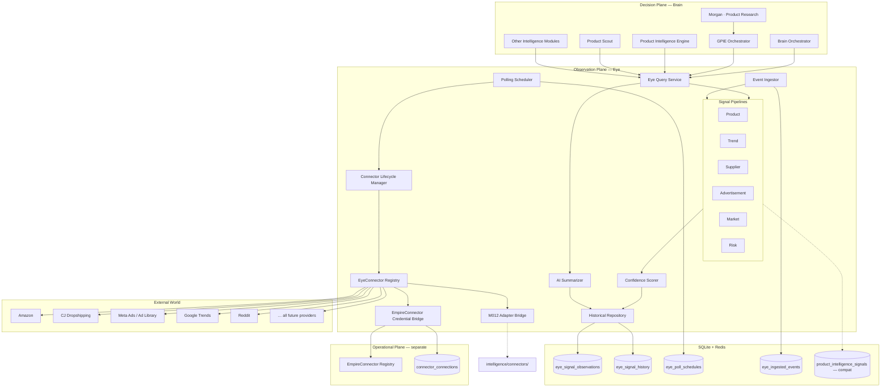
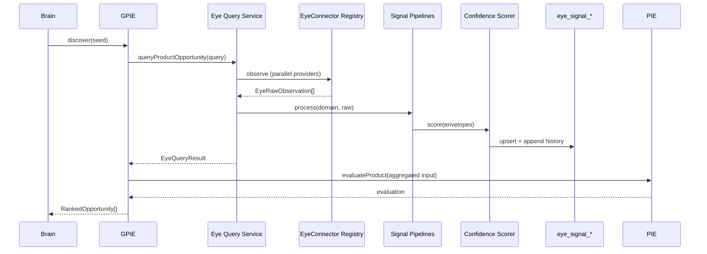

# EMPIREAI Eye Architecture

> **Mission 016 — Design Only**  
> **Status:** Architecture specification (no live API implementation)  
> **Audience:** Engineering, AI workforce, architecture review  
> **Companion docs:** [EMPIREAI_GLOBAL_PRODUCT_INTELLIGENCE_ARCHITECTURE.md](./EMPIREAI_GLOBAL_PRODUCT_INTELLIGENCE_ARCHITECTURE.md) (Mission 015) · [EMPIREAI_ARCHITECTURE.md](./EMPIREAI_ARCHITECTURE.md) · Mission 012 connector work (`backend/src/intelligence/connectors/`)

---

## 1. Executive Summary

The **Eye** is EmpireAI's **single intelligence layer for observing the external world**. Every future connector — Amazon, CJ Dropshipping, AliExpress, TikTok Shop, Meta Ads, Walmart, eBay, Reddit, Pinterest, Google Trends, and all others — communicates **only** with the Eye. The Brain and all intelligence modules query the Eye; they never call external providers directly.

The Eye **subsumes and absorbs** external observation responsibilities currently spread across:

| Current layer | Path | Eye relationship |
|---------------|------|------------------|
| Product intelligence connectors | `backend/src/intelligence/connectors/` (Mission 012) | Becomes `EyeConnector` implementations behind Eye registry |
| GPIE signal fetch | Mission 015 design | Calls Eye Query API instead of `ProductIntelligenceConnectorRegistry` |
| Operational connectors | `backend/src/connectors/` (`EmpireConnector`) | **Unchanged** — mutations stay on operational plane; Eye bridges credentials only |

**Three planes (permanent separation):**

```
┌─────────────────────────────────────────────────────────────────────────────┐
│  DECISION PLANE — Brain + Intelligence Modules                              │
│  PIE · Product Scout · GPIE · Supplier Intelligence · Morgan · Guardian     │
│  Queries Eye ONLY for external world state                                  │
└───────────────────────────────────┬─────────────────────────────────────────┘
                                    │ Eye Query API
                                    ▼
┌─────────────────────────────────────────────────────────────────────────────┐
│  OBSERVATION PLANE — Eye (Mission 016)                                      │
│  Connectors · Pipelines · Scheduler · Ingestion · Storage · Summarization   │
└───────────────────────────────────┬─────────────────────────────────────────┘
                                    │ EyeConnector contract
                                    ▼
┌─────────────────────────────────────────────────────────────────────────────┐
│  EXTERNAL WORLD — Amazon · CJ · Meta · Google Trends · Reddit · …         │
└─────────────────────────────────────────────────────────────────────────────┘

        ┌──────────────────────────────────────────┐
        │  OPERATIONAL PLANE (parallel, separate) │
        │  EmpireConnector — orders · campaigns   │
        │  backend/src/connectors/                 │
        └──────────────────────────────────────────┘
              ▲ credentials bridge (read-only)
              └──────── Eye credential resolver
```

**Mission 016 adds (design only):**

- Unified `EyeConnector` contract (supersedes direct `ProductIntelligenceConnector` usage by Brain/GPIE)
- Six signal pipelines: product, trend, supplier, advertisement, market, risk
- Polling scheduler and webhook event ingestion
- Cross-signal confidence scoring and historical time-series storage
- AI summarization layer for Brain-consumable narratives
- Unified Eye Query API — sole external-intelligence ingress for Brain

**Do not modify in Mission 016:** production code, existing modules, or live API implementations.

---

## 2. Relationship to Mission 012 and Mission 015

### 2.1 Mission 012 — Product Intelligence Connectors

Mission 012 introduced `ProductIntelligenceConnector` — a read-only, mock-first registry for marketplace/supplier/trend signals used by PIE's `evaluateFromConnectors()`.

**Eye subsumes Mission 012 at the consumption boundary:**

| Today (M012) | Future (Eye) |
|--------------|--------------|
| PIE/GPIE calls `ProductIntelligenceConnectorRegistry.fetchAllSignals()` | PIE/GPIE calls `EyeQueryService.queryProductSignals()` |
| Each provider implements `ProductIntelligenceConnector` | Each provider implements `EyeConnector` (superset contract) |
| Signals stored in `product_intelligence_signals` | Eye writes to `eye_signal_observations` + backward-compat mirror to existing PIE tables during migration |
| Registry in `intelligence/connectors/registry.ts` | `EyeConnectorRegistry` in `eye/registry/` |

**Migration strategy:** `ProductIntelligenceConnector` implementations are wrapped by `EyeConnectorAdapter` — no rewrite required on day one. The adapter translates `fetchProductSignals()` → `EyeConnector.observe()` product facet.

### 2.2 Mission 015 — Global Product Intelligence Engine (GPIE)

GPIE orchestrates discovery → signal → score → rank → recommend for Grand King's Account. Mission 015 placed signal fetch at the Mission 012 aggregator.

**Eye repositioning:**

```
Before (M015 design):
  GPIE Orchestrator → ProductIntelligenceConnectorRegistry → PIE → Scout → Ranker

After (M016 Eye):
  GPIE Orchestrator → Eye Query API → PIE → Scout → Ranker
                           ▲
                     Eye (pipelines, storage, confidence)
                           ▲
                     EyeConnector registry
```

GPIE remains the **orchestrator for product opportunity ranking**. Eye remains the **source of truth for external observations**. GPIE does not fetch from providers; it asks Eye.

Brain dispatch flow:

```
Morgan (Grand King's Account)
  → Brain dispatch: global-product-intelligence.discover
  → GPIE Orchestrator
  → Eye.query({ domain: "product", ... })
  → PIE.evaluateProduct()
  → Product Scout (optional Guardian gate)
  → RankedOpportunity[]
```

**Single rule:** Brain and all intelligence modules **never** import from `backend/src/intelligence/connectors/` or `backend/src/connectors/` for observation. They import from `backend/src/eye/contract/` only.

---

## 3. Eye Architecture

### 3.1 Core components

| Component | Responsibility |
|-----------|----------------|
| **EyeConnectorRegistry** | Register, health-check, and lifecycle-manage all observation connectors |
| **ConnectorLifecycleManager** | Connect → activate → poll → degrade → disconnect states per workspace |
| **PollingScheduler** | Cron/interval-driven observation jobs per connector + workspace |
| **EventIngestor** | Webhook/push events from providers (Meta lead forms, order webhooks repurposed as signals) |
| **Signal Pipelines** | Normalize raw connector output into typed signal envelopes |
| **ConfidenceScorer** | Cross-source, cross-time confidence for every observation |
| **HistoricalRepository** | Time-series persistence with retention policy |
| **AiSummarizer** | LLM-generated narratives for Brain agents |
| **EyeQueryService** | Unified read API for Brain and intelligence modules |

### 3.2 Architecture diagram



### 3.3 Design principles

1. **Single observation ingress** — Eye is the only module that talks to external data sources for intelligence.
2. **Operational isolation** — `EmpireConnector.invoke()` for mutations never flows through Eye pipelines.
3. **Backward compatibility** — Mission 012 connectors run behind adapters until native `EyeConnector` implementations ship.
4. **Mock-first** — Every provider ships deterministic mock; live swap via registry override per workspace.
5. **Workspace isolation** — All observations, schedules, and credentials scoped by `workspace_id`.
6. **Explainability** — Every query result retains per-connector provenance, confidence breakdown, and raw observation IDs.
7. **Additive migration** — Existing PIE/Scout/GPIE code paths gain Eye adapter; no breaking refactors in Mission 016.

---

## 4. Proposed Folder Structure

```
backend/src/eye/                              # NEW — Mission 016+ implementation
├── index.ts
├── types.ts                                  # Shared Eye types
│
├── contract/
│   ├── eye-connector.ts                      # EyeConnector interface
│   ├── eye-query-api.ts                      # EyeQueryService interface
│   ├── signal-envelope.ts                    # Unified signal types
│   └── capabilities.ts                       # eye.* Brain capabilities (design)
│
├── registry/
│   ├── connector-registry.ts                 # EyeConnectorRegistry
│   ├── lifecycle-manager.ts                  # ConnectorLifecycleManager
│   └── provider-catalog.ts                   # Eye provider metadata
│
├── scheduler/
│   ├── polling-scheduler.ts                  # Cron/interval job runner
│   ├── schedule-repository.ts
│   └── job-types.ts
│
├── ingestion/
│   ├── event-ingestor.ts                     # Push/webhook normalization
│   ├── webhook-handler.ts                    # HTTP ingress (future route)
│   └── deduplication.ts
│
├── pipelines/
│   ├── pipeline-runner.ts                    # Routes observations to pipelines
│   ├── product-signal-pipeline.ts
│   ├── trend-signal-pipeline.ts
│   ├── supplier-signal-pipeline.ts
│   ├── advertisement-signal-pipeline.ts
│   ├── market-signal-pipeline.ts
│   └── risk-signal-pipeline.ts
│
├── scoring/
│   ├── confidence-scorer.ts
│   └── scoring-policies.ts
│
├── storage/
│   ├── observation-repository.ts
│   ├── historical-repository.ts
│   └── retention-policy.ts
│
├── summarization/
│   ├── ai-summarizer.ts
│   └── prompt-templates.ts
│
├── query/
│   ├── eye-query-service.ts                  # Brain-facing implementation
│   └── query-router.ts
│
├── adapters/                                 # Bridge existing layers — no changes to source modules
│   ├── product-intelligence-bridge.ts        # M012 ProductIntelligenceConnector → EyeConnector
│   └── empire-credential-bridge.ts           # connector_connections → EyeConnectorContext
│
└── connectors/                               # Per-provider EyeConnector implementations
    ├── mock/                                 # Deterministic mocks (default bootstrap)
    │   ├── amazon.mock.ts
    │   ├── cj-dropshipping.mock.ts
    │   └── ...
    └── providers/                            # Live adapters (future missions)
        ├── amazon.live.ts
        └── ...

backend/src/intelligence/connectors/          # Mission 012 — EXISTS, unchanged until Eye Phase B
backend/src/connectors/                       # Operational plane — EXISTS, unchanged
backend/src/brain/contract/                   # ADD eye.* capabilities in future mission (design)
```

---

## 5. Connector Contract — EyeConnector vs Existing Layers

### 5.1 Three-layer comparison

| Concern | `EmpireConnector` | `ProductIntelligenceConnector` (M012) | `EyeConnector` (M016) |
|---------|-------------------|---------------------------------------|------------------------|
| Path | `backend/src/connectors/` | `backend/src/intelligence/connectors/` | `backend/src/eye/connectors/` |
| Purpose | Operational mutations | Product research signals only | **All external observation** |
| OAuth / credentials | Yes — owner | Bridge from operational (future) | Yes — via credential bridge |
| Mutations | Orders, campaigns, sync | None | **None — read-only** |
| Signal domains | N/A (capabilities) | Product only | Product, trend, supplier, ad, market, risk |
| Polling | N/A | Manual/on-demand | Scheduler-managed |
| Event ingestion | Webhooks for ops | None | Webhook + push events |
| Brain access | Direct (ops modules) | Direct (PIE — deprecated path) | **Eye Query API only** |
| Live swap | `ConnectorRegistry.register()` | `ProductIntelligenceConnectorRegistry.register()` | `EyeConnectorRegistry.register()` |

### 5.2 EyeConnector interface (TypeScript sketch)

```typescript
/** Documentation contract — implement in backend/src/eye/contract/eye-connector.ts */

export type EyeProviderId =
  | "cj-dropshipping"
  | "aliexpress"
  | "amazon"
  | "ebay"
  | "walmart"
  | "tiktok-shop"
  | "google-trends"
  | "meta-ad-library"
  | "meta-ads"
  | "reddit"
  | "pinterest-trends"
  | "google-ads"
  | "tiktok-ads";

/** Signal domains the Eye routes to specialized pipelines. */
export type EyeSignalDomain =
  | "product"
  | "trend"
  | "supplier"
  | "advertisement"
  | "market"
  | "risk";

export type EyeConnectorStatus =
  | "registered"
  | "connected"
  | "active"
  | "degraded"
  | "paused"
  | "disconnected";

export type EyeObservationMode = "poll" | "push" | "both";

export type EyeConnectorContext = {
  workspaceId: string;
  correlationId: string;
  credentialsRef?: string;
  region?: string;              // default "US"
};

export type EyeObserveRequest = {
  domain: EyeSignalDomain;
  query: Record<string, unknown>;  // domain-specific; validated by pipeline
  mode?: "live" | "cached";        // cached reads from historical store
};

/** Raw observation before pipeline normalization. */
export type EyeRawObservation = {
  observationId: string;
  providerId: EyeProviderId;
  domain: EyeSignalDomain;
  payload: Record<string, unknown>;
  fetchedAt: string;
  mock: boolean;
  sourceRef?: string;             // URL, API endpoint, webhook ID
};

export type EyeConnectorHealth = {
  status: EyeConnectorStatus;
  message: string;
  latencyMs?: number;
  lastSuccessfulPollAt?: string;
  checkedAt: string;
};

export type EyeConnectorDefinition = {
  providerId: EyeProviderId;
  providerName: string;
  supportedDomains: readonly EyeSignalDomain[];
  observationMode: EyeObservationMode;
  defaultPollIntervalSec: number;
  rateLimitPerMinute: number;
  replacesOperationalId?: string;  // e.g. "amazon" links to EmpireConnector catalog id
};

export interface EyeConnector {
  readonly definition: EyeConnectorDefinition;

  /** Lifecycle — workspace-scoped activation */
  connect(context: EyeConnectorContext, credentialsRef: string): Promise<void>;
  disconnect(context: EyeConnectorContext): Promise<void>;
  healthCheck(context: EyeConnectorContext): Promise<EyeConnectorHealth>;

  /** Primary observation entry — Eye scheduler and query service call this */
  observe(
    context: EyeConnectorContext,
    request: EyeObserveRequest,
  ): Promise<EyeRawObservation[]>;

  /** Optional: provider-initiated discovery without known entity (GPIE seeds) */
  discover?(
    context: EyeConnectorContext,
    domain: EyeSignalDomain,
    seed: Record<string, unknown>,
  ): Promise<EyeRawObservation[]>;

  /** Optional: validate and parse inbound webhook payload */
  ingestWebhook?(
    context: EyeConnectorContext,
    headers: Record<string, string>,
    body: unknown,
  ): Promise<EyeRawObservation[]>;
}
```

### 5.3 ProductIntelligenceConnector adapter (backward compat)

```typescript
/** Wraps existing M012 connector — no changes to intelligence/connectors/ source */

export function wrapProductIntelligenceConnector(
  legacy: ProductIntelligenceConnector,
): EyeConnector {
  return {
    definition: {
      providerId: legacy.providerId,
      providerName: legacy.providerName,
      supportedDomains: ["product", "supplier", "trend"],  // inferred from provider
      observationMode: "poll",
      defaultPollIntervalSec: 3600,
      rateLimitPerMinute: 30,
    },
    async connect() { /* no-op for mock */ },
    async disconnect() { /* no-op */ },
    async healthCheck(ctx) {
      return { status: "active", message: "Legacy adapter", checkedAt: new Date().toISOString() };
    },
    async observe(ctx, request) {
      if (request.domain !== "product") return [];
      const signal = await legacy.fetchProductSignals(ctx, request.query as ProductSignalQuery);
      return [{ observationId: crypto.randomUUID(), providerId: legacy.providerId, domain: "product", payload: signal, fetchedAt: signal.fetchedAt, mock: signal.mock }];
    },
  };
}
```

### 5.4 EmpireConnector credential bridge

Eye **never** calls `EmpireConnector.invoke()` for intelligence. It reads `connector_connections` to resolve `credentialsRef` when a live EyeConnector needs OAuth tokens already established by the operational plane.

```typescript
export interface EmpireCredentialBridge {
  resolveCredentialsRef(workspaceId: string, operationalConnectorId: string): Promise<string | null>;
  isConnected(workspaceId: string, operationalConnectorId: string): Promise<boolean>;
}
```

---

## 6. Connector Lifecycle

### 6.1 State machine

```
                    register (bootstrap)
                          │
                          ▼
                   ┌─────────────┐
         connect   │  connected  │  disconnect
        ──────────►│             │──────────────► disconnected
                   └──────┬──────┘
                          │ activate (credentials valid)
                          ▼
                   ┌─────────────┐
                   │   active    │◄──── resume
                   └──────┬──────┘
                          │
            health fail   │   health recover
                          ▼
                   ┌─────────────┐
                   │  degraded   │
                   └──────┬──────┘
                          │ operator pause / rate limit
                          ▼
                   ┌─────────────┐
                   │   paused    │
                   └─────────────┘
```

### 6.2 Lifecycle manager responsibilities

| Phase | Action | Persistence |
|-------|--------|-------------|
| **Register** | Load mock or live connector into registry at bootstrap | In-memory registry |
| **Connect** | Validate workspace credentials; create `eye_connector_states` row | SQLite |
| **Activate** | Enable polling schedule; first observation run | `eye_poll_schedules` |
| **Poll cycle** | Scheduler triggers `observe()` per domain + interval | `eye_signal_observations` |
| **Degrade** | 3 consecutive failures → degraded; reduce poll frequency | State update + Guardian alert |
| **Pause** | Operator or Guardian pauses connector | Schedule disabled |
| **Disconnect** | Revoke schedule; mark disconnected | State update |

### 6.3 Lifecycle interface (TypeScript sketch)

```typescript
export interface ConnectorLifecycleManager {
  registerConnector(connector: EyeConnector): void;
  connect(workspaceId: string, providerId: EyeProviderId, credentialsRef: string): Promise<void>;
  disconnect(workspaceId: string, providerId: EyeProviderId): Promise<void>;
  activate(workspaceId: string, providerId: EyeProviderId): Promise<void>;
  pause(workspaceId: string, providerId: EyeProviderId, reason: string): Promise<void>;
  resume(workspaceId: string, providerId: EyeProviderId): Promise<void>;
  getState(workspaceId: string, providerId: EyeProviderId): Promise<EyeConnectorStateRecord>;
  listActive(workspaceId: string): Promise<EyeConnectorStateRecord[]>;
}

export type EyeConnectorStateRecord = {
  workspaceId: string;
  providerId: EyeProviderId;
  status: EyeConnectorStatus;
  credentialsRef: string | null;
  lastPollAt: string | null;
  lastSuccessAt: string | null;
  consecutiveFailures: number;
  metadata: Record<string, unknown>;
  updatedAt: string;
};
```

---

## 7. Polling Scheduler

### 7.1 Design

The polling scheduler is a **BullMQ-backed job runner** (Redis) with SQLite schedule persistence. Each active `EyeConnector` + workspace + domain tuple gets a repeatable job.

| Setting | Default | Notes |
|---------|---------|-------|
| Poll interval | From `EyeConnectorDefinition.defaultPollIntervalSec` | Override per workspace in schedule row |
| Jitter | ±10% | Prevents thundering herd |
| Concurrency | 5 per workspace | Configurable |
| Retry | 3 with exponential backoff | Then degrade connector |
| Dedup window | 5 minutes | Skip identical query hash |

### 7.2 Schedule record

```typescript
export type EyePollSchedule = {
  id: string;
  workspaceId: string;
  providerId: EyeProviderId;
  domain: EyeSignalDomain;
  cronExpression?: string;          // optional; overrides interval
  intervalSec: number;
  queryTemplate: Record<string, unknown>;  // JSON — workspace watchlist, category seeds
  enabled: boolean;
  lastRunAt: string | null;
  nextRunAt: string | null;
  createdAt: string;
};
```

### 7.3 Scheduler flow

```
BullMQ tick
  → load EyePollSchedule
  → ConnectorLifecycleManager.ensureActive()
  → EyeConnector.observe(context, { domain, query, mode: "live" })
  → PipelineRunner.process(rawObservations)
  → ConfidenceScorer.score(envelope)
  → HistoricalRepository.append(envelope)
  → emit eye.observation.recorded (SSE to Brain stream)
```

### 7.4 Scheduler interface (TypeScript sketch)

```typescript
export interface PollingScheduler {
  upsertSchedule(schedule: Omit<EyePollSchedule, "id" | "lastRunAt" | "nextRunAt">): Promise<EyePollSchedule>;
  removeSchedule(scheduleId: string): Promise<void>;
  listSchedules(workspaceId: string): Promise<EyePollSchedule[]>;
  triggerNow(scheduleId: string): Promise<void>;   // manual refresh
}
```

---

## 8. Event Ingestion

### 8.1 Push vs poll

| Mode | Source examples | Entry point |
|------|-----------------|-------------|
| **Poll** | Google Trends, Amazon research API, CJ catalog | Polling scheduler |
| **Push** | Meta webhook, TikTok Shop notifications, custom RSS | Event ingestor |
| **Both** | Meta Ad Library (poll) + Meta Ads (webhook campaign metrics) | Scheduler + ingestor |

### 8.2 Ingestion pipeline

```
HTTP POST /eye/webhooks/:providerId  (future route, Guardian-gated)
  → verify signature (provider-specific)
  → EventIngestor.deduplicate(eventHash)
  → EyeConnector.ingestWebhook() OR generic normalizer
  → PipelineRunner.process()
  → eye_ingested_events (audit) + eye_signal_observations
  → SSE: eye.event.ingested
```

### 8.3 Event ingestor interface (TypeScript sketch)

```typescript
export type EyeIngestedEvent = {
  id: string;
  workspaceId: string;
  providerId: EyeProviderId;
  eventType: string;
  eventHash: string;               // SHA-256 for dedup
  rawPayload: string;              // JSON
  processed: boolean;
  observationIds: string[];        // linked after pipeline
  receivedAt: string;
  processedAt: string | null;
};

export interface EventIngestor {
  ingest(params: {
    workspaceId: string;
    providerId: EyeProviderId;
    eventType: string;
    headers: Record<string, string>;
    body: unknown;
  }): Promise<EyeIngestedEvent>;

  markProcessed(eventId: string, observationIds: string[]): Promise<void>;
}
```

---

## 9. Signal Pipelines

Each pipeline accepts `EyeRawObservation[]` and emits a typed `EyeSignalEnvelope`. Pipelines are **pure normalization** — no scoring decisions (that belongs to PIE/Scout/GPIE and Eye confidence layer).

### 9.1 Unified signal envelope

```typescript
export type EyeSignalEnvelope<TPayload = Record<string, unknown>> = {
  envelopeId: string;
  workspaceId: string;
  domain: EyeSignalDomain;
  providerId: EyeProviderId;
  providerName: string;
  subjectKey: string;              // dedup key: product title hash, keyword, supplier SKU
  payload: TPayload;
  confidence: number;              // 0–100, post ConfidenceScorer
  confidenceFactors: ConfidenceFactor[];
  provenance: {
    observationIds: string[];
    mock: boolean;
    fetchedAt: string;
    sourceRefs: string[];
  };
  normalizedAt: string;
};

export type ConfidenceFactor = {
  name: string;
  weight: number;
  value: number;
  explanation: string;
};
```

### 9.2 Product signal pipeline

**Input domains:** `product`  
**Sources:** Amazon, eBay, Walmart, TikTok Shop  
**Output:** `ProductSignalPayload`

```typescript
export type ProductSignalQuery = {
  productTitle: string;
  category: string;
  sku?: string;
  keywords?: string[];
  region?: string;
};

export type ProductSignalPayload = {
  productTitle: string;
  category: string;
  demandIndex: number;              // 0–100
  competitionIndex: number;         // 0–100
  marginEstimatePct: number;
  estimatedSellingPriceCents?: number;
  monthlyOrdersEstimate?: number;
  trendDirection: "rising" | "stable" | "falling";
  listingCount?: number;
  avgRating?: number;
  /** Superset of M012 ProductIntelligenceSignal — backward compatible */
};
```

**Processing steps:**

1. Validate query fields
2. Map raw provider payload → canonical `ProductSignalPayload`
3. Merge multi-listing observations for same `subjectKey`
4. Pass to ConfidenceScorer
5. Write to `eye_signal_observations` + optional mirror to `product_intelligence_signals`

**Alignment:** Output shape is a superset of Mission 012 `ProductIntelligenceSignal`. PIE `aggregateSignalsToInput()` consumes Eye product envelopes via adapter without type changes.

### 9.3 Trend signal pipeline

**Input domains:** `trend`  
**Sources:** Google Trends, Pinterest Trends, Reddit, TikTok Shop velocity  
**Output:** `TrendSignalPayload`

```typescript
export type TrendSignalQuery = {
  keywords: string[];
  category?: string;
  region?: string;
  horizonDays?: number;             // default 30
};

export type TrendSignalPayload = {
  keywords: string[];
  searchVolumeIndex: number;        // 0–100
  momentumScore: number;            // -100 to +100 (negative = declining)
  trendDirection: "rising" | "stable" | "falling";
  seasonalityIndex?: number;
  breakoutDetected: boolean;
  relatedQueries?: string[];
  socialMentionIndex?: number;      // Reddit
  visualDiscoveryIndex?: number;    // Pinterest
};
```

### 9.4 Supplier signal pipeline

**Input domains:** `supplier`  
**Sources:** CJ Dropshipping, AliExpress, Alibaba, Spocket  
**Output:** `SupplierSignalPayload`

```typescript
export type SupplierSignalQuery = {
  productTitle?: string;
  sku?: string;
  supplierId?: string;
  category?: string;
};

export type SupplierSignalPayload = {
  supplierId: string;
  supplierName: string;
  available: boolean;
  purchasePriceCents: number;
  shippingCostCents?: number;
  avgShipDays: number;
  moq?: number;
  defectRatePct?: number;
  reliabilityScore: number;         // 0–100
  region: string;
  variants?: number;
};
```

**Alignment:** Feeds PIE `supplierData` block and Supplier Intelligence module via Eye Query API.

### 9.5 Advertisement signal pipeline

**Input domains:** `advertisement`  
**Sources:** Meta Ad Library, Meta Ads, Google Ads, TikTok Ads  
**Output:** `AdvertisementSignalPayload`

```typescript
export type AdvertisementSignalQuery = {
  productTitle?: string;
  keywords?: string[];
  competitorDomains?: string[];
  region?: string;
};

export type AdvertisementSignalPayload = {
  adDensityIndex: number;           // 0–100 — crowdedness
  activeAdCount?: number;
  avgAdLongevityDays?: number;
  estimatedCpcCents?: number;
  creativeFatigueIndex?: number;
  topChannels?: string[];
  competitorSpendBand?: "low" | "medium" | "high" | "unknown";
};
```

### 9.6 Market signal pipeline

**Input domains:** `market`  
**Sources:** Cross-provider aggregation (Amazon + Walmart + eBay benchmarks)  
**Output:** `MarketSignalPayload`

```typescript
export type MarketSignalQuery = {
  category: string;
  region?: string;
  priceBandCents?: { min: number; max: number };
};

export type MarketSignalPayload = {
  category: string;
  region: string;
  marketSizeIndex: number;          // 0–100 relative TAM proxy
  priceFloorCents: number;
  priceCeilingCents: number;
  medianPriceCents: number;
  saturationIndex: number;            // 0–100
  growthRatePct?: number;
  topChannels: string[];
};
```

### 9.7 Risk signal pipeline

**Input domains:** `risk`  
**Sources:** Guardian cross-checks, provider health, policy flags, IP/trademark proxies  
**Output:** `RiskSignalPayload`

```typescript
export type RiskSignalQuery = {
  productTitle?: string;
  category?: string;
  supplierId?: string;
  keywords?: string[];
};

export type RiskSignalPayload = {
  overallRiskScore: number;         // 0–100, higher = riskier
  flags: RiskFlag[];
  policyCompliance: "clear" | "review" | "blocked";
  suggestedAction: "proceed" | "review" | "avoid";
};

export type RiskFlag = {
  code: string;                     // e.g. "TRADEMARK_PROXY", "PROVIDER_DEGRADED"
  severity: "low" | "medium" | "high";
  description: string;
  source: EyeProviderId | "guardian" | "eye-internal";
};
```

**Alignment:** Product Scout Guardian may consume Eye risk envelopes alongside its internal gates.

### 9.8 Pipeline runner

```typescript
export interface PipelineRunner {
  process(
    workspaceId: string,
    domain: EyeSignalDomain,
    observations: EyeRawObservation[],
  ): Promise<EyeSignalEnvelope[]>;
}
```

---

## 10. Confidence Scoring

Eye assigns confidence to every envelope **before** Brain modules apply their own scoring (PIE weights, Scout Empire score, etc.).

### 10.1 Confidence formula

```
envelopeConfidence =
    sourceTrustScore(providerId)     × 0.30
  + dataFreshnessScore(fetchedAt)    × 0.20
  + crossSourceAgreementScore        × 0.25   // when multiple providers same domain
  + payloadCompletenessScore         × 0.15
  + mockPenalty                      × 0.10   // mock → cap at 60
```

| Factor | Calculation |
|--------|-------------|
| `sourceTrustScore` | Provider tier: P1 marketplace = 90, P2 = 75, P3 social = 65, mock = 40 |
| `dataFreshnessScore` | Linear decay: 100 at 0h, 50 at 24h, 0 at 72h |
| `crossSourceAgreementScore` | 100 − (coefficient of variation × 100) for numeric fields |
| `payloadCompletenessScore` | `(populatedFields / expectedFields) × 100` |
| `mockPenalty` | `mock ? min(rawScore, 60) : rawScore` |

### 10.2 Confidence scorer interface

```typescript
export interface ConfidenceScorer {
  score(
    domain: EyeSignalDomain,
    envelopes: EyeSignalEnvelope[],
  ): EyeSignalEnvelope[];

  explain(envelopeId: string): Promise<ConfidenceFactor[]>;
}
```

### 10.3 Relationship to PIE confidence

PIE `computeConfidence()` (Mission 005) operates on **aggregated product intelligence input** after Eye delivers envelopes. Eye confidence = **observation quality**. PIE confidence = **decision readiness**. Both propagate to Brain; GPIE opportunity ranking uses PIE confidence, not Eye confidence directly — but hard-filters on Eye confidence < 40 for stale/mock-only observations.

---

## 11. Historical Storage

### 11.1 Storage strategy

| Store | Technology | Contents |
|-------|------------|----------|
| Hot observations | SQLite `eye_signal_observations` | Latest envelope per subjectKey + domain |
| Time series | SQLite `eye_signal_history` | Append-only history for trend/momentum |
| Ingested events | SQLite `eye_ingested_events` | Webhook audit trail |
| Connector state | SQLite `eye_connector_states` | Lifecycle |
| Poll schedules | SQLite `eye_poll_schedules` | Scheduler config |
| Cache (future) | Redis | Dedup hashes, rate limit counters |

### 11.2 Retention policy

| Domain | Hot TTL | History retention |
|--------|---------|-------------------|
| product | 7 days | 90 days |
| trend | 3 days | 365 days |
| supplier | 7 days | 180 days |
| advertisement | 3 days | 90 days |
| market | 14 days | 365 days |
| risk | 30 days | 365 days |

Compaction job (future): aggregate history to weekly snapshots after retention window.

### 11.3 Historical repository interface

```typescript
export interface HistoricalRepository {
  upsertLatest(envelope: EyeSignalEnvelope): Promise<void>;
  appendHistory(envelope: EyeSignalEnvelope): Promise<void>;
  getLatest(workspaceId: string, domain: EyeSignalDomain, subjectKey: string): Promise<EyeSignalEnvelope | null>;
  getHistory(workspaceId: string, domain: EyeSignalDomain, subjectKey: string, since: string): Promise<EyeSignalEnvelope[]>;
  getMomentum(workspaceId: string, subjectKey: string, horizonDays: number): Promise<number>;  // -100 to +100
}
```

### 11.4 Backward compatibility with Mission 005 tables

During migration phases B–C, the product pipeline **mirrors** envelopes into existing tables:

- `product_intelligence_signals.signal_data` ← JSON of `ProductSignalPayload`
- No schema changes to existing PIE tables in Mission 016

---

## 12. AI Summarization

The AI summarizer converts multi-envelope query results into **Brain-consumable narratives** for Morgan and other agents.

### 12.1 Summarization triggers

| Trigger | Input | Output |
|---------|-------|--------|
| Query API `includeSummary: true` | Envelopes across domains | `EyeQuerySummary` |
| Scheduled digest | Workspace watchlist | Daily/weekly narrative |
| Anomaly detection | History delta > threshold | Alert summary |

### 12.2 Summary shape

```typescript
export type EyeQuerySummary = {
  summaryId: string;
  workspaceId: string;
  headline: string;
  narrative: string;                // 2–4 paragraphs, LLM-generated
  keyFindings: string[];
  risks: string[];
  opportunities: string[];
  confidence: number;
  envelopeIds: string[];
  generatedAt: string;
  mock: boolean;
};

export interface AiSummarizer {
  summarize(params: {
    workspaceId: string;
    domain?: EyeSignalDomain;
    envelopes: EyeSignalEnvelope[];
    audience: "founder" | "agent" | "guardian";
  }): Promise<EyeQuerySummary>;
}
```

### 12.3 Guardrails

- Summarizer receives **normalized envelopes only** — never raw API responses (PII scrubbed at pipeline)
- Guardian policy gate before LLM call
- `mock: true` when all source envelopes are mock
- Token budget: 1500 output max; truncate envelope list to top 20 by confidence

---

## 13. Unified Query API for Brain

### 13.1 Eye Query Service — sole external intelligence ingress

```typescript
export type EyeQueryRequest = {
  workspaceId: string;
  correlationId: string;
  domain: EyeSignalDomain | "composite";   // composite = multi-domain bundle
  query: Record<string, unknown>;
  providerIds?: EyeProviderId[];           // default: all active for domain
  mode?: "live" | "cached" | "hybrid";     // hybrid: cache first, poll stale
  includeSummary?: boolean;
  includeHistory?: boolean;
  historyHorizonDays?: number;
};

export type EyeQueryResult = {
  queryId: string;
  workspaceId: string;
  domain: EyeSignalDomain | "composite";
  envelopes: EyeSignalEnvelope[];
  summary?: EyeQuerySummary;
  providerCount: number;
  overallConfidence: number;              // weighted across envelopes
  cached: boolean;
  queriedAt: string;
  durationMs: number;
};

export interface EyeQueryService {
  /** Primary Brain entry point */
  query(request: EyeQueryRequest): Promise<EyeQueryResult>;

  /** Convenience — product domain (GPIE, PIE) */
  queryProductSignals(ctx: EyeConnectorContext, query: ProductSignalQuery): Promise<EyeQueryResult>;

  /** Convenience — multi-domain product opportunity bundle */
  queryProductOpportunity(ctx: EyeConnectorContext, query: ProductSignalQuery): Promise<EyeQueryResult>;
  // Runs product + trend + supplier + advertisement + risk pipelines in parallel

  /** Batch discovery for GPIE seeds */
  discover(params: {
    workspaceId: string;
    correlationId: string;
    domain: EyeSignalDomain;
    seed: Record<string, unknown>;
    providerIds?: EyeProviderId[];
  }): Promise<EyeQueryResult>;

  /** Read-only health */
  providerHealth(workspaceId: string): Promise<EyeConnectorHealth[]>;
}
```

### 13.2 Brain contract capabilities (proposed)

Add to `backend/src/brain/contract/capabilities.ts` in a future mission:

```typescript
export type EyeCapability =
  | "eye.query"
  | "eye.query_product"
  | "eye.query_opportunity"       // composite product bundle
  | "eye.discover"
  | "eye.summarize"
  | "eye.provider_health"
  | "eye.refresh";                // triggerNow on schedules

// Module ID: "eye" (new intelligence module — observation facade)
```

### 13.3 Consumer mapping

| Consumer | Eye capability | Replaces |
|----------|----------------|----------|
| PIE `evaluateFromConnectors()` | `eye.query_product` | Direct registry call |
| GPIE orchestrator | `eye.query_opportunity`, `eye.discover` | M012 aggregator + M015 direct fetch |
| Supplier Intelligence | `eye.query` (domain: supplier) | Direct provider calls (future) |
| Product Scout | `eye.query` (domain: risk) | Internal-only today |
| Morgan / Grand King's Account | `eye.query_opportunity` + `eye.summarize` | N/A |
| Marketing Strategist (planned) | `eye.query` (domain: advertisement, trend) | N/A |

### 13.4 Composite opportunity query (GPIE integration)

`queryProductOpportunity` executes parallel domain queries and returns a merged result:

```
queryProductOpportunity({ productTitle, category })
  ├─ product pipeline   → demand, competition, pricing
  ├─ trend pipeline     → momentum, seasonality
  ├─ supplier pipeline  → cost, availability, ship time
  ├─ advertisement pipeline → ad density, CPC band
  └─ risk pipeline      → policy flags, trademark proxy
       │
       ▼
  EyeQueryResult.envelopes[]  →  GPIE passes product+supplier to PIE aggregate adapter
                              →  trend/ad/risk enrich opportunity ranking (M015 formula)
```

---

## 14. Proposed Database Schema

**Do not migrate in Mission 016.** Document-only. Existing tables remain unchanged.

### 14.1 Existing tables (DO NOT MODIFY)

| Table | Purpose |
|-------|---------|
| `product_intelligence_catalog` | PIE workspace catalog |
| `product_intelligence_signals` | Per-provider signals (M005/M012) |
| `product_intelligence_evaluations` | PIE evaluation history |
| `product_scout_evaluations` | Scout + Guardian |
| `connector_connections` | Operational OAuth state |
| `gpi_*` (M015 proposed) | Discovery runs and rankings |

### 14.2 Proposed new tables

```sql
-- Eye connector lifecycle state per workspace
CREATE TABLE IF NOT EXISTS eye_connector_states (
  workspace_id TEXT NOT NULL,
  provider_id TEXT NOT NULL,
  status TEXT NOT NULL,              -- EyeConnectorStatus
  credentials_ref TEXT,
  last_poll_at TEXT,
  last_success_at TEXT,
  consecutive_failures INTEGER NOT NULL DEFAULT 0,
  metadata TEXT,                     -- JSON
  updated_at TEXT NOT NULL,
  PRIMARY KEY (workspace_id, provider_id)
);
CREATE INDEX IF NOT EXISTS idx_eye_connector_ws ON eye_connector_states(workspace_id, status);

-- Polling schedules
CREATE TABLE IF NOT EXISTS eye_poll_schedules (
  id TEXT PRIMARY KEY,
  workspace_id TEXT NOT NULL,
  provider_id TEXT NOT NULL,
  domain TEXT NOT NULL,
  interval_sec INTEGER NOT NULL,
  cron_expression TEXT,
  query_template TEXT NOT NULL,      -- JSON
  enabled INTEGER NOT NULL DEFAULT 1,
  last_run_at TEXT,
  next_run_at TEXT,
  created_at TEXT NOT NULL
);
CREATE INDEX IF NOT EXISTS idx_eye_schedules_ws ON eye_poll_schedules(workspace_id, enabled);

-- Latest normalized signal envelopes (hot store)
CREATE TABLE IF NOT EXISTS eye_signal_observations (
  id TEXT PRIMARY KEY,
  workspace_id TEXT NOT NULL,
  domain TEXT NOT NULL,
  provider_id TEXT NOT NULL,
  subject_key TEXT NOT NULL,         -- dedup key
  payload TEXT NOT NULL,             -- JSON EyeSignalEnvelope payload
  confidence REAL NOT NULL,
  mock INTEGER NOT NULL DEFAULT 0,
  fetched_at TEXT NOT NULL,
  normalized_at TEXT NOT NULL,
  UNIQUE (workspace_id, domain, provider_id, subject_key)
);
CREATE INDEX IF NOT EXISTS idx_eye_obs_ws_domain ON eye_signal_observations(workspace_id, domain);
CREATE INDEX IF NOT EXISTS idx_eye_obs_subject ON eye_signal_observations(workspace_id, subject_key);

-- Append-only history for momentum and trend analysis
CREATE TABLE IF NOT EXISTS eye_signal_history (
  id TEXT PRIMARY KEY,
  observation_id TEXT NOT NULL,
  workspace_id TEXT NOT NULL,
  domain TEXT NOT NULL,
  subject_key TEXT NOT NULL,
  payload TEXT NOT NULL,             -- JSON snapshot
  confidence REAL NOT NULL,
  recorded_at TEXT NOT NULL
);
CREATE INDEX IF NOT EXISTS idx_eye_hist_subject ON eye_signal_history(workspace_id, subject_key, recorded_at DESC);

-- Webhook / push event audit
CREATE TABLE IF NOT EXISTS eye_ingested_events (
  id TEXT PRIMARY KEY,
  workspace_id TEXT NOT NULL,
  provider_id TEXT NOT NULL,
  event_type TEXT NOT NULL,
  event_hash TEXT NOT NULL,
  raw_payload TEXT NOT NULL,
  processed INTEGER NOT NULL DEFAULT 0,
  observation_ids TEXT,              -- JSON array
  received_at TEXT NOT NULL,
  processed_at TEXT,
  UNIQUE (workspace_id, provider_id, event_hash)
);
CREATE INDEX IF NOT EXISTS idx_eye_events_ws ON eye_ingested_events(workspace_id, received_at DESC);

-- AI-generated summaries linked to queries
CREATE TABLE IF NOT EXISTS eye_query_summaries (
  id TEXT PRIMARY KEY,
  workspace_id TEXT NOT NULL,
  query_id TEXT NOT NULL,
  headline TEXT NOT NULL,
  narrative TEXT NOT NULL,
  key_findings TEXT NOT NULL,        -- JSON array
  risks TEXT NOT NULL,               -- JSON array
  opportunities TEXT NOT NULL,       -- JSON array
  confidence REAL NOT NULL,
  envelope_ids TEXT NOT NULL,        -- JSON array
  mock INTEGER NOT NULL DEFAULT 0,
  generated_at TEXT NOT NULL
);
CREATE INDEX IF NOT EXISTS idx_eye_summaries_ws ON eye_query_summaries(workspace_id, generated_at DESC);
```

---

## 15. Data Flow

### 15.1 End-to-end: Brain product discovery

```
1. Founder/Morgan triggers discovery
2. Brain POST /brain/dispatch { action: "global-product-intelligence.discover", ... }
3. GPIE Orchestrator builds DiscoverySeed
4. GPIE → EyeQueryService.discover({ domain: "product", seed })
5. Eye → EyeConnectorRegistry → providers with discover()
6. Raw observations → ProductSignalPipeline → ConfidenceScorer
7. Envelopes persisted → eye_signal_observations
8. GPIE → EyeQueryService.queryProductOpportunity() for full bundle
9. GPIE adapter → ProductIntelligenceInput (PIE-compatible)
10. PIE evaluateProduct() → SELL/REVIEW/DO_NOT_SELL
11. Product Scout Guardian gate (optional)
12. GPIE OpportunityRanker → RankedOpportunity[]
13. Brain → Morgan → founder UI
```

### 15.2 End-to-end: Scheduled background observation

```
1. PollingScheduler fires (BullMQ)
2. LifecycleManager ensures connector active
3. EyeConnector.observe() per schedule query_template
4. PipelineRunner → domain pipeline
5. ConfidenceScorer → HistoricalRepository.append
6. If momentum delta > threshold → AiSummarizer → eye_query_summaries
7. SSE eye.observation.recorded → /brain/events/stream
8. Subscribed agents (Morgan, Inventory) react via Brain dispatch
```

### 15.3 Data flow diagram



---

## 16. Future Implementation Roadmap

### Phase A — Mission 016 (this document)

- Architecture specification
- EyeConnector contract design
- Six pipeline definitions
- Schema design
- Brain capability catalog (design)
- Zero production code changes

### Phase B — Eye skeleton + M012 bridge

- Create `backend/src/eye/` folder structure
- Implement `EyeConnectorRegistry` + `wrapProductIntelligenceConnector()` adapter
- Implement `EyeQueryService.queryProductSignals()` delegating to existing M012 registry
- Brain route stub (feature-flagged): `eye.query_product`
- Migration for `eye_connector_states`, `eye_signal_observations`

### Phase C — Pipelines + confidence

- Implement all six signal pipelines (mock data paths)
- `ConfidenceScorer` with factor explainability
- `HistoricalRepository` + retention job
- GPIE orchestrator switches from direct M012 to `EyeQueryService` (feature flag)

### Phase D — Scheduler + ingestion

- BullMQ polling scheduler
- `eye_poll_schedules` migration
- Webhook ingestor skeleton (Guardian-gated)
- SSE events: `eye.observation.recorded`, `eye.event.ingested`

### Phase E — Live connectors

- Native `EyeConnector` implementations (replace adapters one provider at a time)
- Empire credential bridge from `connector_connections`
- Rate limiting + Redis dedup cache
- Provider SLO monitoring via Guardian

### Phase F — AI summarization + Grand King's Account

- `AiSummarizer` with Guardian LLM gate
- Morgan dispatches `eye.query_opportunity` + `eye.summarize`
- Scheduled workspace digests
- Full GPIE → Eye integration; deprecate direct M012 imports from intelligence modules

### Phase G — Deprecation cleanup

- Remove direct `ProductIntelligenceConnectorRegistry` usage from PIE/GPIE
- M012 module becomes thin re-export of Eye adapters (or archived)
- Documentation update across EMPIREAI_* docs

---

## 17. Provider Roadmap

| Provider | Eye domains | M012 mock | EyeConnector mock | Live API | Priority |
|----------|-------------|-----------|-------------------|----------|----------|
| CJ Dropshipping | supplier, product | ✅ | Phase B | Catalog API | P1 |
| AliExpress | supplier, product | ✅ | Phase B | Affiliate/portal | P1 |
| Amazon | product, market | ✅ | Phase B | SP-API / research | P1 |
| Google Trends | trend | ✅ | Phase C | Trends API | P1 |
| Meta Ad Library | advertisement | ✅ | Phase C | Ad Library API | P1 |
| Walmart | product, market | ✅ | Phase C | Marketplace API | P2 |
| eBay | product, market | ✅ | Phase C | Browse API | P2 |
| TikTok Shop | product, trend | ✅ | Phase C | Partner API | P2 |
| Meta Ads | advertisement | ❌ | Phase D | Marketing API | P2 |
| Google Ads | advertisement | ❌ | Phase D | Ads API | P2 |
| TikTok Ads | advertisement | ❌ | Phase D | Ads API | P2 |
| Reddit | trend | ❌ design | Phase C | Reddit API | P3 |
| Pinterest Trends | trend | ❌ design | Phase C | Pinterest API | P3 |

---

## 18. Module Interaction Map

```
Mission 012 PI Connectors          Mission 016 Eye                    Mission 015 GPIE
        │                                │                                  │
        │  (wrapped by adapter)          │  Eye Query API                   │  orchestrates
        └──────────────────────────────►│◄─────────────────────────────────┘
                                         │
                    ┌────────────────────┼────────────────────┐
                    ▼                    ▼                    ▼
              Pipelines            Confidence            Historical
                    │                    │                    │
                    └────────────────────┴────────────────────┘
                                         │
                                         ▼
                              Brain (queries Eye ONLY)
                    ┌────────────────────┼────────────────────┐
                    ▼                    ▼                    ▼
                   PIE              Product Scout         Morgan / GPIE
              (Mission 005)         (Mission 003)      (Grand King's Account)

Operational Plane (EmpireConnector) ── credentials only ──► Eye Credential Bridge
                              ✗ no direct Brain/GPIE/PIE access for observation
```

---

## 19. Testing Strategy (future implementation)

| Test | Scope |
|------|-------|
| Existing 71+ tests | Must pass unchanged through Phase B (adapter delegation) |
| `eye-connector-bridge.test.ts` | M012 wrapper produces valid envelopes |
| `eye-pipelines.test.ts` | Each pipeline normalizes mock observations deterministically |
| `eye-confidence.test.ts` | Scoring formula edge cases (mock cap, stale decay) |
| `eye-query-service.test.ts` | Query API returns PIE-compatible product payloads |
| Integration | GPIE → Eye → PIE → rank pipeline (feature-flagged) |

Mission 016: **typecheck only** — no new tests required for doc-only delivery.

---

## 20. References

| Artifact | Path |
|----------|------|
| Global Product Intelligence (M015) | `EMPIREAI_GLOBAL_PRODUCT_INTELLIGENCE_ARCHITECTURE.md` |
| Product intelligence connectors (M012) | `backend/src/intelligence/connectors/` |
| EmpireConnector catalog | `backend/src/connectors/catalog.ts` |
| Brain contract | `backend/src/brain/contract/` |
| PIE evaluation engine | `backend/src/intelligence/product-intelligence-engine/` |
| Platform architecture | `EMPIREAI_ARCHITECTURE.md` |
| Mission 012 tests | `backend/src/validation/tests/product-intelligence-connectors.test.ts` |

---

## Revision History

| Version | Date | Changes |
|---------|------|---------|
| 1.0 | 2026-06-23 | Mission 016 — initial Eye architecture (design only) |
