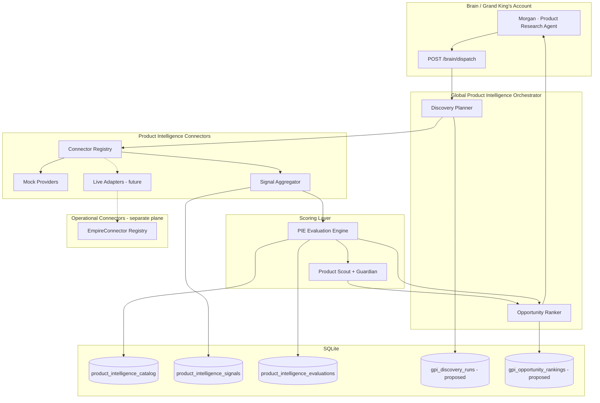

# EMPIREAI Global Product Intelligence Architecture

> **Mission 015 — Design Only**  
> **Status:** Architecture specification (no live API implementation)  
> **Audience:** Engineering, AI workforce, architecture review  
> **Companion docs:** [EMPIREAI_ARCHITECTURE.md](./EMPIREAI_ARCHITECTURE.md) · [docs/PRODUCT_INTELLIGENCE_ENGINE.md](./docs/PRODUCT_INTELLIGENCE_ENGINE.md) · Mission 012 connector work (`backend/src/intelligence/connectors/`)

---

## 1. Executive Summary

The **Global Product Intelligence Engine (GPIE)** is EmpireAI's architecture for **Grand King's Account auto-discovery** — continuously surfacing profitable product opportunities across marketplaces, suppliers, and trend sources without manual research.

GPIE builds on existing Mission 005 (Product Intelligence Engine), Mission 012 (product intelligence connectors), and Mission 003 (AI Product Scout). It does **not** replace those modules; it orchestrates them into a **discovery → signal → score → rank → recommend** pipeline scoped to a workspace.

**Current state (implemented):**

| Layer | Path | Role |
|-------|------|------|
| Operational connectors | `backend/src/connectors/` | `EmpireConnector` catalog — OAuth, invoke, fulfillment |
| Product intelligence connectors | `backend/src/intelligence/connectors/` | `ProductIntelligenceConnector` — read-only market signals |
| PIE evaluation | `backend/src/intelligence/product-intelligence-engine/` | Dimension scoring, SELL/REVIEW/DO_NOT_SELL |
| Product Scout | `backend/src/intelligence/product-scout/` | Empire scoring + Guardian gates + portfolio scan |
| Legacy PIE framework | `backend/src/intelligence/pie-engine.ts` | Explainable dimension scorer (used by Scout) |

**Mission 015 adds (design only):**

- Global discovery orchestration (category seeds, keyword expansion, batch scans)
- Opportunity ranking across workspace catalog
- Provider weighting and signal normalization policy
- Proposed persistence tables for discovery runs and ranked opportunities
- Plug-in contract for 10 future connectors (8 mock today + Reddit + Pinterest Trends)
- Brain contract capabilities for Grand King's Account (Morgan / Product Research Agent)

---

## 2. Architecture Overview

GPIE is a **read-only intelligence plane** separate from the operational `EmpireConnector` plane. Operational connectors mutate external systems (orders, campaigns, catalog sync). Product intelligence connectors **only fetch normalized signals** used for scoring.

```
┌─────────────────────────────────────────────────────────────────────────────┐
│                        Grand King's Account (Brain)                         │
│              Morgan · Product Research Agent · workspace scope              │
└───────────────────────────────────┬─────────────────────────────────────────┘
                                    │ Brain dispatch
                                    ▼
┌─────────────────────────────────────────────────────────────────────────────┐
│              Global Product Intelligence Orchestrator (NEW)                 │
│   discovery seeds · batch evaluate · rank · schedule · explain              │
└───────┬─────────────────────────────┬───────────────────────────┬───────────┘
        │                             │                           │
        ▼                             ▼                           ▼
┌───────────────┐           ┌─────────────────────┐       ┌──────────────────┐
│  Discovery    │           │  Signal Aggregator  │       │  Opportunity     │
│  Planner      │──────────►│  (Mission 012)      │──────►│  Ranker (NEW)    │
│  (NEW)        │           │  normalize + merge  │       │                  │
└───────────────┘           └──────────┬──────────┘       └────────┬─────────┘
                                       │                           │
                                       ▼                           ▼
                            ┌─────────────────────┐       ┌──────────────────┐
                            │  PIE Evaluation     │       │  Product Scout   │
                            │  (Mission 005)      │──────►│  Guardian gate   │
                            │  evaluateProduct()  │       │  (Mission 003)   │
                            └─────────────────────┘       └──────────────────┘
                                       │
                                       ▼
                            ┌─────────────────────┐
                            │  Catalog + Signals  │
                            │  (SQLite — existing)│
                            └─────────────────────┘
```

### Design principles

1. **Additive only** — extend registries and add orchestrator; do not refactor working PIE/Scout paths.
2. **Mock-first** — every provider ships as deterministic mock; live swap via registry override.
3. **Two connector planes** — `EmpireConnector` for operations; `ProductIntelligenceConnector` for research signals.
4. **Single scoring truth** — PIE `evaluateProduct()` remains authoritative for SELL/REVIEW/DO_NOT_SELL; Scout adds Empire + Guardian layer for portfolio decisions.
5. **Workspace isolation** — all discovery runs, catalogs, and rankings scoped by `workspace_id`.
6. **Explainability** — every ranked opportunity retains per-provider signals and dimension breakdown.

---

## 3. Proposed Folder Structure

Aligned with existing `backend/src/intelligence/` layout. **Bold** = new (Mission 015+ implementation phases).

```
backend/src/intelligence/
├── connectors/                          # Mission 012 — EXISTS
│   ├── types.ts                         # ProductIntelligenceConnector contract
│   ├── registry.ts                      # ProductIntelligenceConnectorRegistry
│   ├── aggregator.ts                    # fetchAndAggregateProductSignals()
│   ├── mock-providers.ts                # Deterministic mock signals
│   ├── index.ts
│   └── providers/                       # NEW — one file per live provider (future)
│       ├── amazon.mock.ts               # Re-export mock (today)
│       ├── amazon.live.ts               # Future: live adapter
│       ├── reddit.mock.ts               # NEW provider stub
│       └── pinterest-trends.mock.ts     # NEW provider stub
│
├── product-intelligence-engine/         # Mission 005 — EXISTS
│   ├── product-intelligence-engine.ts   # evaluateProduct()
│   ├── service.ts                       # evaluateFromConnectors()
│   ├── catalog-repository.ts
│   ├── score-computers.ts
│   ├── recommendation-engine.ts
│   └── routes.ts
│
├── product-scout/                       # Mission 003 — EXISTS
│   └── ...
│
├── global-product-intelligence/         # NEW — Mission 015 orchestration
│   ├── index.ts
│   ├── types.ts                         # GPIE-specific types (design)
│   ├── discovery-planner.ts             # Category/keyword seed expansion
│   ├── opportunity-ranker.ts            # Cross-product ranking algorithm
│   ├── orchestrator.ts                  # End-to-end discovery run
│   ├── provider-weights.ts              # Per-provider signal weights
│   ├── signal-normalizer.ts             # Extended normalization (future)
│   └── discovery-repository.ts          # CRUD for new tables (future)
│
├── pie-engine.ts                        # Legacy framework scorer — UNCHANGED
└── index.ts                             # Re-exports (additive exports only)

backend/src/connectors/                  # Operational plane — EXISTS
├── catalog.ts                           # EmpireConnector definitions
├── registry.ts
└── ...

backend/src/brain/contract/
├── capabilities.ts                      # ADD future GPIE capabilities (design)
└── ...
```

### Documentation placement

| Document | Purpose |
|----------|---------|
| `EMPIREAI_GLOBAL_PRODUCT_INTELLIGENCE_ARCHITECTURE.md` (this file) | System architecture, contracts, schema, algorithms |
| `docs/PRODUCT_INTELLIGENCE_ENGINE.md` | Founder-facing product spec |
| `EMPIREAI_ARCHITECTURE.md` | Platform-wide control plane |

---

## 4. Intelligence Interfaces

TypeScript sketches below are **documentation contracts**. Implement as new files under `global-product-intelligence/` in a future mission — not in Mission 015.

### 4.1 ProductIntelligenceConnector (existing — Mission 012)

```typescript
/** Already implemented: backend/src/intelligence/connectors/types.ts */

export type ProductIntelligenceProviderId =
  | "cj-dropshipping"
  | "amazon"
  | "tiktok-shop"
  | "ebay"
  | "walmart"
  | "aliexpress"
  | "google-trends"
  | "meta-ad-library"
  // Mission 015 additions (design):
  | "reddit"
  | "pinterest-trends";

export type ProductSignalQuery = {
  productTitle: string;
  category: string;
  sku?: string;
  keywords?: string[];       // NEW — for discovery expansion
  region?: string;           // NEW — default "US"
};

export type ProductIntelligenceSignal = {
  providerId: ProductIntelligenceProviderId;
  providerName: string;
  productTitle: string;
  category: string;
  demandIndex: number;           // 0–100
  competitionIndex: number;      // 0–100, higher = more crowded
  marginEstimatePct: number;
  supplierAvailable: boolean;
  trendDirection: "rising" | "stable" | "falling";
  confidence: number;            // 0–100
  purchasePriceCents?: number;
  estimatedSellingPriceCents?: number;
  shippingCostCents?: number;
  searchVolumeIndex?: number;
  monthlyOrdersEstimate?: number;
  mock: boolean;
  fetchedAt: string;
  // NEW optional enrichments (design):
  socialMentionIndex?: number;   // Reddit, Pinterest
  adDensityIndex?: number;       // Meta Ad Library
  sourceUrl?: string;
};

export interface ProductIntelligenceConnector {
  readonly providerId: ProductIntelligenceProviderId;
  readonly providerName: string;
  readonly signalCategories: readonly (
    | "marketplace"
    | "supplier"
    | "trend"
    | "social"
    | "advertising"
  )[];
  fetchProductSignals(
    context: ProductIntelligenceConnectorContext,
    query: ProductSignalQuery,
  ): Promise<ProductIntelligenceSignal>;
  /** Future: batch discovery without known product title */
  discoverCandidates?(
    context: ProductIntelligenceConnectorContext,
    seed: DiscoverySeed,
  ): Promise<DiscoveredProductCandidate[]>;
}
```

### 4.2 ProductIntelligenceConnectorRegistry (existing)

Registry pattern already implemented. Future live swap:

```typescript
// Today: default registry loads mocks
const registry = new ProductIntelligenceConnectorRegistry();

// Future: override single provider without touching others
registry.register(createLiveAmazonProductIntelligenceConnector());

// Future: workspace-scoped registry factory
function createWorkspaceProductIntelligenceRegistry(
  workspaceId: string,
  connectionRepo: ConnectorConnectionRepository,
): ProductIntelligenceConnectorRegistry {
  const overrides: ProductIntelligenceConnector[] = [];
  if (connectionRepo.isConnected(workspaceId, "amazon")) {
    overrides.push(createLiveAmazonProductIntelligenceConnector());
  }
  return new ProductIntelligenceConnectorRegistry(overrides);
}
```

### 4.3 Global Product Intelligence Orchestrator (new)

```typescript
export type DiscoverySeed = {
  category: string;
  keywords?: string[];
  maxCandidates?: number;        // default 50
  providerIds?: ProductIntelligenceProviderId[];
  region?: string;
};

export type DiscoveredProductCandidate = {
  candidateId: string;
  productTitle: string;
  category: string;
  sourceProviderId: ProductIntelligenceProviderId;
  discoveryScore: number;        // provider-native relevance 0–100
  metadata?: Record<string, unknown>;
};

export type GlobalDiscoveryRunRequest = {
  workspaceId: string;
  seed: DiscoverySeed;
  persist?: boolean;
  applyScoutGate?: boolean;      // run Product Scout Guardian after PIE
};

export type RankedOpportunity = {
  rank: number;
  productId: string;
  productTitle: string;
  category: string;
  pieOverallScore: number;
  pieRecommendation: "SELL" | "DO_NOT_SELL" | "REVIEW";
  empireScore?: number;          // from Product Scout when applyScoutGate=true
  scoutRecommendation?: "APPROVE" | "REVIEW" | "REJECT";
  opportunityScore: number;      // composite rank key (see §7)
  confidence: number;
  providerCount: number;
  trendDirection: "rising" | "stable" | "falling";
  explanation: string;
  isTopPick: boolean;
};

export type GlobalDiscoveryRunResult = {
  runId: string;
  workspaceId: string;
  seed: DiscoverySeed;
  candidateCount: number;
  evaluatedCount: number;
  opportunities: RankedOpportunity[];
  topPick?: RankedOpportunity;
  startedAt: string;
  completedAt: string;
};

export interface GlobalProductIntelligenceOrchestrator {
  runDiscovery(request: GlobalDiscoveryRunRequest): Promise<GlobalDiscoveryRunResult>;
  rankWorkspaceCatalog(workspaceId: string, limit?: number): Promise<RankedOpportunity[]>;
  scheduleRefresh(workspaceId: string, cronExpression: string): Promise<void>; // future
}
```

### 4.4 Brain contract capabilities (proposed)

Add to `backend/src/brain/contract/capabilities.ts` in a future mission:

```typescript
export type GlobalProductIntelligenceCapability =
  | "global-product-intelligence.discover"
  | "global-product-intelligence.rank_catalog"
  | "global-product-intelligence.top_pick"
  | "global-product-intelligence.refresh_signals";

// Module ID: "global-product-intelligence" (or extend "product-intelligence")
```

Grand King's Account (Morgan) dispatches `global-product-intelligence.discover` with a category seed; Brain returns ranked opportunities for founder approval UI.

### 4.5 Relationship to EmpireConnector

| Concern | EmpireConnector | ProductIntelligenceConnector |
|---------|-----------------|------------------------------|
| Path | `backend/src/connectors/` | `backend/src/intelligence/connectors/` |
| OAuth / credentials | Yes | Uses credentials via bridge (future) |
| Mutations | Orders, campaigns, sync | None — read-only signals |
| Catalog entry | `CONNECTOR_CATALOG` | `PRODUCT_INTELLIGENCE_PROVIDER_IDS` |
| Capability model | `invoke(capability, ...)` | `fetchProductSignals(...)` |
| Live swap | `ConnectorRegistry.register()` | `ProductIntelligenceConnectorRegistry.register()` |

**Bridge pattern (future):** A live `ProductIntelligenceConnector` for Amazon may internally call `EmpireConnector.invoke("catalog_sync", ...)` or a dedicated research API — but GPIE never calls `EmpireConnector` directly from scoring code; the adapter encapsulates it.

---

## 5. Scoring Pipeline

End-to-end flow from raw provider data to ranked opportunity.

### Stage 1 — Discovery (NEW)

| Input | Process | Output |
|-------|---------|--------|
| Category + optional keywords | Discovery planner expands seeds; providers with `discoverCandidates()` return titles | `DiscoveredProductCandidate[]` |
| Known product title (today) | Skip discovery; use `ProductSignalQuery` directly | Single candidate |

**Fallback (today):** Use `PIE_MOCK_EVALUATIONS` catalog and `evaluateFromConnectors()` per product — no live discovery API required.

### Stage 2 — Signal fetch (Mission 012 — EXISTS)

```
For each candidate:
  registry.fetchAllSignals(context, { productTitle, category })
    → ProductIntelligenceSignal[] (one per provider)
```

Providers and default roles:

| Provider | Category | Signal role | Weight |
|----------|----------|-------------|--------|
| CJ Dropshipping | supplier | Cost, availability, ship time | 1.0 |
| AliExpress | supplier | Cost floor, availability | 0.9 |
| Amazon | marketplace | Demand, competition, price anchor | 1.0 |
| eBay | marketplace | Competition, price band | 0.7 |
| Walmart | marketplace | Retail benchmark, competition | 0.8 |
| TikTok Shop | marketplace | Social commerce velocity | 1.0 |
| Google Trends | trend | Search momentum | 1.0 |
| Meta Ad Library | advertising | Ad density, creative longevity | 0.9 |
| Reddit | social | Mention velocity, sentiment proxy | 0.75 |
| Pinterest Trends | social | Visual discovery momentum | 0.8 |

### Stage 3 — Normalize & aggregate (Mission 012 — EXISTS, extend in GPIE)

Current: `aggregateSignalsToInput()` in `aggregator.ts` — averages numeric fields, majority trend, supplier priority (CJ → AliExpress).

**Proposed extensions (design):**

```typescript
// provider-weights.ts — weighted average replaces simple average
function weightedDemand(signals: ProductIntelligenceSignal[]): number {
  return weightedAverage(
    signals.map(s => ({ value: s.demandIndex, weight: PROVIDER_WEIGHTS[s.providerId] ?? 0.5 }))
  );
}

// signal-normalizer.ts — outlier dampening
function normalizeCompetition(signals: ProductIntelligenceSignal[]): number {
  const values = signals.map(s => s.competitionIndex);
  return clamp(trimmedMean(values, 0.1)); // drop top/bottom 10%
}
```

Output: `ProductIntelligenceInput` (unchanged type) → fed to PIE.

### Stage 4 — PIE evaluation (Mission 005 — EXISTS)

```
ProductIntelligenceInput
  → computeAllScores()        // demand, competition, margin, shipping, supplier
  → computeOverallScore()     // PIE_EVALUATION_WEIGHTS
  → deriveRecommendation()    // SELL | REVIEW | DO_NOT_SELL
  → ProductIntelligenceEvaluation
```

Weights (existing):

| Dimension | Weight |
|-----------|--------|
| demandScore | 0.25 |
| competitionScore | 0.15 |
| marginScore | 0.25 |
| shippingScore | 0.15 |
| supplierReliability | 0.20 |

Persist to: `product_intelligence_catalog`, `product_intelligence_signals`, `product_intelligence_evaluations`.

### Stage 5 — Product Scout gate (optional — Mission 003)

When `applyScoutGate: true`:

```
PIE evaluation + connector signals
  → ProductScoutEngine.evaluate()
  → productScoutGuard.assess()
  → APPROVE | REVIEW | REJECT
  → finalEmpireScore
```

Scout is required for **founder-facing Top Pick** — Guardian must not be bypassed.

### Stage 6 — Opportunity ranking (NEW — see §7)

Cross-product sort producing `RankedOpportunity[]` for Grand King's Account.

---

## 6. Data Flow Diagram



---

## 7. Opportunity Ranking Algorithm

Ranking orders **multiple evaluated products** within a workspace — distinct from PIE's single-product `overallScore`.

### 7.1 Opportunity score formula

```
opportunityScore =
    pieOverallScore          × 0.40
  + trendBonus               × 0.12
  + confidence               × 0.15
  + providerCoverage         × 0.08
  + scoutBonus               × 0.15   // 0 if Scout not run
  + momentumBonus            × 0.10
```

Where:

| Component | Calculation |
|-----------|-------------|
| `pieOverallScore` | PIE weighted composite (0–100) |
| `trendBonus` | rising → +12, stable → 0, falling → −10 (added to base before weight) |
| `confidence` | PIE `computeConfidence()` (0–100) |
| `providerCoverage` | `(activeProviders / expectedProviders) × 100` |
| `scoutBonus` | APPROVE → 100, REVIEW → 55, REJECT → 0 (× weight) |
| `momentumBonus` | Normalized 7d score delta when historical data exists; else 50 neutral |

All components clamped 0–100 before weighting. Final `opportunityScore` clamped 0–100.

### 7.2 Hard filters (exclude from ranked list)

A product is **excluded** from opportunities if any of:

- `pieRecommendation === "DO_NOT_SELL"`
- Scout `REJECT` when `applyScoutGate === true`
- `confidence < 40`
- `supplierAvailability === "unavailable"` (from aggregator)
- Duplicate title match (case-insensitive) — keep highest `opportunityScore` only

### 7.3 Top Pick selection

```
topPickCandidates = opportunities.filter(o =>
  o.opportunityScore >= 85 &&
  o.pieRecommendation === "SELL" &&
  o.scoutRecommendation !== "REJECT" &&
  o.confidence >= 70 &&
  o.trendDirection !== "falling"
)
topPick = max(topPickCandidates, by opportunityScore)
```

If none qualify, `topPick = opportunities[0]` with `isTopPick: false` and `REVIEW` recommendation surfaced to founder.

### 7.4 Diversity constraints (portfolio scan)

When returning top N (default 15):

- Max 3 products per supplier source
- Max 4 per sub-category keyword cluster
- At least 2 price tiers when candidate pool supports it

These mirror `docs/PRODUCT_INTELLIGENCE_ENGINE.md` diversity rules and apply at rank time only — no change to PIE scoring.

### 7.5 Sort order

1. Apply hard filters
2. Compute `opportunityScore` for survivors
3. Apply diversity constraints (soft — may skip lower slots)
4. Sort descending by `opportunityScore`, tie-break by `confidence`, then `evaluatedAt`

---

## 8. Proposed Database Schema

**Do not migrate in Mission 015.** Document-only. Existing tables remain unchanged.

### 8.1 Existing tables (Mission 005 / 012 — DO NOT MODIFY)

| Table | Purpose |
|-------|---------|
| `product_intelligence_catalog` | Workspace product catalog with scores |
| `product_intelligence_signals` | Per-provider raw signals (JSON) |
| `product_intelligence_evaluations` | PIE evaluation history |
| `product_scout_evaluations` | Scout + Guardian results |
| `pie_product_scores` | Legacy framework scorer output |
| `connector_connections` | Operational connector OAuth state |

### 8.2 Proposed new tables

```sql
-- Migration candidate: gpi_discovery_runs
-- Tracks each auto-discovery execution for Grand King's Account
CREATE TABLE IF NOT EXISTS gpi_discovery_runs (
  id TEXT PRIMARY KEY,
  workspace_id TEXT NOT NULL,
  category TEXT NOT NULL,
  seed_keywords TEXT,              -- JSON array
  region TEXT NOT NULL DEFAULT 'US',
  provider_ids TEXT,               -- JSON array of ProductIntelligenceProviderId
  candidate_count INTEGER NOT NULL DEFAULT 0,
  evaluated_count INTEGER NOT NULL DEFAULT 0,
  top_pick_product_id TEXT,
  status TEXT NOT NULL,            -- pending | running | completed | failed
  error_message TEXT,
  started_at TEXT NOT NULL,
  completed_at TEXT,
  created_at TEXT NOT NULL
);
CREATE INDEX IF NOT EXISTS idx_gpi_runs_workspace ON gpi_discovery_runs(workspace_id);
CREATE INDEX IF NOT EXISTS idx_gpi_runs_status ON gpi_discovery_runs(workspace_id, status);

-- Migration candidate: gpi_opportunity_rankings
-- Materialized ranking rows per discovery run or catalog refresh
CREATE TABLE IF NOT EXISTS gpi_opportunity_rankings (
  id TEXT PRIMARY KEY,
  workspace_id TEXT NOT NULL,
  discovery_run_id TEXT,           -- nullable for manual catalog ranks
  product_id TEXT NOT NULL,
  rank INTEGER NOT NULL,
  opportunity_score REAL NOT NULL,
  pie_overall_score REAL NOT NULL,
  empire_score REAL,
  pie_recommendation TEXT NOT NULL,
  scout_recommendation TEXT,
  confidence REAL NOT NULL,
  is_top_pick INTEGER NOT NULL DEFAULT 0,
  explanation TEXT NOT NULL,
  ranked_at TEXT NOT NULL,
  FOREIGN KEY (discovery_run_id) REFERENCES gpi_discovery_runs(id)
);
CREATE INDEX IF NOT EXISTS idx_gpi_rankings_workspace ON gpi_opportunity_rankings(workspace_id);
CREATE INDEX IF NOT EXISTS idx_gpi_rankings_run ON gpi_opportunity_rankings(discovery_run_id);
CREATE INDEX IF NOT EXISTS idx_gpi_rankings_score ON gpi_opportunity_rankings(workspace_id, opportunity_score DESC);

-- Migration candidate: gpi_discovery_candidates
-- Staging table for candidates before full PIE evaluation
CREATE TABLE IF NOT EXISTS gpi_discovery_candidates (
  id TEXT PRIMARY KEY,
  discovery_run_id TEXT NOT NULL,
  workspace_id TEXT NOT NULL,
  product_title TEXT NOT NULL,
  category TEXT NOT NULL,
  source_provider_id TEXT NOT NULL,
  discovery_score REAL NOT NULL,
  evaluated INTEGER NOT NULL DEFAULT 0,
  product_id TEXT,                 -- set after PIE persist
  metadata TEXT,                   -- JSON
  created_at TEXT NOT NULL,
  FOREIGN KEY (discovery_run_id) REFERENCES gpi_discovery_runs(id)
);
CREATE INDEX IF NOT EXISTS idx_gpi_candidates_run ON gpi_discovery_candidates(discovery_run_id);
```

### 8.3 Index strategy

- Workspace-scoped queries for founder dashboard (`workspace_id`, `opportunity_score DESC`)
- Run history for Morgan agent audit trail
- No changes to existing `product_intelligence_*` indexes

---

## 9. Future Connector Plug-In Guide

### 9.1 Adding a new provider (e.g., Reddit)

1. **Extend type union** in `connectors/types.ts`:
   ```typescript
   | "reddit"
   ```

2. **Add mock provider** in `connectors/mock-providers.ts`:
   ```typescript
   PROVIDER_NAMES["reddit"] = "Reddit";
   // seeded mock with socialMentionIndex
   ```

3. **Register in** `PRODUCT_INTELLIGENCE_PROVIDER_IDS`.

4. **Assign weight** in `global-product-intelligence/provider-weights.ts` (future file).

5. **Optional live adapter** at `connectors/providers/reddit.live.ts`:
   ```typescript
   export function createLiveRedditProductIntelligenceConnector(): ProductIntelligenceConnector {
     return {
       providerId: "reddit",
       providerName: "Reddit",
       signalCategories: ["social"],
       async fetchProductSignals(ctx, query) { /* ... */ return { ...signal, mock: false }; },
     };
   }
   ```

6. **Swap at bootstrap** — no changes to aggregator or PIE:
   ```typescript
   registry.register(createLiveRedditProductIntelligenceConnector());
   ```

7. **Add validation test** mirroring `product-intelligence-connectors.test.ts`.

### 9.2 Mock → live swap checklist

| Step | Action |
|------|--------|
| 1 | Confirm `connector_connections` row for workspace (operational plane) |
| 2 | Implement live adapter returning same `ProductIntelligenceSignal` shape |
| 3 | Set `mock: false` on live signals |
| 4 | Register override on workspace registry factory |
| 5 | Guardian health check for provider latency/error rate |
| 6 | Run existing test suite — must stay 71/71+ |

### 9.3 Provider roadmap

| Provider | Mock (M012) | Live API | Priority |
|----------|-------------|----------|----------|
| CJ Dropshipping | ✅ | Catalog API | P1 |
| AliExpress | ✅ | Affiliate/portal | P1 |
| Amazon | ✅ | SP-API / research | P1 |
| TikTok Shop | ✅ | Partner API | P2 |
| Walmart Marketplace | ✅ | Marketplace API | P2 |
| eBay | ✅ | Browse API | P2 |
| Google Trends | ✅ | Trends API / scrape | P1 |
| Meta Ad Library | ✅ | Ad Library API | P1 |
| Reddit | ❌ design | Reddit API / pushshift | P3 |
| Pinterest Trends | ❌ design | Pinterest Trends | P3 |

---

## 10. Future Expansion Strategy

### Phase A — Mission 015 (complete with this doc)

- Architecture specification
- Provider ID extensions documented (Reddit, Pinterest Trends)
- Ranking algorithm and schema design
- Zero code path changes to working modules

### Phase B — Orchestrator skeleton

- Add `global-product-intelligence/` with mock discovery run
- Implement `rankWorkspaceCatalog()` using existing catalog repository
- Brain route stub (feature-flagged)
- Migration for `gpi_*` tables

### Phase C — Provider expansion

- Reddit + Pinterest mock providers
- Weighted aggregator (optional flag, default off for backward compat)
- `discoverCandidates()` on marketplace mocks

### Phase D — Live connector bridge

- Workspace-scoped registry factory
- Credentials bridge from `connector_connections`
- Rate limiting + cache layer (Redis) for signal dedup
- Guardian monitoring for provider SLOs

### Phase E — Grand King's Account automation

- Scheduled discovery per workspace category preferences
- SSE events to founder UI (`/brain/events/stream`)
- Integration with Merchandising Agent for post-approval listing
- Calibration feedback loop from order/refund ledger events

### Phase F — Cross-workspace intelligence (deferred)

- Anonymized aggregate benchmarks (PDR scale decision)
- Empire saturation guard from `docs/PRODUCT_INTELLIGENCE_ENGINE.md`
- Category weight tuning from platform conversion data

---

## 11. Module Interaction Map

```
Mission 003 Product Scout          Mission 005 PIE              Mission 012 Connectors
        │                                  │                              │
        │  uses pie-engine                 │  evaluateProduct()           │  fetchAllSignals()
        ▼                                  ▼                              ▼
   Guardian gate                    catalog-repository  ◄───────  aggregator.ts
        │                                  ▲                              │
        │                                  │                              │
        └──────────── GPIE Orchestrator ───┴──────────────────────────────┘
                              │
                              ▼
                    Grand King's Account (Brain)
```

**Do not merge** Product Scout and PIE evaluation engines — GPIE orchestrates both.

---

## 12. Testing Strategy (future implementation)

| Test | Scope |
|------|-------|
| Existing 71 tests | Must pass unchanged |
| `global-product-intelligence.test.ts` | Rank algorithm determinism |
| `product-intelligence-connectors.test.ts` | Extended for Reddit/Pinterest mocks |
| Integration | `evaluateFromConnectors` → `rankWorkspaceCatalog` pipeline |

Mission 015: **typecheck only** — no new tests required for doc-only delivery.

---

## 13. References

| Artifact | Path |
|----------|------|
| PIE evaluation engine | `backend/src/intelligence/product-intelligence-engine/` |
| Product intelligence connectors | `backend/src/intelligence/connectors/` |
| EmpireConnector catalog | `backend/src/connectors/catalog.ts` |
| Brain contract | `backend/src/brain/contract/` |
| Mission 012 tests | `backend/src/validation/tests/product-intelligence-connectors.test.ts` |
| Product spec | `docs/PRODUCT_INTELLIGENCE_ENGINE.md` |
| Platform architecture | `EMPIREAI_ARCHITECTURE.md` |

---

## Revision History

| Version | Date | Changes |
|---------|------|---------|
| 1.0 | 2026-06-23 | Mission 015 — initial Global Product Intelligence architecture (design only) |
