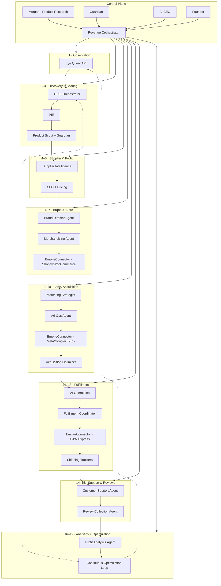
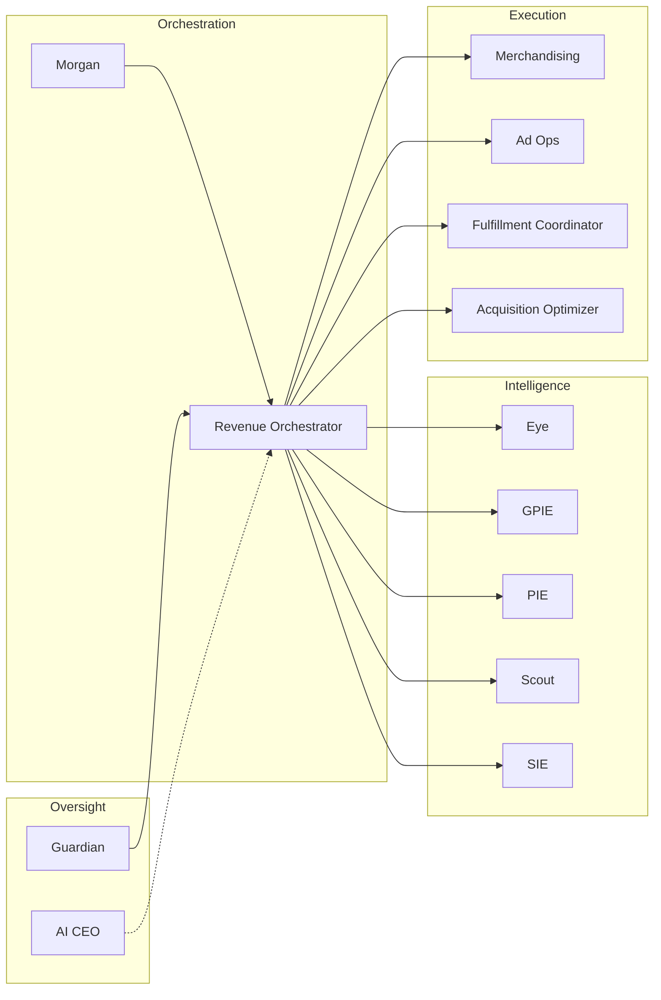
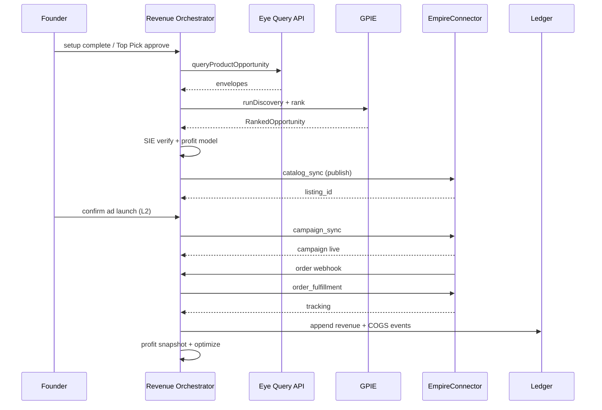
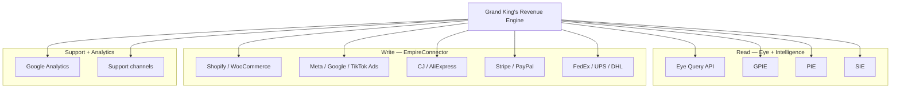

# EMPIREAI Grand King's Revenue Engine Architecture

> **Mission 017 — Design Only**  
> **Status:** Architecture specification (no live API implementation)  
> **Audience:** Engineering, AI workforce, architecture review  
> **Companion docs:** [EMPIREAI_EYE_ARCHITECTURE.md](./EMPIREAI_EYE_ARCHITECTURE.md) (Mission 016) · [EMPIREAI_GLOBAL_PRODUCT_INTELLIGENCE_ARCHITECTURE.md](./EMPIREAI_GLOBAL_PRODUCT_INTELLIGENCE_ARCHITECTURE.md) (Mission 015) · [EMPIREAI_ARCHITECTURE.md](./EMPIREAI_ARCHITECTURE.md)

---

## 1. Executive Summary

The **Grand King's Revenue Engine (GKRE)** is EmpireAI's end-to-end architecture for turning external market signals into **autonomous, repeatable revenue** for Grand King's Account workspaces — with **minimal founder intervention** after initial setup.

Where Mission 015 (GPIE) answers *"What should we sell?"* and Mission 016 (Eye) answers *"What is happening in the external world?"*, Mission 017 answers:

> **"How does a scored product become a profitable order — and how does the system learn and optimize?"**

GKRE is a **revenue execution orchestrator** that sits above existing intelligence modules and the operational connector plane. It does **not** replace PIE, Product Scout, Supplier Intelligence, GPIE, or Eye. It **coordinates** them through a seventeen-stage pipeline from observation to continuous optimization.

**Mission 017 adds (design only):**

- Unified revenue pipeline specification (17 stages, end-to-end)
- **Revenue Orchestrator** — master state machine for Grand King's Account lifecycle
- Proposed agents: Ad Ops Agent, Fulfillment Coordinator, Merchandising Agent, Acquisition Optimizer, Brand Director
- Human-in-the-loop approval matrix (founder vs AI CEO vs auto)
- Proposed `gka_*` persistence schema linking discovery → listing → campaign → order → profit
- Cross-cutting failure, rollback, and Guardian circuit breakers
- Rollup KPI dashboard and phased implementation roadmap

**Constraints (Phase A):** No changes to Brain core, AI CEO runtime, or any existing working intelligence modules. Architecture and documentation only.

---

## 2. Positioning — Where GKRE Sits

### 2.1 Layer stack

```
┌─────────────────────────────────────────────────────────────────────────────┐
│  FOUNDER + AI CEO — strategic oversight, budget caps, policy exceptions     │
└───────────────────────────────────┬─────────────────────────────────────────┘
                                    │ approval gates
                                    ▼
┌─────────────────────────────────────────────────────────────────────────────┐
│  REVENUE EXECUTION PLANE — Grand King's Revenue Engine (Mission 017)      │
│  Revenue Orchestrator · stage state machine · gka_* entities · rollback     │
└───────┬─────────────────────────────┬───────────────────────────┬───────────┘
        │                             │                           │
        ▼                             ▼                           ▼
┌───────────────┐           ┌─────────────────────┐       ┌──────────────────┐
│  DECISION     │           │  OBSERVATION        │       │  OPERATIONAL     │
│  INTELLIGENCE │           │  Eye (M016)         │       │  EmpireConnector │
│  GPIE · PIE   │           │  Query API only     │       │  mutations only  │
│  Scout · SIE  │           │  6 signal pipelines │       │  orders · ads    │
└───────────────┘           └─────────────────────┘       └──────────────────┘
```

### 2.2 Relationship to companion missions

| Layer | Mission | Role in GKRE |
|-------|---------|----------------|
| **Eye** | M016 | Stages 1, 8 (ad signals), 10 (market/acquisition signals), 17 (optimization inputs) — **read-only observation** |
| **GPIE** | M015 | Stages 2–3 — discovery orchestration, opportunity ranking |
| **PIE** | M005 | Stage 3 — authoritative SELL/REVIEW/DO_NOT_SELL scoring |
| **Product Scout** | M003 | Stage 3 — Empire score + Guardian gate on Top Pick |
| **Supplier Intelligence (SIE)** | Active | Stage 4 — trust scoring, fake detection, supplier comparison |
| **EmpireConnector** | M012+ ops | Stages 7–13 — storefront publish, ad deploy, order route, fulfilment, tracking |
| **CFO / Pricing / Inventory** | Planned contract | Stages 5, 11, 16 — margin, price guard, stock risk |
| **Marketing Strategist** | Planned contract | Stages 8–10 — campaign strategy, channel analysis |
| **Customer Support** | Planned contract | Stage 14 — triage, retention |
| **Guardian** | Active | Cross-cutting — policy gates, circuit breakers, rollback authorization |
| **AI CEO** | Active | Strategic approvals above workspace budget/policy thresholds — **unchanged runtime** |

### 2.3 Permanent separation rules (inherited from M015/M016)

1. **Observation** flows through Eye Query API only — GKRE never calls external APIs for intelligence.
2. **Mutations** flow through `EmpireConnector.invoke()` only — GKRE never mutates via Eye or PIE.
3. **Scoring truth** remains PIE + Scout + SIE — GKRE orchestrates, does not re-score.
4. **Brain dispatch** is the sole agent ingress — Revenue Orchestrator registers as a new module facade, not a Brain fork.

### 2.4 Grand King's Account scope

Each workspace running Grand King's Account owns one **GKRE pipeline instance** scoped by `workspace_id`. The pipeline progresses products from `gka_product_candidates` → `gka_listings` → `gka_campaigns` → `gka_orders` → `gka_profit_snapshots`, with SSE events on `/brain/events/stream` for founder passive monitoring.

---

## 3. End-to-End Pipeline Flowchart



---

## 4. Stage-by-Stage Specification

Each stage defines eight attributes in a consistent structure. Stage numbers map to the user's required pipeline.

---

### Stage 1 — External Market Observation (EmpireAI Eye)

| Attribute | Specification |
|-----------|---------------|
| **Inputs** | Workspace watchlist (`gka_watchlists`), category seeds, keyword seeds, poll schedules, webhook events, `EyeQueryRequest` from upstream stages |
| **Outputs** | `EyeQueryResult` with typed envelopes (product, trend, supplier, advertisement, market, risk); `EyeQuerySummary` narratives; SSE `eye.observation.recorded` |
| **Responsible AI agent** | **Morgan** (triggers composite queries) · **Eye Query Service** (execution) · **Guardian** (LLM summarization gate) |
| **External systems** | Amazon, CJ, AliExpress, Google Trends, Meta Ad Library, Reddit, Pinterest, TikTok Shop — via EyeConnector registry only |
| **Automation opportunities** | Scheduled polling per workspace category; anomaly-triggered refresh; composite `queryProductOpportunity` on watchlist delta |
| **Failure recovery** | Connector degrade → reduce poll frequency; fallback to cached envelopes (<72h); Guardian alert on 3 consecutive provider failures; skip stage with stale-data flag |
| **Human approval** | **Auto** — observation is read-only; founder notified on Guardian risk flags only |
| **Future KPIs** | Observation freshness (median age); provider uptime %; envelope confidence median; signals ingested / day |

---

### Stage 2 — Product Discovery

| Attribute | Specification |
|-----------|---------------|
| **Inputs** | Eye product/trend envelopes; `DiscoverySeed` (category, keywords, region); workspace category preferences; prior `gka_discovery_runs` |
| **Outputs** | `DiscoveredProductCandidate[]`; `gka_product_candidates` rows (status: `discovered`); `gka_discovery_runs` audit record |
| **Responsible AI agent** | **Morgan** · **GPIE Orchestrator** (Discovery Planner) · Eye `discover()` |
| **External systems** | Eye only (no direct provider calls); optional mirror to `gpi_discovery_candidates` |
| **Automation opportunities** | Nightly category scan; keyword expansion from Eye trend envelopes; dedup against active listings |
| **Failure recovery** | Partial candidate set accepted if ≥1 provider responds; retry with reduced `maxCandidates`; fallback to workspace catalog re-rank |
| **Human approval** | **Auto** for discovery runs; founder sees candidates in passive dashboard |
| **Future KPIs** | Candidates discovered / run; discovery run success rate; time-to-first-candidate; duplicate rate |

---

### Stage 3 — Product Scoring

| Attribute | Specification |
|-----------|---------------|
| **Inputs** | `DiscoveredProductCandidate[]`; Eye composite opportunity bundle; workspace catalog entries |
| **Outputs** | PIE `ProductIntelligenceEvaluation`; Scout evaluation + Guardian assessment; `RankedOpportunity[]`; `gka_product_candidates` (status: `scored`); `gka_scoring_records` |
| **Responsible AI agent** | **PIE** (authoritative score) · **Product Scout** (Empire score) · **Guardian** (Top Pick gate) · **GPIE Opportunity Ranker** |
| **External systems** | Eye Query API (`queryProductOpportunity`); SQLite PIE tables (existing) |
| **Automation opportunities** | Batch evaluate all candidates; auto-promote SELL + Scout APPROVE to Stage 4 queue; hard-filter DO_NOT_SELL |
| **Failure recovery** | Skip candidate on PIE error; continue batch; mark candidate `scoring_failed` with retry job; never bypass Scout Guardian for Top Pick |
| **Human approval** | **Founder signature** for Top Pick launch (`gka_approval_gates.type = top_pick`); **Auto** for background catalog scoring |
| **Future KPIs** | SELL rate among candidates; Scout APPROVE rate; median PIE overall score; scoring latency p95 |

---

### Stage 4 — Supplier Verification

| Attribute | Specification |
|-----------|---------------|
| **Inputs** | Scored product candidate; Eye supplier + risk envelopes; product SKU/title; preferred supplier connector |
| **Outputs** | SIE evaluation (SELL/REVIEW/REJECT); verified supplier binding; `gka_supplier_bindings`; candidate status `supplier_verified` or `supplier_rejected` |
| **Responsible AI agent** | **AI Supplier Intelligence (SIE)** · **AI Supplier Manager** · **Guardian** (fake supplier block) |
| **External systems** | Eye (supplier, risk domains); EmpireConnector `catalog_sync` (operational validation); CJ, AliExpress, Spocket |
| **Automation opportunities** | Auto-select lowest-cost verified supplier; compare top 3 via `supplier-intelligence.compare`; re-verify on price drift >10% |
| **Failure recovery** | Failover to `replaceableBy` supplier from connector catalog; mark `supplier_pending` and pause pipeline; escalate to AI Supplier Manager |
| **Human approval** | **Auto** when SIE SELL + Guardian clear; **AI CEO approve** when SIE REVIEW + high opportunity score; **Founder signature** on supplier switch mid-flight |
| **Future KPIs** | Supplier verification pass rate; median verify latency; fake-supplier block count; supplier failover rate |

---

### Stage 5 — Profit Calculation

| Attribute | Specification |
|-----------|---------------|
| **Inputs** | PIE margin dimensions; SIE purchase + ship costs; Eye market price band; ad CPC estimates (Eye advertisement domain); workspace fee schedule; royalty rate (10%) |
| **Outputs** | `GkaProfitModel` (COGS, landed cost, target price, gross margin, net margin after ads/royalty); `gka_profit_models`; go/no-go flag |
| **Responsible AI agent** | **AI CFO** · **Pricing Intelligence** · **Guardian** (`pricing.margin_guard`) |
| **External systems** | Finance ledger (read); Eye advertisement + market envelopes; Stripe/PayPal fee tables (config) |
| **Automation opportunities** | Auto-compute on supplier bind; dynamic price recommendation within margin floor; batch recalc on Eye price drift |
| **Failure recovery** | Block publish if net margin < workspace floor (default 15%); REVIEW queue for 10–15% margin; use conservative CPC upper bound |
| **Human approval** | **Auto** above margin floor; **Founder signature** below floor override; **AI CEO approve** for portfolio-wide margin policy change |
| **Future KPIs** | Predicted vs actual margin delta; % products blocked at margin gate; median net margin at launch; royalty accrual accuracy |

---

### Stage 6 — Brand Assignment

| Attribute | Specification |
|-----------|---------------|
| **Inputs** | Workspace brand profile; product category; Scout brandability score; founder setup brand direction (if exists) |
| **Outputs** | Brand variant assignment (colors, tone, hero template); product copy tone tag; `gka_brand_assignments`; listing creative brief |
| **Responsible AI agent** | **Brand Director Agent** (NEW) · **Brand Consistency Agent** (cross-catalog style) · Morgan (category alignment) |
| **External systems** | Workspace brand assets store; optional image generation service (S3 presigned, future) |
| **Automation opportunities** | Auto-assign from workspace default brand kit; A/B tone selection weighted by category; enforce catalog color consistency |
| **Failure recovery** | Fallback to workspace default brand; block publish if trademark risk flag from Eye risk pipeline |
| **Human approval** | **Auto** when reusing established workspace brand; **Founder signature** on first product in new category or new brand kit |
| **Future KPIs** | Brand consistency score; creative regeneration rate; trademark flag count |

---

### Stage 7 — Store Publishing

| Attribute | Specification |
|-----------|---------------|
| **Inputs** | Verified candidate; profit model (price); brand assignment; product images/copy; commerce connector credentials |
| **Outputs** | Live storefront listing; external listing ID; `gka_listings` (status: `published`); EmpireConnector sync receipt |
| **Responsible AI agent** | **Merchandising Agent** · **AI Operations** · Morgan (catalog coherence) |
| **External systems** | EmpireConnector: Shopify / WooCommerce (`catalog_sync`, metafields); Stripe checkout linkage |
| **Automation opportunities** | One-click publish pipeline post-approval; SEO metafield injection via SEO Intelligence; inventory placeholder for dropship |
| **Failure recovery** | Idempotent publish with correlation ID; rollback listing on Guardian block; retry with degraded copy-only publish |
| **Human approval** | **Auto** after Stage 3 Top Pick approval + margin pass; **Founder signature** for price override at publish |
| **Future KPIs** | Publish success rate; time-to-live listing; listing error rate by platform; catalog sync lag |

---

### Stage 8 — Advertisement Generation

| Attribute | Specification |
|-----------|---------------|
| **Inputs** | Published listing; Eye advertisement + trend envelopes; brand assignment; workspace ad budget cap; channel preferences |
| **Outputs** | Campaign brief; ad creatives (copy, hooks, CTAs); audience seed; `gka_ad_creatives`; `gka_campaign_drafts` |
| **Responsible AI agent** | **Marketing Strategist** · **AI Marketing Director** · **Ad Ops Agent** (NEW) |
| **External systems** | Eye (advertisement, trend domains); asset storage; optional LLM creative generation (Guardian-gated) |
| **Automation opportunities** | Template-based creative variants (3–5 per product); channel selection from Eye ad density; auto-localize copy |
| **Failure recovery** | Fallback to static template creatives; reduce variant count on LLM failure; skip video, ship static image ads |
| **Human approval** | **Auto** for template creatives within brand guidelines; **Founder signature** for first campaign per workspace; Guardian block on policy-sensitive copy |
| **Future KPIs** | Creatives generated / listing; creative approval rate; generation latency; policy rejection rate |

---

### Stage 9 — Advertisement Deployment

| Attribute | Specification |
|-----------|---------------|
| **Inputs** | `gka_campaign_drafts`; ad creatives; budget allocation; commerce pixel/catalog linkage |
| **Outputs** | Live ad campaigns; platform campaign IDs; `gka_campaigns` (status: `live`); spend tracking hooks |
| **Responsible AI agent** | **Ad Ops Agent** · **AI Marketing Director** · Guardian (spend cap enforcement) |
| **External systems** | EmpireConnector: Meta Ads, Google Ads, TikTok Ads (`campaign_sync`); payment method on ad account |
| **Automation opportunities** | Deploy to primary channel first; stagger multi-channel by Eye CPC efficiency; auto-pause at 80% budget (founder notification) |
| **Failure recovery** | Rollback campaign create on partial failure; switch channel per `replaceableBy`; circuit breaker on 3 deploy failures / hour |
| **Human approval** | **Founder signature** — confirm ad launch (one tap per FOUNDER_EXPERIENCE); **Auto** for creative rotation on live campaigns |
| **Future KPIs** | Deploy success rate; time-to-live ads; platform error rate; budget utilization at day 7 |

---

### Stage 10 — Customer Acquisition

| Attribute | Specification |
|-----------|---------------|
| **Inputs** | Live campaigns; Eye acquisition signals (CTR proxies, trend momentum); storefront traffic; conversion events |
| **Outputs** | Optimized bids/budgets; channel mix adjustments; `gka_acquisition_snapshots`; traffic attribution records |
| **Responsible AI agent** | **Acquisition Optimizer** (NEW) · **Media Buying Agent** · Marketing Strategist |
| **External systems** | Ad platform insights (via EmpireConnector); Google Analytics; storefront analytics webhooks |
| **Automation opportunities** | Dayparting; pause losers (ROAS < threshold); scale winners; cross-channel budget reallocation |
| **Failure recovery** | Freeze spend on tracking loss; revert to last known good bid set; alert founder on payment/policy pause only |
| **Human approval** | **Auto** within daily budget cap; **Founder signature** on budget increase >20%; **AI CEO approve** on cross-workspace spend reallocation |
| **Future KPIs** | CAC; ROAS; CTR; conversion rate; blended CPA by channel |

---

### Stage 11 — Order Routing

| Attribute | Specification |
|-----------|---------------|
| **Inputs** | Storefront order webhook; `gka_listings` supplier binding; inventory/availability snapshot |
| **Outputs** | Routed supplier order intent; `gka_orders` (status: `routed`); payment capture confirmation |
| **Responsible AI agent** | **AI Operations** · **Fulfillment Coordinator** (NEW) · Inventory Intelligence |
| **External systems** | EmpireConnector: Shopify/WooCommerce checkout; Stripe/PayPal (`payment_capture`); supplier connector |
| **Automation opportunities** | Auto-route to bound supplier; split orders on multi-SKU (future); fraud score gate (Guardian) |
| **Failure recovery** | Failover supplier from `gka_supplier_bindings` ranked list; queue order `routing_pending`; never double-charge — idempotent payment refs |
| **Human approval** | **Auto** for standard dropship route; **AI CEO approve** on high-value order (> threshold); **Founder signature** on manual supplier override |
| **Future KPIs** | Order routing success rate; routing latency p95; failover rate; payment capture failure rate |

---

### Stage 12 — Supplier Fulfilment

| Attribute | Specification |
|-----------|---------------|
| **Inputs** | Routed order; supplier API credentials; line items + ship-to address |
| **Outputs** | Supplier order confirmation; supplier order ID; `gka_orders` (status: `fulfillment_submitted`); ledger COGS event |
| **Responsible AI agent** | **Fulfillment Coordinator** · **AI Supplier Manager** · **AI Operations** |
| **External systems** | EmpireConnector: CJ, AliExpress, etc. (`order_fulfillment`); finance ledger (append) |
| **Automation opportunities** | Instant supplier API submit; auto-cancel on Guardian fraud flag; batch daily reconciliation |
| **Failure recovery** | Retry with exponential backoff; alternate supplier if SLA breached; refund trigger on unfulfillable SKU |
| **Human approval** | **Auto**; **Founder signature** on refund > threshold; **AI CEO approve** on supplier account suspension |
| **Future KPIs** | Fulfillment submit success rate; supplier SLA adherence; unfulfillable order rate; COGS accuracy |

---

### Stage 13 — Tracking

| Attribute | Specification |
|-----------|---------------|
| **Inputs** | Supplier shipment notification; carrier tracking numbers; order state |
| **Outputs** | Storefront fulfillment update; customer notification trigger; `gka_shipments`; `gka_orders` (status: `shipped` / `delivered`) |
| **Responsible AI agent** | **AI Operations** · **Fulfillment Coordinator** · Inventory Intelligence (`fulfillment_risk`) |
| **External systems** | EmpireConnector: supplier tracking webhooks; FedEx/UPS/DHL (`shipment_tracking`); Shopify fulfillment API |
| **Automation opportunities** | Auto-push tracking to storefront; proactive delay emails; escalate stuck shipments > SLA |
| **Failure recovery** | Poll carrier on missing webhook; mark `tracking_pending`; customer support auto-ticket on delay > 7 days |
| **Human approval** | **Auto**; **Founder signature** only on bulk tracking correction / manual fulfillment |
| **Future KPIs** | Tracking upload rate; median ship time; delivery success rate; stuck shipment count |

---

### Stage 14 — Customer Support

| Attribute | Specification |
|-----------|---------------|
| **Inputs** | Support tickets; order/shipment state; customer messages; retention signals |
| **Outputs** | Resolved/escalated tickets; refund/credit recommendations; `gka_support_cases`; CSAT record |
| **Responsible AI agent** | **AI Customer Success** · **Customer Support module** · Guardian (refund policy) |
| **External systems** | Support inbox (email/chat webhook); storefront order API; Stripe refund capability |
| **Automation opportunities** | Tier-1 auto-reply (where is my order, cancel window); retention offers on churn signals |
| **Failure recovery** | Escalate to founder on policy edge cases; link ticket to `gka_orders` for context; never auto-refund above cap |
| **Human approval** | **Auto** tier-1; **Founder signature** on refund above cap; **AI CEO approve** on repeat offender policy |
| **Future KPIs** | First response time; resolution time; CSAT; escalation rate; refund rate |

---

### Stage 15 — Review Collection

| Attribute | Specification |
|-----------|---------------|
| **Inputs** | Delivered orders; post-delivery timer; storefront review API; customer email/SMS consent |
| **Outputs** | Product reviews; aggregate rating; `gka_reviews`; listing social proof sync |
| **Responsible AI agent** | **Review Collection Agent** (NEW) · **AI Customer Success** · Merchandising Agent (display sync) |
| **External systems** | Shopify/WooCommerce review metafields; email provider; optional third-party review app |
| **Automation opportunities** | Timed review request (7 days post-delivery); incentive-free nudge sequence; negative review alert to support |
| **Failure recovery** | Skip channel on consent missing; retry once on send failure; suppress request on open support case |
| **Human approval** | **Auto**; **Founder signature** on public response to negative review (optional policy) |
| **Future KPIs** | Review request send rate; review conversion rate; average rating; negative review response time |

---

### Stage 16 — Profit Analytics

| Attribute | Specification |
|-----------|---------------|
| **Inputs** | Ledger events (revenue, COGS, ad spend, fees, royalty); `gka_orders`; `gka_campaigns`; predicted `gka_profit_models` |
| **Outputs** | Product-level P&L; workspace rollup; `gka_profit_snapshots`; variance reports (predicted vs actual) |
| **Responsible AI agent** | **AI CFO** · **Analytics Agent** · Morgan (research feedback) |
| **External systems** | Finance ledger; ad platform spend import; treasury buckets |
| **Automation opportunities** | Daily snapshot job; alert on margin erosion >5pp; auto-tag loss leaders for optimization |
| **Failure recovery** | Reconcile from source connectors on ledger gap; mark snapshot `partial` if ad spend lag; never overwrite ledger |
| **Human approval** | **Auto** reporting; **Founder signature** on withdrawal; **AI CEO approve** on portfolio reallocation recommendations |
| **Future KPIs** | Gross/net margin by SKU; ROAS vs predicted; revenue MTD; royalty accrued; variance MAPE |

---

### Stage 17 — Continuous Optimization

| Attribute | Specification |
|-----------|---------------|
| **Inputs** | Profit snapshots; acquisition metrics; Eye refreshed signals; review sentiment; support themes; Scout/GPIE feedback |
| **Outputs** | Optimization actions (pause SKU, swap supplier, refresh ads, re-run discovery); `gka_optimization_actions`; loop back to Stages 1–10 |
| **Responsible AI agent** | **Revenue Orchestrator** · **Acquisition Optimizer** · Morgan · **AI CEO** (strategic pivots) |
| **External systems** | Eye (all domains); EmpireConnector (mutations); Brain dispatch to all modules |
| **Automation opportunities** | Closed-loop: pause ROAS < 1.0 for 7d; Merchandising swap within category; refresh Eye watchlist; GPIE re-rank catalog |
| **Failure recovery** | Rollback last optimization action set; Guardian circuit breaker on >3 actions / hour; human review queue for destructive changes |
| **Human approval** | **Auto** for bounded actions (bid -10%, pause ad); **AI CEO approve** for SKU removal; **Founder signature** for category pivot |
| **Future KPIs** | Optimization action success rate; revenue lift from optimizations; loop cycle time; false-positive pause rate |

---

## 5. Agent Roster

### 5.1 Mapping to existing EmpireAI modules

| Agent / Role | Workforce / Module | GKRE stages | Status |
|--------------|-------------------|-------------|--------|
| **Morgan** | Product Research (Grand King's Account) | 1–3, 6–7, 16–17 | Active (Brain agent) |
| **GPIE Orchestrator** | `global-product-intelligence/` (M015 design) | 2–3 | Design |
| **PIE** | `product-intelligence` module | 3 | Active |
| **Product Scout + Guardian gate** | `product-scout` + `guardian` | 3 | Active |
| **AI Supplier Intelligence (SIE)** | `supplier-intelligence` | 4 | Active |
| **AI Supplier Manager** | `suppliers` / workforce | 4, 12 | Active |
| **AI CFO** | `cfo` / finance | 5, 16 | Contract planned |
| **Pricing Intelligence** | `pricing` | 5, 17 | Contract planned |
| **Marketing Strategist** | `marketing-strategist` | 8–10 | Contract planned |
| **AI Marketing Director** | `marketing` workforce | 8–9 | Active |
| **Media Buying Agent** | Marketing workforce | 10, 17 | Documented |
| **Merchandising Agent** | Merchandising (docs) | 7, 15, 17 | Documented |
| **AI Operations** | `orders` workforce | 7, 11–13 | Active |
| **AI Customer Success** | `support` workforce | 14–15 | Active |
| **Inventory Intelligence** | `inventory` | 11, 13 | Contract planned |
| **SEO Intelligence** | `seo` | 7 | Contract planned |
| **Guardian** | `guardian` | All (gates) | Active |
| **AI CEO** | `ai-ceo` | Approval matrix | Active — **no runtime changes** |
| **Eye Query Service** | `eye/` (M016 design) | 1, 8, 10, 17 | Design |

### 5.2 Proposed new agents (Mission 017+)

| Agent | Module ID (proposed) | Responsibility | Stages |
|-------|---------------------|----------------|--------|
| **Revenue Orchestrator** | `grand-kings-revenue-engine` | Master pipeline state machine, stage transitions, rollback, SSE | All |
| **Ad Ops Agent** | `ad-ops` | Creative QA, campaign deploy, platform error recovery | 8–9 |
| **Fulfillment Coordinator** | `fulfillment-coordinator` | Order route → supplier submit → tracking cohesion | 11–13 |
| **Brand Director Agent** | `brand-director` | Brand kit assignment, copy tone, trademark check | 6 |
| **Acquisition Optimizer** | `acquisition-optimizer` | Bid/budget loop, channel mix, CAC/ROAS targets | 10, 17 |
| **Review Collection Agent** | `review-collection` | Post-delivery review requests, rating sync | 15 |
| **Analytics Agent** | `analytics` | Daily digest, dashboard rollups (extends reporting) | 16 |

### 5.3 Agent interaction diagram



---

## 6. Human-in-the-Loop Gates — Founder Approval Matrix

### 6.1 Authority levels

| Level | Actor | Scope |
|-------|-------|-------|
| **L0 Auto** | Revenue Orchestrator + modules | Read-only, scoring, observation, bounded optimizations |
| **L1 AI CEO** | AI CEO strategic approval queue | Portfolio policy, high-value orders, SKU removal, spend reallocation |
| **L2 Founder tap** | One-tap confirm in dashboard | Ad launch, Top Pick, standard budget confirm |
| **L3 Founder signature** | Explicit approve + audit trail | Margin override, supplier switch, refund above cap, category pivot |

### 6.2 Stage approval matrix

| Stage | Default mode | Escalation |
|-------|--------------|------------|
| 1 Observation | L0 Auto | Guardian alert only |
| 2 Discovery | L0 Auto | — |
| 3 Scoring | L0 Auto (batch) / **L2 Top Pick** | Scout REJECT blocks auto |
| 4 Supplier verify | L0 Auto (SELL) / L1 (REVIEW) | L3 supplier switch |
| 5 Profit calc | L0 Auto above floor | L3 below margin floor |
| 6 Brand | L0 Auto (existing kit) | L3 new brand kit |
| 7 Publish | L0 after Top Pick | L3 price override |
| 8 Ad generation | L0 template | L3 first workspace campaign |
| 9 Ad deploy | **L2 Founder tap** | L1 if budget > cap |
| 10 Acquisition | L0 within cap | L2 budget +20%; L1 cross-workspace |
| 11 Order route | L0 standard | L1 high-value |
| 12 Fulfilment | L0 Auto | L3 refund trigger |
| 13 Tracking | L0 Auto | L3 bulk correction |
| 14 Support | L0 tier-1 | L3 refund above cap |
| 15 Reviews | L0 Auto | L3 public negative reply |
| 16 Analytics | L0 Auto | L3 withdrawal |
| 17 Optimization | L0 bounded | L1 SKU remove; L3 category pivot |

### 6.3 Approval persistence (proposed)

```typescript
export type GkaApprovalLevel = "auto" | "ai_ceo" | "founder_tap" | "founder_signature";

export type GkaApprovalGate = {
  id: string;
  workspaceId: string;
  pipelineRunId: string;
  stage: number;                    // 1–17
  gateType: string;                 // e.g. "top_pick", "ad_launch", "margin_override"
  requiredLevel: GkaApprovalLevel;
  status: "pending" | "approved" | "rejected" | "expired";
  resolvedBy?: "founder" | "ai-ceo" | "system";
  resolvedAt?: string;
  expiresAt?: string;
  metadata: Record<string, unknown>;
  createdAt: string;
};
```

**AI CEO constraint:** GKRE **queues** decisions to the existing AI CEO approval interface — it does not modify AI CEO agent code in Phase A–C.

---

## 7. Data Flow & Proposed Schema

### 7.1 Entity lifecycle

```
gka_pipeline_runs
  └── gka_product_candidates
        ├── gka_scoring_records
        ├── gka_supplier_bindings
        ├── gka_profit_models
        ├── gka_brand_assignments
        └── gka_listings
              ├── gka_ad_creatives
              ├── gka_campaigns
              └── gka_orders
                    ├── gka_shipments
                    ├── gka_support_cases
                    ├── gka_reviews
                    └── gka_profit_snapshots
gka_optimization_actions  → loops back to pipeline / Eye watchlists
gka_approval_gates        → cross-cutting
gka_watchlists            → Eye schedule seeds
```

### 7.2 Proposed tables (design only — no migrations in Mission 017)

```sql
-- Master pipeline run per workspace product journey
CREATE TABLE IF NOT EXISTS gka_pipeline_runs (
  id TEXT PRIMARY KEY,
  workspace_id TEXT NOT NULL,
  product_candidate_id TEXT NOT NULL,
  current_stage INTEGER NOT NULL DEFAULT 1,   -- 1–17
  status TEXT NOT NULL,                       -- active | paused | completed | failed | rolled_back
  correlation_id TEXT NOT NULL,
  started_at TEXT NOT NULL,
  updated_at TEXT NOT NULL,
  completed_at TEXT
);
CREATE INDEX IF NOT EXISTS idx_gka_runs_ws ON gka_pipeline_runs(workspace_id, status);

-- Product candidates (extends GPIE discovery)
CREATE TABLE IF NOT EXISTS gka_product_candidates (
  id TEXT PRIMARY KEY,
  workspace_id TEXT NOT NULL,
  discovery_run_id TEXT,                      -- links gpi_discovery_runs
  product_title TEXT NOT NULL,
  category TEXT NOT NULL,
  status TEXT NOT NULL,                       -- discovered | scored | supplier_verified | rejected | published
  pie_product_id TEXT,
  top_pick INTEGER NOT NULL DEFAULT 0,
  metadata TEXT,                              -- JSON
  created_at TEXT NOT NULL,
  updated_at TEXT NOT NULL
);

CREATE TABLE IF NOT EXISTS gka_scoring_records (
  id TEXT PRIMARY KEY,
  candidate_id TEXT NOT NULL,
  pie_overall_score REAL NOT NULL,
  pie_recommendation TEXT NOT NULL,
  empire_score REAL,
  scout_recommendation TEXT,
  opportunity_score REAL,
  confidence REAL NOT NULL,
  scored_at TEXT NOT NULL
);

CREATE TABLE IF NOT EXISTS gka_supplier_bindings (
  id TEXT PRIMARY KEY,
  candidate_id TEXT NOT NULL,
  supplier_connector_id TEXT NOT NULL,
  supplier_sku TEXT,
  sie_recommendation TEXT NOT NULL,
  purchase_price_cents INTEGER NOT NULL,
  ship_days_estimate INTEGER,
  rank INTEGER NOT NULL DEFAULT 1,            -- failover order
  verified_at TEXT NOT NULL
);

CREATE TABLE IF NOT EXISTS gka_profit_models (
  id TEXT PRIMARY KEY,
  candidate_id TEXT NOT NULL,
  target_price_cents INTEGER NOT NULL,
  cogs_cents INTEGER NOT NULL,
  est_ad_cost_cents INTEGER NOT NULL,
  gross_margin_pct REAL NOT NULL,
  net_margin_pct REAL NOT NULL,
  royalty_cents INTEGER NOT NULL,
  go_no_go TEXT NOT NULL,                     -- go | review | no_go
  computed_at TEXT NOT NULL
);

CREATE TABLE IF NOT EXISTS gka_brand_assignments (
  id TEXT PRIMARY KEY,
  candidate_id TEXT NOT NULL,
  brand_kit_id TEXT NOT NULL,
  tone TEXT NOT NULL,
  creative_brief TEXT,                        -- JSON
  assigned_at TEXT NOT NULL
);

CREATE TABLE IF NOT EXISTS gka_listings (
  id TEXT PRIMARY KEY,
  workspace_id TEXT NOT NULL,
  candidate_id TEXT NOT NULL,
  commerce_connector_id TEXT NOT NULL,
  external_listing_id TEXT,
  status TEXT NOT NULL,                       -- draft | published | paused | removed
  price_cents INTEGER NOT NULL,
  published_at TEXT,
  created_at TEXT NOT NULL
);

CREATE TABLE IF NOT EXISTS gka_ad_creatives (
  id TEXT PRIMARY KEY,
  listing_id TEXT NOT NULL,
  channel TEXT NOT NULL,                      -- meta | google | tiktok
  creative_type TEXT NOT NULL,
  copy TEXT NOT NULL,
  asset_refs TEXT,                            -- JSON array
  status TEXT NOT NULL,
  created_at TEXT NOT NULL
);

CREATE TABLE IF NOT EXISTS gka_campaigns (
  id TEXT PRIMARY KEY,
  listing_id TEXT NOT NULL,
  ad_connector_id TEXT NOT NULL,
  external_campaign_id TEXT,
  daily_budget_cents INTEGER NOT NULL,
  status TEXT NOT NULL,                       -- draft | live | paused | ended
  deployed_at TEXT,
  created_at TEXT NOT NULL
);

CREATE TABLE IF NOT EXISTS gka_orders (
  id TEXT PRIMARY KEY,
  workspace_id TEXT NOT NULL,
  listing_id TEXT NOT NULL,
  external_order_id TEXT NOT NULL,
  supplier_connector_id TEXT,
  supplier_order_id TEXT,
  status TEXT NOT NULL,                       -- received | routed | fulfillment_submitted | shipped | delivered | cancelled | refunded
  revenue_cents INTEGER NOT NULL,
  cogs_cents INTEGER,
  created_at TEXT NOT NULL,
  updated_at TEXT NOT NULL
);

CREATE TABLE IF NOT EXISTS gka_shipments (
  id TEXT PRIMARY KEY,
  order_id TEXT NOT NULL,
  carrier TEXT,
  tracking_number TEXT,
  status TEXT NOT NULL,
  shipped_at TEXT,
  delivered_at TEXT
);

CREATE TABLE IF NOT EXISTS gka_support_cases (
  id TEXT PRIMARY KEY,
  order_id TEXT,
  workspace_id TEXT NOT NULL,
  subject TEXT NOT NULL,
  status TEXT NOT NULL,
  tier INTEGER NOT NULL DEFAULT 1,
  resolved_at TEXT,
  created_at TEXT NOT NULL
);

CREATE TABLE IF NOT EXISTS gka_reviews (
  id TEXT PRIMARY KEY,
  order_id TEXT NOT NULL,
  listing_id TEXT NOT NULL,
  rating INTEGER NOT NULL,
  body TEXT,
  external_review_id TEXT,
  collected_at TEXT NOT NULL
);

CREATE TABLE IF NOT EXISTS gka_profit_snapshots (
  id TEXT PRIMARY KEY,
  workspace_id TEXT NOT NULL,
  listing_id TEXT,
  period_start TEXT NOT NULL,
  period_end TEXT NOT NULL,
  revenue_cents INTEGER NOT NULL,
  cogs_cents INTEGER NOT NULL,
  ad_spend_cents INTEGER NOT NULL,
  fees_cents INTEGER NOT NULL,
  royalty_cents INTEGER NOT NULL,
  net_profit_cents INTEGER NOT NULL,
  predicted_net_margin_pct REAL,
  variance_pct REAL,
  computed_at TEXT NOT NULL
);

CREATE TABLE IF NOT EXISTS gka_optimization_actions (
  id TEXT PRIMARY KEY,
  workspace_id TEXT NOT NULL,
  pipeline_run_id TEXT,
  action_type TEXT NOT NULL,                  -- pause_campaign | swap_supplier | refresh_discovery | price_adjust
  target_entity_type TEXT NOT NULL,
  target_entity_id TEXT NOT NULL,
  status TEXT NOT NULL,                       -- pending | applied | rolled_back | failed
  approval_level TEXT NOT NULL,
  applied_at TEXT,
  created_at TEXT NOT NULL
);

CREATE TABLE IF NOT EXISTS gka_approval_gates (
  id TEXT PRIMARY KEY,
  workspace_id TEXT NOT NULL,
  pipeline_run_id TEXT NOT NULL,
  stage INTEGER NOT NULL,
  gate_type TEXT NOT NULL,
  required_level TEXT NOT NULL,
  status TEXT NOT NULL,
  resolved_by TEXT,
  resolved_at TEXT,
  expires_at TEXT,
  metadata TEXT,
  created_at TEXT NOT NULL
);

CREATE TABLE IF NOT EXISTS gka_watchlists (
  id TEXT PRIMARY KEY,
  workspace_id TEXT NOT NULL,
  category TEXT NOT NULL,
  keywords TEXT,                              -- JSON array
  eye_schedule_id TEXT,                       -- links eye_poll_schedules (M016)
  enabled INTEGER NOT NULL DEFAULT 1,
  created_at TEXT NOT NULL
);

CREATE TABLE IF NOT EXISTS gka_acquisition_snapshots (
  id TEXT PRIMARY KEY,
  campaign_id TEXT NOT NULL,
  snapshot_date TEXT NOT NULL,
  impressions INTEGER NOT NULL DEFAULT 0,
  clicks INTEGER NOT NULL DEFAULT 0,
  spend_cents INTEGER NOT NULL DEFAULT 0,
  conversions INTEGER NOT NULL DEFAULT 0,
  roas REAL,
  cac_cents INTEGER,
  recorded_at TEXT NOT NULL
);
```

### 7.3 Event bus (SSE / domain events)

| Event | Stage | Consumers |
|-------|-------|-----------|
| `gka.stage.advanced` | Any | Founder dashboard, AI CEO digest |
| `gka.approval.required` | 3, 5, 9, … | Founder UI, AI CEO queue |
| `gka.listing.published` | 7 | Merchandising, SEO, Ad Ops |
| `gka.campaign.live` | 9 | Acquisition Optimizer |
| `gka.order.received` | 11 | Fulfillment Coordinator |
| `gka.profit.snapshot` | 16 | CFO, Analytics, Optimization |
| `gka.optimization.applied` | 17 | Guardian audit, Morgan feedback |

### 7.4 Sequence — happy path



---

## 8. Integration Map

### 8.1 Intelligence integrations (read-only)

| Integration | GKRE usage | Stages |
|-------------|-----------|--------|
| **Eye Query API** | `query`, `queryProductOpportunity`, `discover`, `summarize` | 1, 2, 8, 10, 17 |
| **GPIE Orchestrator** | `runDiscovery`, `rankWorkspaceCatalog` | 2, 3, 17 |
| **PIE** | `product-intelligence.evaluate` | 3 |
| **Product Scout** | `product-scout.evaluate`, Guardian gate | 3 |
| **SIE** | `supplier-intelligence.evaluate`, `.compare` | 4 |
| **CFO / Pricing** | `cfo.analyze_margin`, `pricing.margin_guard` | 5, 16 |
| **Marketing Strategist** | `marketing-strategist.generate_campaign` | 8 |
| **SEO** | `seo.content_recommend` | 7 |
| **Inventory** | `inventory.fulfillment_risk` | 11, 13 |
| **Customer Support** | `customer-support.triage` | 14 |
| **Guardian** | `guardian.assess` on destructive actions | All |

### 8.2 Operational integrations (mutations via EmpireConnector)

| Connector category | Providers | Capabilities | Stages |
|-------------------|-----------|--------------|--------|
| **Commerce** | Shopify, WooCommerce | `catalog_sync`, checkout webhooks | 7, 11 |
| **Suppliers** | CJ, AliExpress, Spocket, … | `catalog_sync`, `order_fulfillment` | 4, 12 |
| **Advertising** | Meta, Google, TikTok | `campaign_sync` | 9, 10 |
| **Payments** | Stripe, PayPal | `payment_capture`, `refund` | 11, 14 |
| **Shipping** | FedEx, UPS, DHL | `shipment_tracking` | 13 |
| **Analytics** | GA, GSC | `metrics_import` | 10, 16 |

### 8.3 Integration diagram



### 8.4 Brain contract capabilities (proposed)

```typescript
export type GrandKingsRevenueEngineCapability =
  | "gka.pipeline.start"
  | "gka.pipeline.advance"
  | "gka.pipeline.pause"
  | "gka.pipeline.rollback"
  | "gka.approval.resolve"
  | "gka.listing.publish"
  | "gka.campaign.deploy"
  | "gka.order.route"
  | "gka.optimize.apply"
  | "gka.dashboard.summary";

// Module ID: "grand-kings-revenue-engine"
// Orchestrator dispatches to existing module capabilities — never bypasses Brain Contract
```

---

## 9. Failure & Resilience

### 9.1 Cross-cutting principles

1. **Idempotency** — every EmpireConnector mutation carries `correlationId` from `gka_pipeline_runs`.
2. **Append-only finance** — refunds and COGS adjust via new ledger events, never overwrite.
3. **Stage isolation** — failure in Stage 9 does not rollback Stage 7 listing unless Guardian mandates.
4. **Compensating transactions** — documented rollback actions per stage (see §9.3).

### 9.2 Circuit breakers (Guardian-enforced)

| Breaker | Trigger | Action |
|---------|---------|--------|
| **Ad deploy breaker** | 3 failed `campaign_sync` / hour | Pause Stage 9; notify founder |
| **Spend breaker** | Daily spend > 110% budget | Auto-pause campaigns |
| **Fulfillment breaker** | 5 consecutive supplier failures | Failover chain; then pause new routes |
| **Optimization breaker** | >3 destructive actions / hour | Queue for AI CEO review |
| **Margin breaker** | Net margin < floor on 3 consecutive orders | Pause ads; Merchandising review |

### 9.3 Rollback matrix

| Failed stage | Rollback action | Data impact |
|--------------|-----------------|-------------|
| 7 Publish | `catalog_sync` delete / unpublish | `gka_listings.status = removed` |
| 9 Ad deploy | Pause/delete campaign via connector | `gka_campaigns.status = ended` |
| 11 Order route | Cancel supplier intent if not submitted; refund if captured | Order `cancelled` |
| 12 Fulfilment | Cancel supplier order; initiate refund | Ledger refund event |
| 17 Optimization | Reverse last `gka_optimization_actions` row | Restore prior campaign/listing state |

### 9.4 Guardian checks (mandatory)

- Pre-mutation `guardian.assess` for: publish, deploy, refund, SKU removal, margin override
- Architecture validation on new agent module registration
- Health check aggregation from Eye + EmpireConnector before nightly optimization job

### 9.5 Pipeline pause / resume

```typescript
export interface RevenueOrchestrator {
  startPipeline(workspaceId: string, seed: DiscoverySeed): Promise<GkaPipelineRun>;
  advanceStage(runId: string, targetStage?: number): Promise<GkaPipelineRun>;
  pausePipeline(runId: string, reason: string): Promise<void>;
  resumePipeline(runId: string): Promise<void>;
  rollback(runId: string, toStage: number): Promise<GkaRollbackResult>;
  resolveApproval(gateId: string, decision: "approved" | "rejected", actor: string): Promise<void>;
}
```

---

## 10. KPI Dashboard — Rollup Metrics

### 10.1 Executive rollup (founder dashboard)

| KPI | Formula / source | Target (initial) |
|-----|------------------|------------------|
| **Revenue MTD** | Sum `gka_profit_snapshots.revenue_cents` | Growth WoW |
| **Net profit MTD** | Revenue − COGS − ads − fees − royalty | Positive by day 30 |
| **Blended ROAS** | Revenue / ad spend | ≥ 1.5 at steady state |
| **CAC** | Ad spend / new customers | < 40% of first-order margin |
| **Pipeline velocity** | Median hours Stage 1 → 9 | < 24h (automated path) |
| **Founder actions / week** | Count L2+L3 approvals | ≤ 3 (passive operating mode) |
| **Live listings** | `gka_listings` published | Portfolio target |
| **Fulfillment rate** | Delivered / routed orders | ≥ 95% |
| **Support CSAT** | Post-resolution survey | ≥ 4.2 / 5 |
| **Optimization lift** | Revenue delta post `gka_optimization_actions` | Track; target +5% / month |

### 10.2 Stage health panel

| Stage group | Health signal | Red threshold |
|-------------|---------------|---------------|
| Observation (1) | Eye confidence median | < 40 |
| Discovery–Scoring (2–3) | Run failure rate | > 10% |
| Supply chain (4–5, 11–13) | Verify + fulfil success | < 90% |
| Growth (8–10) | Deploy + ROAS | ROAS < 0.8 for 7d |
| Post-sale (14–15) | CSAT + review rate | CSAT < 3.5 |
| Learning (16–17) | Margin variance MAPE | > 25% |

### 10.3 AI CEO digest (daily)

- Top 3 opportunities in pipeline
- Pending approval gates
- Circuit breaker activations
- Net profit vs plan
- Recommended strategic actions (read-only until approved)

---

## 11. Implementation Roadmap

### Phase A — Mission 017 (this document) ✅

- Full architecture specification (17 stages)
- Agent roster and approval matrix
- `gka_*` schema design
- Integration and resilience design
- **Zero production code changes**
- **No modifications to Brain, AI CEO, or existing working modules**

### Phase B — Orchestrator skeleton

- Create `backend/src/grand-kings-revenue-engine/` (new module)
- Implement `RevenueOrchestrator` state machine (mock stage transitions)
- Brain route stub (feature-flagged): `gka.pipeline.start`, `gka.dashboard.summary`
- Migration for core `gka_pipeline_runs`, `gka_product_candidates`, `gka_approval_gates`
- SSE events: `gka.stage.advanced`, `gka.approval.required`

### Phase C — Intelligence path (Stages 1–5)

- Wire GPIE + Eye adapter (depends on Eye Phase B/C)
- Pipeline Stages 1–5 automation against existing PIE, Scout, SIE
- `gka_scoring_records`, `gka_supplier_bindings`, `gka_profit_models`
- Top Pick approval UI integration (founder tap)

### Phase D — Commerce path (Stages 6–9)

- Brand Director + Merchandising Agent facades
- EmpireConnector publish + campaign deploy
- Ad Ops Agent; founder ad launch confirmation
- Tables: `gka_listings`, `gka_campaigns`, `gka_ad_creatives`

### Phase E — Operations path (Stages 10–15)

- Order webhook ingestion → Fulfillment Coordinator
- Acquisition Optimizer loop; `gka_acquisition_snapshots`
- Customer Support + Review Collection integration
- Tables: `gka_orders`, `gka_shipments`, `gka_support_cases`, `gka_reviews`

### Phase F — Analytics & optimization (Stages 16–17)

- CFO profit snapshots vs ledger reconciliation
- Continuous optimization closed loop → Eye watchlist refresh
- KPI dashboard in founder UI
- Calibration feedback into GPIE ranking weights

### Phase G — Grand King's Account production

- End-to-end feature flag per workspace
- Guardian circuit breakers live
- Deprecate ad-hoc scripts replaced by GKRE orchestrator
- Documentation sync across EMPIREAI_* docs

### Dependency graph

```
Phase A (doc)
  → Phase B (orchestrator)
      → Phase C (requires Eye B/C + GPIE B)
      → Phase D (requires EmpireConnector live or mock invoke)
      → Phase E (requires D listings + campaigns)
      → Phase F (requires ledger + order history)
      → Phase G (production GA)
```

---

## 12. Constraints Honored

Mission 017 Phase A explicitly commits to:

| Constraint | Status |
|------------|--------|
| **No production code changes** | ✅ Document only |
| **No Brain core modifications** | ✅ GKRE registers as new module facade via Brain Contract |
| **No AI CEO runtime changes** | ✅ Approval queue integration designed against existing interface |
| **No PIE / Scout / SIE refactors** | ✅ Orchestrator calls existing capabilities |
| **No Eye implementation** | ✅ Depends on M016 phases; GKRE consumes Eye Query API contract only |
| **No GPIE implementation** | ✅ Depends on M015 phases; GKRE consumes orchestrator contract only |
| **No EmpireConnector catalog changes** | ✅ Uses existing capabilities map |
| **No database migrations** | ✅ Schema documented only |
| **Additive agent modules only** | ✅ New agents in new folders; workforce registry extension in future phase |

---

## 13. Proposed Folder Structure

```
backend/src/grand-kings-revenue-engine/     # NEW — Mission 017+ implementation
├── index.ts
├── types.ts
├── contract/
│   ├── revenue-orchestrator.ts             # RevenueOrchestrator interface
│   ├── pipeline-stages.ts                  # Stage enum + transition rules
│   └── capabilities.ts                     # gka.* Brain capabilities (design)
├── orchestrator/
│   ├── revenue-orchestrator.ts             # Master state machine
│   ├── stage-handlers/                     # One handler per stage (1–17)
│   │   ├── stage-01-observation.ts
│   │   ├── stage-02-discovery.ts
│   │   └── ...
│   ├── rollback-service.ts
│   └── approval-service.ts
├── agents/                                 # Thin facades — dispatch to Brain modules
│   ├── ad-ops-agent.ts
│   ├── fulfillment-coordinator.ts
│   ├── brand-director-agent.ts
│   ├── acquisition-optimizer.ts
│   └── review-collection-agent.ts
├── repositories/
│   ├── pipeline-repository.ts
│   ├── listing-repository.ts
│   ├── campaign-repository.ts
│   └── order-repository.ts
└── dashboard/
    └── kpi-aggregator.ts

backend/src/eye/                            # M016 — unchanged by M017
backend/src/intelligence/                 # PIE, Scout, SIE, GPIE — unchanged
backend/src/brain/                        # Brain + AI CEO — unchanged
backend/src/connectors/                     # EmpireConnector — unchanged
```

---

## 14. Testing Strategy (future implementation)

| Test | Scope |
|------|-------|
| Existing 71+ tests | Must pass unchanged through all GKRE phases |
| `grand-kings-revenue-engine.test.ts` | Stage transition determinism, rollback |
| `gka-approval-matrix.test.ts` | Gate level enforcement |
| `gka-idempotency.test.ts` | Duplicate order/webhook handling |
| Integration | Mock Eye + GPIE + EmpireConnector happy path Stages 1–13 |
| Guardian | Circuit breaker triggers and recovery |

Mission 017: **typecheck only** — no new tests required for doc-only delivery.

---

## 15. References

| Artifact | Path |
|----------|------|
| Eye architecture (M016) | `EMPIREAI_EYE_ARCHITECTURE.md` |
| Global Product Intelligence (M015) | `EMPIREAI_GLOBAL_PRODUCT_INTELLIGENCE_ARCHITECTURE.md` |
| Platform architecture | `EMPIREAI_ARCHITECTURE.md` |
| Founder journey | `docs/FOUNDER_EXPERIENCE.md` |
| Product Intelligence spec | `docs/PRODUCT_INTELLIGENCE_ENGINE.md` |
| Brain contract | `backend/src/brain/contract/` |
| EmpireConnector catalog | `backend/src/connectors/catalog.ts` |
| Workforce registry | `backend/src/workforce/registry.ts` |
| PIE | `backend/src/intelligence/product-intelligence-engine/` |
| Product Scout | `backend/src/intelligence/product-scout/` |
| Supplier Intelligence | `backend/src/intelligence/supplier-intelligence-engine/` |

---

## Revision History

| Version | Date | Changes |
|---------|------|---------|
| 1.0 | 2026-06-23 | Mission 017 — initial Grand King's Revenue Engine architecture (design only) |
