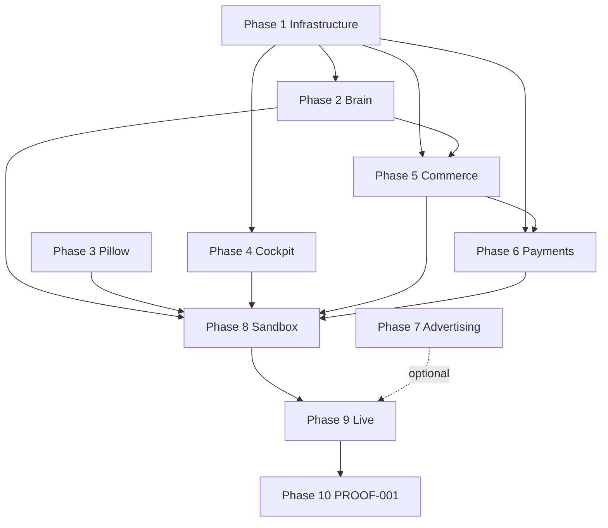

# GO-002 — Grand King Operational Master Plan

> **Mission ID:** GO-002  
> **Title:** Grand King Operational Master Plan  
> **Mission type:** Executive Operational Planning — analysis only  
> **Date:** 2026-06-21  
> **Authority:** Grand King · Executive Intelligence v1.0  
> **Prerequisite audits:** GO-001 Operational Readiness Audit  
> **Constitutional baseline:** `docs/executive-intelligence/` (EIR-v1.0)  
> **Architecture gates:** G1–G8 complete (G8 certified simulation)  
> **Status:** ✅ Complete  
> **Implementation:** None · **Push:** None unless separately approved

---

## Plan charter

This document is the **sole implementation guide** from the close of governance planning until **PROOF-001** (first verified positive net profit).

| Rule | Requirement |
|------|-------------|
| **P1 — Blocker-first** | Every mission must close ≥1 certification blocker (B5–B8) or advance an approved phase step toward PROOF-001 |
| **P2 — EI obedience** | All implementation cites Executive Intelligence v1.0; launch work requires EI5+EI6 pairing and CRIR (EI6-09) |
| **P3 — V1 scope** | V1 channels: **`amazon-us` · `amazon-sg` · `shopee-sg` · `shopify` (architecture provision)** + CJ Dropshipping + Stripe — see `docs/governance/V1_MARKETPLACE_CHANNEL_REGISTRY.md` · first PROOF-001 SKU on King-approved V1 live path |
| **P4 — King operability** | No live commerce without Cockpit surfaces the King can use to approve, monitor, and verify |
| **P5 — No new governance frameworks** | After GO-002, planning stops; work is implementation, testing, deployment, operation, optimisation |

**Companion artifact:** [GO-001_OPERATIONAL_READINESS_REPORT.md](./GO-001_OPERATIONAL_READINESS_REPORT.md)

---

## Executive summary

EmpireAI is **78% architecture-ready** and **22% operationally ready** for live commerce (GO-001). G4–G8 certified the Cockpit consolidation, production-hardening hooks, and **simulation-only** King's Operation (REAL-135 smoke 2/2 pass). Four blockers remain: **B5 → B6 → B7 → B8**.

Implementation does **not** require rebuilding architecture. It requires:

1. **Production infrastructure** with secrets and monitoring  
2. **Targeted Brain/Pillow/Cockpit wiring** for the V1 profit path  
3. **Live activation** of existing Amazon/CJ/Stripe modules (currently gated)  
4. **CRIR enforcement** before first product launch  
5. **Sandbox validation** then **Grand King Live** with explicit approval  
6. **PROOF-001** measurement and audit trail  

**Estimated calendar to PROOF-001 (focused execution):** 8–14 weeks assuming credentials available and Grand King approval gates cleared without delay.

---

## G1–G8 foundation summary (complete — do not rebuild)

| Gate | Scope | Status | Key REAL / evidence |
|------|-------|--------|---------------------|
| **G1–G3** | Architecture foundations · REAL-001–100 module tree · Brain orchestration · Pillow Layer 1 | ✅ Complete | `EMPIREAI_STATUS.md` · EIR-v1.0 |
| **G4** | Cockpit URL consolidation | ✅ Complete | REAL-124–127 |
| **G5** | Production hardening hooks | ✅ Complete | REAL-128–133 |
| **G6** | Action wiring + revenue smoke | ✅ Complete | REAL-134–135 |
| **G7** | King's Operation preparation | ✅ Certified pre-live | `G7_KINGS_OPERATION_PREPARATION_REPORT.md` |
| **G8** | King's Operation simulation | ✅ Certified simulation | `G8_KINGS_OPERATION_REPORT.md` · REAL-135 2/2 |

**G8 explicit stop:** No live spend, publish, ads, or `LIVE_COMMERCE_INTEGRATION_MODE=production` until B6 + B7.

---

## Master phase map

```
Phase 1  Infrastructure ──────────────────────────────┐
Phase 2  Brain (V1 path wiring) ───────────┐          │
Phase 3  Pillow (Delivery 1–3) ──────┐   │          │
Phase 4  Cockpit (live panels) ──────┼───┼──────────┤
Phase 5  Commerce (Amazon+CJ path) ──┼───┼──────────┤
Phase 6  Payments (Stripe) ────────────┼───┼──────────┤
Phase 7  Advertising (optional pre-PROOF) ────────────┤
Phase 8  Grand King Sandbox (E2E dry run) ────────────┤
Phase 9  Grand King Live (B7 gate) ───────────────────┤
Phase 10 PROOF-001 (B8 outcome) ◄─────────────────────┘
```

**Critical path:** Phase 1 → Phase 5/6 (credentials) → Phase 4 (King UI) → Phase 8 → Phase 9 → Phase 10

Phases 2, 3, 7 can **parallel** Phase 4/5 once Phase 1 baseline exists.

---

## PHASE 1 — Infrastructure

### Objective

Deploy a **production-grade hosting environment** that passes B5 production readiness review and can securely hold live commerce credentials.

### Dependencies

- G1–G8 complete ✅  
- EIR-v1.0 constitutional baseline ✅  
- Grand King selection of hosting accounts (Railway, Vercel, Upstash, domain registrar)

### Estimated implementation order

| Step | Work | Owner |
|------|------|-------|
| 1.1 | Provision **Railway** backend service from repo root (`railway.toml`) | DevOps |
| 1.2 | Provision **Vercel** frontend (`empireai-web`) with production domain | DevOps |
| 1.3 | Configure **Upstash Redis** (`REDIS_URL` TLS) | DevOps |
| 1.4 | Attach **Railway volume** for SQLite (`DATABASE_PATH=/data/empireai-brain.db`) or execute REAL-132 Postgres cutover | DevOps |
| 1.5 | Register **domain + SSL** (Vercel auto-SSL; API subdomain for Brain) | DevOps |
| 1.6 | Set **CORS_ORIGIN** to exact Vercel origin | DevOps |
| 1.7 | Set **SESSION_SECRET**, rotate dev passwords, restrict FOUNDER credentials | Security |
| 1.8 | Inject **LLM API keys** (OpenAI minimum for Pillow/Brain) | DevOps |
| 1.9 | Configure **secrets manager** pattern: `CREDENTIAL_VAULT_KEY` + env injection for B6 | DevOps |
| 1.10 | Enable **monitoring**: `/health`, `/health/version-1-activation`, Guardian, connector heartbeat alerts | DevOps |
| 1.11 | Run **B5** — `GET /version-1-activation/readiness` → `productionReadinessPassed: true` | Runtime Engineering |
| 1.12 | Document rollback per `VERSION_1_GO_LIVE_PREPARATION_CHECKLIST.md` | Repository Governance |

### Blocking risks

| Risk | Mitigation |
|------|------------|
| SQLite on single Railway volume — no HA | Accept for PROOF-001; plan REAL-132 Postgres before scale |
| Redis unavailable → degraded in-memory queue | Require Upstash in production; alert on degraded mode |
| `EMPIREAI_REPO_ROOT` misconfigured on Railway | Set `/app` per `backend/.env.example` |
| Secrets in git or logs | Vault key only in Railway/Vercel secrets; never commit |

### Recommended REAL missions

| REAL | Purpose |
|------|---------|
| **REAL-047** | Production hardening review — runtime pass in prod env (B5) |
| **REAL-132** | Postgres migration (optional pre-PROOF; recommended before MS-A scale) |
| **REAL-024** | Version 1 readiness audit — production evidence bundle |

### Success criteria

- [ ] Production URL live with valid SSL  
- [ ] `GET /health` → `status: ok` from public internet  
- [ ] `GET /health/version-1-activation` — blockers documented  
- [ ] B5 closed with audit artifact  
- [ ] Monitoring alerts configured for health + Guardian failures  
- [ ] Rollback procedure tested (sandbox mode revert)

---

## PHASE 2 — Brain

### Objective

Wire Brain to **execute the V1 commercial workflow** — not expand module count. Connect intelligence contract, commerce dispatch, and live module routes for the Amazon+CJ+Stripe path.

### Dependencies

- Phase 1 production backend running  
- B5 passed  

### Estimated implementation order

| Step | Work |
|------|------|
| 2.1 | Wire **product-scout** and **product-intelligence** adapters to contract registry (currently type-only stubs) |
| 2.2 | Ensure **supplier-intelligence** module feeds CJ qualification path |
| 2.3 | Connect **commerce-readiness-engine** dispatch to Brain orchestrator for launch workflow |
| 2.4 | Implement **CRIR evaluator hook** in readiness pipeline (EI6-09 — currently missing) |
| 2.5 | Verify **decision-engine** L3/L4 gates on publish, payment, fulfilment actions |
| 2.6 | Enable **Guardian** pre-dispatch on all live commerce tool calls |
| 2.7 | Wire **workflow-engine** steps: discover → evaluate → readiness → publish → order → pay → fulfil |
| 2.8 | Run Brain module route verification (G8 pattern: `orders.*`, `live-cj-fulfillment.*`, revenue-loop) |
| 2.9 | Optional: enable **Postgres** persistence (REAL-132) for audit durability |

### Blocking risks

| Risk | Mitigation |
|------|------------|
| Intelligence modules remain catalog-only | Scope to supplier-intelligence + one discovery path only |
| CRIR implementation delays launch | Implement minimal CRIR gate first; full CRIR UI later |
| LLM costs unbounded | Rate limits + Guardian + Pillow cost gates |

### Recommended REAL missions

| REAL | Purpose |
|------|---------|
| **REAL-006** | Commerce execution pipeline — CRIR + readiness integration |
| **REAL-002B** | Live commerce integration — Brain dispatch activation |
| **REAL-128** | Live PIE connector registry (replace mocks for discovery) |
| **REAL-004** | Listing intelligence — first SKU packaging |
| **REAL-007** | Executive visual debate — optional for first SKU evaluation |

### Success criteria

- [ ] Brain orchestrator routes V1 commerce workflow end-to-end in **sandbox**  
- [ ] CRIR gate blocks launch when certification absent  
- [ ] All live commerce tools require founder approval at L3/L4  
- [ ] Module route registry matches G8 verification + new CRIR routes  
- [ ] `npm run test:validation` passes including version-1 activation tests

---

## PHASE 3 — Pillow

### Objective

Complete **Pillow Delivery Mode Phases 1–3** so Pillow supports Grand King executive workflow, research, and gated live handoff — without new constitutional architecture.

### Dependencies

- Phase 1 backend + Pillow host (`EMPIREAI_REPO_ROOT`)  
- Grand King approval to execute delivery missions (currently ⏸ per `EMPIREAI_STATUS.md`)  
- EIR-002 Pillow Executive Constitution

### Estimated implementation order

| Step | Work | Product Integration Phase |
|------|------|---------------------------|
| 3.1 | Obtain **Grand King approval** for Pillow Delivery missions | — |
| 3.2 | Constitutional fields on proposal UI | Phase 1 |
| 3.3 | Chat → approve → audit integration tests | Phase 1 |
| 3.4 | GC-03 alerts for objective blockers / pending approvals | Phase 2 |
| 3.5 | GC-05 deep-link to Pillow Chat | Phase 2 |
| 3.6 | Mission Home Pillow status chip | Phase 2 |
| 3.7 | UX-014 Approvals federation mirror | Phase 2 |
| 3.8 | Bootstrap health surfacing in Cockpit | Phase 2 |
| 3.9 | **14-criteria operational readiness** check (PILLOW-ENH-012) — minimum subset for go-live | Phase 2 |
| 3.10 | GK-GOLIVE gate integration in Pillow orchestrator | Phase 3 |
| 3.11 | `PILLOW_DRY_RUN=false` only after B5 + sandbox pass | Phase 3 |
| 3.12 | Pillow Master Audit re-score ≥90% | Phase 3 |
| 3.13 | Structured **commercial research** outputs per `PILLOW_RESEARCH_DOCTRINE.md` for first SKU | Phase 2–3 |

### Blocking risks

| Risk | Mitigation |
|------|------------|
| GK approval not granted | Request explicit sign-off before Phase 3.10 |
| Scope creep into Layer 2 PEI | Reject per Pillow Delivery Mode D4 |
| Pillow Supervisor vs Executive Personality terminology | Use EIR-002 constitution as supreme doc |

### Recommended REAL missions

| REAL | Purpose |
|------|---------|
| **PILLOW Phase 1–3 steps** | Per `PILLOW_PRODUCT_INTEGRATION_MASTER_PLAN.md` §10 |
| **REAL-121–123** | Cockpit overlays — Pillow FAB, approval bar federation |
| **REAL-099** | Version 1 go-live approval — Pillow gate integration |

### Success criteria

- [ ] Pillow Phase 1 integration tests pass  
- [ ] GC-03/05 federation live in Cockpit  
- [ ] Mission Home shows Pillow status  
- [ ] Pillow prepares EI5+EI6 paired research packet for first SKU  
- [ ] Master Audit ≥90% before Phase 3 go-live posture  
- [ ] No self-amendment of EI doctrine

---

## PHASE 4 — Cockpit

### Objective

Replace demo placeholders with **live Brain-backed panels** so the Grand King can discover, approve, launch, monitor orders, view profit, and manage integrations.

### Dependencies

- Phase 1 deployed Cockpit (Vercel)  
- Phase 2 Brain modules wired  
- G4–G6 Cockpit architecture ✅

### Estimated implementation order

| Step | Work | SCR / REAL |
|------|------|------------|
| 4.1 | Mount **GlobalApprovalBar + SUCCESS-001 chip** in CockpitShell (B1/B2 closed but not in empireai-web) | REAL-121–123 |
| 4.2 | Wire **Integrations** pattern to Commerce dept | REAL-133 ✅ → extend |
| 4.3 | **SCR-200–204** Commerce: Store, Launch, Marketing, Ads, Workspace → `useBrainModule` | REAL-089–093 |
| 4.4 | **SCR-300–301** Operations: Orders + Fulfillment live path | REAL-098–100, REAL-129/130 |
| 4.5 | **SCR-400** Finance profit → ledger-backed (extend REAL-127) | REAL-101–104 |
| 4.6 | **SCR-001/010/020** Executive Home, Command, Missions — replace placeholders | REAL-084–086 |
| 4.7 | **SCR-704** V1 certification / blocker dashboard | REAL-109–113 |
| 4.8 | **SCR-800** Pillow companion in Cockpit drawer | REAL-117–120 |
| 4.9 | Data mode badges: Live / Sandbox / Demo per widget registry | REAL-087–088 |
| 4.10 | **CRIR status surface** on Launch screen (EI6 executive visibility) | New — minimal |
| 4.11 | **PROOF-001 progress widget** on Command Centre | New — minimal |

### Blocking risks

| Risk | Mitigation |
|------|------------|
| 22 widgets still `placeholder: true` | Prioritize V1 path screens only; defer P2 departments |
| Dual frontend confusion | Keep `/platform/*` redirects; no new frontend routes |
| King operates blind during live transaction | Phase 4.4 + 4.5 mandatory before Phase 9 |

### Recommended REAL missions

| REAL | Purpose |
|------|---------|
| **REAL-089–093** | Commerce department wiring |
| **REAL-098–100** | Operations department wiring |
| **REAL-127** | Ledger-backed KPIs (extend to all finance widgets) |
| **REAL-129/130** | Live fulfilment UI — remove sandbox-only submit |
| **REAL-084–086** | Command core — King daily workflow |

### Success criteria

- [ ] King can view integration connection status (live)  
- [ ] King can approve launch from Cockpit with CRIR visible  
- [ ] King can see order + fulfilment status for test order  
- [ ] King can see profit line from ledger (not hardcoded placeholders)  
- [ ] GlobalApprovalBar mounted and functional  
- [ ] `empireai-web` build + typecheck pass  
- [ ] No `placeholder: true` on SCR-200, 201, 300, 301, 400, 010, 020

---

## PHASE 5 — Commerce

### Objective

Enable **discover → evaluate → launch → operate → monitor** for **one real product** on **Amazon** fulfilled by **CJ**.

### Dependencies

- Phase 1 credentials infrastructure  
- Phase 2 CRIR + readiness gates  
- Phase 4 Launch/Store/Operations UI  
- B6 Amazon + CJ credentials

### Estimated implementation order

| Step | Work |
|------|------|
| 5.1 | Inject **Amazon SP-API** credentials (B6) |
| 5.2 | Inject **CJ API** credentials (B6) |
| 5.3 | Set `LIVE_COMMERCE_INTEGRATION_MODE=production` |
| 5.4 | Activate **Amazon SP-API adapter** — verify `supportsPublish: true` |
| 5.5 | Activate **CJ supplier adapter** — verify OAR live |
| 5.6 | Replace **mock discovery** with REAL-128 live PIE feed for candidate SKU research |
| 5.7 | Run **EI5 opportunity + EI6 risk** paired evaluation (documented in Pillow research packet) |
| 5.8 | Generate **CRIR** — all 10 sections per CRI spec; Finance sign-off |
| 5.9 | Pass **commerce-readiness-engine** (Stripe + CJ + marketplace + CRIR) |
| 5.10 | **REAL-003** — first gated marketplace publish (single SKU) |
| 5.11 | Enable **inventory/pricing** for single SKU (minimal — REAL-005/011 scope) |
| 5.12 | **Monitor** listing health via marketplace intelligence modules |

### Blocking risks

| Risk | Mitigation |
|------|------------|
| Amazon account not seller-ready | Verify seller account before B6 injection |
| CJ SKU mapping wrong | Sandbox CJ order test in Phase 8 first |
| Launch without CRIR | Hard gate in readiness engine (Phase 2.4) |
| Scope creep to Shopify/TikTok | Explicitly defer until post-PROOF-001 |

### Recommended REAL missions

| REAL | Purpose |
|------|---------|
| **REAL-002B** | Live commerce integration |
| **REAL-003** | Marketplace publishing |
| **REAL-004** | Listing intelligence |
| **REAL-005** | Product media |
| **REAL-006** | Commerce execution pipeline |
| **REAL-011** | Global product distribution (single marketplace) |
| **REAL-128** | Live PIE connectors |
| **REAL-013–018** | Product intelligence (minimal for one SKU) |

### Success criteria

- [ ] One SKU listed on Amazon with GK approval audit trail  
- [ ] CRIR on file with Finance review  
- [ ] Readiness evaluator passes all blocking checks  
- [ ] Product visible in Cockpit Store/Launch with live data mode  
- [ ] Supplier mapped in CJ with verified product ID  
- [ ] Rollback tested (unpublish / sandbox revert)

---

## PHASE 6 — Payments

### Objective

Receive **customer payments** via Stripe, record in ledger, and enable **supplier cost tracking** for net profit calculation.

### Dependencies

- Phase 1 production backend with webhook URL  
- Phase 5 product listed with checkout path  
- Stripe account verified

### Estimated implementation order

| Step | Work |
|------|------|
| 6.1 | Configure **Stripe** production keys (`STRIPE_SECRET_KEY`, webhook secret, publishable key) |
| 6.2 | Set `LIVE_PAYMENT_ENABLED=true`; disable mock |
| 6.3 | Register **Stripe webhook endpoint** on production URL with HMAC verification |
| 6.4 | Wire checkout to **single SKU** store path |
| 6.5 | Verify **ledger entry** on `payment_intent.succeeded` |
| 6.6 | Record **supplier cost** (CJ product + shipping) against order |
| 6.7 | Enable **Finance profit view** (Phase 4.5) to show revenue − COGS − fees |
| 6.8 | Document **accounting export** (CSV/minimal — full accounting post-PROOF) |

### Blocking risks

| Risk | Mitigation |
|------|------------|
| Webhook not reachable | Stripe CLI test in staging; verify Railway public URL |
| Mock payments silently active | Assert `LIVE_PAYMENT_MOCK=false` in prod |
| PayPal expected | Defer — Stripe only for PROOF-001 |

### Recommended REAL missions

| REAL | Purpose |
|------|---------|
| **REAL-101** (revenue loop) | Minimum live revenue loop |
| **REAL-103** | Live payment engine |
| **REAL-104** | Customer order pipeline |
| **REAL-020** | Financial intelligence (margin tracking) |

### Success criteria

- [ ] Test payment succeeds in **sandbox** (Phase 8)  
- [ ] Live payment succeeds with real card (Phase 9)  
- [ ] Ledger records payment with external Stripe reference  
- [ ] Profit calculation includes supplier cost  
- [ ] Webhook replay/idempotency verified

---

## PHASE 7 — Advertising

### Objective

Optional **pre-PROOF-001** customer acquisition via Meta Ads — only after organic/first-transaction path validated. Not on critical path to PROOF-001.

### Dependencies

- Phase 5 product live on Amazon (or parallel landing page)  
- Phase 6 payment path  
- Meta Business account

### Estimated implementation order

| Step | Work |
|------|------|
| 7.1 | Complete **Meta OAuth** flow (`META_ADS_*` env vars) |
| 7.2 | Set `META_ADS_LAUNCH_ENABLED=true` with founder approval gate |
| 7.3 | Prepare **minimum viable campaign** (single ad set, strict budget cap) |
| 7.4 | Wire **Cockpit Ads panel** (Phase 4) to Brain `meta-ads` module |
| 7.5 | Enable **conversion tracking** (REAL-106 analytics — GA4/Meta pixel) |
| 7.6 | Measure **ROAS** against PROOF-001 SKU |

### Blocking risks

| Risk | Mitigation |
|------|------------|
| Ad spend before fulfilment proven | Defer Phase 7 until Phase 8 sandbox pass |
| TikTok/Google scope creep | Meta only for V1 |
| Negative ROAS on first SKU | Cap daily budget; organic Amazon traffic first |

### Recommended REAL missions

| REAL | Purpose |
|------|---------|
| **REAL-032/038** | Advertising/growth (EI9 companions) |
| **REAL-107** | Meta ads connector |
| **REAL-106** | Analytics & conversion engine |

### Success criteria

- [ ] Campaign launches only with GK approval  
- [ ] Spend tracked in finance ledger  
- [ ] Conversion events tied to order IDs  
- [ ] **Optional for PROOF-001** — not required if first sale is organic Amazon

---

## PHASE 8 — Grand King Sandbox

### Objective

Define and execute the **complete end-to-end sandbox workflow** — full commercial chain validation **without live spend** (or with Stripe test mode only).

### Dependencies

- Phases 1–6 substantially complete  
- `LIVE_COMMERCE_INTEGRATION_MODE=sandbox` OR production creds with mock flags enabled

### Sandbox workflow (canonical)

```
┌─────────────────────────────────────────────────────────────────────────┐
│ GRAND KING SANDBOX — End-to-end workflow                                 │
├─────────────────────────────────────────────────────────────────────────┤
│ 1. DISCOVER   │ Pillow research + REAL-128 (sandbox/mock PIE)         │
│                │ Select candidate SKU · document EI5+EI6 evaluation     │
├────────────────┼────────────────────────────────────────────────────────┤
│ 2. EVALUATE   │ Business workspace · margin simulation · CRIR draft    │
│                │ Finance review · readiness pre-check                   │
├────────────────┼────────────────────────────────────────────────────────┤
│ 3. APPROVE    │ King approves via Cockpit GlobalApprovalBar             │
│                │ CRIR certification recorded                            │
├────────────────┼────────────────────────────────────────────────────────┤
│ 4. PREPARE    │ CJ product mapping · listing package · media (REAL-004/005)│
│                │ Stripe test mode checkout configured                     │
├────────────────┼────────────────────────────────────────────────────────┤
│ 5. PUBLISH    │ Sandbox publish OR dry-run publish audit               │
│                │ Verify readiness engine passes                         │
├────────────────┼────────────────────────────────────────────────────────┤
│ 6. ORDER      │ Simulated or Stripe test-mode customer order             │
│                │ Order appears in Cockpit Operations                    │
├────────────────┼────────────────────────────────────────────────────────┤
│ 7. PAY        │ Stripe test webhook → ledger entry                     │
│                │ Verify payment recorded with test reference            │
├────────────────┼────────────────────────────────────────────────────────┤
│ 8. FULFIL     │ CJ sandbox/mock fulfilment OR dry-run submit           │
│                │ Tracking ID returned · status in Cockpit               │
├────────────────┼────────────────────────────────────────────────────────┤
│ 9. RECONCILE  │ Profit line = payment − CJ cost − fees                 │
│                │ REAL-135 smoke + manual King verification              │
├────────────────┼────────────────────────────────────────────────────────┤
│ 10. SIGN-OFF  │ King confirms sandbox E2E understood                     │
│                │ Go-live checklist reviewed · B7 packet prepared          │
└─────────────────────────────────────────────────────────────────────────┘
```

### Estimated implementation order

| Step | Work |
|------|------|
| 8.1 | Script sandbox workflow checklist in Cockpit Governance (SCR-704) |
| 8.2 | Run full workflow with **REAL-135** smoke + manual King walkthrough |
| 8.3 | Fix any broken handoffs (Brain route, Cockpit panel, Pillow approval) |
| 8.4 | Produce **sandbox sign-off artifact** for B7 packet |
| 8.5 | Repeat until King confirms operational comprehension |

### Blocking risks

| Risk | Mitigation |
|------|------------|
| Sandbox diverges from live path | Use same code paths; only flags differ |
| King cannot follow workflow | Phase 4 must complete first |
| False confidence from mocks | Document exactly which steps are mock vs live in sandbox runbook |

### Recommended REAL missions

| REAL | Purpose |
|------|---------|
| **REAL-135** | Revenue smoke test — extend to full E2E |
| **REAL-049** | Grand King go-live checklist — sandbox rehearsal |
| **REAL-077/078** | Launch pipeline simulation |

### Success criteria

- [ ] King completes all 10 sandbox steps unaided  
- [ ] REAL-135 E2E extended test pass  
- [ ] No broken Brain routes in workflow  
- [ ] CRIR draft → approval → launch gate demonstrated  
- [ ] Sandbox sign-off document in B7 packet  
- [ ] Rollback procedure verified

---

## PHASE 9 — Grand King Live

### Objective

Execute the **production launch workflow** with real credentials, real money, and explicit **B7 Grand King go-live approval**.

### Dependencies

- Phase 8 sandbox sign-off ✅  
- B5 closed ✅  
- B6 credentials injected ✅  
- Phase 4 Cockpit live panels ✅  
- CRIR certified for first SKU ✅

### Live workflow (canonical)

```
┌─────────────────────────────────────────────────────────────────────────┐
│ GRAND KING LIVE — Production launch workflow                             │
├─────────────────────────────────────────────────────────────────────────┤
│ L1. PRE-FLIGHT │ GET /health/version-1-activation — zero blocking items │
│                │ GET /version-1-activation/go-live-preparation          │
├────────────────┼────────────────────────────────────────────────────────┤
│ L2. CREDENTIALS│ LIVE_COMMERCE_INTEGRATION_MODE=production              │
│                │ All B6 env vars verified · vault unlocked              │
├────────────────┼────────────────────────────────────────────────────────┤
│ L3. M5 PILLOW  │ productionReadinessPassed → EMPIRE_V1_OPERATIONAL_READY│
│                │ Pillow restart · dryRunLaunch: false                   │
├────────────────┼────────────────────────────────────────────────────────┤
│ L4. B7 APPROVAL│ Grand King signs REAL-099 go-live checklist            │
│                │ Gold Master checklist · Journey audit entry            │
├────────────────┼────────────────────────────────────────────────────────┤
│ L5. PUBLISH    │ REAL-003 live publish — single SKU to Amazon           │
│                │ Founder approval token · audit trail                   │
├────────────────┼────────────────────────────────────────────────────────┤
│ L6. MONITOR    │ King monitors Command Centre + Operations              │
│                │ Connector heartbeat · Guardian green                   │
├────────────────┼────────────────────────────────────────────────────────┤
│ L7. TRANSACT   │ First real customer order (organic or approved ad)       │
│                │ Stripe live payment · CJ live fulfilment               │
├────────────────┼────────────────────────────────────────────────────────┤
│ L8. VERIFY     │ Payment + fulfilment + tracking confirmed              │
│                │ External references captured                             │
├────────────────┼────────────────────────────────────────────────────────┤
│ L9. ROLLBACK   │ Rollback procedure documented and tested if failure    │
│                │ sandbox revert env vars ready                          │
└─────────────────────────────────────────────────────────────────────────┘
```

### Estimated implementation order

| Step | Work |
|------|------|
| 9.1 | Run pre-flight checklist (`VERSION_1_GO_LIVE_PREPARATION_CHECKLIST.md`) |
| 9.2 | Set production mode env vars |
| 9.3 | M5 Pillow operational ready |
| 9.4 | Obtain **B7 GK-GOLIVE-APPROVAL** signature |
| 9.5 | Execute live publish (single SKU) |
| 9.6 | Monitor 72-hour stabilization window |
| 9.7 | Process first live order end-to-end |

### Blocking risks

| Risk | Mitigation |
|------|------------|
| Publishing without B7 | Hard gate — execution layer requires GK approval token |
| Credential leak | Vault + audit; rotate on any suspicion |
| First order failure | CJ support path documented; manual fulfilment fallback runbook |
| Amazon policy violation | EI6 MPI review before publish |

### Recommended REAL missions

| REAL | Purpose |
|------|---------|
| **REAL-099** | Version 1 go-live approval |
| **REAL-003** | Live marketplace publish |
| **REAL-049** | Grand King go-live checklist |
| **REAL-002B** | Live commerce activation verification |

### Success criteria

- [ ] B7 closed with signed artifact  
- [ ] Live listing visible on Amazon  
- [ ] First live order received  
- [ ] Live Stripe payment captured  
- [ ] Live CJ fulfilment submitted  
- [ ] King verified status in Cockpit  
- [ ] No Guardian blocks on happy path  
- [ ] Rollback tested and documented

---

## PHASE 10 — PROOF-001

### Objective

Achieve **first verified positive net profit** with full audit trail — closing **B8** and beginning **MS-A** path.

### Dependencies

- Phase 9 complete live transaction ✅  
- B7 closed ✅

### PROOF-001 measurable milestones

| Milestone | Metric | Evidence required |
|-----------|--------|-------------------|
| **M-01** | First live **customer payment received** | Stripe `payment_intent` ID · ledger entry · amount > 0 |
| **M-02** | **Supplier cost recorded** | CJ order ID · product cost + shipping in ledger |
| **M-03** | **Fulfilment confirmed** | CJ tracking number · status = shipped/delivered |
| **M-04** | **Fees accounted** | Stripe fees · Amazon referral fee (if applicable) in ledger |
| **M-05** | **Net margin positive** | `revenue − COGS − fees − shipping > 0` |
| **M-06** | **External reference bundle** | Stripe ID + CJ ID + Amazon order ID linked in audit log |
| **M-07** | **King verification** | Grand King confirms PROOF-001 in Cockpit Command Centre |
| **M-08** | **B8 closure** | Blocker register updated · Journey sync · `JOURNEY_AUDIT.md` entry |
| **M-09** | **PROOF artifact** | PROOF-001 record with timestamp, SKU, margin, external refs |
| **M-10** | **V1-CERT path open** | REAL-070 + REAL-100 eligible after B8 |

### Net profit formula (PROOF-001)

```
Net Profit = Customer Payment
           − CJ Product Cost
           − CJ Shipping Cost
           − Stripe Processing Fees
           − Amazon Referral/FBA Fees (if applicable)
           − Ad Spend (if Phase 7 used)
```

**PROOF-001 passes when M-05 is true and M-06 through M-09 are recorded.**

### Estimated implementation order

| Step | Work |
|------|------|
| 10.1 | Process live orders until M-01 through M-04 satisfied |
| 10.2 | Finance reconciliation — verify M-05 |
| 10.3 | Generate PROOF-001 artifact bundle |
| 10.4 | King sign-off on PROOF-001 |
| 10.5 | Close B8 in blocker register |
| 10.6 | Begin MS-A tracking (USD 100,000 cumulative net profit) |

### Blocking risks

| Risk | Mitigation |
|------|------------|
| Sale occurs but margin negative | Pre-launch margin simulation in CRIR; reject unprofitable SKU |
| Missing external reference | Block PROOF-001 closure until M-06 complete |
| Dispute/refund before proof | Wait for settlement window; document net after refunds |

### Recommended REAL missions

| REAL | Purpose |
|------|---------|
| **REAL-110** | First revenue validation |
| **REAL-109** | Grand King's revenue engine |
| **REAL-100** | Version 1 completion certificate (post-B8) |
| **REAL-070** | Executive sign-off report |

### Success criteria

- [ ] M-01 through M-10 all ✅  
- [ ] B8 closed  
- [ ] PROOF-001 artifact published to governance record  
- [ ] MS-A counter initialized  
- [ ] Executive Intelligence v1.0 cited in PROOF record  
- [ ] No open critical blockers for V1-CERT path

---

## Cross-phase dependency graph



---

## Consolidated REAL mission priority list

| Priority | REAL / work | Phase | Blocker |
|----------|-------------|-------|---------|
| **P0** | REAL-047 production readiness pass | 1 | B5 |
| **P0** | Infrastructure deploy (Railway/Vercel/Redis) | 1 | B5 |
| **P0** | CRIR gate in commerce-readiness-engine | 2 | CB-08 |
| **P0** | REAL-002B credential activation | 5 | B6 |
| **P0** | Cockpit Commerce + Operations wiring | 4 | CB-09 |
| **P0** | GlobalApprovalBar in CockpitShell | 4 | UX |
| **P1** | REAL-128 live PIE connectors | 5 | CB-07 |
| **P1** | REAL-129/130 fulfilment UI | 4/5 | CB-09 |
| **P1** | Pillow Delivery Phase 2 | 3 | King UX |
| **P1** | REAL-003 live publish | 5/9 | — |
| **P1** | Stripe live activation | 6 | — |
| **P1** | Sandbox E2E (REAL-135 extended) | 8 | — |
| **P1** | REAL-099 B7 go-live approval | 9 | B7 |
| **P2** | Pillow Delivery Phase 3 | 3/9 | — |
| **P2** | REAL-132 Postgres cutover | 1 | scale |
| **P2** | Meta ads (REAL-107) | 7 | optional |
| **P3** | Shopify/TikTok/eBay adapters | post-PROOF | — |
| **P3** | PayPal live | post-PROOF | — |
| **P3** | EI7–EI9 full drafting | post-PROOF | — |

---

## Certification blocker closure sequence

```
B5 (Production Readiness)     → Phase 1
        ↓
B6 (REAL-002B credentials)    → Phase 1 + 5
        ↓
[Phase 8 Sandbox complete]
        ↓
B7 (GK-GOLIVE-APPROVAL)       → Phase 9
        ↓
B8 (PROOF-001)                → Phase 10
        ↓
V1-CERT (REAL-070 + REAL-100)
```

---

## Executive Intelligence alignment (implementation rules)

| EI | Implementation obligation |
|----|----------------------------|
| **EI2** | King approval on all irreversible live actions |
| **EI5 + EI6** | Paired opportunity/risk evaluation before SKU selection |
| **EI6-09** | CRIR required before launch — must be runtime-enforced (Phase 2.4) |
| **EI7** | CJ supplier qualification documented in research packet |
| **EI8** | Amazon marketplace rules reviewed before publish |
| **EI10** | Autonomous operation only within GK-approved boundaries |
| **Pillow Constitution** | Pillow executes; never self-amends EI |

---

## Final executive answer

### If EmpireAI starts implementation tomorrow, what is the optimal sequence that reaches the first verified positive net profit with the least risk and highest probability of success?

**Answer:** Execute a **single-threaded critical path** with **limited parallel UI work** — do not expand scope, marketplaces, or ads until PROOF-001 is recorded.

#### Optimal sequence (week-by-week outline)

| Week | Focus | Outcome |
|------|-------|---------|
| **1–2** | **Phase 1** — Deploy Railway + Vercel + Redis + domain + monitoring. Close **B5**. Procure Amazon seller, CJ, Stripe accounts. | Production environment live |
| **2–3** | **Phase 2.4 + Phase 4 (parallel)** — CRIR gate in readiness engine. Wire Cockpit Commerce/Operations/Finance + GlobalApprovalBar. | King can operate sandbox UI |
| **3–4** | **Phase 3 Phase 2** — Pillow federation (GC-03/05, Mission Home). **Phase 5 prep** — inject **B6** credentials in staging first. | Credentials validated |
| **4–5** | **Phase 8** — Full sandbox E2E with Stripe test mode. Select **one SKU** with EI5+EI6 packet + CRIR. Fix broken handoffs. | Sandbox sign-off |
| **5–6** | **Phase 5 + 6** — Live adapters activated in staging. REAL-003 dry-run → sandbox publish rehearsal. | Ready for live |
| **6** | **Phase 9** — B7 King approval. Flip production flags. Live publish **one SKU**. | Live listing |
| **7–10** | **Phase 9–10** — Monitor. First live order. Stripe live payment. CJ live fulfilment. Reconcile margin. **PROOF-001**. Close **B8**. | First net profit |

#### What NOT to do (risk reduction)

| Avoid | Why |
|-------|-----|
| Multi-marketplace launch | Complexity · credential surface · support burden |
| Live ads before fulfilment proven | Spend risk with unproven ops |
| Postgres migration before PROOF-001 | Distraction unless SQLite limits hit |
| Pillow Layer 2 PEI | Post-V1 deferred |
| New governance docs | GO-002 is final plan |
| REAL-128–130 live activation without CRIR | EIR-004 hold |
| Skipping Phase 8 sandbox | Highest probability of live failure |

#### The minimum build list (if resources are constrained)

1. Production deploy + B5  
2. B6 credentials (Amazon + CJ + Stripe + vault)  
3. CRIR gate (Brain)  
4. Cockpit wiring (Launch + Orders + Fulfillment + Profit + Approval bar)  
5. One SKU · EI5+EI6 evaluation · CRIR  
6. Sandbox E2E pass  
7. B7 approval  
8. Live publish + one transaction  
9. PROOF-001 reconciliation  

**Everything else is optimization after first profit.**

---

## Plan maintenance

| Event | Action |
|-------|--------|
| Blocker closed | Update `VERSION_1_CERTIFICATION_BLOCKER_REGISTER.md` + Journey |
| Phase complete | Record evidence in Journey; no new planning doc |
| Operational surprise | King-directed amendment only — not new framework |
| PROOF-001 achieved | Transition to MS-A operations mode; BL-C enhancements admitted |

---

## Validation (GO-002 mission)

| Check | Result |
|-------|--------|
| Planning only — no implementation | ✅ Pass |
| No runtime changes | ✅ Pass |
| No production code | ✅ Pass |
| All 10 phases covered | ✅ Pass |
| Per-phase: objective, dependencies, order, risks, REAL missions, success criteria | ✅ Pass |
| Executive question answered | ✅ Pass |
| No push | ✅ Pass |

---

## Cross-references

| Document | Relationship |
|----------|--------------|
| [GO-001_OPERATIONAL_READINESS_REPORT.md](./GO-001_OPERATIONAL_READINESS_REPORT.md) | Readiness audit baseline |
| [docs/executive-intelligence/EXECUTIVE_INTELLIGENCE_RELEASE_CERTIFICATE.md](./docs/executive-intelligence/EXECUTIVE_INTELLIGENCE_RELEASE_CERTIFICATE.md) | EIR-v1.0 |
| [docs/governance/VERSION_1_CERTIFICATION_BLOCKER_REGISTER.md](./docs/governance/VERSION_1_CERTIFICATION_BLOCKER_REGISTER.md) | B5–B8 SSOT |
| [docs/governance/G7_KINGS_OPERATION_PREPARATION_REPORT.md](./docs/governance/G7_KINGS_OPERATION_PREPARATION_REPORT.md) | G7 preparation |
| [docs/governance/G8_KINGS_OPERATION_REPORT.md](./docs/governance/G8_KINGS_OPERATION_REPORT.md) | G8 simulation |
| [docs/governance/VERSION_1_GO_LIVE_PREPARATION_CHECKLIST.md](./docs/governance/VERSION_1_GO_LIVE_PREPARATION_CHECKLIST.md) | Live env vars |
| [docs/governance/PILLOW_VERSION_1_DELIVERY_MODE.md](./docs/governance/PILLOW_VERSION_1_DELIVERY_MODE.md) | Pillow scope |
| [docs/architecture/cockpit/COCKPIT_IMPLEMENTATION_ROADMAP.md](./docs/architecture/cockpit/COCKPIT_IMPLEMENTATION_ROADMAP.md) | Cockpit REAL map |
| [EMPIREAI_STATUS.md](./EMPIREAI_STATUS.md) | Living state |

---

*GO-002 Grand King Operational Master Plan · Sole implementation guide until PROOF-001 · 2026-06-21*
