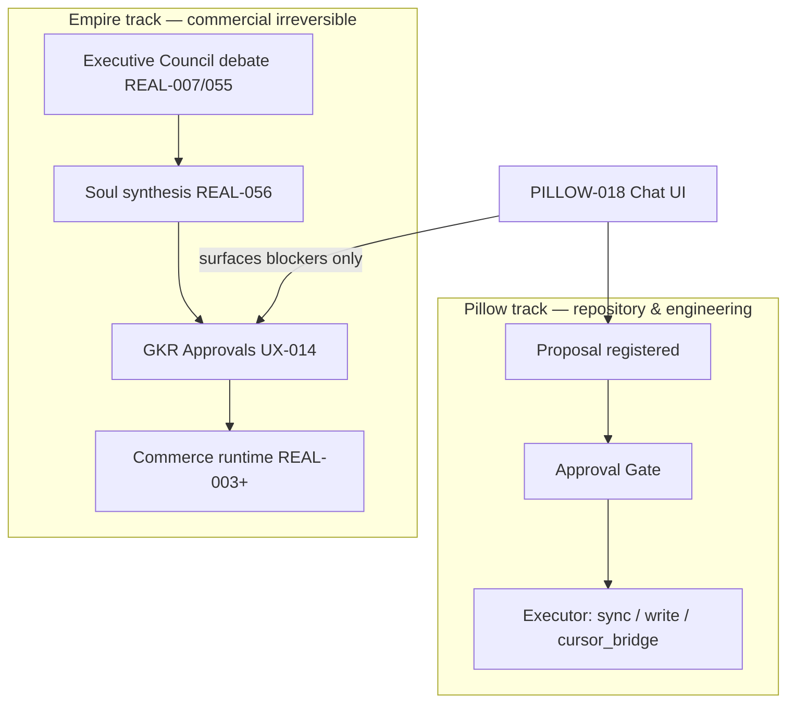
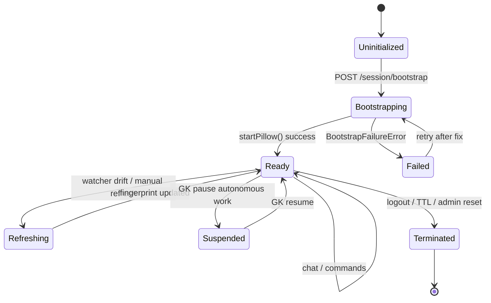
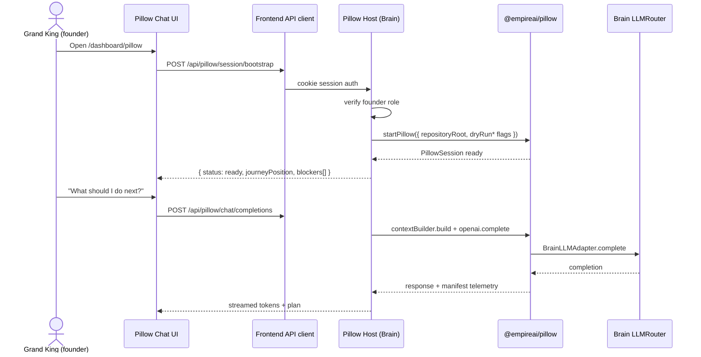
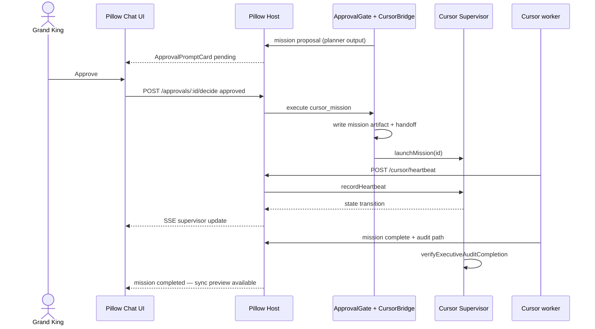

# Pillow Runtime Integration Plan

> **Canonical owner:** Pillow Architecture · Repository Governance  
> **Authority:** `PILLOW_ARCHITECTURE_CONTRACT.md` · `PILLOW_ROADMAP.md` (Layer 1 — Runtime)  
> **Status:** **HISTORICAL — Layer 1 integration complete** (PILLOW-016…018 implemented; PILLOW-019 objective runtime added post-plan)  
> **Superseded for product scope by:** `docs/governance/PILLOW_PRODUCT_INTEGRATION_MASTER_PLAN.md`  
> **Scope:** PILLOW-016 · PILLOW-017 · PILLOW-018  
> **Date:** 2026-06-29

---

## Document status (2026-06-29)

This plan described the integration of Pillow into the live Brain backend and frontend. **Phases 1–3 are implemented.** For current roadmap framing (Runtime vs Executive Intelligence), see **`PILLOW_ROADMAP.md`**. This file is retained as integration archaeology and closeout reference.

---
## Executive summary

Pillow V1 (`PILLOW-002…015`) is **complete as a read-only `@empireai/pillow` package** with in-process session bootstrap (`pillow/src/session.ts`). It is **not yet connected** to the live EmpireAI Brain backend, auth session, or frontend. There are **zero** Pillow references in `backend/src` or `frontend/src` today.

This plan defines the canonical architecture to integrate Pillow into the live runtime in three governed missions — **OpenAI layer first**, **Approval Gate + Cursor Bridge second**, **Chat UI third** — preserving ADR-010 (BFF, no browser LLM keys), GVD-019 (Grand King approval), Memory Doctrine (repository is memory), and the existing engineering pipeline in PILLOW-013 Orchestrator.

**Integration readiness gate:** Version 1 is **conditionally ready for integration** (~79%). Pillow integration may proceed in **governance/repository mode** without live commerce credentials; **Empire Operations mode** that triggers money-moving runtime actions remains blocked until REAL-002B, PROOF-001, and GK-GOLIVE-APPROVAL.

---

## 1. Current state vs target state

| Layer | Today (V1 complete) | Target (post PILLOW-016…018) |
|---|---|---|
| **Pillow package** | Standalone Node lib; CLI/tests; singleton session | Same lib; hosted by Brain backend |
| **Backend** | No Pillow routes | `/api/pillow/*` Brain module; session store |
| **Brain LLM** | `LLMRouter` (OpenAI/Anthropic/Gemini) — general agents | Pillow-016 adapter **reuses** router; separate policy/budget |
| **Frontend** | No Pillow UI | PILLOW-018 chat surface; BFF API client |
| **Auth** | Cookie/Bearer session; roles `founder`/`operator`/`admin` | Pillow gated to **founder** (Grand King sole-operation, ADR-016) |
| **Approvals** | Sync-only approval in PILLOW-010; improvement partial | Unified PILLOW-017 gate for sync + missions + ADR/Journey writes |
| **Cursor** | Supervisor registry + dry-run launch | Cursor Bridge handoff + heartbeat ingress API |

---

## 2. Target architecture

### 2.1 Layered integration model

```
┌─────────────────────────────────────────────────────────────────────────┐
│  FRONTEND (PILLOW-018)                                                   │
│  PillowChatPage · ApprovalPrompt · MissionDraftPanel · BootstrapBanner   │
│  frontend/src/api/pillow.ts  →  credentials:include (session cookie)   │
└───────────────────────────────┬─────────────────────────────────────────┘
                                │ ADR-010 BFF — no provider keys in browser
                                ▼
┌─────────────────────────────────────────────────────────────────────────┐
│  BACKEND — Pillow Host Module (new)                                      │
│  backend/src/orchestration/pillow-host/                                  │
│  · PillowSessionManager (workspace-scoped)                               │
│  · PillowRouteHandlers (/api/pillow/*)                                   │
│  · EventStream (SSE) for chat + supervisor heartbeats                    │
│  · Auth: createAuthMiddleware + founder-only preHandler                │
└───────────────────────────────┬─────────────────────────────────────────┘
                                │ in-process import
                                ▼
┌─────────────────────────────────────────────────────────────────────────┐
│  @empireai/pillow (existing — extended, not replaced)                    │
│  startPillow() → PillowSession (002…015)                                 │
│  + PILLOW-016 OpenAIIntegrationLayer                                     │
│  + PILLOW-017 ApprovalGateEngine + CursorBridgeAdapter                   │
│  + PILLOW-018 types/contracts only (UI lives in frontend)                │
└───────────────────────────────┬─────────────────────────────────────────┘
                                │ adapter injection
                                ▼
┌─────────────────────────────────────────────────────────────────────────┐
│  BRAIN (existing — reused, not duplicated)                               │
│  LLMRouter.complete() · audit-logger · session-store · SQLite            │
│  Optional read: REAL-035 blockers, GKR queue (empire operations context)   │
└─────────────────────────────────────────────────────────────────────────┘
                                │
                                ▼
┌─────────────────────────────────────────────────────────────────────────┐
│  REPOSITORY (git workspace on server)                                    │
│  Journey · Soul · Status · contracts · audits · enhancement registers    │
│  Writes ONLY via Approval Gate → canonical owner paths                   │
└─────────────────────────────────────────────────────────────────────────┘
```

### 2.2 Design principles

1. **Pillow remains the cognitive owner** — Brain hosts transport, auth, and persistence; Pillow owns context assembly, orchestration, and approval semantics per contract Part 4.
2. **No duplicated LLM intelligence** — PILLOW-016 wraps Context Builder output and delegates completion to Brain `LLMRouter` (CTD-022).
3. **No duplicated UX screens** — Chat UI is a **conversation shell**, not a replacement for UX-001…023 dashboards (contract §4.12).
4. **Repository writes never bypass Approval Gate** — including Journey, ADR append, Status, sync executor, and Cursor mission dispatch (contract §4.11).
5. **Ephemeral chat ≠ permanent memory** — session transcript stored in backend session TTL only; durable knowledge flows through repository artifacts and PILLOW-005 Memory refresh (Memory Doctrine).

---

## 3. PILLOW-016 — OpenAI Integration Layer

### 3.1 Purpose

Execute LLM completions using **Context Builder payloads only**, with operating-mode policies, token budgets, and CFO cost telemetry (contract §4.13).

### 3.2 Proposed module layout (planning)

| Artifact | Path (planned) | Owner |
|---|---|---|
| OpenAI Integration Layer | `pillow/src/openai/engine.ts` | Pillow Architecture |
| LLM transport adapter interface | `pillow/src/openai/brain-adapter.ts` | Pillow Architecture |
| Brain-side adapter impl | `backend/src/orchestration/pillow-host/brain-llm-adapter.ts` | Runtime Engineering |
| Mode policy + budgets | `pillow/src/openai/mode-policy.ts` | Pillow Architecture · CFO |

### 3.3 Operating modes (internal routing — user sees one chat)

| Mode | Trigger signals | Context task profile | Token budget (default plan) |
|---|---|---|---|
| **General Intelligence** | Question, explain, summarize | `general_query` | 8K context / 2K completion |
| **Empire Operations** | Journey, blocker, commercial, SUCCESS-001 | `executive_operations` | 16K context / 2K completion |
| **Engineering Operations** | Mission, build, audit, sync, Cursor | `engineering_mission` | 24K context / 4K completion |

Mode detection: reuse `resolveContextTask()` (PILLOW-004) + `parseCommandIntent()` (PILLOW-015) — **no separate user mode toggle**.

### 3.4 Request lifecycle

```
User message (Chat UI)
      ↓
PILLOW-015 Command / Chat router
      ↓
PILLOW-004 ContextBuilder.build({ userMessage, task })
      ↓
PILLOW-016 assemble LLM messages (system + manifest summary + slices)
      ↓
BrainLLMAdapter.complete(request)  →  Brain LLMRouter
      ↓
PILLOW-016 record telemetry (tokens, mode, manifest id) — no embedding store
      ↓
Response + optional ExecutionPlan / ApprovalProposal to client
```

### 3.5 Brain integration

| Concern | Approach |
|---|---|
| **Credentials** | `OPENAI_API_KEY` (and fallbacks) remain **server env only** — never exposed to frontend |
| **Router reuse** | Inject `LLMRouter` from Brain into Pillow host at session creation |
| **Audit** | Log each completion via existing `audit-logger` with `moduleId: "pillow-openai"`, manifest hash, token counts |
| **Cost governance** | CFO budget counters in SQLite table `pillow_llm_usage` (planned); soft cap returns user-visible deferral |
| **Guardian** | Optional pre-dispatch Guardian assessment for engineering mode prompts that imply repository mutation |

### 3.6 Backend integration

New routes (planned):

| Method | Route | Purpose |
|---|---|---|
| `POST` | `/api/pillow/session/bootstrap` | Idempotent session init; returns bootstrap status |
| `POST` | `/api/pillow/chat/completions` | Non-streaming completion (phase 1) |
| `POST` | `/api/pillow/chat/completions/stream` | SSE streaming (phase 1b) |
| `GET` | `/api/pillow/session/status` | Pillow Ready, mode, memory fingerprint |

### 3.7 Dependencies

- **Must exist:** PILLOW-004 Context Builder ✅, Brain `LLMRouter` ✅, auth session ✅
- **Related:** `EMPIREAI_PILLOW_MEMORY_DOCTRINE.md`, Cost Governance ADR-018

---

## 4. PILLOW-017 — Approval Gate + Cursor Bridge

### 4.1 Purpose

**No repository mutation and no Cursor mission dispatch without Grand King explicit approval** (contract §4.11, GVD-019). Unify fragmented approval patterns in synchronizer (PILLOW-010) and improvement engine (PILLOW-012) under one gate; add Cursor handoff.

### 4.2 Proposed module layout (planning)

| Artifact | Path (planned) | Owner |
|---|---|---|
| Unified Approval Gate | `pillow/src/approval-gate/engine.ts` | Repository Governance |
| Proposal types | `pillow/src/approval-gate/proposals.ts` | Repository Governance |
| Cursor Bridge | `pillow/src/cursor-bridge/engine.ts` | Pillow Architecture |
| Bridge transport | `backend/src/orchestration/pillow-host/cursor-bridge-transport.ts` | Runtime Engineering |

### 4.3 Gated action taxonomy

| Proposal type | Source subsystem | On approve → executor |
|---|---|---|
| `repository_sync` | PILLOW-010 Synchronizer | `applyApprovedSync()` |
| `journey_update` | Journey Manager (deferred mgr) / sync proposals | Write `JOURNEY.md` + append `JOURNEY_AUDIT.md` |
| `adr_append` | Decision Manager / improvement | Append `EMPIREAI_DECISIONS.md` |
| `status_update` | Status Manager / sync | Update `EMPIREAI_STATUS.md` |
| `cursor_mission` | PILLOW-006 Planner + PILLOW-017 | Cursor Bridge handoff → PILLOW-007 Supervisor |
| `improvement_mission` | PILLOW-012 | Planner → Approval → Cursor mission |
| `bl_c_accumulation` | Improvement / audits | Append active `BL-C.md` item (GK approved) |

**Not gated via Pillow:** Grand King commercial irreversible actions on REAL modules (publish, spend) — those remain **GKR + REAL-055/056/014** chain. Pillow may *surface* blockers but does not replace empire governance runtime.

### 4.4 Approval Gate flow

```
Subsystem creates Proposal (typed, diff summary, owner route, evidence)
        ↓
ApprovalGateEngine.register(proposal) → pending queue
        ↓
Chat UI renders ApprovalPrompt (Approve / Reject / Defer / Request revision)
        ↓
POST /api/pillow/approvals/:id/decide  { outcome, notes }
        ↓
Validate GK session + founder role
        ↓
On Approve → dispatch to typed executor (sync | write | cursor_bridge)
        ↓
PILLOW-014 Watcher emits SynchronizationCompleted / MissionCompleted
        ↓
PILLOW-005 Memory.refresh · PILLOW-004 fingerprint refresh
        ↓
Next Executive Audit records synchronization (Audit Standard §2)
```

### 4.5 Cursor Bridge architecture

Pillow Supervisor (PILLOW-007) already models mission lifecycle states (`queued` → `implementation` → `executive_audit` → `completed`). Cursor Bridge closes the gap between **approved mission document** and **live Cursor worker**.

| Component | Responsibility |
|---|---|
| **Mission artifact writer** | Persist approved `CursorMissionDocument` to governed path (e.g. `.cursor/missions/pending/<id>.md` or internal queue table) |
| **Handoff notifier** | Signal Cursor via approved channel: (A) filesystem queue watched by developer, (B) MCP/cursor-sdk automation (preferred post-V1), (C) manual copy UX fallback |
| **Heartbeat ingress** | `POST /api/pillow/cursor/heartbeat` — maps to `CursorSupervisorEngine.recordHeartbeat()` |
| **Progress ingress** | `POST /api/pillow/cursor/progress` — maps to `recordProgress()` |
| **Audit completion** | `verifyExecutiveAuditCompletion()` before supervisor marks complete |

**Default until GK sign-off:** `dryRunLaunch: true` — bridge records handoff but does not spawn external processes.

### 4.6 Executive approval flow (dual track)



Pillow **prepares and routes**; it **does not** approve marketplace publish, ad spend, or live credential activation.

### 4.7 Backend routes (planned)

| Method | Route | Purpose |
|---|---|---|
| `GET` | `/api/pillow/approvals/pending` | List pending proposals for session |
| `POST` | `/api/pillow/approvals/:id/decide` | Grand King decision |
| `POST` | `/api/pillow/missions/preview` | Planner draft without dispatch |
| `POST` | `/api/pillow/missions/:id/handoff` | Post-approval Cursor Bridge |
| `GET` | `/api/pillow/missions/:id/status` | Supervisor state |
| `POST` | `/api/pillow/cursor/heartbeat` | Worker heartbeat ingress |
| `POST` | `/api/pillow/sync/preview` | Proxy to PILLOW-010 preview |

### 4.8 Dependencies

- **Must exist:** PILLOW-006 Planner ✅, PILLOW-007 Supervisor ✅, PILLOW-010 Synchronizer ✅, PILLOW-013 Orchestrator ✅
- **Must exist first:** PILLOW-016 (for natural-language mission drafting in chat)
- **Related:** `EMPIREAI_CURSOR_RECOVERY_DOCTRINE.md`, `EMPIREAI_EXECUTIVE_AUDIT_STANDARD.md`

---

## 5. PILLOW-018 — Pillow Chat UI

### 5.1 Purpose

Single continuous Grand King conversation surface — General Intelligence, Empire Operations, and Engineering Operations without user mode switching (contract §4.12).

### 5.2 Frontend integration (planned)

| Artifact | Path (planned) | Owner |
|---|---|---|
| Pillow chat page | `frontend/src/pages/PillowChatPage.tsx` | UX Governance |
| API client | `frontend/src/api/pillow.ts` | UX Governance |
| Chat components | `frontend/src/components/pillow/` | Executive Components |
| Route registration | App router `/dashboard/pillow` | GC-01 nav extension |

**Nav placement:** Founder-only item under Mission Home cluster — label **Pillow** — does not replace UX-002 Mission Home.

### 5.3 UI component map

| Component | Purpose | Contract requirement |
|---|---|---|
| `PillowBootstrapBanner` | Shows bootstrap progress until Pillow Ready | §4.12 bootstrap indicator |
| `PillowChatThread` | Message list; ephemeral session history | Memory Doctrine |
| `PillowComposer` | Input + send; streams SSE | ADR-010 |
| `ApprovalPromptCard` | Inline Approve/Reject/Defer for pending proposals | §4.12 approval prompts |
| `MissionDraftPanel` | Review Cursor mission before handoff | §4.12 mission draft review |
| `SupervisorStatusChip` | Active mission phase / stall recovery banner | Cursor Recovery Doctrine |
| `RecoverySessionBanner` | Empire Recovery Assessment active | §4.12 recovery banner |

### 5.4 State synchronization

| State | Store | TTL | Sync mechanism |
|---|---|---|---|
| Chat transcript | Backend `pillow_chat_sessions` table | 24h rolling (configurable) | REST + SSE |
| Pillow runtime session | In-process `PillowSession` per workspace | Until server restart or explicit reset | Bootstrap endpoint |
| Repository memory fingerprint | PILLOW-005 | Refreshed on watcher events | Watcher → host invalidates context cache |
| Pending approvals | Approval Gate queue | Until decided | Poll or SSE push |
| Supervisor missions | PILLOW-007 registry | Durable in SQLite `pillow_supervised_missions` | Heartbeat API |

**Client rule:** On `RepositoryUpdated` / `JourneyUpdated` SSE event → refetch session status + invalidate local plan cache.

### 5.5 Authentication

| Rule | Implementation |
|---|---|
| Grand King sole-operation | Pillow routes require `role === "founder"` (maps to Grand King account per ADR-016) |
| Session | Reuse `empireai_session` cookie + Bearer fallback (`createAuthMiddleware`) |
| Operator/admin | **403** on all `/api/pillow/*` until MS-B multi-tenant doctrine activates |
| UX-001 alignment | Post-login founder → may deep-link to `/dashboard/pillow` or Mission Home; operator never sees Pillow nav |

### 5.6 Command routing (chat → subsystems)

```
Chat message
      ↓
POST /api/pillow/chat/completions
      ↓
PILLOW-015 parseCommandIntent (if imperative) ELSE PILLOW-016 conversational path
      ↓
Orchestrator.coordinateWorkflow(workflowId)
      ├─ general_query → OpenAI layer only
      ├─ executive_review → Due Diligence + Memory + optional REAL dashboard context
      ├─ mission_planning → Planner preview → Approval Gate
      ├─ repository_sync → Synchronizer preview → Approval Gate
      └─ cursor_recovery → Recovery Manager (read-only until approved repair mission)
      ↓
Response envelope { message, proposals[], plan?, supervisor? }
```

### 5.7 Dependencies

- **Must exist:** PILLOW-016 ✅ (planned), PILLOW-017 ✅ (planned), UX GC-01 shell ✅
- **Related:** `UX_IMPLEMENTATION_CONTRACT.md`, `UID-008` Mission Home HQ

---

## 6. Session lifecycle

### 6.1 Server-side Pillow session states



### 6.2 Bootstrap sequence (unchanged semantics — hosted)

Matches contract Part 4 bootstrap sequence and `startPillow()` in `pillow/src/session.ts`:

`PILLOW-002 Bootstrap` → `PILLOW-003 Intelligence` → `PILLOW-004 Context` → `PILLOW-005 Memory` → `PILLOW-006 Planner` → `PILLOW-007 Supervisor` → `PILLOW-008 Recovery` → `PILLOW-009 Audit Reviewer` → `PILLOW-010 Synchronizer` → `PILLOW-011 Due Diligence` → `PILLOW-012 Improvement` → `PILLOW-013 Orchestrator` → `PILLOW-014 Watcher` → `PILLOW-015 Command` → **`PILLOW-016 OpenAI`** → **`PILLOW-017 Approval Gate`**

### 6.3 Sequence — first login to first chat



### 6.4 Sequence — mission approve → Cursor handoff



---

## 7. Dependency graph

```mermaid
flowchart TB
  subgraph Frontend
    UI18[PILLOW-018 Chat UI]
    GC01[GC-01 Global Shell]
    API[frontend/src/api/pillow.ts]
  end

  subgraph BackendHost["Backend Pillow Host (new)"]
    Routes[/api/pillow/*]
    SessMgr[SessionManager]
    SSE[SSE EventStream]
    Auth[auth middleware founder-only]
  end

  subgraph PillowPkg["@empireai/pillow"]
    B02[PILLOW-002 Bootstrap]
    B03[PILLOW-003 Intelligence]
    B04[PILLOW-004 Context Builder]
    B05[PILLOW-005 Memory]
    B06[PILLOW-006 Planner]
    B07[PILLOW-007 Supervisor]
    B10[PILLOW-010 Synchronizer]
    B13[PILLOW-013 Orchestrator]
    B15[PILLOW-015 Command]
    B16[PILLOW-016 OpenAI Layer]
    B17[PILLOW-017 Approval + Cursor Bridge]
  end

  subgraph Brain
    LLM[LLMRouter]
    Audit[audit-logger]
    SQLite[(SQLite)]
  end

  subgraph Repo[Repository artifacts]
    Journey[JOURNEY.md]
    Soul[EMPIREAI_SOUL.md]
    Status[EMPIREAI_STATUS.md]
    ADR[EMPIREAI_DECISIONS.md]
  end

  subgraph EmpireGov[Empire governance runtime]
    GKR[GKR Approvals UX-014]
    REAL[REAL modules]
  end

  UI18 --> API --> Routes
  GC01 --> UI18
  Routes --> Auth --> SessMgr
  SessMgr --> B02
  B02 --> B03 --> B04 --> B05 --> B06
  B06 --> B07
  B04 --> B16
  B16 --> LLM
  B17 --> B10
  B17 --> B07
  B15 --> B13
  B13 --> B06
  B13 --> B07
  B13 --> B10
  B10 -->|gated write| Journey
  B10 -->|gated write| Status
  B17 -->|gated append| ADR
  B16 --> Audit
  SessMgr --> SQLite
  B07 --> SSE --> UI18
  UI18 -.->|blockers only| GKR
  REAL -.->|context read| B04
```

---

## 8. Migration plan

### Phase 0 — Planning (this document) ✅

| Deliverable | Owner | Validation |
|---|---|---|
| `PILLOW_RUNTIME_INTEGRATION_PLAN.md` | Pillow Architecture | Grand King review |
| Journey + Audit sync | Journey | Rows added §9 log |

### Phase 1 — PILLOW-016 + Backend host skeleton

| Step | Action | Risk |
|---|---|---|
| 1.1 | Add `backend/src/orchestration/pillow-host/` module registration in Brain | Low |
| 1.2 | Implement `PillowSessionManager` wrapping `startPillow()` | Medium — repo path on server |
| 1.3 | Implement `pillow/src/openai/` + Brain LLM adapter | Medium — cost telemetry |
| 1.4 | Routes: bootstrap, status, completions (non-stream) | Low |
| 1.5 | Founder-only auth preHandler | Low |
| 1.6 | Executive Audit + typecheck/build | Standard |

**Exit criteria:** Founder can bootstrap Pillow via API; one completion returns manifest-attached response; no frontend yet.

### Phase 2 — PILLOW-017

| Step | Action | Risk |
|---|---|---|
| 2.1 | Extract unified `ApprovalGateEngine` from sync/improvement patterns | Medium |
| 2.2 | Implement `CursorBridgeAdapter` + SQLite mission queue | High — external Cursor IPC |
| 2.3 | Heartbeat/progress ingress routes | Medium |
| 2.4 | Wire Orchestrator engineering pipeline to gate | Medium |
| 2.5 | Disable `dryRunSyncExecution` / `dryRunLaunch` only via env + GK flag | High — governance |

**Exit criteria:** Approve sync preview writes Journey in dry-run staging; approved mission enters supervisor queue; Cursor heartbeats update UI via SSE.

### Phase 3 — PILLOW-018

| Step | Action | Risk |
|---|---|---|
| 3.1 | `frontend/src/api/pillow.ts` + route `/dashboard/pillow` | Low |
| 3.2 | Chat thread + bootstrap banner + approval cards | Medium |
| 3.3 | SSE streaming completions | Medium |
| 3.4 | Mission draft panel + supervisor chip | Medium |
| 3.5 | UX Master spot-check — no dashboard duplication | Low |

**Exit criteria:** Grand King completes full loop: chat → plan → approve mission → supervisor tracking in UI.

### Phase 4 — Hardening + governance closeout

| Step | Action |
|---|---|
| 4.1 | Pillow Master Audit + Integration Readiness re-score |
| 4.2 | Register enhancements in `PILLOW_ENHANCEMENT_REGISTER.md` |
| 4.3 | Journey synchronization (PILLOW-016…018 → ✅) |
| 4.4 | ADR for Pillow host module + Cursor Bridge transport choice |
| 4.5 | CFO cost dashboard for `pillow_llm_usage` |

---

## 9. Repository synchronization

| Event | Trigger | Actions |
|---|---|---|
| **Approved sync** | Approval Gate `repository_sync` | PILLOW-010 executor → verifier → history |
| **Post-mission sync** | Supervisor `completed` + audit verified | Auto-generate sync preview from mission diff |
| **Watcher drift** | PILLOW-014 `DriftDetected` | Invalidate context cache; banner in UI; optional Due Diligence run |
| **Memory refresh** | Any successful gated write | `memoryEngine.refreshFromRepository()` |
| **Journey First** | Before recommending next engineering step | Read Journey position; never infer from chat history |

**ROUTE 02 compliance:** Every phase closeout runs Audit → Journey → Journey Audit → Difference Report → Validation → Executive Audit.

---

## 10. Integration risks

| ID | Risk | Severity | Mitigation |
|---|---|---|---|
| R-01 | **Pillow package singleton assumes one repo path per process** | High | SessionManager maps `workspaceId → PillowSession`; document server deployment model |
| R-02 | **Repository root on server differs from developer machine** | High | Configure `EMPIREAI_REPO_ROOT`; read-only mount for production; no cloud write until GK |
| R-03 | **Cursor Bridge has no standard IPC today** | High | Phase 2 ships manual queue + heartbeat API; cursor-sdk automation in enhancement register |
| R-04 | **Duplicated LLM if Pillow bypasses Brain router** | Medium | Mandatory BrainLLMAdapter injection in host |
| R-05 | **Approval Gate bypass via direct Cursor IDE** | Medium | Governance doctrine + audit; Pillow tracks canonical path only |
| R-06 | **Chat history mistaken for memory** | Medium | TTL session store; Memory Doctrine tests; no vector DB |
| R-07 | **Cost overrun on OpenAI** | Medium | CFO budgets per mode; soft caps; ADR-018 telemetry |
| R-08 | **founder role ≠ Grand King in multi-user future** | Low until MS-B | Explicit GK account check when identity registry matures |
| R-09 | **dry-run flags left on in production** | High | Env `PILLOW_DRY_RUN=false` requires GK-GOLIVE + explicit ADR |
| R-10 | **Empire irreversible actions confused with Pillow approvals** | High | Dual-track diagram; UI labels; no publish/spend executors in Pillow gate |
| R-11 | **Integration readiness ~79% — runtime blockers** | Medium | Pillow operates in repository/governance mode; empire ops read REAL blockers |
| R-12 | **REAL-002B live credentials** | Medium | Pillow surfaces blocker; does not store OAuth secrets in chat session |

---

## 11. Prompt Registry

| Status | **NOT IMPLEMENTED** |
|---|---|
| Plan impact | PILLOW-016 system prompts live in `pillow/src/openai/prompts/` (planned); no repository-level Prompt Registry artifact exists |
| Future | Optional BL-C enhancement — canonical prompt templates versioned in `docs/governance/` |

---

## 12. Related artifacts

| Artifact | Relationship |
|---|---|
| `PILLOW_ARCHITECTURE_CONTRACT.md` | Supreme Pillow authority — Part 4.11–4.13, Part 7 order |
| `EMPIREAI_PILLOW_MEMORY_DOCTRINE.md` | Ephemeral chat vs repository memory |
| `EMPIREAI_CURSOR_RECOVERY_DOCTRINE.md` | Supervisor stall recovery |
| `EMPIREAI_EXECUTIVE_AUDIT_STANDARD.md` | Closeout audits for each PILLOW mission |
| `EMPIREAI_STATUS.md` | Integration readiness state |
| `EMPIREAI_REPOSITORY_MASTER_INDEX.md` | Navigation to all owners |
| `docs/governance/PILLOW_ENHANCEMENT_REGISTER.md` | Post-V1 enhancements discovered during integration |
| ADR-010 | BFF pattern |
| ADR-016 | Grand King sole-operation |
| ADR-018 | CFO cost governance |
| ADR-043 | PILLOW-015 Command Interface |

---

## 13. Executive recommendation

**Approve planning.** Execute **Phase 1 (PILLOW-016 + backend host)** as the first Grand King-authorized post-V1 Pillow engineering mission. Do **not** enable repository writes or live Cursor handoff until Phase 2 Approval Gate passes Executive Audit with `PILLOW_DRY_RUN` governance verified.

Pillow integration **does not require** REAL-002B or PROOF-001 for Phases 1–3 in **repository/governance mode**. Re-score Integration Readiness after Phase 4.

---

_Planning document only. No runtime, Journey contract, or Pillow contract modifications beyond Journey index synchronization. Implementation requires Grand King approval per mission._
