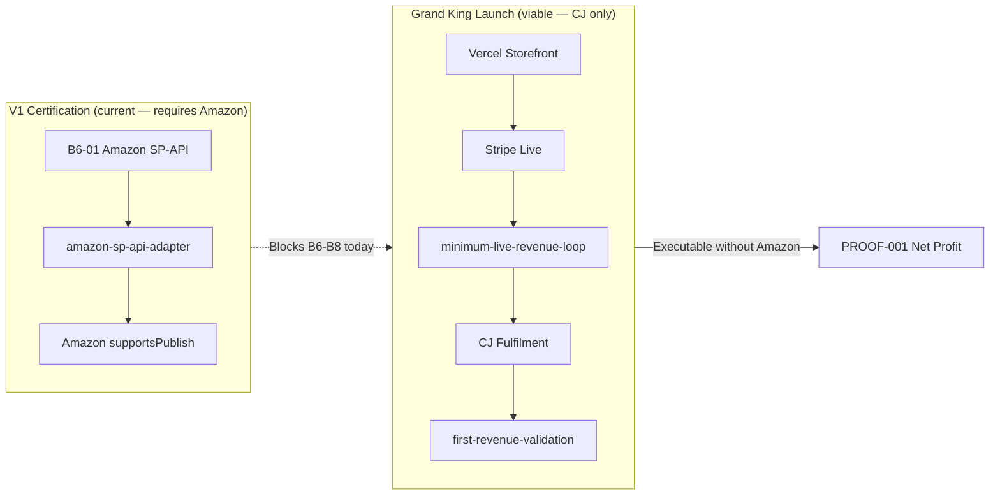

# Executive Audit — B6-01A Amazon SP-API Scope Review

> ⚠️ **SUPERSEDED** by B6-01C Governance Amendment v2 (2026-07-02). The DEFER recommendation is **void**. See `docs/governance/V1_MARKETPLACE_CHANNEL_REGISTRY.md` · ADR-052 · `artifacts/b6-01c-marketplace-governance-amendment-v2-executive-audit.md`.

**Mission:** B6-01A  
**Date:** 2026-07-02  
**Authority:** Grand King Executive Directive  
**Mode:** Audit only — no production code changes, no Amazon integration  
**Production baseline:** `a8945b2`  
**Recommendation:** **DEFER Amazon SP-API until post-Version 1** (with governance scope amendment)

---

## Executive Summary

EmpireAI currently treats **Amazon SP-API as a Version 1 certification blocker** (B6-01). Code and governance define V1 live commerce as **one SKU · Amazon marketplace · CJ Dropshipping · Stripe** (GO-002 P3).

However, the **executable Grand King revenue path** — the modules that actually move product, take payment, fulfil orders, and record profit — runs on **owned storefront + Stripe + CJ Dropshipping** with **no Amazon SP-API dependency**. The 12-stage first-revenue validation pipeline, minimum live revenue loop, live CJ fulfilment, and Grand King production readiness assessor all operate without Amazon credentials.

**Conclusion:** Amazon SP-API is **required under current V1 certification doctrine** but **not required for Grand King account launch or first net profit** via the CJ+Stripe storefront path. EmpireAI can launch the Grand King account using CJ Dropshipping alone for the revenue loop; Amazon is a **marketplace channel expansion**, not a prerequisite for PROOF-001's underlying commerce mechanics.

**Formal recommendation:** **DEFER** Amazon SP-API (B6-01) from Version 1 blockers. Re-scope V1 Grand King launch to **CJ + Stripe + owned storefront**. Reserve Amazon SP-API for **post-V1 marketplace expansion** (REAL-051A multi-marketplace doctrine).

**Important:** Deferral requires a **governance scope amendment** — code today still blocks B6 closure, V1 operational activation, and marketplace publish until `AMAZON_SP_API_*` is set. This audit does not implement that change.

---

## Certification Result (B6-01A Audit)

| Question | Answer |
|----------|--------|
| Should Amazon SP-API remain a V1 blocker **as currently coded**? | Yes — until scope is amended |
| Should Amazon SP-API remain a V1 blocker **for Grand King launch viability**? | **No — recommend DEFER** |
| Can Grand King launch with CJ alone? | **Yes** — revenue loop is CJ+Stripe storefront |
| Code changes required for deferral? | Yes — B6 tracker, activation gates, PROOF-001 critical path (future mission) |

---

## Dependency Matrix

| # | Feature / Module | Amazon SP-API Role | V1 Classification | Grand King Launch |
|---|------------------|-------------------|---------------------|-------------------|
| 1 | **B6-01 credential tracker** | Env gate: `AMAZON_SP_API_*` | Required for V1 *(current)* | Not needed for CJ storefront |
| 2 | **`isVersion1OperationalActivationReady()`** | Hard requirement | Required for V1 *(current)* | Bypass if scope amended |
| 3 | **`assessLiveCommerceGoLive()`** | Requires verified `amazon-seller` | Required for V1 *(current)* | Optional — separate REAL-002B path |
| 4 | **Marketplace publish (`supportsPublish`)** | Amazon listing publish | Required for V1 *(current)* | Future — storefront publish replaces for V1 |
| 5 | **`isPlatformOperationallyLive("amazon-seller")`** | OAR live lift | Required for V1 *(current)* | Future Enhancement |
| 6 | **PROOF-001 critical path (OMS)** | Lists B6-01 first | Required for V1 *(current)* | Defer with scope amendment |
| 7 | **GO-002 Phase 5** | Amazon+CJ live activation | Required for V1 *(current doctrine)* | Defer Amazon leg |
| 8 | **`amazon-sp-api-adapter` (REAL-002B)** | Live catalog/inventory/orders sync | Required for V1 *(current)* | Future Enhancement |
| 9 | **Amazon OAuth lifecycle** | Seller Central auth | Required for V1 *(current)* | Future Enhancement |
| 10 | **minimum-live-revenue-loop** | None | **Required for V1** (revenue) | ✅ CJ + Stripe only |
| 11 | **live-cj-fulfillment** | None | **Required for V1** (fulfilment) | ✅ CJ only |
| 12 | **live-payment-engine / Stripe** | None | **Required for V1** (payment) | ✅ Independent |
| 13 | **first-revenue-validation (12 stages)** | None — uses CJ catalog | **Required for V1** (PROOF-001) | ✅ CJ + storefront |
| 14 | **`assessProductionReadiness()` (Grand King)** | No Amazon check | **Required for V1** (revenue gates) | ✅ CJ + Stripe + Meta + Vercel |
| 15 | **production-store-deployment** | None | **Required for V1** (storefront) | ✅ Vercel hosting |
| 16 | **customer-order-pipeline** | None | **Required for V1** (order flow) | ✅ CJ-gated fulfilment |
| 17 | **product-publishing-engine** | Gates on `isCjLiveCommerceActivated()` | **Required for V1** | ✅ CJ supplier sync |
| 18 | **meta-ads-connector** | None | Optional for V1 (traffic) | ✅ Independent |
| 19 | **commerce-readiness-engine** | Warning if Amazon not connected | Optional for V1 | Non-blocking if other marketplace ready |
| 20 | **amazon-global-seller (RS-001–005)** | Architecture mapping only | Future Enhancement | Not live APIs |
| 21 | **Eye Amazon connector** | Mock product intelligence | Future Enhancement | Explicitly not selling |
| 22 | **Amazon runtime plugin** | `ARCHITECTURE_ONLY` | Future Enhancement | Post-V1 |
| 23 | **Integrations hub catalog** | Lists Amazon as V1 primary | Required for V1 *(doctrine)* | Doctrine update needed |
| 24 | **Global commerce registry** | Regional Amazon → `amazon-seller` | Future Enhancement | Post-V1 expansion |
| 25 | **operation-first-dollar** | Counts `amazon-seller` if connected | Optional for V1 | Milestone counter only |
| 26 | **B6-05 adapter connectivity test** | Blocked until B6-01 + B6-02 | Required for V1 *(current)* | Redefine to CJ-only test |
| 27 | **account-infrastructure-engine** | Amazon onboarding steps | Future Enhancement | Post-V1 seller setup |
| 28 | **Frontend (empireai-web)** | No direct SP-API client | N/A | Backend-gated only |

---

## Version 1 Impact Assessment

### If Amazon SP-API is KEPT as blocker (status quo)

| Impact | Severity |
|--------|----------|
| B6 cannot close until Amazon Seller Central + SP-API credentials obtained | 🔴 High — external dependency |
| PROOF-001 critical path blocked at B6-01 | 🔴 High |
| Grand King must list on Amazon marketplace before V1 cert | 🔴 High — adds Seller Central onboarding |
| CJ+Stripe storefront path remains usable but **uncertified** | 🟡 Medium |
| Timeline to PROOF-001 extended by Amazon approval cycle | 🔴 High (weeks–months) |
| B6-03 Stripe ✅ and B6-04 Vault ✅ already complete — blocked by unrelated credential | 🟡 Medium |

### If Amazon SP-API is DEFERRED (recommended)

| Impact | Severity |
|--------|----------|
| Grand King launch via **owned storefront + CJ + Stripe** unblocked | ✅ Enables faster path |
| PROOF-001 achievable without marketplace listing | ✅ Aligns with executable code path |
| B6-01 removed; B6-05 redefined as CJ connectivity test | 🟡 Requires code/governance update |
| Amazon remains architecture-ready for post-V1 | ✅ No capability loss |
| V1 scope narrows to **direct-to-consumer storefront** vs marketplace | 🟡 Doctrine amendment required |
| `assessLiveCommerceGoLive()` Amazon requirement becomes post-V1 | 🟡 Code update in future mission |
| Seller Central / SP-API OAuth complexity deferred | ✅ Reduces operational risk for V1 |

### Grand King CJ-Only Launch Path (Viable Today)

```
Meta Ads (optional) → Vercel Storefront → Stripe Checkout → Order Pipeline → CJ Fulfilment → Ledger → PROOF-001
```

**Production readiness already verified for this path (partial):**

| Gate | Production status |
|------|-------------------|
| B6-03 Stripe live keys | ✅ VERIFIED |
| B6-04 Credential vault key | ✅ VERIFIED |
| B6-02 CJ API key | ✅ CONFIGURED |
| B6-01 Amazon SP-API | ❌ PENDING (only Amazon blocker) |
| `LIVE_PAYMENT_ENABLED` | Gated (Protect The Empire) |
| `LIVE_COMMERCE_INTEGRATION_MODE` | `sandbox` |

The revenue loop modules do not read `AMAZON_SP_API_*`. First-revenue validation imports CJ products (`connectorId: "cj-dropshipping"`), deploys via `minimum-live-revenue-loop`, and completes checkout through `live-payment-engine`.

---

## Architecture: Two Parallel Paths



---

## Evidence: Amazon Not Required for Revenue Loop

### `assessProductionReadiness()` — no Amazon gate

```39:52:backend/src/revenue/first-revenue-validation/services/production-readiness-assessor.ts
  const gates = {
    stripeConfigured: isStripeLiveConfigured(livePayment),
    livePaymentsEnabled: livePayment.LIVE_PAYMENT_ENABLED,
    stripeWebhookConfigured: Boolean(livePayment.STRIPE_WEBHOOK_SECRET),
    productionDomainConfigured: Boolean(revenueLoop.REVENUE_LOOP_STORE_BASE_URL &&
      !revenueLoop.REVENUE_LOOP_STORE_BASE_URL.includes("localhost")),
    vercelDeployEnabled: isVercelLiveConfigured(productionDeploy),
    metaAdsConfigured: isMetaAdsLiveConfigured(metaAds),
    metaAdsLaunchEnabled: isMetaAdsLaunchAllowed(metaAds),
    cjCredentialsConfigured: hasCjCredentials(cjConfig),
    liveCjFulfillmentEnabled: isLiveCjFulfillmentAllowed(cjFulfillment),
    liveOrderFulfillmentEnabled: orderPipeline.CUSTOMER_ORDER_PIPELINE_LIVE_FULFILLMENT_ENABLED,
    liveSupplierSyncEnabled: isLiveSupplierSyncAllowed(productPublishing),
  };
```

### V1 activation — Amazon explicitly required *(current blocker source)*

```68:76:backend/src/orchestration/version-1-activation/version-1-activation-config.ts
export function isVersion1OperationalActivationReady(
  env: NodeJS.ProcessEnv = process.env,
): boolean {
  return (
    isLiveCommerceProductionMode(env) &&
    hasCredentialVaultKey(env) &&
    hasAmazonSpApiEnvCredentials(env) &&
    hasCjDropshippingEnvCredentials(env)
  );
}
```

### First-revenue validation — CJ supplier only

```74:83:backend/src/revenue/first-revenue-validation/services/first-revenue-validation-executor.ts
function buildSupplierItems() {
  return syncSupplierCatalog({
    connectorId: "cj-dropshipping",
    platform: "CJ_DROPSHIPPING",
    catalogItems: buildStubCatalogForPlatform("CJ_DROPSHIPPING"),
  }).map((item) => ({
    supplierProduct: item.supplierProduct,
    supplierInventory: item.supplierInventory,
    supplierPricing: item.supplierPricing,
  }));
}
```

---

## Recommendation

### **DEFER Amazon SP-API until post-Version 1**

**Rationale:**

1. **Executable path exists** — Grand King revenue loop (storefront → Stripe → CJ → ledger) requires no Amazon SP-API.
2. **PROOF-001 mechanics are CJ-centric** — 12 validation stages use CJ catalog and owned storefront, not Amazon listings.
3. **External dependency risk** — Amazon Seller Central approval, SP-API OAuth, and listing compliance add weeks/months unrelated to proving EmpireAI can generate profit.
4. **Partial B6 progress wasted** — Stripe (VERIFIED) and Vault (VERIFIED) are blocked by an orthogonal marketplace credential.
5. **Architecture preserved** — REAL-002B Amazon adapter, amazon-global-seller modules, and REAL-051A multi-marketplace doctrine remain for post-V1 without blocking V1 certification.
6. **Doctrine alignment opportunity** — GO-002 P3 ("one SKU · Amazon · CJ · Stripe") should be amended to **"one SKU · owned storefront · CJ · Stripe"** for V1; Amazon becomes V1.1 marketplace expansion.

**Deferral is NOT automatic** — requires future governance mission to:

- Remove or downgrade B6-01 from B6 closure criteria
- Update `isVersion1OperationalActivationReady()` and PROOF-001 critical path
- Redefine B6-05 as CJ-only adapter connectivity test
- Amend GO-002 P3 and blocker register B6 scope
- Mark Amazon SP-API as post-V1 blocker **B6-POST** or REAL-002B Phase 2

**Do not defer if:** Grand King strategy explicitly requires Amazon as the **first sales channel** (marketplace listing before any DTC storefront). Current executable code suggests DTC-first is the implemented path.

---

## Remaining B6 Blockers (Post-Recommendation Context)

| ID | Status | Notes if Amazon DEFERRED |
|----|--------|--------------------------|
| B6-01 | PENDING → **DEFER** | Remove from V1 closure (governance change) |
| B6-02 | CONFIGURED | CJ key on Railway; needs production mode for VERIFIED |
| B6-03 | ✅ VERIFIED | Stripe live |
| B6-04 | ✅ VERIFIED | Vault key |
| B6-05 | PENDING | Redefine as CJ connectivity test (no Amazon prerequisite) |

**Other gates (unchanged by this audit):**

- `LIVE_PAYMENT_ENABLED=false` — Stripe charges gated
- `LIVE_COMMERCE_INTEGRATION_MODE=sandbox`
- B7 Grand King go-live approval
- B8 PROOF-001 net profit outcome
- Amazon SP-API credentials absent on Railway (`present: false`)

---

## Files Reviewed

| Path | Purpose |
|------|---------|
| `backend/src/orchestration/version-1-activation/b6-credential-implementation.ts` | B6-01 definition |
| `backend/src/orchestration/version-1-activation/version-1-activation-config.ts` | V1 marketplace scope constants |
| `backend/src/orchestration/version-1-activation/production-infrastructure-readiness.ts` | Secrets checklist |
| `backend/src/orchestration/reality-integration/live-commerce/config.ts` | Live commerce provider IDs |
| `backend/src/orchestration/reality-integration/live-commerce/adapters/amazon-sp-api-adapter.ts` | SP-API adapter |
| `backend/src/orchestration/reality-integration/live-commerce/services/live-commerce-integration-service.ts` | Go-live assessment |
| `backend/src/runtime/marketplace-publishing/models/marketplace-adapter.ts` | Amazon publish gate |
| `backend/src/revenue/minimum-live-revenue-loop/` | CJ+Stripe revenue loop |
| `backend/src/execution/live-cj-fulfillment/` | CJ live fulfilment |
| `backend/src/revenue/first-revenue-validation/` | 12-stage PROOF-001 pipeline |
| `backend/src/revenue/first-revenue-validation/services/production-readiness-assessor.ts` | Grand King readiness (no Amazon) |
| `backend/src/orchestration/objective-management-engine/services/objective-default-objectives.ts` | PROOF-001 critical path |
| `backend/src/runtime/amazon-global-seller/` | Architecture-only Amazon modules |
| `backend/src/eye/connectors/amazon/` | Observation-only Eye connector |
| `GO-002_GRAND_KING_OPERATIONAL_MASTER_PLAN.md` | V1 scope doctrine |
| `docs/governance/VERSION_1_CERTIFICATION_BLOCKER_REGISTER.md` | B6 blocker register |
| `docs/governance/VERSION_1_GO_LIVE_PREPARATION_CHECKLIST.md` | M2/M3 Amazon requirements |
| Production probe | `GET /health/b6-implementation` |

---

## Files Changed

**None.** Audit-only mission per requirements.

---

## Recommended Next Mission

**B6-01B — V1 Scope Amendment: Defer Amazon SP-API**

Governance + minimal code updates to:

1. Remove B6-01 from V1 B6 closure criteria  
2. Amend PROOF-001 critical path to CJ+Stripe storefront  
3. Redefine B6-05 as CJ-only connectivity test  
4. Update GO-002 P3 scope language  
5. Register Amazon SP-API as post-V1 expansion (REAL-002B Phase 2)

**Do not proceed to B6-05** until scope amendment is King-approved.

---

## Scope Compliance

- ✅ Audited current architecture  
- ✅ Identified all Amazon SP-API dependencies  
- ✅ Classified each dependency  
- ✅ Assessed CJ-only Grand King launch viability  
- ✅ Formal DEFER recommendation produced  
- ❌ No production code modified  
- ❌ No Amazon integration implemented  
- ❌ Did not proceed to B6-05
