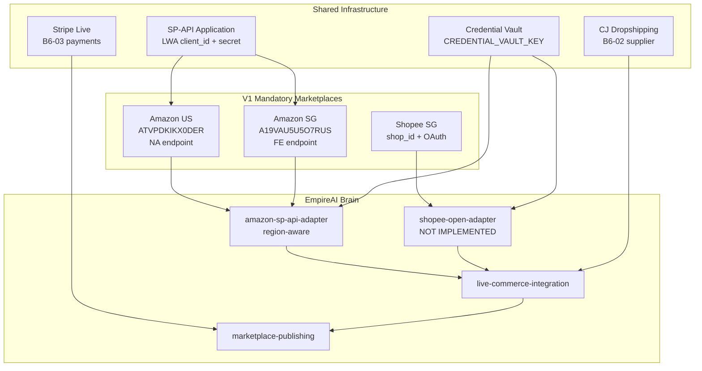
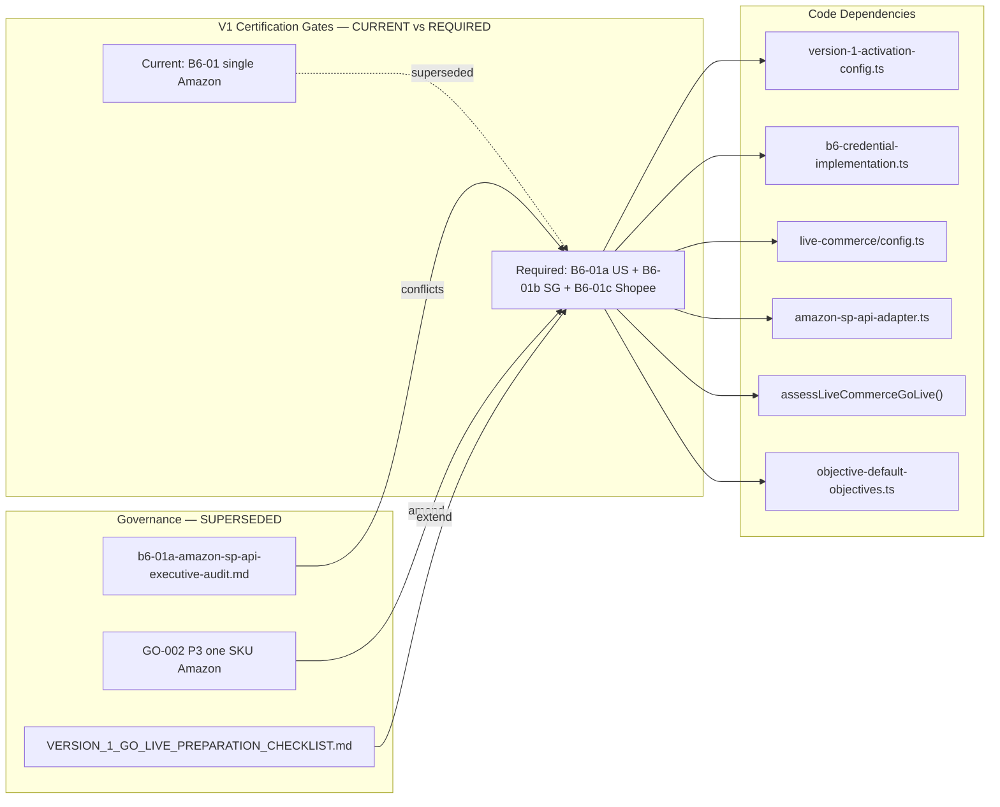

# Executive Audit — B6-01B Marketplace Architecture

> **Amended by:** B6-01C Governance Amendment v2 (2026-07-02) — adds **Shopify architecture provision** and future-proof expansion model. See `docs/governance/V1_MARKETPLACE_CHANNEL_REGISTRY.md`.

**Mission:** B6-01B  
**Date:** 2026-07-02  
**Authority:** Grand King Executive Directive — **Canonical V1 Marketplace Redefinition**  
**Mode:** Architecture and governance audit only — no code modified  
**Supersedes:** B6-01A DEFER recommendation (`artifacts/b6-01a-amazon-sp-api-executive-audit.md`)

---

## Executive Summary

The King has redefined Version 1 to require **three mandatory marketplaces**:

| # | Canonical V1 Marketplace | Country | EmpireAI registry ID |
|---|--------------------------|---------|----------------------|
| 1 | **Amazon US** | US | `amazon-us` → `amazon-seller` |
| 2 | **Amazon Singapore** | SG | `amazon-sg` → `amazon-seller` |
| 3 | **Shopee Singapore** | SG | `shopee-sg` → `shopee` |

**Current codebase state:** V1 activation hard-codes **one** Amazon marketplace (`V1_PRODUCTION_MARKETPLACE_ID = "amazon"`), **one** live-commerce marketplace adapter (`amazon-seller`), and **no** Shopee live adapter. Shopee exists only as architecture/registry entries (`supportsPublish: false`, `architectureOnly: true`).

**B6-01A is obsolete.** Its DEFER recommendation, CJ-only storefront path, and post-V1 Amazon deferral directly conflict with the King's directive.

**Amazon SP-API evidence (external):**

- **One SP-API application** (shared LWA `client_id` + `client_secret`) can serve **both US and Singapore**.
- **Refresh tokens are region-scoped**, not marketplace-scoped: NA token for US (`sellingpartnerapi-na.amazon.com`); FE token for Singapore (`sellingpartnerapi-fe.amazon.com`).
- **One Seller Central seller account** can sell on both US and SG if enrolled in both marketplaces (Global Selling), but **each region requires a separate OAuth authorization** through the correct Seller Central URL.
- **Marketplace IDs** are passed per API call: US = `ATVPDKIKX0DER`, SG = `A19VAU5U5O7RUS`.

**Shopee evidence (external + codebase):**

- Shopee Open Platform v2 uses **OAuth 2.0 + HMAC-SHA256** request signing (`partner_id`, `partner_key`, `shop_id`, `access_token`).
- **No live Shopee adapter** exists in EmpireAI; provider catalog and integrations hub list Shopee as architecture-only.
- Production API base: `https://partner.shopeemobile.com` (Singapore-deployed services).

**Recommended V1 architecture:** **Tri-marketplace model** with shared Amazon SP-API app credentials, **per-region Amazon refresh tokens**, marketplace-scoped routing (`amazon-us`, `amazon-sg`, `shopee-sg`), CJ Dropshipping as sole supplier (unchanged), Stripe for payments (unchanged). Refactor `LIVE_COMMERCE_PROVIDER_IDS.marketplaces` from `["amazon-seller"]` to three distinct V1 marketplace identities while retaining one `amazon-sp-api-adapter` with region-aware context.

---

## Marketplace Architecture

### Canonical V1 topology



### Target provider model (recommended)

| Layer | Current | Required for V1 |
|-------|---------|-----------------|
| V1 constants | `V1_PRODUCTION_MARKETPLACE_ID = "amazon"` | Array: `amazon-us`, `amazon-sg`, `shopee-sg` |
| Live commerce marketplaces | `["amazon-seller"]` | `["amazon-us", "amazon-sg", "shopee-sg"]` |
| Amazon adapter | Single NA endpoint + one refresh token | Region router: NA + FE endpoints, per-region tokens |
| Shopee adapter | None | New `shopee-open-adapter` (REAL-002B extension) |
| B6 tracker | B6-01 single Amazon block | B6-01a Amazon US, B6-01b Amazon SG, B6-01c Shopee SG |
| Supplier | `cj-dropshipping` | Unchanged |

### Amazon architecture findings (evidence-based)

#### Can one Seller Central account support US + Singapore?

**Yes, with enrollment.** A seller can operate multiple marketplaces under one Seller Central identity via [Amazon Global Selling](https://sellercentral.amazon.com). The seller must be **approved/enrolled** for each target marketplace (US and SG). This is an **account configuration** step, not an API limitation.

**SP-API implication:** Seller account is global; **API authorization is regional**. The seller must authorize the EmpireAI application separately through:

- US: `https://sellercentral.amazon.com/apps/authorize/consent?application_id=...`
- SG: `https://sellercentral.amazon.sg/apps/authorize/consent?application_id=...`

#### Can one SP-API application serve both marketplaces?

**Yes.** Amazon documents SP-API applications as **global** with a single LWA `client_id` / `client_secret` pair. Authorization produces **region-specific refresh tokens**:

| Region | SP-API endpoint | AWS signing region | Seller Central URL | Refresh token env (proposed) |
|--------|-----------------|-------------------|--------------------|-----------------------------|
| North America (US) | `https://sellingpartnerapi-na.amazon.com` | `us-east-1` | `sellercentral.amazon.com` | `AMAZON_SP_API_REFRESH_TOKEN_NA` |
| Far East (SG) | `https://sellingpartnerapi-fe.amazon.com` | `us-west-2` | `sellercentral.amazon.sg` | `AMAZON_SP_API_REFRESH_TOKEN_FE` |

**Note:** Far East region behavior differs from NA/EU — community reports indicate JP/AU/SG may each need separate authorization in some cases. For V1 scope (SG only in FE), one FE refresh token targeting Singapore is the minimum.

#### Marketplace IDs required

| Marketplace | Marketplace ID | Country code | SP-API region |
|-------------|----------------|--------------|---------------|
| Amazon US | `ATVPDKIKX0DER` | US | NA |
| Amazon Singapore | `A19VAU5U5O7RUS` | SG | FE |

Source: [Amazon SP-API Marketplace IDs](https://developer-docs.amazon.com/sp-api/docs/marketplace-ids)

#### Credentials: shared vs region-specific

| Credential | Scope | Storage |
|------------|-------|---------|
| `AMAZON_SP_API_CLIENT_ID` | **Shared** (one SP-API app) | Railway env |
| `AMAZON_SP_API_CLIENT_SECRET` | **Shared** | Railway env |
| `AMAZON_SP_API_REFRESH_TOKEN` *(current)* | **Insufficient** — single token, NA-assumed | Railway env |
| `AMAZON_SP_API_REFRESH_TOKEN_NA` | **Region-specific** (US) | Railway env or vault |
| `AMAZON_SP_API_REFRESH_TOKEN_FE` | **Region-specific** (SG) | Railway env or vault |
| AWS IAM access key + secret | **Shared or per-role** | Railway env |
| IAM role ARN (SP-API signing) | **Shared** | Railway env |
| `marketplaceIds` query param | **Per-request** | Runtime (not env) |
| LWA access token | **Per-region, short-lived** | Runtime cache |

**Current code gap:** `getAmazonSpApiConfig()` in `live-commerce/config.ts` exposes only one `refreshToken`, one `region` (default `"na"`), and one `productionEndpoint`. This **cannot** serve Amazon SG without refactor.

#### Architectural implications for EmpireAI

1. **Split B6-01** into US + SG credential gates with separate verification.
2. **Parameterize amazon-sp-api-adapter** with `marketplaceId`, `region`, `endpoint`, and `refreshToken` from context — not global env alone.
3. **Extend `assessLiveCommerceGoLive()`** to iterate three V1 marketplaces, not one `amazon-seller`.
4. **Update `isPlatformOperationallyLive()`** to accept `amazon-us`, `amazon-sg`, `shopee-sg` — not binary `amazon-seller`.
5. **Global commerce registry** already defines `amazon-us`, `amazon-sg`, `shopee-sg` — align V1 activation with registry IDs.

---

### Shopee Singapore integration (evidence-based)

#### Current EmpireAI state

| Component | Status |
|-----------|--------|
| `provider-catalog.ts` | `shopee` provider — oauth2, regions SG/MY/TH/ID/PH/VN/TW |
| `integrations-hub-catalog.ts` | Listed — `connectionStatus: not_connected`, architecture |
| `marketplace-adapter.ts` | `supportsPublish: false`, formatter `shopee-open` |
| `global-commerce-registry-data.ts` | `shopee-sg` entry for SG |
| `infrastructure-seed-data.ts` | SG dependencies: local payment REQUIRED, PDPA REQUIRED |
| **Live adapter** | **Does not exist** |
| **Env vars in `.env.example`** | **None for Shopee** |

#### Required developer accounts

| Account | Purpose |
|---------|---------|
| [Shopee Open Platform Console](https://open.shopee.com) | Register app, obtain `partner_id` + `partner_key` |
| Shopee Seller Centre (Singapore) | Seller account for Grand King; authorize EmpireAI app |
| (Optional) Shopee sandbox | Pre-production testing — separate test `partner_id` |

#### Authentication model

1. **Authorization URL** — redirect seller to Shopee consent screen.
2. **Callback** — receive `code` + `shop_id` (code valid 10 minutes, one-time).
3. **Token exchange** — `POST /api/v2/auth/token/get` with HMAC signature.
4. **API calls** — every request signed: `HMAC-SHA256(partner_key, partner_id + path + timestamp + access_token + shop_id)`.
5. **Refresh** — access token expires **4 hours**; refresh token valid **30 days**.

Source: [Shopee Open Platform Developer Guide — Authorization](https://open.shopee.com/developer-guide/20)

#### Required credentials

| Credential | Type | Notes |
|------------|------|-------|
| `partner_id` | App-level | From Open Platform Console |
| `partner_key` | App-level secret | Live key for production |
| `shop_id` | Shop-level | Returned after seller authorization |
| `access_token` | Runtime | 4-hour TTL; refresh automatically |
| `refresh_token` | Runtime | 30-day TTL; store in credential vault |
| `redirect_uri` | App config | Must match Console callback domain |

#### Required production environment variables (proposed)

```env
# Shopee Open Platform — Singapore (V1)
SHOPEE_PARTNER_ID=
SHOPEE_PARTNER_KEY=
SHOPEE_API_BASE_URL=https://partner.shopeemobile.com
SHOPEE_REDIRECT_URI=https://empireai-production.up.railway.app/reality-integration/live-commerce/oauth/shopee/callback
SHOPEE_SHOP_ID=                    # Set after OAuth authorization
# Tokens should live in credential vault after initial OAuth — not plain env long-term
```

#### Production readiness steps (operator)

1. Create Shopee Open Platform **Live** app (not sandbox).
2. Configure production callback URL domain in Console.
3. Complete Shopee Seller Centre SG registration / verification.
4. Run OAuth authorization flow; capture `shop_id`, `access_token`, `refresh_token`.
5. Store tokens in credential vault via `/reality-integration/connect`.
6. Verify catalog read + order webhook endpoints in sandbox before production mode.
7. Confirm SG infrastructure dependencies: local payout method, PDPA compliance (human actions per `infrastructure-seed-data.ts`).

---

## Credential Matrix

| Variable / credential | Amazon US | Amazon SG | Shopee SG | Shared? |
|----------------------|-----------|-----------|-----------|---------|
| SP-API LWA client ID | ✅ | ✅ | — | **Yes** |
| SP-API LWA client secret | ✅ | ✅ | — | **Yes** |
| SP-API refresh token | NA token | FE token | — | **No** |
| SP-API endpoint | `sellingpartnerapi-na.amazon.com` | `sellingpartnerapi-fe.amazon.com` | — | **No** |
| Marketplace ID | `ATVPDKIKX0DER` | `A19VAU5U5O7RUS` | — | **No** |
| AWS IAM signing credentials | ✅ | ✅ | — | **Yes** (same role typical) |
| Shopee partner_id | — | — | ✅ | Shopee only |
| Shopee partner_key | — | — | ✅ | Shopee only |
| Shopee shop_id | — | — | ✅ | Shopee only |
| Shopee access/refresh token | — | — | ✅ (vault) | Shopee only |
| `CREDENTIAL_VAULT_KEY` | ✅ | ✅ | ✅ | **Yes** |
| `CJ_API_KEY` | ✅ (fulfilment) | ✅ | ✅ | **Yes** |
| `STRIPE_SECRET_KEY` | ✅ (payments) | ✅ | ✅ | **Yes** |

---

## Marketplace Dependency Diagram



---

## Required Railway Variables

### Current (insufficient for tri-marketplace V1)

```env
AMAZON_SP_API_CLIENT_ID=
AMAZON_SP_API_CLIENT_SECRET=
AMAZON_SP_API_REFRESH_TOKEN=          # Single token — NA only
AMAZON_SP_API_REGION=na                 # Default NA — blocks SG
```

### Recommended (V1 tri-marketplace)

```env
# --- Amazon SP-API (shared app) ---
AMAZON_SP_API_CLIENT_ID=
AMAZON_SP_API_CLIENT_SECRET=
AMAZON_SP_API_REFRESH_TOKEN_NA=       # US — North America authorization
AMAZON_SP_API_REFRESH_TOKEN_FE=       # SG — Far East authorization
AWS_ACCESS_KEY_ID=                    # SP-API request signing
AWS_SECRET_ACCESS_KEY=
AWS_SELLING_PARTNER_ROLE_ARN=

# --- Shopee Open Platform (Singapore) ---
SHOPEE_PARTNER_ID=
SHOPEE_PARTNER_KEY=
SHOPEE_API_BASE_URL=https://partner.shopeemobile.com
SHOPEE_REDIRECT_URI=
SHOPEE_SHOP_ID=

# --- Unchanged V1 dependencies ---
CREDENTIAL_VAULT_KEY=                 # B6-04 ✅ VERIFIED
CJ_API_KEY=                           # B6-02 CONFIGURED
STRIPE_SECRET_KEY=                    # B6-03 ✅ VERIFIED
STRIPE_WEBHOOK_SECRET=
LIVE_COMMERCE_INTEGRATION_MODE=sandbox
```

**Migration note:** Retain `AMAZON_SP_API_REFRESH_TOKEN` as alias to `_NA` during transition if backward compatibility needed.

---

## Required Real-World Setup

### Amazon US + Amazon SG

| Step | Action | Owner |
|------|--------|-------|
| 1 | Register SP-API developer profile (if not done) | Operator |
| 2 | Create SP-API application; note LWA client ID + secret | Operator |
| 3 | Configure IAM user/role for SP-API signing | Operator |
| 4 | Enroll seller account in **US** marketplace | Grand King / Operator |
| 5 | Enroll seller account in **Singapore** marketplace (Global Selling) | Grand King / Operator |
| 6 | OAuth authorize app via `sellercentral.amazon.com` → capture NA refresh token | Operator |
| 7 | OAuth authorize app via `sellercentral.amazon.sg` → capture FE refresh token | Operator |
| 8 | Inject credentials on Railway; verify `getMarketplaceParticipations` per region | Engineering |
| 9 | List one test SKU on US; verify catalog sync | Grand King approval |

### Shopee Singapore

| Step | Action | Owner |
|------|--------|-------|
| 1 | Register on Shopee Open Platform; create Live app | Operator |
| 2 | Configure callback URL matching Railway public domain | Operator |
| 3 | Create / verify Shopee Seller Centre SG account | Grand King |
| 4 | Complete seller verification (identity, payout method) | Grand King |
| 5 | Implement Shopee OAuth callback route (future mission) | Engineering |
| 6 | Authorize app; store tokens in credential vault | Operator |
| 7 | Verify product list + order webhook endpoints | Engineering |
| 8 | Confirm PDPA + local payout prerequisites | Grand King |

### Cross-marketplace

| Step | Action |
|------|--------|
| 1 | Supersede B6-01A DEFER artifacts in Journey |
| 2 | Update PROOF-001 scope: three marketplaces + CJ + Stripe |
| 3 | Redefine B6-05 as tri-marketplace connectivity test |
| 4 | King approval before `LIVE_COMMERCE_INTEGRATION_MODE=production` |

---

## Documents & Gates Superseded by King Directive

The following assume Amazon deferral, single Amazon marketplace, or CJ-only V1 — **all conflict with canonical V1**:

| Artifact / gate | Conflict | Action required |
|-----------------|----------|-----------------|
| `artifacts/b6-01a-amazon-sp-api-executive-audit.md` | DEFER Amazon recommendation | **Supersede** — mark obsolete |
| `artifacts/b6-01a-amazon-sp-api-evidence.json` | `"recommendation": "DEFER"` | **Supersede** |
| `GO-002` P3 | "one SKU · Amazon · CJ · Stripe" | **Amend** — add Amazon SG + Shopee SG |
| `GO-001` PROOF-001 scope | Single Amazon marketplace | **Amend** |
| `objective-default-objectives.ts` critical path | B6-01 single Amazon | **Update** — tri-marketplace |
| `version-1-activation-config.ts` | `V1_PRODUCTION_MARKETPLACE_ID = "amazon"` | **Update** — three IDs |
| `live-commerce/config.ts` | Single NA Amazon config | **Update** — multi-region |
| `b6-credential-implementation.ts` | B6-01 single block | **Split** B6-01a/b/c |
| `VERSION_1_GO_LIVE_PREPARATION_CHECKLIST.md` M2/M3 | Single Amazon SP-API trio | **Extend** Shopee + SG Amazon |
| `SA-001_ARCHITECTS_FINAL_RECOMMENDATIONS.md` | "one SKU Amazon" | **Amend** |
| `integrations-hub-catalog.ts` | "Primary V1 marketplace: Amazon" | **Amend** — three primaries |
| `COMBINED_EXECUTIVE_AUDIT_EMPIREAI_V1_OPERATIONAL_ACTIVATION.md` | "Non-Amazon architecture-only" | **Amend** |
| `EMPIRE_RETURN_PACKAGE.md` | "Amazon first certified; Shopee BLOCKED" | **Amend** |
| `b6-04b` / `b6-04` remaining blockers | "B6-01 Amazon next" (single) | **Update** after scope amendment |

**Not superseded (still valid):** CJ Dropshipping as V1 supplier, Stripe as payment rail, credential vault (B6-04 VERIFIED), B5 hosting closed, Protect The Empire gates.

---

## Complete File List Requiring Updates

### P0 — Governance & superseded audits (13 files)

| File | Update |
|------|--------|
| `artifacts/b6-01a-amazon-sp-api-executive-audit.md` | Mark SUPERSEDED by B6-01B |
| `artifacts/b6-01a-amazon-sp-api-evidence.json` | Mark SUPERSEDED |
| `GO-002_GRAND_KING_OPERATIONAL_MASTER_PLAN.md` | P3 tri-marketplace scope |
| `GO-001_OPERATIONAL_READINESS_REPORT.md` | PROOF-001 marketplace scope |
| `docs/governance/VERSION_1_GO_LIVE_PREPARATION_CHECKLIST.md` | M2/M3 Shopee + Amazon SG |
| `docs/governance/VERSION_1_CERTIFICATION_BLOCKER_REGISTER.md` | B6 scope expansion |
| `SA-001_ARCHITECTS_FINAL_RECOMMENDATIONS.md` | V1 marketplace list |
| `COMBINED_EXECUTIVE_AUDIT_EMPIREAI_V1_OPERATIONAL_ACTIVATION.md` | Single Amazon doctrine |
| `COMBINED_EXECUTIVE_AUDIT_EMPIREAI_V1_OPERATIONAL_TOTALITY.md` | M2/M3 credentials |
| `EMPIRE_RETURN_PACKAGE.md` | Shopee BLOCKED → V1 required |
| `JOURNEY.md` | B6-01A defer reference if any |
| `EMPIREAI_STATUS.md` | V1 marketplace scope |
| `MARKETPLACE_AUTONOMY_DOCTRINE_REAL-051A.md` | V1 vs post-V1 clarity |

### P1 — V1 activation gates & B6 tracker (8 files)

| File | Update |
|------|--------|
| `backend/src/orchestration/version-1-activation/version-1-activation-config.ts` | Tri-marketplace constants + gates |
| `backend/src/orchestration/version-1-activation/b6-credential-implementation.ts` | B6-01a/b/c split |
| `backend/src/orchestration/version-1-activation/production-infrastructure-readiness.ts` | Secrets checklist |
| `backend/src/orchestration/version-1-activation/index.ts` | Export new constants |
| `backend/src/orchestration/objective-management-engine/services/objective-default-objectives.ts` | PROOF-001 critical path |
| `backend/src/orchestration/objective-management-engine/services/objective-management-service.ts` | Next action defaults |
| `backend/src/domain/services/operational-command-view.ts` | Blocker display |
| `backend/.env.example` | Shopee + multi-region Amazon vars |

### P2 — Live commerce & adapters (10 files)

| File | Update |
|------|--------|
| `backend/src/orchestration/reality-integration/live-commerce/config.ts` | Multi-region Amazon + Shopee config |
| `backend/src/orchestration/reality-integration/live-commerce/adapters/amazon-sp-api-adapter.ts` | Region/marketplace context |
| `backend/src/orchestration/reality-integration/live-commerce/adapters/registry.ts` | Register Shopee adapter |
| `backend/src/orchestration/reality-integration/live-commerce/services/live-commerce-integration-service.ts` | Tri-marketplace go-live |
| `backend/src/orchestration/reality-integration/live-commerce/services/oauth-lifecycle-service.ts` | SG + Shopee OAuth |
| `backend/src/runtime/marketplace-publishing/models/marketplace-adapter.ts` | V1 publish gates per marketplace |
| `backend/src/operational-access/integrations-hub/models/integrations-hub-catalog.ts` | V1 primary marketplaces |
| `backend/src/operational-access/models/empire-platform-catalog.ts` | Shopee architectureOnly → live path |
| `deployment/railway.md` | Env var documentation |
| `deployment/railway-production.env.template` | New marketplace vars |

### P3 — Tests (6 files)

| File | Update |
|------|--------|
| `backend/src/validation/tests/b6-credential-implementation.test.ts` | Tri-marketplace B6 items |
| `backend/src/validation/tests/version-1-operational-activation.test.ts` | Multi-marketplace gates |
| `backend/src/validation/tests/reality-002b.test.ts` | Amazon US + SG scenarios |
| `backend/src/validation/tests/global-commerce-infrastructure.test.ts` | Shopee SG V1 requirements |
| `backend/src/validation/tests/operational-access.test.ts` | Platform live checks |
| *(new)* `backend/src/validation/tests/shopee-live-commerce.test.ts` | Shopee adapter tests |

### P4 — Registry & architecture references (8 files)

| File | Update |
|------|--------|
| `backend/src/runtime/global-commerce/data/global-commerce-registry-data.ts` | Confirm V1 flags |
| `backend/src/orchestration/reality-integration/models/provider-catalog.ts` | V1 marketplace markers |
| `backend/src/intelligence/commerce-intelligence-core/services/mission-service.ts` | `amazon-us` default |
| `pillow/src/planner/catalog.ts` | REAL-002B tri-marketplace mission |
| `backend/src/orchestration/master-completion-ledger/models/program-catalog.ts` | V1 operational access |
| `backend/src/operational-access/models/platform-readiness.ts` | Remove Shopee from FUTURE-only |
| `backend/src/operational-access/models/approval-boundary.ts` | Shopee publish approval |
| `backend/src/orchestration/account-infrastructure-engine/services/account-provider-definitions.ts` | Shopee onboarding steps |

### P5 — Post-B6-01B artifact updates (4 files)

| File | Update |
|------|--------|
| `artifacts/b6-04b-live-vault-certification-executive-audit.md` | Remaining blockers section |
| `artifacts/b6-04b-live-vault-certification-evidence.json` | B6-01 reference |
| `artifacts/b6-04-production-vault-executive-audit.md` | B6-01 scope |
| `artifacts/b6-02b-live-cj-auth-executive-audit.md` | B6-01 open items |

**Total: 49 files** identified for governance/code/documentation alignment.

---

## Recommended Mission Order

| Order | Mission | Purpose | Depends on |
|-------|---------|---------|------------|
| **1** | **B6-01B** ✅ | Marketplace architecture audit (this document) | King directive |
| **2** | **B6-01C** | Governance amendment — supersede B6-01A, update GO-002/GO-001/Journey | B6-01B |
| **3** | **B6-01D** | Amazon multi-region credential model (NA + FE env vars, adapter context) | B6-01C |
| **4** | **B6-06** | Shopee SG live adapter (REAL-002B extension) + OAuth routes | B6-01C |
| **5** | **B6-01E** | Amazon US live auth proof (`/health/b6-01a-amazon-us-live-auth`) | B6-01D + Railway NA creds |
| **6** | **B6-01F** | Amazon SG live auth proof (`/health/b6-01b-amazon-sg-live-auth`) | B6-01D + Railway FE creds |
| **7** | **B6-07** | Shopee SG live auth proof (`/health/b6-07-shopee-sg-live-auth`) | B6-06 + OAuth complete |
| **8** | **B6-05** | Tri-marketplace connectivity test (redefined) | B6-01E/F + B6-07 + B6-02 |
| **9** | **B7** | Grand King go-live approval | B6 closed |
| **10** | **B8** | PROOF-001 first net profit | B7 |

**Parallel track (unchanged):** B6-02 CJ VERIFIED path, B6-03 Stripe ✅, B6-04 Vault ✅ — continue toward production mode gates.

**Do not start B6-05** until tri-marketplace adapters and credentials exist.

---

## Version 1 Impact Assessment

| Area | Impact of tri-marketplace V1 |
|------|---------------------------|
| **B6 closure** | Harder — 3 marketplace credential blocks vs 1; clearer scope |
| **Engineering effort** | +Shopee adapter (greenfield), +Amazon region split (refactor) |
| **Operator setup** | 3 seller accounts/enrollments: Amazon US, Amazon SG, Shopee SG |
| **Timeline** | Longer than CJ-only defer path; aligned with King strategy |
| **Architecture** | Aligns with `global-commerce-registry-data.ts` — already models all three |
| **PROOF-001** | Can target any of three marketplaces for first SKU (King choice) |
| **CJ + Stripe** | Unchanged — supplier and payment rails remain universal |

---

## Scope Compliance

- ✅ Audited documents/doctrine assuming Amazon deferral
- ✅ Complete file update list produced (49 files)
- ✅ Amazon US + SG architecture investigated with evidence
- ✅ Shopee SG integration documented
- ✅ Optimal V1 marketplace architecture recommended
- ❌ No code modified
- ❌ Did not proceed to B6-05

---

## Sources

- [Amazon SP-API Marketplace IDs](https://developer-docs.amazon.com/sp-api/docs/marketplace-ids)
- [Amazon SP-API Endpoints](https://developer-docs.amazon.com/sp-api/docs/sp-api-endpoints)
- [Amazon SP-API Authorization Workflow](https://developer-docs.amazon.com/sp-api/docs/selling-partner-appstore-authorization-workflow)
- [Shopee Open Platform — Authorization](https://open.shopee.com/developer-guide/20)
- [Shopee Open Platform — API Domains](https://open.shopee.com/developer-guide/16)
- EmpireAI codebase: `live-commerce/config.ts`, `global-commerce-registry-data.ts`, `b6-credential-implementation.ts`
