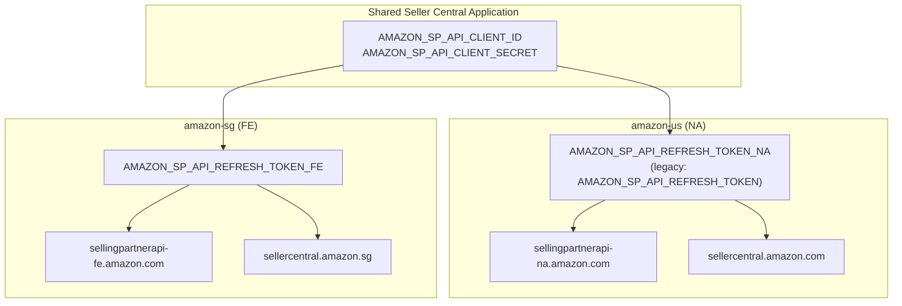
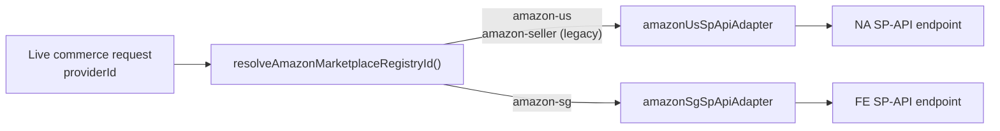
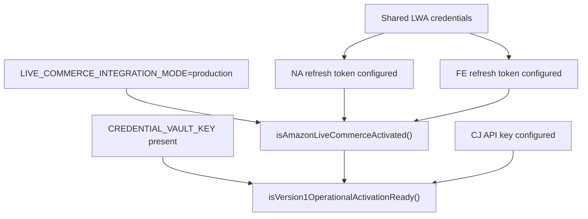

# B6-01D — Amazon Multi-Region Foundation Executive Audit

**Mission:** B6-01D — Amazon Multi-Region Foundation  
**Governance:** ADR-052 / `V1_MARKETPLACE_CHANNEL_REGISTRY.md`  
**Date:** 2026-06-21  
**Status:** **FOUNDATION COMPLETE** (architecture + routing; no live auth)  
**Scope boundary:** Does **not** include B6-01E live OAuth certification or credential injection.

---

## Executive Summary

EmpireAI has been refactored from a single `amazon-seller` assumption to a **marketplace-aware Amazon architecture** supporting **`amazon-us`** and **`amazon-sg`** as first-class V1 channels.

| Layer | Before | After |
|-------|--------|-------|
| Live-commerce provider IDs | `amazon-seller` (single) | `amazon-us`, `amazon-sg` |
| LWA credentials | One global config | Shared `client_id` + `client_secret` |
| Refresh tokens | `AMAZON_SP_API_REFRESH_TOKEN` | Per-region `…_NA` / `…_FE` (+ legacy alias) |
| SP-API endpoints | NA only | NA (US) + FE (SG) |
| OAuth authorize URL | `sellercentral.amazon.com` only | Region-specific Seller Central |
| B6 tracker | Single B6-01 | B6-01a (US) + B6-01b (SG) |

**Validation:** 36 targeted unit tests pass (profiles, B6 tracker, V1 activation, REAL-002A/002B). Typecheck clean.

---

## Files Changed

### New

| File | Purpose |
|------|---------|
| `backend/src/orchestration/reality-integration/live-commerce/amazon-marketplace-profiles.ts` | Canonical profile registry, credential resolution, routing helpers |
| `backend/src/validation/tests/amazon-marketplace-profiles.test.ts` | Unit tests for multi-region profiles |
| `artifacts/b6-01d-amazon-multi-region-foundation-executive-audit.md` | This audit |

### Modified — Core architecture

| File | Change |
|------|--------|
| `backend/src/orchestration/reality-integration/live-commerce/config.ts` | `LIVE_COMMERCE_PROVIDER_IDS.marketplaces` → `amazon-us`, `amazon-sg`; marketplace-aware `getAmazonSpApiConfig(registryId)` |
| `backend/src/orchestration/reality-integration/live-commerce/adapters/amazon-sp-api-adapter.ts` | Factory `createAmazonSpApiAdapter()`; per-region endpoints; region OAuth URLs |
| `backend/src/orchestration/reality-integration/live-commerce/adapters/registry.ts` | Registers `amazonUsSpApiAdapter` + `amazonSgSpApiAdapter`; legacy `amazon-seller` → `amazon-us` |
| `backend/src/orchestration/reality-integration/live-commerce/services/oauth-lifecycle-service.ts` | OAuth start/complete/refresh require marketplace `providerId` |
| `backend/src/orchestration/version-1-activation/version-1-activation-config.ts` | `V1_PRODUCTION_MARKETPLACE_IDS`; per-marketplace activation gates |
| `backend/src/orchestration/version-1-activation/b6-credential-implementation.ts` | Split B6-01 → B6-01a / B6-01b |
| `backend/src/orchestration/version-1-activation/production-infrastructure-readiness.ts` | Per-region B6 readiness (`amazonUs`, `amazonSg`) |
| `backend/src/orchestration/version-1-activation/index.ts` | Export new symbols |
| `backend/src/runtime/marketplace-publishing/models/marketplace-adapter.ts` | Publish IDs `amazon-us`, `amazon-sg`; per-region activation |
| `backend/src/orchestration/reality-integration/models/live-commerce-foundation.ts` | Marketplace catalog lists V1 Amazon regions |
| `backend/src/orchestration/reality-integration/models/provider-catalog.ts` | `amazon-us`, `amazon-sg` provider definitions |
| `backend/src/orchestration/reality-integration/services/runtime-activation-service.ts` | Plugin mapping for both Amazon regions |
| `backend/src/orchestration/reality-integration/services/live-commerce-foundation-service.ts` | ESIS/snapshot reports US + SG separately |
| `backend/src/runtime/global-commerce/data/global-commerce-registry-data.ts` | `realityProviderId` aligned to registry IDs for US/SG |
| `backend/.env.example` | Document shared LWA + NA/FE refresh tokens |

### Modified — Tests

| File | Change |
|------|--------|
| `backend/src/validation/tests/b6-credential-implementation.test.ts` | B6-01a first objective |
| `backend/src/validation/tests/version-1-operational-activation.test.ts` | Both NA + FE tokens in prod env |
| `backend/src/validation/tests/reality-002a.test.ts` | V1 Amazon region catalog + registry |
| `backend/src/validation/tests/reality-002b.test.ts` | Dual-marketplace go-live; SG OAuth URL test |

---

## Architecture Diagrams

### 1. Credential topology (shared app, separate region profiles)



### 2. Runtime routing (provider ID → adapter → endpoint)



### 3. V1 activation gate flow



---

## Credential Matrix

| Dimension | Shared | amazon-us | amazon-sg |
|-----------|--------|-----------|-----------|
| **Registry ID** | — | `amazon-us` | `amazon-sg` |
| **Country** | — | US | SG |
| **SP-API region** | — | NA | FE |
| **Marketplace ID** | — | `ATVPDKIKX0DER` | `A19VAU5U5O7RUS` |
| **LWA client_id** | `AMAZON_SP_API_CLIENT_ID` | *(shared)* | *(shared)* |
| **LWA client_secret** | `AMAZON_SP_API_CLIENT_SECRET` | *(shared)* | *(shared)* |
| **Refresh token env** | — | `AMAZON_SP_API_REFRESH_TOKEN_NA` | `AMAZON_SP_API_REFRESH_TOKEN_FE` |
| **Legacy alias** | — | `AMAZON_SP_API_REFRESH_TOKEN` → NA | — |
| **Production endpoint** | — | `https://sellingpartnerapi-na.amazon.com` | `https://sellingpartnerapi-fe.amazon.com` |
| **Sandbox endpoint** | — | `https://sandbox.sellingpartnerapi-na.amazon.com` | `https://sandbox.sellingpartnerapi-fe.amazon.com` |
| **OAuth authorize base** | — | `sellercentral.amazon.com` | `sellercentral.amazon.sg` |
| **B6 tracker item** | — | B6-01a | B6-01b |
| **Live activation fn** | — | `isAmazonMarketplaceLiveActivated('amazon-us')` | `isAmazonMarketplaceLiveActivated('amazon-sg')` |

**Full Amazon readiness** (`hasAmazonSpApiEnvCredentials`): shared LWA **plus** both region refresh tokens.

---

## Marketplace Routing

| Entry point | Routing behaviour |
|-------------|-------------------|
| `getLiveCommerceAdapter(providerId)` | `amazon-us` / `amazon-sg` → region adapter; `amazon-seller` → `amazon-us` (legacy) |
| `getAmazonSpApiConfig(registryId)` | Returns shared LWA + region token + endpoints for registry ID |
| `startMarketplaceOAuth({ providerId })` | Resolves registry ID → region Seller Central authorize URL |
| `LIVE_COMMERCE_PROVIDER_IDS.marketplaces` | `['amazon-us', 'amazon-sg']` |
| `isPlatformOperationallyLive(id)` | Per-registry for `amazon-us`/`amazon-sg`; umbrella `amazon`/`amazon-seller` requires **both** regions |
| `resolveMarketplaceAdapter(id)` | `amazon`, `amazon-us`, `amazon-sg` each gate on appropriate activation |
| `assessLiveCommerceGoLive()` | Scores **both** V1 Amazon marketplaces independently |
| Global commerce registry (US/SG) | `realityProviderId` = registry ID (not legacy `amazon-seller`) |

---

## Backward Compatibility

| Legacy surface | Behaviour |
|----------------|-----------|
| `amazon-seller` provider ID | Resolves to `amazon-us` adapter and NA OAuth during transition |
| `AMAZON_SP_API_REFRESH_TOKEN` | Aliases to NA token only; does **not** satisfy SG |
| `V1_PRODUCTION_MARKETPLACE_ID = "amazon"` | Publish umbrella; requires both regions live for full activation |
| `amazon-seller` in provider catalog | Retained as `(legacy)` entry; V1 paths prefer `amazon-us` / `amazon-sg` |
| `amazon-seller` runtime plugin | Shared plugin ID mapped from both region provider IDs |

---

## Remaining Implementation Work

These items are **explicitly out of scope** for B6-01D and deferred to later missions:

| ID | Work | Notes |
|----|------|-------|
| **B6-01E** | Live OAuth certification | Per-region Seller Central consent flows; **not started** |
| **B6-01c** | Shopee SG adapter | Governance V1 channel; separate mission |
| **B6-01d (gov)** | Shopify architecture provision | Governance tracker item (distinct from this mission code) |
| **Operational access layer** | Migrate remaining `amazon-seller` references in OAR, permission matrix, mission control, ESIS dashboards | Partially updated; full UI/catalog sweep pending |
| **Amazon global seller plugin** | Split capability profile from monolithic `amazon-seller` | Plugin still `amazon-seller`; regions route through it |
| **Production Railway** | Inject `AMAZON_SP_API_REFRESH_TOKEN_NA` + `AMAZON_SP_API_REFRESH_TOKEN_FE` | Awaiting operator credentials |
| **Per-marketplace vault profiles** | Store region tokens as separate vault entries keyed by registry ID | Env-based foundation only |
| **Listing publish routing** | Route `marketplaceId: "amazon"` packages to explicit US vs SG target | Publish layer accepts umbrella + per-region IDs |
| **Webhook subscription** | Region-specific SP-API notification destinations | Architecture stub only |
| **Integration hub catalog** | Update `integrations-hub-catalog.ts` platform entries | Still references legacy `amazon-seller` |

---

## Test Evidence

```
amazon-marketplace-profiles.test.ts   — 6/6 pass
b6-credential-implementation.test.ts  — 4/4 pass
version-1-operational-activation.test.ts — 9/9 pass
reality-002a.test.ts                  — 9/9 pass
reality-002b.test.ts                  — 8/8 pass
npm run typecheck                       — clean
```

---

## Certification Statement

| Gate | Result |
|------|--------|
| ADR-052 multi-region Amazon foundation | **IMPLEMENTED** |
| Shared LWA application model | **IMPLEMENTED** |
| Per-region credentials, endpoints, routing | **IMPLEMENTED** |
| Single-marketplace assumptions removed (live-commerce + V1 activation core) | **IMPLEMENTED** |
| Live authentication / credential injection | **NOT PERFORMED** (by design) |
| B6-01E progression | **NOT STARTED** (by design) |

**Recommendation:** Proceed to operator credential injection (Railway env) when ready, then **B6-01E** live OAuth certification per marketplace — not before King approval for production mode.
