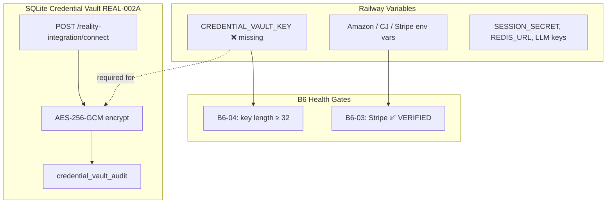

# Executive Audit — B6-04 Production Vault

**Mission:** B6-04  
**Date:** 2026-07-02  
**Authority:** Grand King Executive Directive  
**Audit commit:** `a8945b2` (production baseline post B6-03C recovery)  
**Certification:** ❌ **FAIL**

---

## Executive Summary

EmpireAI has a **real application-level credential vault** (REAL-002A/REAL-004): AES-256-GCM encryption in SQLite, governance audit events, authenticated REST APIs, and per-credential rotation. B6-04 tracking exists in code and is exposed on public health endpoints.

**Production does not satisfy B6-04 today.** Railway reports `CREDENTIAL_VAULT_KEY` **absent** (`present: false`, B6-04 status `PENDING`). The vault encryption key is the sole B6-04 gate — it must be a non-empty string of **32+ characters** injected on Railway.

Additionally, V1 commerce credentials (Amazon, CJ, Stripe) load from **plain Railway environment variables**, not from the encrypted vault. The vault serves connector OAuth/API storage via `/reality-integration/connect`; B6 live-commerce paths bypass it. This split is architectural debt but **not** what blocks B6-04 certification — the blocker is the missing master key on Railway.

**Readiness Score:** **52 / 100**

---

## Certification Result

| Criterion | Result |
|-----------|--------|
| B6-04 gate (`CREDENTIAL_VAULT_KEY` 32+ chars on Railway) | ❌ **Not met** |
| Vault implementation present in codebase | ✅ Yes |
| Production live proof endpoint (B6-04B) | ❌ Not implemented |
| B6-04 certification | ❌ **FAIL** |

---

## Readiness Score Breakdown

| Dimension | Weight | Score | Notes |
|-----------|--------|-------|-------|
| Railway environment variables | 20% | **0%** | `CREDENTIAL_VAULT_KEY` missing on production |
| Secret loading | 15% | **55%** | Dual model: vault for connectors; B6 creds via raw `process.env` |
| Encryption | 20% | **80%** | AES-256-GCM + scrypt key derivation; dev fallback key if unset |
| Rotation capability | 15% | **50%** | Per-credential rotate API; no master-key re-encryption; env secrets manual |
| Access control | 15% | **70%** | Session auth on vault routes; revoke lacks workspace ownership check |
| Audit logging | 15% | **60%** | Store/rotate/verify/revoke logged; `resolveSecret()` reads not audited |
| **Composite** | 100% | **52%** | Implementation ahead of production deployment |

---

## Production Evidence (2026-07-02)

### `GET /health/b6-implementation`

```json
{
  "id": "B6-04",
  "label": "Credential Vault verification",
  "status": "PENDING",
  "configured": false,
  "verified": false,
  "envKeys": ["CREDENTIAL_VAULT_KEY"],
  "detail": "Set CREDENTIAL_VAULT_KEY on Railway"
}
```

B6 progress: **20%** (1/5 verified — B6-03 Stripe only).

### `GET /health/production-deploy`

```json
{
  "credentialReadinessForB6": {
    "amazon": false,
    "cj": true,
    "vault": false
  },
  "secretsChecklist": [
    {
      "key": "CREDENTIAL_VAULT_KEY",
      "present": false,
      "category": "commerce",
      "note": "B6 — required before live commerce production mode"
    }
  ]
}
```

Other production secrets confirmed present: `SESSION_SECRET`, `REDIS_URL`, `DATABASE_PATH`, `CORS_ORIGIN`, LLM keys, CJ key, Stripe keys (B6-03 VERIFIED).

---

## Audit Findings by Requirement

### 1. Railway environment variables

| Variable | Production | B6 item | Required for B6-04 |
|----------|------------|---------|-------------------|
| `CREDENTIAL_VAULT_KEY` | ❌ Absent | B6-04 | **Yes** |
| `SESSION_SECRET` | ✅ Present | Hosting | No (separate) |
| `STRIPE_SECRET_KEY` / `STRIPE_WEBHOOK_SECRET` | ✅ Present | B6-03 | No |
| `CJ_API_KEY` | ✅ Present | B6-02 | No |
| `AMAZON_SP_API_*` | ❌ Absent | B6-01 | No |

**Documentation gaps:**

- `deployment/railway.md` documents `CREDENTIAL_VAULT_KEY` under V1 activation block ✅
- `backend/.env.example` includes `CREDENTIAL_VAULT_KEY=` ✅
- `deployment/railway-production.env.template` **omits** `CREDENTIAL_VAULT_KEY` ⚠️

### 2. Secret loading

| Path | Mechanism | Used by |
|------|-----------|---------|
| Zod-validated `env.ts` | `dotenv` + schema at boot | Core Brain (`SESSION_SECRET`, LLM, Redis, etc.) |
| Raw `process.env` | Direct read, no schema | B6 commerce (Amazon, CJ, Stripe), vault key check |
| SQLite credential vault | Encrypted store + `resolveSecret()` | REAL connector connect flow |

`CREDENTIAL_VAULT_KEY` is **not** in `env.ts` Zod schema — checked ad hoc via `hasCredentialVaultKey()` / `isCredentialVaultVerified()`.

Railway injects secrets at runtime (platform-managed); no secrets in git. ✅

### 3. Encryption

**At rest (vault):**

- Algorithm: **AES-256-GCM**
- Key derivation: `scryptSync(CREDENTIAL_VAULT_KEY, "empire-credential-vault-v1", 32)`
- Storage: `credential_vault.encrypted_payload` in SQLite on Railway volume (`/data`)

**Risk:** If `CREDENTIAL_VAULT_KEY` is unset, `getVaultKey()` falls back to `JWT_SECRET` or hardcoded `"empire-dev-vault-key-not-for-production"`. Production currently has no key set — any vault writes would use the dev fallback until the operator sets a proper key.

**In transit:**

- Railway HTTPS termination ✅
- Redis `rediss://` TLS (Upstash) ✅
- Stripe webhook HMAC verification (B6-03) ✅

**B6 env secrets:** Encrypted by Railway platform at rest; not application-encrypted.

### 4. Rotation capability

| Capability | Status |
|------------|--------|
| Per-credential rotate (`rotateCredential`) | ✅ Implemented |
| 75-day rotation recommendation (governance) | ✅ Implemented |
| OAuth/refresh token 90-day expiry default | ✅ Implemented |
| Revoke credential | ✅ Implemented |
| Master key (`CREDENTIAL_VAULT_KEY`) rotation / re-encrypt | ❌ Not implemented |
| Automated Railway env secret rotation | ❌ Manual operator only |
| B6 Stripe/CJ/Amazon key rotation workflow | ❌ Manual Railway update |

### 5. Access control

| Control | Status |
|---------|--------|
| Vault list/revoke/governance routes require session auth | ✅ |
| Vault list returns metadata/refs only (no plaintext) | ✅ |
| Module permission gating (`reality-integration`) | ✅ |
| Connect/disconnect Brain audit logger | ✅ |
| `/vault/revoke` workspace ownership validation | ⚠️ **Gap** — any authenticated user could revoke any `credentialsRef` if known |
| Public B6 health endpoints expose credential *presence* not values | ✅ |

### 6. Audit logging

| Event | Logged |
|-------|--------|
| Credential stored | ✅ `credential_vault_audit` |
| Rotated | ✅ |
| Verified / expired / audit_check | ✅ |
| Revoked | ✅ |
| Secret decryption (`resolveSecret`) | ❌ Not logged |
| Env var reads (Stripe/CJ/Amazon) | ❌ Not logged (expected) |

Governance summary API: `GET /reality-integration/credential-governance` (authenticated).

---

## B6-04 Code Requirements (Authoritative)

From `b6-credential-implementation.ts`:

```typescript
export function isCredentialVaultVerified(env = process.env): boolean {
  const key = env.CREDENTIAL_VAULT_KEY ?? "";
  return hasNonEmpty(key) && key.length >= 32;
}
```

B6 closes only when B6-01 through B6-05 are all **VERIFIED**. B6-04 requires operator action on Railway — no code deploy needed beyond what is already on `main`.

**No B6-04 live proof endpoint exists** (unlike B6-02B `/health/b6-02-cj-live-auth` and B6-03B `/health/b6-03-stripe-live-auth`). B6-04 verification is env-presence + length only.

---

## Architecture (Current State)



---

## Files Reviewed

| Path | Purpose |
|------|---------|
| `backend/src/orchestration/version-1-activation/b6-credential-implementation.ts` | B6-04 gate definition |
| `backend/src/orchestration/version-1-activation/version-1-activation-config.ts` | `hasCredentialVaultKey()`, V1 activation gates |
| `backend/src/orchestration/version-1-activation/production-infrastructure-readiness.ts` | Secrets checklist, `credentialReadinessForB6.vault` |
| `backend/src/orchestration/version-1-activation/routes/version-1-activation-routes.ts` | Public B6 health endpoints |
| `backend/src/orchestration/reality-integration/repositories/sqlite-credential-vault-repository.ts` | Vault encrypt/decrypt/store/rotate |
| `backend/src/orchestration/reality-integration/services/credential-governance-service.ts` | Audit events, rotation thresholds |
| `backend/src/orchestration/reality-integration/routes/reality-integration-routes.ts` | Authenticated vault/governance APIs |
| `backend/src/orchestration/reality-integration/services/connector-runtime.ts` | Connector cred storage into vault |
| `backend/src/config/env.ts` | Core env loading (vault key not in schema) |
| `backend/.env.example` | Documents `CREDENTIAL_VAULT_KEY` |
| `backend/src/validation/tests/b6-credential-implementation.test.ts` | B6-04 unit tests |
| `deployment/railway.md` | Railway vault key documentation |
| `deployment/railway-production.env.template` | Production env template (vault key missing) |
| `docs/governance/VERSION_1_GO_LIVE_PREPARATION_CHECKLIST.md` | M2 vault key requirement |
| `EMPIREAI_DECISIONS.md` | PDR-004 external secrets manager — pending |
| Production probes | `/health/b6-implementation`, `/health/production-deploy` |

---

## Files Changed

**None.** This mission was audit-only. Certification failure is an **operator configuration gap**, not a missing code feature for the B6-04 gate as currently defined.

Optional non-blocking improvements (not required for current B6-04 definition):

- Add `CREDENTIAL_VAULT_KEY` to `deployment/railway-production.env.template`
- Add B6-04B live vault proof endpoint (encrypt/decrypt round-trip)
- Remove dev fallback vault key in production paths
- Add workspace check on `/vault/revoke`
- Audit `resolveSecret()` access events

---

## Remaining Blockers

### P0 — Blocks B6-04 certification

1. **`CREDENTIAL_VAULT_KEY` not set on Railway** — generate 32+ random characters and inject via Railway Variables. Confirm via `GET /health/b6-implementation` → B6-04 `VERIFIED`.

### P1 — Blocks full B6 closure (beyond B6-04)

2. **B6-01** — Amazon SP-API credentials not on Railway  
3. **B6-02** — CJ configured but not VERIFIED (requires `LIVE_COMMERCE_INTEGRATION_MODE=production` + King approval)  
4. **B6-05** — Commerce adapter connectivity test pending B6-01/B6-02

### P2 — Vault hardening (post-certification)

5. Dev fallback key in `getVaultKey()` when `CREDENTIAL_VAULT_KEY` unset  
6. No master-key rotation / ciphertext re-encryption migration  
7. B6 commerce creds bypass encrypted vault (split secret model)  
8. No audit trail on secret decryption reads  
9. Revoke endpoint missing workspace ownership validation  
10. PDR-004 external secrets manager (HashiCorp/KMS/Doppler) undecided

---

## Recommended Next Mission

**B6-04B — Live Credential Vault Authentication Proof**

Mirror the B6-02B / B6-03B pattern:

1. **Operator:** Set `CREDENTIAL_VAULT_KEY` (32+ chars) on Railway.  
2. **Engineering:** Add `GET /health/b6-04-vault-live-auth` that performs an encrypt → decrypt round-trip using the production key (no secrets returned), confirms governance audit write, and reports `certification: PASS | FAIL`.  
3. **Verify:** Production probe after deploy.

If operator action only (minimal path): set `CREDENTIAL_VAULT_KEY` on Railway and re-run this audit — B6-04 gate would flip to **VERIFIED** without code changes.

**Do not proceed to B6-05** until B6-01/B6-02 production paths are addressed per tracker.

---

## Scope Compliance

- ✅ Audited existing secret-management implementation  
- ✅ Determined B6-04 satisfaction status  
- ✅ Reviewed all six required dimensions  
- ✅ No new features introduced  
- ❌ Did not proceed to B6-05
