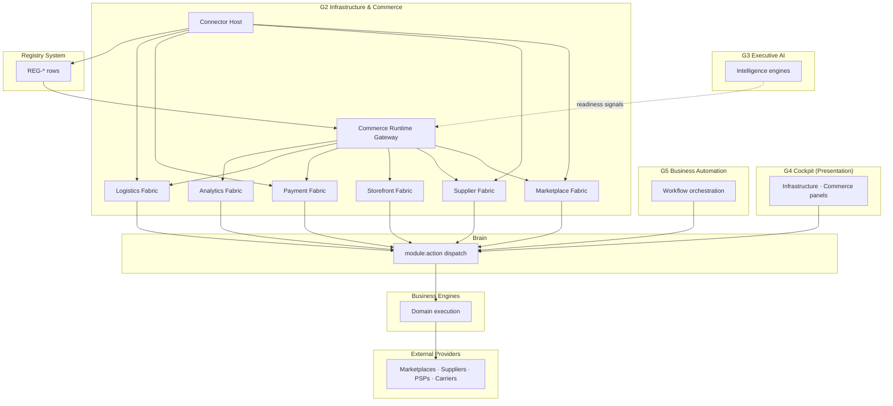
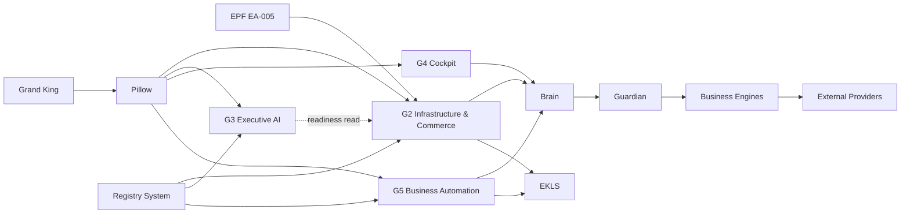

# G2-00 — Infrastructure & Commerce Programme Architecture

**Mission:** G2-00 — Infrastructure & Commerce Programme Architecture  
**Authority:** Grand King · EmpireAI Version 1 · EA-002 Registry Architecture · EA-003 RegistryLoader · EA-005 EPF · Pillow §17 · Commerce Canon (ADR-011) · Commerce OS (ADR-013)  
**Date:** 2026-06-21  
**Status:** **ARCHITECTURE COMPLETE** — specification only; **no runtime implementation**  
**Prerequisites:** Brain · Pillow Layer 1 · EKLS · Registry System (EA-003) · Guardian · GVD module boundaries  
**Amendment policy:** Future G2 evolution **amends this document**; implementation missions (G2-01+) cite this architecture as sole authority

---

## Executive Summary

**Infrastructure & Commerce (G2)** is EmpireAI Version 1’s **canonical programme for external connection fabric and commerce execution infrastructure**. G2 makes the Empire **connectable, activatable, and operable** across marketplaces, suppliers, storefronts, payments, logistics, and analytics — under Pillow governance, through Brain dispatch, configured by Registry System rows, and extended via EPF — **without duplicating intelligence, orchestration, governance, or presentation layers**.

Repository archaeology confirms **no prior G2-xx mission programme existed** (`artifacts/g2-programme-roadmap-status.md`). Scattered runtime modules (`global-commerce/`, `marketplace-connection-engine/`, `supplier-connector-framework/`, `commerce-runtime/`, etc.) represent **partial, pre-programme implementation**. G2-00 **defines the programme** that future missions shall canonicalize — not reimplement ad hoc.

| Subsystem | G2 relationship |
|-----------|-----------------|
| **Registry System (EA-002)** | Source of truth for countries, marketplaces, suppliers, channels, providers, deployment profiles — G2 **consumes**, never owns catalog data |
| **Brain** | Mandatory execution path for every connector operation and commerce infrastructure action |
| **Pillow** | Owns governance, credentials policy, live-commerce approval, and connection trust |
| **EKLS** | Institutional memory for connection health, commerce operations, and integration outcomes — G2 **contributes**, never owns memory |
| **Guardian** | Pre-dispatch safety on every external-facing Brain step |
| **Executive AI Engines (G3)** | Consume commerce readiness and infrastructure signals — G2 **never scores or ranks** |
| **Grand King Cockpit (G4)** | Presents infrastructure health and commerce status — G2 **never owns UI** |
| **Business Automation (G5)** | Orchestrates approved commerce operations via Brain into G2 Business Engine targets — G2 **never owns workflow DAGs** |
| **Business Engines** | Domain execution (list, publish, fulfill, charge) — G2 provides **integration fabric**, engines retain domain logic |
| **EPF (EA-005)** | Registers marketplace, supplier, payment, logistics providers — G2 **consumes** certified plugins |

**Core principle:** G2 **connects · activates · routes · monitors · reports** — it **owns no intelligence scoring**, **no executive presentation**, **no workflow orchestration**, **no governance policy**, and **no canonical registry authoring**.

**Target placement (Pillow §17 extension):**

```
Grand King
    │
EmpireAI
    │
Pillow (governance · credentials · live-commerce approval)
    │
    ├── Registry System (REG-* catalog & deployment profiles)
    ├── Brain (execution dispatch)
    ├── EKLS (operational memory)
    ├── Guardian (safety)
    │
    ├── G2 Infrastructure & Commerce     ← this programme
    │       ├── Connector Fabric
    │       ├── Marketplace Infrastructure
    │       ├── Supplier Infrastructure
    │       ├── Storefront Infrastructure
    │       ├── Payment Integration
    │       ├── Logistics Integration
    │       └── Analytics Integration
    │
    ├── G3 Executive AI Engines (intelligence — consumes G2 signals)
    ├── G4 Grand King Cockpit (presentation — consumes G2 views)
    ├── G5 Business Automation (orchestration — invokes G2 via Brain)
    └── Business Engines (domain execution — registered Brain modules)
```

---

## 0. Nomenclature Disambiguation

The letter **G2** previously appeared in the repository under **non-programme meanings**. G2-00 **supersedes informal usage** for Version 1 mission planning:

| Prior usage | Meaning | G2-00 disposition |
|-------------|---------|-------------------|
| GO-002 gate **G1–G3** bundle | Architecture foundations (inferred middle tier = Brain) | **Distinct** — not this programme |
| OKQA guarantee **G2** | Grand King sole knowledge authority | **Distinct** — governance guarantee only |
| Roadmap **Layer 2 / PEI** | Pillow Executive Intelligence | **Distinct** — PEI programme, not G2 |
| Scattered runtime commerce code | Pre-programme partial implementation | **Archaeological input** — canonicalized by G2-01+ |

**Authoritative G-series ladder after G2-00:**

```
G2-xx  — Infrastructure & Commerce (THIS PROGRAMME)
G3-xx  — Executive AI Engines ✅ CLOSED
G4-xx  — Grand King Cockpit ✅ CLOSED
G5-xx  — Business Automation ✅ CLOSED
```

---

## 1. Infrastructure Philosophy

### 1.1 Purpose

Infrastructure exists because **commerce without reliable connections is impossible**. G3 answers *what markets and products matter*; G4 lets the Grand King *see status*; G5 *orchestrates approved actions*; **G2 ensures those actions can reach external systems safely**.

### 1.2 Design tenets

| # | Tenet | Implication |
|---|-------|-------------|
| IC-1 | **Registry-first** | Every provider, channel, marketplace, and connector resolves from REG-* rows — zero hardcoded countries, platforms, or suppliers in G2 core |
| IC-2 | **Connect, never duplicate** | G2 wraps external APIs via Brain-mediated adapters — it does not reimplement G3 intelligence or G5 orchestration |
| IC-3 | **Pillow-governed credentials** | Secrets, OAuth tokens, and live-commerce activation pass through Pillow credential policy — no env-var sprawl in engines |
| IC-4 | **Brain-only execution** | Every connector call, publish attempt, payment authorization, and tracking query dispatches through Brain (`module:action`) |
| IC-5 | **Plugin-extensible providers** | New marketplaces, suppliers, payment rails register via EPF Layer A + Layer B — G2 core unchanged |
| IC-6 | **Fail closed** | Unconfigured channel, missing credential, or failed health check **blocks** operation — no silent fallback to demo data in live mode |
| IC-7 | **Observable by default** | Connection health, sync status, and integration failures are EKLS-audited and Cockpit-visible |
| IC-8 | **Workspace-isolated** | Credentials and channel bindings are workspace-scoped; cross-workspace commerce requires explicit Pillow approval |
| IC-9 | **Deployment-profile aware** | V1 activation subset resolves from REG-DEPLOYMENT-PROFILE — expansion catalog rows exist but remain inactive until profile enables them |
| IC-10 | **Idempotent integration** | Retries must not double-publish, double-charge, or duplicate irreversible external mutations |

### 1.3 What Infrastructure & Commerce is NOT

- Not an Executive AI Engine (no product scoring, market ranking, or supplier evaluation)
- Not Business Automation (no workflow DAGs, triggers, or approval routing)
- Not Pillow (no executive reasoning or repository mutation authority)
- Not Brain (no tool registry ownership or LLM routing)
- Not EKLS (no canonical memory ownership — contributes operational records only)
- Not Cockpit (no panel business logic — supplies Brain-assembled views only)
- Not Registry System (no catalog authoring — consumes RegistryLoader)
- Not a hardcoding surface (no `if amazon-us then …` in G2 core)

---

## 2. Commerce Philosophy

### 2.1 Purpose

Commerce is the **operational expression of EmpireAI’s revenue mission**. G2 defines the **infrastructure layer** that makes commerce **executable** — connecting discovery (G3) and decision (G4/G5) to **live operations** on marketplaces, storefronts, suppliers, payments, and logistics.

### 2.2 Commerce design tenets

| # | Tenet | Implication |
|---|-------|-------------|
| CM-1 | **Channel-agnostic core** | Marketplace, storefront, and hybrid channels resolve from REG-CHANNEL — core logic is channel-type driven, not platform-named |
| CM-2 | **Readiness before live** | Commerce readiness gates (credentials, policy, Guardian clearance) precede LIVE mode — aligned with B6 / V1 go-live doctrine |
| CM-3 | **Engine delegation** | Product listing, order capture, fulfillment, and payment capture remain **Business Engine responsibilities** — G2 provides routing and health fabric |
| CM-4 | **Revenue loop traceability** | Every commerce operation carries workspace, company, brand, channel, and correlation identifiers for EKLS and automation audit |
| CM-5 | **Separation of catalog and execution** | REG-PRODUCT (workspace catalog) is distinct from REG-MARKETPLACE (platform catalog) — G2 routes between them, never merges ownership |
| CM-6 | **Grand King live gate** | Irreversible live commerce (publish, payout, production storefront) requires Pillow + King approval flags per Commerce Canon |

### 2.3 Commerce OS alignment (ADR-013)

G2 implements the **infrastructure and integration spine** of the Commerce OS blueprint:

```
Discover (G3) → Decide (G4 · Pillow) → Orchestrate (G5) → Connect & Execute (G2 + Business Engines) → Learn (EKLS)
```

G2 **does not** own the Discover or Decide phases.

---

## 3. Programme Ownership

| Domain | Owner | G2 role |
|--------|-------|---------|
| **Programme ownership** | Pillow (`EMPIREAI_PILLOW_CONSTITUTION.md` §17 extension) | G2 is a Pillow-governed programme |
| **Platform catalog** | Registry System (REG-REGION, REG-COUNTRY, REG-MARKETPLACE, REG-SUPPLIER, REG-PROVIDER) | G2 resolves at runtime |
| **Deployment activation** | REG-DEPLOYMENT-PROFILE + Grand King V1 gates | G2 enforces active subset |
| **Operational channels** | REG-CHANNEL | G2 binds credentials and health |
| **Connector execution** | Brain dispatch | G2 constructs requests; Brain routes |
| **Domain operations** | Business Engines | G2 registers engine modules; engines implement |
| **Intelligence inputs** | G3 suite | G2 publishes readiness/health signals only |
| **Automation** | G5 Business Automation | Invokes G2 targets via registry executor refs |
| **Memory & audit** | EKLS under Pillow | G2 writes integration events via gateway |
| **Human intervention** | Grand King via Cockpit | G2 surfaces connection/commerce status |

**Accountability chain:**

```
Grand King (final authority · live commerce approval)
      ↓
Pillow (governance · credentials · objective filter)
      ↓
G2 Infrastructure & Commerce (connection fabric · commerce infrastructure)
      ↓
Brain (execution dispatch)
      ↓
Business Engines + Guardian + External Providers
```

---

## 4. Implementation Boundaries

### 4.1 In scope (G2 programme)

| Capability | Description |
|------------|-------------|
| Connector framework | Canonical adapter lifecycle, health, capability discovery |
| Marketplace infrastructure | Connection, publishing fabric, listing sync orchestration hooks |
| Supplier infrastructure | Supplier connector fabric, catalog sync, fulfillment handoff |
| Storefront infrastructure | Store deployment, domain, theme/code generation hooks |
| Payment integration | Payment provider binding, authorization/capture fabric |
| Logistics integration | Tracking, carrier, fulfillment status fabric |
| Analytics integration | Conversion and commerce telemetry ingestion hooks |
| Commerce runtime gateway | Unified Brain module surface for commerce infrastructure ops |
| Credential governance | Pillow-mediated secret storage references (not raw secret ownership) |
| Registry integration | Canonical G2 resolver over REG-* commerce registries |
| EKLS operational records | Connection events, sync outcomes, integration failures |
| Cockpit data contracts | Infrastructure health and commerce status view payloads |
| EPF commerce plugins | Provider registration pipeline for G2 domain |

### 4.2 Out of scope (owned elsewhere)

| Capability | Owner |
|------------|-------|
| Product/market/supplier **intelligence scoring** | G3 Executive AI Engines |
| Executive dashboards and approval UI | G4 Cockpit |
| Workflow triggers, scheduling, recovery | G5 Business Automation |
| Governance policy and kill switch | Pillow |
| Tool registry and LLM routing | Brain |
| Canonical memory and learning store | EKLS |
| Registry row authoring and validation schemas | Registry System (EA-002 / EA-003) |
| Domain listing algorithms, ad optimization, CRO analysis | Respective Business Engines |
| Constitutional amendments | Grand King separate missions |

### 4.3 Archaeological modules (pre-G2 partial implementation)

The following repository areas contain **partial commerce/infrastructure logic** that G2-01+ missions shall **canonicalize under this architecture** — not replace blindly:

| Area | Path (indicative) | G2 canonicalization role |
|------|-------------------|--------------------------|
| Global commerce registry seed | `runtime/global-commerce/` | Migrate consumption to RegistryLoader-only |
| Commerce infrastructure profiles | `runtime/global-commerce-infrastructure/` | G2 infrastructure readiness resolver |
| Marketplace connection | `orchestration/marketplace-connection-engine/` | G2 marketplace fabric |
| Marketplace infrastructure | `orchestration/marketplace-infrastructure-engine/` | G2 Brain module contract |
| Supplier connectors | `suppliers/supplier-connector-framework/` | G2 supplier fabric |
| Amazon global seller | `runtime/amazon-global-seller/` | Provider-specific engine (EPF Layer B) |
| Marketplace publishing | `runtime/marketplace-publishing/` | Publishing adapter host |
| Commerce runtime | `runtime/commerce-runtime/` | G2 commerce runtime gateway target |
| Storefront assembly | `runtime/storefront-*` | G2 storefront infrastructure |
| Live payment | `validation/tests/live-payment-engine.test.ts` etc. | G2 payment fabric |
| Order / store execution bridges | `order-execution-bridge/`, `store-execution-bridge/` | G2 logistics/order handoff |
| Connector catalog | `connectors/catalog.ts`, `integrations-hub/` | G2 connector registry resolver |
| Channel registry (legacy) | `intelligence/shared/marketplace-channel-registry.ts` | Migrate to REG-CHANNEL via loader |

**Rule:** G2 missions **refactor toward** this architecture — they do not add parallel connector paths.

---

## 5. Commerce Architecture

### 5.1 Layer model



### 5.2 Commerce domains

| Domain | G2 responsibility | Business Engine responsibility |
|--------|--------------------|-----------------------------|
| **Marketplace** | Connection health, publish route, channel binding | Listing content, offer logic, platform API semantics |
| **Supplier** | Connector auth, catalog sync schedule, fulfillment webhook ingress | Supplier SKU mapping, margin rules, stock interpretation |
| **Storefront** | Deployment blueprint binding, domain readiness | Page content, theme assembly, checkout UX |
| **Payment** | PSP connection, webhook verification fabric | Charge logic, refund rules, reconciliation |
| **Logistics** | Carrier tracking fabric, fulfillment status normalization | SLA rules, exception handling |
| **Analytics** | Event ingestion endpoints, pixel/tag binding | Attribution models, reporting semantics |

### 5.3 Commerce readiness chain

```
REG-DEPLOYMENT-PROFILE (V1 active channels)
    → REG-CHANNEL (operational identity)
    → Credential binding (Pillow-governed)
    → Connector health check (G2)
    → Guardian clearance (live mode)
    → Commerce readiness snapshot (G2 → Brain tool)
    → G3 / G4 / G5 consumers
```

---

## 6. Connector Architecture

### 6.1 Connector model

Every external integration is a **Connector** with:

| Field | Source |
|-------|--------|
| `connectorId` | Registry-derived (links to REG-PROVIDER / REG-CHANNEL) |
| `providerKind` | `marketplace` · `supplier` · `payment` · `logistics` · `analytics` · `storefront` · `advertising` |
| `adapterRef` | EPF Layer B runtime plugin or engine module ref |
| `credentialRef` | Pillow-governed secret handle (never inline secret) |
| `healthStatus` | `healthy` · `degraded` · `failed` · `unconfigured` |
| `capabilities` | Declared adapter capabilities (read-only discovery) |
| `workspaceId` | Isolation scope |

### 6.2 Connector lifecycle

```
Discovered (registry row exists)
    → Configured (credential bound)
    → Validated (health check pass)
    → Active (deployment profile enabled)
    → Live (King + Pillow approval for irreversible ops)
    → Suspended (kill switch / health failure)
    → Retired (registry DEPRECATED)
```

### 6.3 Connector host responsibilities

| Responsibility | Owner |
|----------------|-------|
| Resolve connector definition | G2 Connector Host (registry-driven) |
| Validate manifest | EPF + RegistryLoader |
| Store credentials | Pillow credential vault (G2 holds references only) |
| Execute API call | Business Engine via Brain |
| Record outcome | EKLS via Pillow gateway |
| Enforce permissions | Pillow + Guardian + operational access matrix |

**Non-goal:** G2 Connector Host does **not** embed provider SDK calls in programme core — adapters live in engines/plugins.

---

## 7. Marketplace Architecture

### 7.1 Registry chain (mandatory)

```
REG-CHANNEL → REG-COUNTRY → REG-MARKETPLACE → REG-PROVIDER
```

Reference pattern: G3 market discovery consumer (`intelligence-market-discovery.ts`) — G2 **uses the same chain** for operational binding, not discovery scoring.

### 7.2 Marketplace fabric components

| Component | Function |
|-----------|----------|
| **Connection Manager** | OAuth/API key lifecycle, token refresh scheduling |
| **Publish Router** | Maps workspace product → channel publish adapter |
| **Sync Observer** | Listing status, suppression, error normalization |
| **Health Monitor** | Rate limit, quota, API availability |

### 7.3 V1 scope rule

V1 mandatory channels resolve from `docs/governance/V1_MARKETPLACE_CHANNEL_REGISTRY.md` via REG-DEPLOYMENT-PROFILE. Expansion marketplaces in `global-commerce-registry-data.ts` remain **catalog-only** until King approves profile activation.

---

## 8. Supplier Architecture

### 8.1 Supplier model

| Concept | Registry |
|---------|----------|
| Supplier platform | REG-SUPPLIER |
| Operational channel | REG-CHANNEL (supplier-facing) |
| Adapter template | EPF SupplierPlugin |
| Workspace binding | Credential + sync policy row |

### 8.2 Supplier fabric components

| Component | Function |
|-----------|----------|
| **Catalog Sync Scheduler** | Registry-driven poll/webhook ingestion |
| **SKU Mapping Layer** | Normalizes supplier SKU → workspace product ref |
| **Fulfillment Handoff** | Routes order lines to supplier adapter via Brain |
| **Inventory Signal Publisher** | Publishes stock deltas to EKLS + G3 consumers |

---

## 9. Storefront Architecture

### 9.1 Storefront model

Storefronts are **first-class commerce channels** (REG-CHANNEL type `storefront`) distinct from marketplaces.

| Layer | Responsibility |
|-------|----------------|
| **Blueprint** | Registry-defined store template (pages, checkout model) |
| **Assembly** | Business Engine generates artifacts |
| **Deployment** | G2 fabric binds domain, hosting, SSL readiness |
| **Runtime** | Order capture routes to payment + logistics fabric |

### 9.2 G2 boundary

G2 owns **deployment readiness and connection binding** — not page copy, theme design, or merchandising logic.

---

## 10. Payment Integration Architecture

### 10.1 Payment fabric

| Capability | G2 role |
|------------|---------|
| PSP registration | REG-PROVIDER + EPF PaymentPlugin |
| Connection | Credential binding, webhook endpoint registration |
| Authorization fabric | Brain dispatch to payment engine — G2 validates readiness |
| Capture / refund route | Registry policy refs — execution in payment engine |
| Reconciliation hooks | EKLS event stream for financial intelligence (G3-04 consumer) |

### 10.2 Security rule

Payment credentials are **never** logged, echoed in EKLS, or exposed in Cockpit payloads — only credential **handles** and **status** surface.

---

## 11. Logistics Architecture

### 11.1 Logistics fabric

| Capability | G2 role |
|------------|---------|
| Carrier registration | REG-PROVIDER + EPF LogisticsPlugin |
| Tracking normalization | Canonical tracking event schema → EKLS |
| Fulfillment status | Supplier + carrier composite status |
| Exception routing | Brain notification to G5/G4 escalation consumers |

---

## 12. Analytics Integration Architecture

### 12.1 Analytics fabric

| Capability | G2 role |
|------------|---------|
| Tag/pixel binding | REG-CHANNEL analytics extensions |
| Event ingestion | Normalized commerce event envelope |
| Forwarding | Brain dispatch to analytics engine |
| **Non-goal** | Attribution modeling (analytics Business Engine) |

---

## 13. Registry Integration

### 13.1 Primary registries (EA-002)

| Registry | G2 usage |
|----------|----------|
| `REG-REGION` | Geographic grouping for infrastructure profiles |
| `REG-COUNTRY` | Commerce domain activation per country |
| `REG-MARKETPLACE` | Platform catalog |
| `REG-SUPPLIER` | Supplier platform catalog |
| `REG-PROVIDER` | Adapter / API provider identity |
| `REG-CHANNEL` | Operational channel binding |
| `REG-DEPLOYMENT-PROFILE` | V1/V2 activation subset |
| `REG-BUSINESS-RULE` | Commerce policy thresholds (fees, margins) |
| `REG-SCORING-POLICY` | Readiness gate thresholds (consumer only — G2 does not score) |

### 13.2 Proposed G2 extension registries (G2-01+)

| Registry | Purpose |
|----------|---------|
| `REG-COMMERCE-CONNECTOR` | Connector template definitions, capability schemas |
| `REG-COMMERCE-POLICY` | Sync intervals, retry, rate-limit policy |
| `REG-COMMERCE-READINESS` | Readiness checklist bindings per channel type |

**Rule:** New registries follow EA-004 migration standard — no ad hoc JSON in engine folders.

### 13.3 G2 registry resolver pattern

```typescript
// Architectural contract (not implemented in G2-00)
resolveCommerceRegistry(context, registryId, query?) → RegistryDerivedResult
```

All G2 subsystems consume registries through **one resolver** — mirroring G5 `automation-registry-resolver.ts` pattern.

---

## 14. Brain Integration

### 14.1 Module contract

| Field | Value |
|-------|-------|
| `moduleId` | `infrastructure-commerce` (canonical — consolidates scattered module IDs) |
| `dispatchPath` | `POST /brain/dispatch` |
| `authorityLevel` | L1 (read) · L2 (mutate) · L3 (live irreversible) |

### 14.2 Capability categories (future tools)

| Category | Examples |
|----------|----------|
| Connector | `list_connectors`, `health_check`, `bind_credential` |
| Marketplace | `connection_status`, `publish_route_preview` |
| Supplier | `sync_status`, `trigger_catalog_sync` |
| Storefront | `deployment_status`, `domain_readiness` |
| Payment | `psp_status`, `webhook_status` |
| Logistics | `tracking_status`, `fulfillment_summary` |
| Analytics | `ingestion_status` |
| Readiness | `commerce_readiness_snapshot` |

### 14.3 Brain integration rules

| Rule | Enforcement |
|------|-------------|
| All external operations dispatch through Brain | G2 services return dispatch envelopes — no direct HTTP from G2 core |
| Guardian runs pre-dispatch | Mandatory for LIVE mode |
| G5 executor refs point to G2/Engine modules | `REG-AUTOMATION-EXECUTOR` rows — no hardcoded module map |
| G3 reads readiness tools only | No publish/pay capabilities on intelligence modules |

---

## 15. Pillow Governance

### 15.1 Governance surfaces

| Surface | Pillow role |
|---------|-------------|
| Credential storage | Pillow vault — G2 stores handles |
| Live commerce approval | King + Pillow flags before LIVE connector mode |
| Kill switch | Blocks all G2 mutating operations |
| Workspace isolation | Credential and channel bindings scoped |
| Plugin trust | EPF certification required for LIVE adapters |
| Objective filter | Commerce ops must align with active Pillow objectives |

### 15.2 Governance contract

Every G2 mutating operation requires:

```typescript
{
  pillowGovernance: true;  // literal type — required
  actorId: string;
  workspaceId: string;
  correlationId: string;
}
```

Mirrors G5 `pillowGovernance: true` pattern.

---

## 16. EKLS Interaction

### 16.1 EKLS contributions (not ownership)

| Record type | Examples |
|-------------|----------|
| Connection events | `connector_configured`, `health_degraded` |
| Sync outcomes | `catalog_sync_completed`, `publish_failed` |
| Commerce operations | `order_handoff`, `payment_authorized` |
| Integration failures | Normalized error class + provider ref |

### 16.2 EKLS gateway rule

All G2 writes pass through `enforceEklsAccess()` with `consumerChannel: "infrastructure-commerce"` — **never** direct EKLS store mutation.

### 16.3 Proposed EKLS backend registration

| Subsystem ID | Backend role |
|--------------|--------------|
| `commerce_operations` | Operational event history |
| `connector_health` | Connection health timeline |

Registered in EKLS store registry (mirroring G5 `outcome_history` pattern) — **implementation in G2-11+**.

---

## 17. Business Engine Interaction

### 17.1 Engine map (canonical targets)

| Engine domain | Indicative module | G2 fabric relationship |
|---------------|-------------------|------------------------|
| Marketplace | `marketplace-infrastructure-engine` | G2 marketplace fabric → engine |
| Marketplace connection | `marketplace-connection-engine` | Consolidated under G2-03 |
| Supplier | `supplier-intelligence-engine` (intel) vs supplier execution engines | G2 supplier fabric — separate intel (G3) from ops |
| Storefront | `storefront-assembly-engine`, codegen engines | G2 deployment fabric |
| Payment | `live-payment-engine` | G2 payment fabric |
| Logistics | `order-execution-bridge`, CJ fulfillment | G2 logistics fabric |
| Analytics | `analytics-intelligence-engine` | G2 ingestion fabric |

### 17.2 Interaction rule

```
G2 Fabric → Brain dispatch → Business Engine → External API
                ↑
            Guardian
```

G2 **never** calls Business Engine methods directly — Brain is the sole broker (same as G5-04 Execution Broker pattern).

---

## 18. G3 / G4 / G5 Integration Contracts

### 18.1 G3 Executive AI Engines

| Direction | Contract |
|-----------|----------|
| G2 → G3 | Readiness snapshots, connection health, sync freshness metrics |
| G3 → G2 | **No execution commands** — intelligence only |
| Shared | REG-CHANNEL discovery chain (read-only for G3) |

### 18.2 G4 Grand King Cockpit

| Direction | Contract |
|-----------|----------|
| G2 → G4 | `InfrastructureHealthView`, `CommerceStatusView`, connector panels |
| G4 → G2 | **No business logic** — Brain tool load only |
| Placement | Commerce / Infrastructure department panels (future SCR) |

### 18.3 G5 Business Automation

| Direction | Contract |
|-----------|----------|
| G5 → G2 | Executor refs: `marketplace-infrastructure-engine:*`, etc. |
| G2 → G5 | Operational outcomes for EKLS learning (via G5-08 path) |
| Shared | REG-AUTOMATION-EXECUTOR rows for commerce steps |

---

## 19. Security

| Control | Implementation |
|---------|----------------|
| Credential isolation | Pillow vault handles only |
| Permission matrix | Operational access + Brain authority levels |
| Workspace isolation | All bindings workspace-scoped |
| Execution isolation | Brain module boundaries + Guardian |
| Plugin isolation | EPF sandbox + certification gate |
| Registry integrity | EA-003 validation + immutable published rows |
| Audit trail | EKLS for all mutating operations |
| Live mode gate | King approval + Pillow governance |

---

## 20. Permissions

| Actor | L1 (read) | L2 (configure) | L3 (live) |
|-------|-----------|----------------|-----------|
| Grand King | ✅ | ✅ | ✅ |
| Pillow supervisor | ✅ | ✅ | ✅ |
| Workspace admin | ✅ | ✅ (workspace) | 🔒 King gate |
| Business Automation | ✅ (status) | 🔒 | 🔒 (via G5 approval) |
| Executive AI (G3) | ✅ (signals) | 🔒 | 🔒 |
| Uncertified plugin | 🔒 | 🔒 | 🔒 |

---

## 21. Deployment Model

### 21.1 Environments

| Environment | G2 behaviour |
|-------------|--------------|
| `validation` | In-memory / sandbox adapters; no live external calls |
| `sandbox` | Mock or recorded provider responses |
| `live` | Certified adapters + credentials + King approval |

### 21.2 Deployment profile

```
REG-DEPLOYMENT-PROFILE
    ├── activeChannels[]     → REG-CHANNEL ids
    ├── activeSuppliers[]    → REG-SUPPLIER ids
    ├── activeProviders[]    → REG-PROVIDER ids
    └── readinessPolicyRef   → REG-COMMERCE-READINESS (future)
```

### 21.3 V1 production rule

Version 1 live commerce requires:

1. V1 deployment profile active  
2. V1 channel registry King-approved  
3. B6 live commerce probes passing (where applicable)  
4. G2 readiness snapshot `READY`  
5. Pillow live-commerce approval flag  

---

## 22. Extension Model

### 22.1 EPF plugin categories (G2-relevant)

| EPF category | Registry rows | Runtime |
|--------------|---------------|---------|
| MarketplacePlugin | REG-MARKETPLACE, REG-PROVIDER | Listing/sync adapter |
| SupplierPlugin | REG-SUPPLIER, REG-CHANNEL | Catalog/fulfill adapter |
| PaymentPlugin | REG-PROVIDER | PSP adapter |
| LogisticsPlugin | REG-PROVIDER | Carrier adapter |
| StorefrontPlugin | REG-CHANNEL | Hosting/deployment adapter |
| AnalyticsPlugin | REG-CHANNEL extension | Tag/ingestion adapter |

### 22.2 Extension rules

| Rule | Detail |
|------|--------|
| Register, don't patch | No edits to G2 core for new providers |
| Layer A before Layer B | Registry row before LIVE adapter |
| Certification before LIVE | EPF certification gate |
| King gate for irreversible | Publish, charge, production deploy |

---

## 23. Plugin Compatibility

G2 integrates with:

| Programme | Compatibility |
|-----------|---------------|
| **EA-005 EPF** | Primary extension path for providers |
| **G5-09 Automation Plugin Integration** | Commerce executor plugins register as Business Engine adapters |
| **RegistryLoader.registerPlugin()** | Layer A manifest storage (row injection G2-14+) |

G2 Plugin Host (future G2-14) mirrors G5 `AutomationPluginHost` — **consumes EPF, does not own framework**.

---

## 24. Runtime Boundaries

| Boundary | Inside G2 | Outside G2 |
|----------|-----------|------------|
| API call execution | ❌ | Business Engine + certified adapter |
| Intelligence scoring | ❌ | G3 |
| Workflow state | ❌ | G5 |
| UI rendering | ❌ | G4 |
| Governance policy | ❌ | Pillow |
| Registry authoring | ❌ | Registry System |
| LLM routing | ❌ | Brain |
| Long-term memory | ❌ | EKLS |

**G2 runtime packages (future canonical root):**

```
backend/src/orchestration/infrastructure-commerce/   ← proposed G2 module root
    connectors/
    marketplace/
    supplier/
    storefront/
    payment/
    logistics/
    analytics/
    registry/
    governance/
    services/
    tools/
    contracts/
```

Pre-G2 scattered modules migrate incrementally — **no big-bang rewrite**.

---

## 25. Component Boundaries

| Component | Inputs | Outputs | Must not |
|-----------|--------|---------|----------|
| **Connector Host** | REG-PROVIDER, credentials | Health, capabilities | Call external APIs |
| **Commerce Runtime Gateway** | Brain dispatch | Normalized commerce ops | Own workflow state |
| **Marketplace Fabric** | REG-CHANNEL, products | Publish routes, sync jobs | Score products |
| **Supplier Fabric** | REG-SUPPLIER, orders | Sync schedules, handoffs | Evaluate supplier quality |
| **Storefront Fabric** | Blueprints, domains | Deployment status | Generate marketing copy |
| **Payment Fabric** | PSP refs, orders | Auth/capture routes | Store PAN/CVV |
| **Logistics Fabric** | Tracking refs | Normalized events | Own carrier contracts |
| **Analytics Fabric** | Tags, events | Ingestion status | Build dashboards |
| **Registry Resolver** | RegistryLoader | Typed rows | Hardcode catalog |
| **Pillow Governance** | Operation context | Allow/deny | Store secrets |
| **EKLS Recorder** | Events | Audit IDs | Own memory store |

---

## 26. Dependency Graph



**Mission dependency order:**

```
EA-002 / EA-003 (Registry) ─┐
Brain · Pillow L1 · EKLS ───┼──► G2-00 (this doc)
EA-005 EPF ─────────────────┘
         │
         ▼
G2-01 → G2-02 → … → G2-15
         │
         ├──► G3 consumes readiness (parallel OK)
         ├──► G4 consumes views (after G2-13)
         └──► G5 invokes engines (already certified — G2 provides targets)
```

---

## 27. Performance & Scalability Review

*Architecture review only — no optimisation implemented in G2-00.*

| Dimension | Assessment |
|-----------|------------|
| Connector scalability | Stateless Brain dispatch; horizontal scale at worker tier |
| Sync scalability | Registry-driven poll intervals; queue-based sync (G2-03+) |
| Registry scalability | RegistryLoader cache policies (EA-003) — immutable platform snapshot |
| Credential scalability | Pillow vault — external to G2 hot path |
| Multi-workspace | Workspace-scoped bindings; no shared credential pools |
| Provider rate limits | Registry policy refs for backoff — not hardcoded |
| Future extensibility | EPF + REG-* append model supports new countries/platforms without core changes |

---

## 28. Future Compatibility

| Future capability | G2 preparation |
|-------------------|----------------|
| Multi-marketplace expansion | REG-MARKETPLACE append + deployment profile |
| Multi-supplier routing | REG-SUPPLIER + policy rows |
| Enterprise SSO for connectors | REG-PROVIDER auth schema extension |
| Cross-workspace commerce intel | EKLS policy gate — not G2 core |
| AI-assisted connector debugging | Brain tool extension — not G2 intelligence |
| Webhook marketplace | Connector Host ingress normalization |
| Blockchain payment rails | PaymentPlugin + REG-PROVIDER row |

---

## 29. Risks

| ID | Risk | Likelihood | Impact | Mitigation |
|----|------|------------|--------|------------|
| R-G2-01 | Pre-G2 scattered modules duplicate G2 fabric | High | High | G2-01+ canonicalization missions; architecture audit gate |
| R-G2-02 | Hardcoded V1 channels persist despite registry | Medium | High | EA-004 migration; architecture-hardcode-governance audit |
| R-G2-03 | Credential leakage in logs/EKLS | Low | Critical | Pillow vault handles only; G2 contract forbids secret echo |
| R-G2-04 | G2 duplicates G3 supplier/market intelligence | Medium | Medium | Strict ownership matrix; code review |
| R-G2-05 | G2 duplicates G5 orchestration | Medium | Medium | G2 provides fabric only; no workflow engine in G2 |
| R-G2-06 | Uncertified plugin reaches LIVE | Medium | High | EPF certification + Pillow live gate |
| R-G2-07 | RegistryLoader plugin row injection deferred | Medium | Low | G2-14 EPF integration mission |
| R-G2-08 | 103+ legacy runtime modules confuse engine map | High | Medium | Canonical engine map in REG-FEATURE (derived view) |
| R-G2-09 | Amazon-specific logic spreads into G2 core | Medium | High | Provider logic in amazon-global-seller engine only |
| R-G2-10 | Cockpit shows demo data as live | Medium | High | G4 data mode contract; G2 readiness gate |

---

## 30. Non-Goals (G2-00)

| Non-goal | Owner instead |
|----------|---------------|
| Implement G2 runtime code | G2-01+ missions |
| Replace G3 intelligence engines | G3 suite |
| Replace G4 Cockpit | G4 programme |
| Replace G5 automation | G5 programme |
| Replace Pillow governance | Pillow |
| Replace Brain dispatch | Brain |
| Replace EKLS | EKLS |
| Replace Registry System | EA-002 / EA-003 |
| Author V1 business strategy | Grand King |
| Hardcode marketplace/supplier/country lists | REG-* registries |
| Begin PEI / Layer 2 executive intelligence | PEI programme (post-V1) |

---

## 31. G2 Programme Roadmap (Architecture-Derived)

Future implementation missions — **not authorized until G2-00 approval**:

| Mission | Delivers | Depends on |
|---------|----------|------------|
| **G2-00** | This architecture | Brain, Pillow L1, EKLS, EA-002, EA-003 |
| **G2-01** | Commerce registry foundation (`REG-COMMERCE-*` schemas + resolver) | EA-003, G2-00 |
| **G2-02** | Connector framework canonicalization (Connector Host) | G2-01, EPF |
| **G2-03** | Marketplace infrastructure fabric | G2-02, REG-CHANNEL |
| **G2-04** | Supplier connector integration fabric | G2-02, REG-SUPPLIER |
| **G2-05** | Storefront infrastructure fabric | G2-02, REG-CHANNEL |
| **G2-06** | Payment integration fabric | G2-02, REG-PROVIDER |
| **G2-07** | Logistics integration fabric | G2-02, REG-PROVIDER |
| **G2-08** | Analytics integration fabric | G2-02 |
| **G2-09** | Commerce runtime gateway (unified Brain module) | G2-03–G2-08 |
| **G2-10** | Pillow credential & connection governance | G2-02, Pillow |
| **G2-11** | EKLS commerce operations memory | G2-09, EKLS gateway |
| **G2-12** | Brain module contract & tool surface | G2-09, Brain |
| **G2-13** | Cockpit infrastructure & commerce panels | G2-09, G4 shell |
| **G2-14** | EPF commerce provider plugin integration | EA-005, G2-02 |
| **G2-15** | Production readiness & executive audit | G2-01–G2-14 |

**Estimated validation target:** 120+ tests across programme (architecture-derived; not implemented in G2-00).

---

## 32. Repository Consistency

| Reference | Alignment |
|-----------|-----------|
| `artifacts/g2-programme-roadmap-status.md` | G2-00 **defines** the missing G2-xx programme |
| `artifacts/g5-business-automation-architecture.md` | G5 invokes G2 Business Engine targets — no overlap |
| `artifacts/g4-01-grand-king-cockpit-architecture.md` | G4 Commerce/Infrastructure departments consume G2 views |
| `artifacts/ea-002-canonical-registry-architecture.md` | REG-* commerce registries are G2 configuration source |
| `artifacts/ea-005-plugin-framework.md` | EPF is G2 provider extension path |
| `artifacts/architecture-hardcode-governance-audit.md` | G2 missions must eliminate business hardcodes |
| `docs/governance/V1_MARKETPLACE_CHANNEL_REGISTRY.md` | V1 channel activation via deployment profile |
| `EMPIREAI_COMMERCE_CANON.md` | Commerce philosophy alignment |
| `COMMERCE_OS_BLUEPRINT.md` | G2 = Connect & Execute infrastructure spine |

---

## 33. Completion Declaration

**G2-00 is complete.** The Infrastructure & Commerce programme architecture for EmpireAI Version 1 is fully specified. **No runtime code was written. No connectors were created. No implementation missions were started.**

Implementation missions (G2-01+) shall cite this document as the **sole architectural authority** for the G2 programme.

**Stop per mission directive.**

---

*G2-00 Infrastructure & Commerce Programme Architecture · 2026-06-21 · Pillow Architecture · Grand King Authority*
