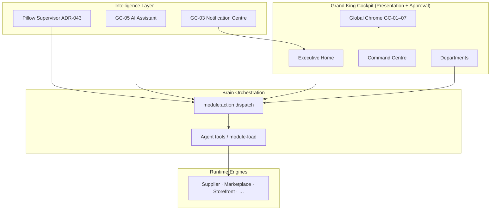
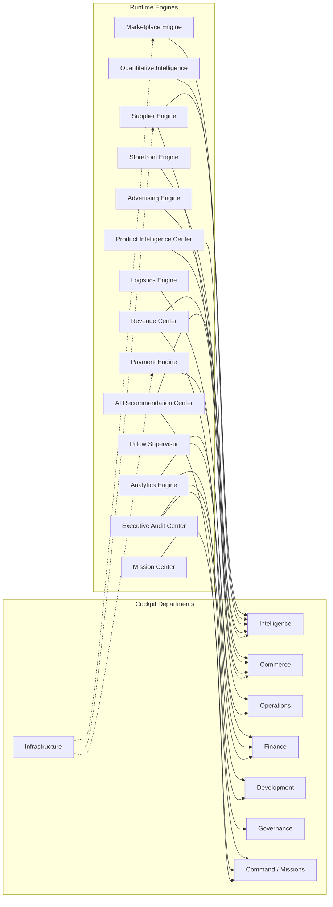

# G4-01 — Grand King Cockpit Architecture

**Mission:** G4-01 — Grand King Cockpit Architecture  
**Authority:** Grand King · GO-002 Phase 4 (King operability) · ADR-047 Executive UX Layer  
**Date:** 2026-06-21  
**Status:** **ARCHITECTURE COMPLETE** — specification only; no frontend implementation  
**Prerequisite:** G4 URL consolidation certified (REAL-124–127) · Infrastructure stable milestone  
**Canonical app:** `empireai-web` · route space `/cockpit/*`

---

## Executive Summary

The **Grand King Cockpit** is EmpireAI’s **Executive Operating System (EOS)** — the founder’s command environment for approving, monitoring, and verifying live commerce. It is not a module registry, not a BI dashboard, and not a replacement for Brain.

G4-01 formalizes the **complete Cockpit architecture** atop the existing REAL-079 information architecture, defining:

- Every **dashboard module** and **Version 1 panel**
- The full **navigation hierarchy** and **screen map**
- **Engine ownership** for all fourteen mandated engine/center provisions
- A **widget inventory** wired to Brain dispatch
- **Future expansion points** without breaking department-first IA

**Metaphor (unchanged):** Cockpit = aircraft carrier bridge · Brain = engine room · Pillow = executive officer · Commerce = flight operations.

**Implementation boundary:** This mission produces architecture only. Frontend pages remain scaffold/placeholder until subsequent wiring missions (GO-002 Phase 4).

---

## 1. Architectural Position

### 1.1 Layer model (ADR-047)



| Layer | Responsibility | Cockpit rule |
|-------|----------------|--------------|
| **Cockpit** | Situational awareness, approval, intervention | Never embed business logic |
| **Pillow (GC + Development)** | Reasoning, recommendations, natural-language command | Does not replace structured panels |
| **Brain dispatch** | Sole data orchestration path for panels | `useBrainModule(module, action)` |
| **Runtime engines** | Domain execution | Never exposed by REAL ID in nav |

### 1.2 Relationship to G4 gate

| Gate | Scope | Status |
|------|-------|--------|
| **G4 (REAL-124–127)** | Single URL space `/cockpit/*`, Vite deprecation, redirects | ✅ Certified |
| **G4-01 (this mission)** | Complete architecture: modules, panels, widgets, engine map | ✅ This document |
| **G4-02+ (future)** | Live Brain wiring per panel, CB-09 closure | Pending |

---

## 2. Information Architecture

**Platform hierarchy:** Grand King → EmpireAI → **Pillow** (sole technical owner) → Grand King Cockpit, Brain, EKLS, Executive AI Engines, Business Engines, Guardian, etc. Brain is **not** a peer of Pillow. Authority: `EMPIREAI_PILLOW_CONSTITUTION.md` §17.

### 2.1 Top-level structure

```
EmpireAI (public)
├── Marketing / Legal
├── Auth (SCR-000)
└── Grand King Cockpit (authenticated EOS)
    ├── Executive Home                    ← default landing · situational awareness
    ├── Command Centre                    ← portfolio · decisions · AI brief
    ├── Mission Centre                    ← action queue · approvals · blockers
    ├── Departments (9)
    │   ├── Intelligence                  ← Product · Supplier · Discovery · Marketplace engines
    │   ├── Commerce                      ← Storefront · Launch · Marketing · Ads engines
    │   ├── Operations                    ← Orders · Logistics · Support
    │   ├── Finance                       ← Revenue · Payment · P&L · Costs
    │   ├── AI Workforce                  ← Agent roster · activity · audit trail
    │   ├── Infrastructure                ← Integrations · Deploy · Health · Admin
    │   ├── Governance                    ← Soul · Decisions · Council · V1 Certification
    │   └── Development                 ← Pillow · Approvals · Inspection · Learning
    └── Global Systems (persistent chrome)
        ├── Executive Command Strip       ← B5–B8 · CRIR · PROOF-001 · OMS
        ├── GC-02 Global Approval Bar
        ├── GC-03 Notification Centre
        ├── GC-05 AI Assistant drawer
        └── GC-07 SUCCESS-001 chip
```

### 2.2 IA principles

1. **Department-first** — founders never see runtime REAL IDs or internal module names in primary nav.
2. **Depth ≤ 3 clicks** — Executive Home → department tab → panel action.
3. **Home ≠ Command** — Home = pulse + triage; Command = portfolio + strategic decisions.
4. **Mission Centre = today’s queue** — blockers, approvals, missions requiring King input.
5. **Composable widgets** — same widget may appear on Home and in a department (single Brain source).
6. **Data mode honesty** — every widget declares `live` | `sandbox` | `demo` (REAL-087 intent).
7. **V1 path only** — Advanced/deep REAL analytics hidden behind “Advanced” affordance (SA-001).

### 2.3 Engine Center provisions (logical modules)

The fourteen mandated provisions are **Engine Centers** — logical ownership domains mapped onto Cockpit departments. They are not separate sidebar entries.

| Engine / Center | Cockpit home | Primary screens | V1 role |
|-----------------|--------------|-----------------|---------|
| **Supplier Engine** | Intelligence → Suppliers | SCR-101 | CJ catalog, health, sourcing |
| **Marketplace Engine** | Intelligence → Marketplace | SCR-103 | amazon-us, amazon-sg, shopee-sg, shopify |
| **Storefront Engine** | Commerce → Store | SCR-200 | Store blueprint, deploy status |
| **Advertising Engine** | Commerce → Ads · Marketing | SCR-202, SCR-203 | Meta ads, campaign readiness |
| **Payment Engine** | Finance → Billing | SCR-402 | Stripe checkout, webhooks, vault |
| **Logistics Engine** | Operations → Fulfillment | SCR-301 | CJ fulfilment, tracking |
| **Analytics Engine** | Finance → Profit · Command | SCR-400, SCR-010 | Conversion, ROAS, KPI strip |
| **Quantitative Intelligence Engine** | Intelligence → Discovery · Products | SCR-100, SCR-102 | Scoring, trends, opportunity quant |
| **Pillow Supervisor** | Development → Pillow + Global | SCR-800, GC-05 | NL command, reasoning audit |
| **Executive Audit Center** | Development → Inspection · Governance → V1 | SCR-802, SCR-704 | ESIS, certification blockers |
| **Mission Center** | Mission Centre · Command | SCR-020, SCR-010 | Mission queue, blockers |
| **AI Recommendation Center** | Command · Intelligence | SCR-010, SCR-100 | Brain recommendations, triage |
| **Revenue Center** | Finance → Profit · Commerce → Launch | SCR-400, SCR-201 | PROOF-001, first-dollar path |
| **Product Intelligence Center** | Intelligence → Products · Commerce → Launch | SCR-100, SCR-201 | PIE, listing packages |

---

## 3. Screen Hierarchy

### 3.1 Screen ID namespace

| Range | Department | Notes |
|-------|------------|-------|
| SCR-000 | Auth | Login / session |
| SCR-001 | Executive | Home |
| SCR-010 | Command | Command Centre |
| SCR-020 | Missions | Mission Centre |
| SCR-1xx | Intelligence | Products · Suppliers · Discovery · Marketplace |
| SCR-2xx | Commerce | Store · Launch · Marketing · Ads · Workspace |
| SCR-3xx | Operations | Orders · Fulfillment · Support |
| SCR-4xx | Finance | Profit · P&L · Billing · Costs |
| SCR-5xx | Workforce | Roster · Activity · Audit |
| SCR-6xx | Infrastructure | Integrations · Deployments · Health · Admin |
| SCR-7xx | Governance | Settings · Soul · Decisions · Council · V1 |
| SCR-8xx | Development | Pillow · Approvals · Inspection · Learning |

**Namespace note (ADR-044):** Cockpit REAL-079 IA ≠ Journey REAL-079 Product Scale Engine. This document uses **SCR-###** screen IDs only.

### 3.2 Screen hierarchy tree

```
SCR-000  Auth
SCR-001  Executive Home
├── SCR-010  Command Centre
│   └── [detail] Company portfolio row expand
├── SCR-020  Mission Centre
│   └── [detail] Mission item expand
├── Intelligence (SCR-1xx)
│   ├── SCR-100  Products          ← Product Intelligence Center
│   ├── SCR-101  Suppliers         ← Supplier Engine
│   ├── SCR-102  Discovery         ← Quantitative Intelligence (discovery)
│   └── SCR-103  Marketplace       ← Marketplace Engine
├── Commerce (SCR-2xx)
│   ├── SCR-200  Store               ← Storefront Engine
│   ├── SCR-201  Launch              ← Revenue + Product Intelligence (launch)
│   ├── SCR-202  Marketing           ← Advertising Engine (organic)
│   ├── SCR-203  Ads                 ← Advertising Engine (paid)
│   └── SCR-204  Workspace           ← Commerce workspace hub
├── Operations (SCR-3xx)
│   ├── SCR-300  Orders
│   ├── SCR-301  Fulfillment         ← Logistics Engine
│   └── SCR-302  Support
├── Finance (SCR-4xx)
│   ├── SCR-400  Profit              ← Revenue Center · Analytics
│   ├── SCR-401  P&L
│   ├── SCR-402  Billing             ← Payment Engine
│   └── SCR-403  Costs
├── Workforce (SCR-5xx)
│   ├── SCR-500  Roster
│   ├── SCR-501  Activity
│   └── SCR-502  Audit               ← Executive Audit (workforce trace)
├── Infrastructure (SCR-6xx)
│   ├── SCR-600  Integrations        ← Provider connectivity (reference live pattern)
│   ├── SCR-601  Deployments
│   ├── SCR-602  Health
│   └── SCR-603  Admin
├── Governance (SCR-7xx)
│   ├── SCR-700  Settings
│   ├── SCR-701  Soul
│   ├── SCR-702  Decisions
│   ├── SCR-703  Council
│   └── SCR-704  V1 Certification    ← Executive Audit Center (blockers)
└── Development (SCR-8xx)
    ├── SCR-800  Pillow              ← Pillow Supervisor
    ├── SCR-801  Approvals
    ├── SCR-802  Inspection          ← Executive Audit Center (ESIS)
    └── SCR-803  Learning
```

---

## 4. Navigation Tree

### 4.1 Primary sidebar (founder view)

```
EMPIREAI COCKPIT                          Route
─────────────────────────────────────────────────────────
◉ Executive Home                          /cockpit
◎ Command Centre                          /cockpit/command
◎ Mission Centre                          /cockpit/missions
─────────────────────────────────────────────────────────
DEPARTMENTS
◎ Intelligence                          /cockpit/intelligence/products
◎ Commerce                              /cockpit/commerce/store
◎ Operations                            /cockpit/operations/orders
◎ Finance                               /cockpit/finance/profit
◎ AI Workforce                          /cockpit/workforce
◎ Infrastructure                        /cockpit/infrastructure/integrations
◎ Governance                            /cockpit/governance/settings
◎ Development                           /cockpit/development/pillow
─────────────────────────────────────────────────────────
⚙ Settings (shortcut)                     /cockpit/governance/settings
```

### 4.2 Department tabs (secondary nav)

| Department | Tab | Route | Screen |
|------------|-----|-------|--------|
| **Intelligence** | Products | `/cockpit/intelligence/products` | SCR-100 |
| | Suppliers | `/cockpit/intelligence/suppliers` | SCR-101 |
| | Discovery | `/cockpit/intelligence/discovery` | SCR-102 |
| | Marketplace | `/cockpit/intelligence/marketplace` | SCR-103 |
| **Commerce** | Store | `/cockpit/commerce/store` | SCR-200 |
| | Launch | `/cockpit/commerce/launch` | SCR-201 |
| | Marketing | `/cockpit/commerce/marketing` | SCR-202 |
| | Ads | `/cockpit/commerce/ads` | SCR-203 |
| | Workspace | `/cockpit/commerce/workspace` | SCR-204 |
| **Operations** | Orders | `/cockpit/operations/orders` | SCR-300 |
| | Fulfillment | `/cockpit/operations/fulfillment` | SCR-301 |
| | Support | `/cockpit/operations/support` | SCR-302 |
| **Finance** | Profit | `/cockpit/finance/profit` | SCR-400 |
| | P&L | `/cockpit/finance/pl` | SCR-401 |
| | Billing | `/cockpit/finance/billing` | SCR-402 |
| | Costs | `/cockpit/finance/costs` | SCR-403 |
| **Workforce** | Roster | `/cockpit/workforce` | SCR-500 |
| | Activity | `/cockpit/workforce/activity` | SCR-501 |
| | Audit | `/cockpit/workforce/audit` | SCR-502 |
| **Infrastructure** | Integrations | `/cockpit/infrastructure/integrations` | SCR-600 |
| | Deployments | `/cockpit/infrastructure/deployments` | SCR-601 |
| | Health | `/cockpit/infrastructure/health` | SCR-602 |
| | Admin | `/cockpit/infrastructure/admin` | SCR-603 |
| **Governance** | Settings | `/cockpit/governance/settings` | SCR-700 |
| | Soul | `/cockpit/governance/soul` | SCR-701 |
| | Decisions | `/cockpit/governance/decisions` | SCR-702 |
| | Council | `/cockpit/governance/council` | SCR-703 |
| | V1 Certification | `/cockpit/governance/v1` | SCR-704 |
| **Development** | Pillow | `/cockpit/development/pillow` | SCR-800 |
| | Approvals | `/cockpit/development/approvals` | SCR-801 |
| | Inspection | `/cockpit/development/inspection` | SCR-802 |
| | Learning | `/cockpit/development/learning` | SCR-803 |

### 4.3 Role matrix

| Surface | Founder | Admin | Operator |
|---------|---------|-------|----------|
| Executive Home | ✓ | ✓ | ✓ |
| Command Centre | ✓ | ✓ | — |
| Mission Centre | ✓ | ✓ | — |
| Finance (all tabs) | ✓ | ✓ | — |
| Workforce | ✓ | ✓ | — |
| Intelligence · Commerce · Operations | ✓ | ✓ | ✓ (read-heavy) |
| Governance · Development | ✓ | ✓ | — |
| Approval actions | ✓ | delegated | — |

---

## 5. Dashboard Layout

### 5.1 Global shell chrome

Every Cockpit screen shares:

```
┌──────────────────────────────────────────────────────────────────────┐
│ TopBar: workspace · search · GC-03 notifications · profile            │
├──────────────────────────────────────────────────────────────────────┤
│ Executive Command Strip: B5–B8 · CRIR · PROOF-001 · OMS · blockers   │
├──────────┬───────────────────────────────────────────────────────────┤
│ Sidebar  │  Page Header (title · breadcrumbs · primary actions)       │
│ (primary │  ─────────────────────────────────────────────────────────  │
│  + tabs) │  Panel grid (responsive 12-col)                            │
│          │  ┌─────────────┐ ┌─────────────┐ ┌─────────────┐          │
│          │  │ Widget      │ │ Widget      │ │ Widget      │          │
│          │  └─────────────┘ └─────────────┘ └─────────────┘          │
│          │  ┌──────────────────────────┐ ┌─────────────┐              │
│          │  │ Wide widget / table      │ │ Side panel  │              │
│          │  └──────────────────────────┘ └─────────────┘              │
├──────────┴───────────────────────────────────────────────────────────┤
│ GC-02 Approval Bar (when pending) · GC-05 AI drawer · GC-07 chip     │
└──────────────────────────────────────────────────────────────────────┘
```

### 5.2 Screen layout templates

| Template | Used by | Layout |
|----------|---------|--------|
| **T-A Executive Pulse** | SCR-001 | KPI strip · 2×2 panel grid · department health row · mission preview |
| **T-B Command Portfolio** | SCR-010 | AI brief · pending decisions · portfolio table · activity feed |
| **T-C Mission Queue** | SCR-020 | Blocker strip · triage columns · full mission queue |
| **T-D Department Hub** | SCR-1xx–4xx tabs | Tab header · primary panel · secondary metrics · action bar |
| **T-E Infrastructure Console** | SCR-6xx | Status cards · integration table · health timeline |
| **T-F Governance Ledger** | SCR-7xx | Policy/decision lists · certification checklist |
| **T-G Development Console** | SCR-8xx | Pillow chat · approval inbox · inspection report |

### 5.3 Executive Home layout (SCR-001)

```
Row 1:  [ W-E-013 KPI Strip ]                    [ W-E-001 Greeting ]
Row 2:  [ W-E-002 Command Snapshot ]  [ W-E-003 Mission Preview ]
Row 3:  [ W-E-004 Portfolio Pulse ]   [ W-E-005 Department Health ]
Row 4:  [ W-E-009 Activity Feed (demo→live) ]    [ Engine quick-links ]
```

### 5.4 V1 commercial spine layout (cross-department)

The Version 1 profit path spans multiple departments. Cockpit exposes it as a **guided spine** on Launch and Profit screens:

```
Product Intelligence → Supplier → Storefront → Marketplace → Advertising
        → Orders → Logistics → Payment → Revenue (PROOF-001)
```

Each step maps to a panel with **gate status** (blocked / ready / live) and deep-link to the owning department tab.

---

## 6. Version 1 Panel Inventory

Every panel required for Version 1 operational activation (GO-002 P3/P4). Panels marked **mandatory** must be Brain-wired before Grand King Live (B7).

### 6.1 Executive & Command

| Panel ID | Panel name | Screen | Engine/Center | V1 | Brain module |
|----------|------------|--------|---------------|-----|--------------|
| P-E-001 | Executive Command Strip | Global | Mission + Audit | **Mandatory** | `cockpit-command:load` |
| P-E-002 | KPI Strip | SCR-001, SCR-010 | Analytics | **Mandatory** | `dashboard:load` |
| P-E-003 | Command Snapshot | SCR-001, SCR-010 | AI Recommendation | **Mandatory** | `cockpit-command:load` |
| P-E-004 | Pending Decisions | SCR-010, SCR-020 | Mission Center | **Mandatory** | `approvals:load` |
| P-E-005 | B6 Credential Status | SCR-001, SCR-704 | Executive Audit | **Mandatory** | `b6-credentials:load` |
| P-E-006 | CRIR Gate Status | SCR-010, SCR-201 | Revenue Center | **Mandatory** | `commerce-readiness:load` |
| P-E-007 | PROOF-001 Tracker | SCR-400, SCR-001 | Revenue Center | **Mandatory** | `proof-001:load` |

### 6.2 Intelligence department

| Panel ID | Panel name | Screen | Engine/Center | V1 | Brain module |
|----------|------------|--------|---------------|-----|--------------|
| P-I-001 | Product Intelligence Overview | SCR-100 | Product Intelligence | **Mandatory** | `product-intelligence:load` |
| P-I-002 | Product Opportunity Queue | SCR-100, SCR-102 | Quantitative Intelligence | **Mandatory** | `product-discovery:load` |
| P-I-003 | Supplier Health (CJ) | SCR-101 | Supplier Engine | **Mandatory** | `cj-dropshipping:load` |
| P-I-004 | Supplier Catalog Sync | SCR-101 | Supplier Engine | **Mandatory** | `supplier-sync:load` |
| P-I-005 | Discovery Scoring Board | SCR-102 | Quantitative Intelligence | Recommended | `product-scoring:load` |
| P-I-006 | Marketplace Channel Registry | SCR-103 | Marketplace Engine | **Mandatory** | `live-commerce:load` |
| P-I-007 | Marketplace Connection Status | SCR-103 | Marketplace Engine | **Mandatory** | `operational-access:load` |
| P-I-008 | Listing Readiness (per channel) | SCR-103, SCR-201 | Marketplace Engine | **Mandatory** | `marketplace-publishing:load` |
| P-I-009 | AI Recommendation Triage | SCR-100, SCR-010 | AI Recommendation | Recommended | `brain-recommendations:load` |

### 6.3 Commerce department

| Panel ID | Panel name | Screen | Engine/Center | V1 | Brain module |
|----------|------------|--------|---------------|-----|--------------|
| P-C-001 | Storefront Blueprint Status | SCR-200 | Storefront Engine | **Mandatory** | `storefront:load` |
| P-C-002 | Store Deployment Pipeline | SCR-200 | Storefront Engine | **Mandatory** | `store-deployment:load` |
| P-C-003 | Launch Control (CRIR) | SCR-201 | Revenue + Product Intel | **Mandatory** | `commerce-launch:load` |
| P-C-004 | Listing Package Builder | SCR-201 | Marketplace Engine | **Mandatory** | `marketplace-publishing:load` |
| P-C-005 | Marketing Campaign Readiness | SCR-202 | Advertising Engine | Optional pre-PROOF | `marketing-campaign:load` |
| P-C-006 | Meta Ads Connector Status | SCR-203 | Advertising Engine | Optional pre-PROOF | `meta-ads:load` |
| P-C-007 | Commerce Workspace Hub | SCR-204 | All commerce engines | **Mandatory** | `commerce-workspace:load` |

### 6.4 Operations department

| Panel ID | Panel name | Screen | Engine/Center | V1 | Brain module |
|----------|------------|--------|---------------|-----|--------------|
| P-O-001 | Order Pipeline | SCR-300 | Analytics + Logistics | **Mandatory** | `orders:load` |
| P-O-002 | Order Detail & Actions | SCR-300 | Mission Center | **Mandatory** | `order-execution:load` |
| P-O-003 | CJ Fulfilment Status | SCR-301 | Logistics Engine | **Mandatory** | `cj-fulfillment:load` |
| P-O-004 | Shipment Tracking | SCR-301 | Logistics Engine | **Mandatory** | `fulfillment:load` |
| P-O-005 | Support Queue | SCR-302 | — | Post-V1 | `support:load` |

### 6.5 Finance department

| Panel ID | Panel name | Screen | Engine/Center | V1 | Brain module |
|----------|------------|--------|---------------|-----|--------------|
| P-F-001 | Profit Dashboard (PROOF-001) | SCR-400 | Revenue Center | **Mandatory** | `profit:load` |
| P-F-002 | Revenue vs Cost Breakdown | SCR-400, SCR-401 | Analytics | **Mandatory** | `financial-forecast:load` |
| P-F-003 | Stripe Billing & Checkout | SCR-402 | Payment Engine | **Mandatory** | `stripe:load` |
| P-F-004 | Webhook Health | SCR-402 | Payment Engine | **Mandatory** | `stripe-health:load` |
| P-F-005 | Credential Vault Status | SCR-402, SCR-704 | Executive Audit | **Mandatory** | `credential-vault:load` |
| P-F-006 | Unit Economics / COGS | SCR-403 | Analytics | Recommended | `costs:load` |

### 6.6 Infrastructure & Governance

| Panel ID | Panel name | Screen | Engine/Center | V1 | Brain module |
|----------|------------|--------|---------------|-----|--------------|
| P-N-001 | Integrations Hub | SCR-600 | All engines | **Mandatory** | `integrations-hub:load` |
| P-N-002 | Provider Credential Matrix | SCR-600 | Marketplace + Supplier + Payment | **Mandatory** | `operational-access:load` |
| P-N-003 | Production Health | SCR-602 | — | **Mandatory** | `production-health:load` |
| P-N-004 | Railway / Vercel Deploy Status | SCR-601 | — | **Mandatory** | `deployments:load` |
| P-G-001 | V1 Certification Blockers | SCR-704 | Executive Audit | **Mandatory** | `v1-certification:load` |
| P-G-002 | Decision Registry | SCR-702 | Governance | Recommended | `decisions:load` |
| P-G-003 | Executive Council Queue | SCR-703 | Mission Center | **Mandatory** | `executive-council:load` |

### 6.7 Development & Mission

| Panel ID | Panel name | Screen | Engine/Center | V1 | Brain module |
|----------|------------|--------|---------------|-----|--------------|
| P-D-001 | Pillow Supervisor Console | SCR-800 | Pillow Supervisor | **Mandatory** | `pillow:load` |
| P-D-002 | Approval Inbox | SCR-801 | Mission Center | **Mandatory** | `approvals:load` |
| P-D-003 | ESIS Inspection Report | SCR-802 | Executive Audit | **Mandatory** | `esis:load` |
| P-D-004 | Executive Audit Artifact Index | SCR-802 | Executive Audit | Recommended | `audit-artifacts:load` |
| P-M-001 | Mission Queue Full | SCR-020 | Mission Center | **Mandatory** | `missions:load` |
| P-M-002 | Mission Blocker Strip | SCR-020 | Mission Center | **Mandatory** | `mission-blockers:load` |
| P-M-003 | Mission Approval Triage | SCR-020 | Mission Center | **Mandatory** | `mission-approvals:load` |

**V1 mandatory panel count:** 42 panels across 7 department groups + global strip.

---

## 7. Widget Inventory

Widgets are the **implementable UI units** registered in `empireai-web/lib/cockpit/widgets/registry.ts`. G4-01 extends the catalogue to cover all V1 panels.

### 7.1 Existing widget registry (baseline)

| Widget ID | Label | Screen(s) | Dept | Data mode | Status |
|-----------|-------|-----------|------|-----------|--------|
| W-E-001 | Grand King Greeting | SCR-001 | executive | live | placeholder |
| W-E-002 | Command Snapshot | SCR-001, SCR-010 | command | live | placeholder |
| W-E-003 | Mission Queue Preview | SCR-001, SCR-020 | missions | live | placeholder |
| W-E-004 | Portfolio Pulse | SCR-001, SCR-010 | command | live | placeholder |
| W-E-005 | Department Health Row | SCR-001 | executive | live | placeholder |
| W-E-006 | AI CEO Briefing | SCR-010 | command | live | placeholder |
| W-E-007 | Pending Decisions | SCR-010, SCR-020 | command | live | placeholder |
| W-E-008 | Company Portfolio Table | SCR-010 | command | live | placeholder |
| W-E-009 | Activity Feed | SCR-001, SCR-010 | command | demo | placeholder |
| W-E-010 | Mission Blocker Strip | SCR-020 | missions | demo | placeholder |
| W-E-011 | Mission Approval Triage | SCR-020 | missions | live | placeholder |
| W-E-012 | Mission Queue Full | SCR-020 | missions | live | placeholder |
| W-E-013 | KPI Strip | SCR-001, SCR-010 | executive | live | placeholder |
| W-C-001 | Commerce Marketing Panel | SCR-202 | commerce | demo | placeholder |
| W-C-002 | Commerce Ads Panel | SCR-203 | commerce | demo | placeholder |
| W-C-003 | Commerce Workspace Panel | SCR-204 | commerce | demo | partial |
| W-I-001 | Intelligence Overview Panel | SCR-100 | intelligence | demo | placeholder |
| W-O-001 | Operations Orders Panel | SCR-300 | operations | sandbox | partial |
| W-F-001 | Finance Dashboard Panel | SCR-400 | finance | demo | placeholder |
| W-W-001 | Workforce Agents Panel | SCR-500 | workforce | demo | placeholder |
| W-N-001 | Infrastructure Integrations Panel | SCR-600 | infrastructure | demo | **reference live pattern** |
| W-G-001 | Governance Policies Panel | SCR-700 | governance | demo | placeholder |
| W-D-001 | Development Pillow Panel | SCR-800 | development | demo | placeholder |

### 7.2 G4-01 widget extensions (to register in wiring phase)

| Widget ID | Maps to panel | Screen | Priority |
|-----------|---------------|--------|----------|
| W-E-014 | Executive Command Strip | Global | P0 |
| W-E-015 | B6 Credential Status | SCR-001, SCR-704 | P0 |
| W-E-016 | PROOF-001 Tracker | SCR-400, SCR-001 | P0 |
| W-E-017 | CRIR Gate Banner | SCR-201, SCR-010 | P0 |
| W-E-018 | V1 Commercial Spine Stepper | SCR-201, SCR-400 | P0 |
| W-I-002 | Product Opportunity Queue | SCR-100, SCR-102 | P0 |
| W-I-003 | Supplier Health (CJ) | SCR-101 | P0 |
| W-I-004 | Marketplace Channel Registry | SCR-103 | P0 |
| W-I-005 | Listing Readiness | SCR-103, SCR-201 | P0 |
| W-I-006 | AI Recommendation Triage | SCR-100, SCR-010 | P1 |
| W-C-004 | Storefront Blueprint Status | SCR-200 | P0 |
| W-C-005 | Launch Control | SCR-201 | P0 |
| W-C-006 | Listing Package Builder | SCR-201 | P0 |
| W-O-002 | CJ Fulfilment Status | SCR-301 | P0 |
| W-O-003 | Shipment Tracking | SCR-301 | P0 |
| W-F-002 | Stripe Billing Panel | SCR-402 | P0 |
| W-F-003 | Webhook Health | SCR-402 | P0 |
| W-F-004 | Vault Status | SCR-402, SCR-704 | P0 |
| W-N-002 | Provider Credential Matrix | SCR-600 | P0 |
| W-N-003 | Production Health | SCR-602 | P0 |
| W-G-002 | V1 Certification Blockers | SCR-704 | P0 |
| W-G-003 | Executive Council Queue | SCR-703 | P0 |
| W-D-002 | ESIS Inspection Report | SCR-802 | P0 |
| W-D-003 | Approval Inbox | SCR-801 | P0 |

### 7.3 Widget composition rules

1. One widget → one Brain `module:action` primary dispatch.
2. Widgets declare `dataMode`; mode badge visible in panel header.
3. Widgets may subscribe to GC-03 events for refresh (no polling unless health panel).
4. Approval-bearing widgets must emit GC-02 compatible approval requests.
5. Placeholder widgets remain in registry until live wiring closes CB-09.

---

## 8. Engine Ownership Map



### 8.1 Engine → backend ownership

| Engine / Center | Primary backend owner | Cockpit widget(s) | V1 provider anchors |
|-----------------|----------------------|-------------------|---------------------|
| **Supplier Engine** | `suppliers/cj-dropshipping`, `supplier-intelligence-engine` | W-I-003, W-O-002 | `cj-dropshipping` |
| **Marketplace Engine** | `reality-integration/live-commerce`, `marketplace-publishing` | W-I-004, W-I-005, W-C-006 | `amazon-us`, `amazon-sg`, `shopee-sg`, `shopify` |
| **Storefront Engine** | `execution/storefront-*`, `store-deployment-pipeline` | W-C-004 | Shopify / Empire store |
| **Advertising Engine** | `execution/meta-ads-connector`, `global-advertising-intelligence` | W-C-001, W-C-002 | `meta-ads` |
| **Payment Engine** | `revenue/live-payment-engine` | W-F-002, W-F-003 | Stripe |
| **Logistics Engine** | `execution/live-cj-fulfillment`, `customer-order-pipeline` | W-O-002, W-O-003 | CJ fulfilment |
| **Analytics Engine** | `analytics-conversion-engine`, `empire-kpi-engine` | W-E-013, W-F-001 | GA4 / pixel (optional) |
| **Quantitative Intelligence** | `commerce-intelligence-core`, `product-scoring` | W-I-002, W-I-006 | Internal scoring |
| **Pillow Supervisor** | `pillow/`, `orchestration/pillow-host` | W-D-001, GC-05 | ADR-043 |
| **Executive Audit Center** | `empire-self-inspection`, governance artifacts | W-D-002, W-G-002 | ESIS, B5–B8 |
| **Mission Center** | `mission-command-engine`, operational command | W-E-010–012, W-M-* | REAL-057 |
| **AI Recommendation Center** | Brain `BrainRecommendation` contract | W-I-006, W-E-006 | Brain dispatch |
| **Revenue Center** | `grand-kings-revenue-engine`, `first-revenue-validation` | W-E-016, W-F-001 | PROOF-001 |
| **Product Intelligence Center** | `product-intelligence-engine`, `product-scout` | W-I-001, W-I-002, W-C-005 | PIE |

### 8.2 Cross-engine coordination points

| Coordination | Cockpit surface | Trigger |
|--------------|-----------------|---------|
| Product → Supplier match | SCR-100 + SCR-101 | CRIR pre-launch |
| Listing → Marketplace publish | SCR-201 + SCR-103 | King approval |
| Order → Fulfilment → Payment | SCR-300 → SCR-301 → SCR-402 | Order event |
| Credential injection → Live mode | SCR-600 + SCR-704 | B6 closure |
| PROOF-001 measurement | SCR-400 + Executive Strip | First profit event |

---

## 9. Dashboard Module Catalogue

Complete module list for the Grand King Cockpit. A **module** is a navigable dashboard unit (screen + panel set).

| Module ID | Module name | Route | Owner dept | Engines served |
|-----------|-------------|-------|------------|----------------|
| MOD-001 | Executive Home | `/cockpit` | executive | Analytics, Mission, Revenue (pulse) |
| MOD-002 | Command Centre | `/cockpit/command` | command | AI Recommendation, Mission, Analytics |
| MOD-003 | Mission Centre | `/cockpit/missions` | missions | Mission Center |
| MOD-010 | Product Intelligence | `/cockpit/intelligence/products` | intelligence | Product Intelligence, Quantitative |
| MOD-011 | Supplier Operations | `/cockpit/intelligence/suppliers` | intelligence | Supplier Engine |
| MOD-012 | Discovery Lab | `/cockpit/intelligence/discovery` | intelligence | Quantitative Intelligence |
| MOD-013 | Marketplace Command | `/cockpit/intelligence/marketplace` | intelligence | Marketplace Engine |
| MOD-020 | Storefront Studio | `/cockpit/commerce/store` | commerce | Storefront Engine |
| MOD-021 | Launch Control | `/cockpit/commerce/launch` | commerce | Revenue, Product Intel, Marketplace |
| MOD-022 | Marketing Hub | `/cockpit/commerce/marketing` | commerce | Advertising Engine |
| MOD-023 | Ads Command | `/cockpit/commerce/ads` | commerce | Advertising Engine |
| MOD-024 | Commerce Workspace | `/cockpit/commerce/workspace` | commerce | All commerce engines |
| MOD-030 | Order Operations | `/cockpit/operations/orders` | operations | Analytics, Mission |
| MOD-031 | Logistics Center | `/cockpit/operations/fulfillment` | operations | Logistics Engine |
| MOD-032 | Customer Support | `/cockpit/operations/support` | operations | — (post-V1) |
| MOD-040 | Revenue Dashboard | `/cockpit/finance/profit` | finance | Revenue Center, Analytics |
| MOD-041 | P&L Ledger | `/cockpit/finance/pl` | finance | Analytics |
| MOD-042 | Payment & Billing | `/cockpit/finance/billing` | finance | Payment Engine |
| MOD-043 | Cost Intelligence | `/cockpit/finance/costs` | finance | Analytics |
| MOD-050 | AI Workforce Roster | `/cockpit/workforce` | workforce | — |
| MOD-051 | Agent Activity | `/cockpit/workforce/activity` | workforce | — |
| MOD-052 | Workforce Audit | `/cockpit/workforce/audit` | workforce | Executive Audit (trace) |
| MOD-060 | Integrations Hub | `/cockpit/infrastructure/integrations` | infrastructure | All engines (connectivity) |
| MOD-061 | Deployment Control | `/cockpit/infrastructure/deployments` | infrastructure | — |
| MOD-062 | System Health | `/cockpit/infrastructure/health` | infrastructure | — |
| MOD-063 | Platform Admin | `/cockpit/infrastructure/admin` | infrastructure | — |
| MOD-070 | Empire Settings | `/cockpit/governance/settings` | governance | — |
| MOD-071 | Soul File | `/cockpit/governance/soul` | governance | — |
| MOD-072 | Decision Registry | `/cockpit/governance/decisions` | governance | — |
| MOD-073 | Executive Council | `/cockpit/governance/council` | governance | Mission Center |
| MOD-074 | V1 Certification | `/cockpit/governance/v1` | governance | Executive Audit |
| MOD-080 | Pillow Supervisor | `/cockpit/development/pillow` | development | Pillow Supervisor |
| MOD-081 | Approval Inbox | `/cockpit/development/approvals` | development | Mission Center |
| MOD-082 | Empire Inspection | `/cockpit/development/inspection` | development | Executive Audit |
| MOD-083 | Executive Learning | `/cockpit/development/learning` | development | — |
| MOD-900 | Executive Command Strip | Global chrome | executive | All (blocker aggregation) |

**Total modules:** 34 navigable dashboard modules + 1 global strip.

---

## 10. Brain Dispatch Contract

Every live panel conforms to:

```
Cockpit Widget  →  useBrainModule(moduleId, action)
                →  backend module-load tool
                →  runtime engine service
                →  CockpitDataMode resolution (live/sandbox/demo)
```

### 10.1 Priority dispatch map (V1 wiring order)

| Priority | Module | Action | Closes |
|----------|--------|--------|--------|
| P0 | `cockpit-command` | `load` | CB-09 partial · King situational awareness |
| P0 | `integrations-hub` | `load` | B6 visibility · reference pattern exists |
| P0 | `b6-credentials` | `load` | B6 tracker in Cockpit |
| P0 | `v1-certification` | `load` | B5–B8 blocker register |
| P0 | `operational-access` | `load` | Marketplace + supplier connectivity |
| P0 | `orders` | `load` | Operations panel |
| P0 | `cj-fulfillment` | `load` | Logistics panel |
| P0 | `stripe` | `load` | Payment panel |
| P0 | `profit` | `load` | PROOF-001 · REAL-127 |
| P0 | `approvals` | `load` | GC-02 · Mission Centre |
| P1 | `product-intelligence` | `load` | Intelligence products |
| P1 | `marketplace-publishing` | `load` | Launch + marketplace |
| P1 | `commerce-launch` | `load` | CRIR gate |
| P1 | `pillow` | `load` | Pillow Supervisor |
| P1 | `esis` | `load` | Executive Audit |
| P2 | `meta-ads` | `load` | Advertising (pre-PROOF optional) |
| P2 | `marketing-campaign` | `load` | Marketing hub |

---

## 11. Future Expansion Points

Architecture reserves extension without IA breakage:

| Expansion | Mechanism | Route pattern | Notes |
|-----------|-----------|---------------|-------|
| **Additional marketplaces** | Channel registry row + SCR-103 panel | Same tab | ADR-052 dimension model |
| **Multi-company portfolio** | Command Centre portfolio table | SCR-010 detail routes | `/cockpit/command/company/[id]` |
| **Advanced REAL analytics** | “Advanced” drawer per department | `/cockpit/*/advanced/*` | SA-001 hide 80+ REALs |
| **World Ops Map** | Optional Command sub-panel | SCR-010 embed | Not V1 full-screen |
| **Risk Command Center** | Governance sub-tab | SCR-705 (reserved) | Post-V1 |
| **CRM Hub** | Operations sub-tab | SCR-303 (reserved) | Post-V1 |
| **Multi-region Amazon** | Marketplace panel rows | SCR-103 | B6-01D foundation wired |
| **Shopee SG live** | Integrations + Marketplace | SCR-600, SCR-103 | B6-01c mission |
| **Shopify provision** | Store + Marketplace | SCR-200, SCR-103 | Architecture-only until King approval |
| **Mobile Cockpit** | `CockpitMobileNav` breakpoints | Same routes | Shell exists |
| **Operator role expansion** | Role matrix in `navigation.ts` | — | Granular panel ACL |
| **Widget marketplace** | Registry plug-in pattern | — | Third-party widgets forbidden V1 |
| **Real-time push** | GC-03 → widget refresh bus | — | WebSocket/SSE Phase 4+ |
| **Audit artifact viewer** | SCR-802 embed | `/cockpit/development/inspection/[artifactId]` | Links to `artifacts/*.md` |

### 11.1 Reserved screen IDs

| Reserved | Purpose |
|----------|---------|
| SCR-105 | Intelligence → Trends (advanced) |
| SCR-205 | Commerce → Catalog manager |
| SCR-304 | Operations → Returns |
| SCR-404 | Finance → Tax nexus |
| SCR-705 | Governance → Risk |
| SCR-804 | Development → Prompt lab |

---

## 12. Alignment & References

| Document | Relationship |
|----------|--------------|
| `docs/architecture/cockpit/COCKPIT_INFORMATION_ARCHITECTURE.md` | REAL-079 IA baseline — **extended by G4-01** |
| `docs/architecture/PROJECT_COCKPIT_SPECIFICATION.md` | REAL-078 department→module mapping |
| `empireai-web/lib/cockpit/navigation.ts` | Canonical nav implementation |
| `empireai-web/lib/cockpit/widgets/registry.ts` | Widget catalogue — **extend per §7.2** |
| `UX_IMPLEMENTATION_CONTRACT.md` | Frozen V1 UX · GC-01–07 |
| `docs/governance/EXECUTIVE_UX_LAYER_ARCHITECTURE.md` | ADR-047 Pillow/GC separation |
| `docs/governance/V1_MARKETPLACE_CHANNEL_REGISTRY.md` | ADR-052 marketplace panels |
| `GO-002_GRAND_KING_OPERATIONAL_MASTER_PLAN.md` | Phase 4 Cockpit wiring · P4 King operability |
| `GO-001_OPERATIONAL_READINESS_REPORT.md` | CB-09 cockpit demo panels blocker |

---

## 13. Certification Statement

| Gate | Result |
|------|--------|
| Complete Cockpit architecture designed | ✅ |
| Every dashboard module defined (34 + global strip) | ✅ |
| Navigation hierarchy specified | ✅ |
| Version 1 panels enumerated (42 mandatory) | ✅ |
| Fourteen engine/center provisions mapped | ✅ |
| Widget inventory + extensions specified | ✅ |
| Engine ownership map documented | ✅ |
| Future expansion points declared | ✅ |
| Frontend page implementation | ❌ Not in scope (by design) |

**Next recommended mission:** G4-02 — Cockpit Live Wiring (P0 dispatch map, CB-09 closure, GO-002 Phase 4).

---

*G4-01 completes the Grand King Cockpit architecture specification. The bridge is designed; wiring the instruments is the next phase.*
