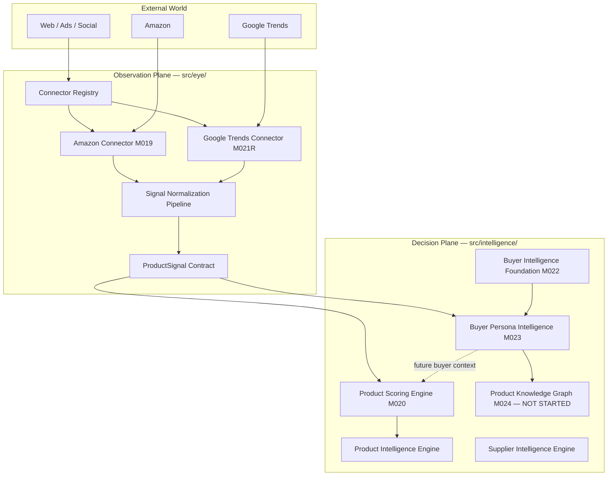
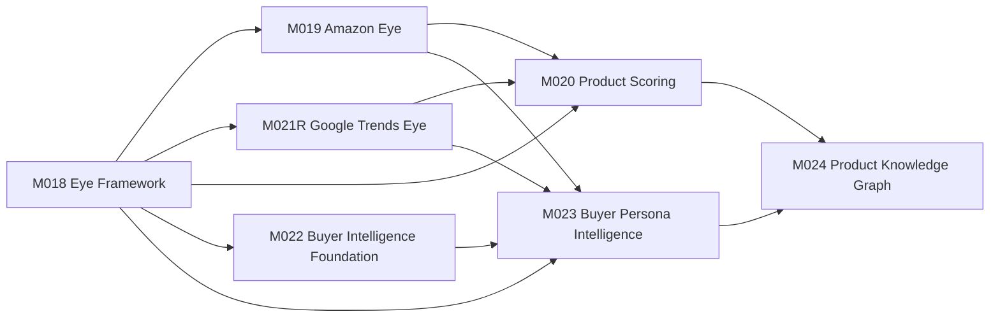

# EmpireAI Mission Control Build Bible

> Generated: 2026-06-23  
> Scope: Missions 018–024 · Backend `@empireai/backend`

---

## Current Architecture Graph



---

## Mission Dependency Graph



**M024 gate:** Product Knowledge Graph requires canonical product identity and buyer/persona contracts (`BuyerSignal`, `BuyerPersonaProfile`, `BuyerIntentContract`) for `targetBuyerPersonaIds`. M024 must not start before M023 completes.

---

## Mission Status (018–024)

| Mission | Name | Status | Locked |
|---------|------|--------|--------|
| M018 | Eye connector framework | **Complete** | Locked |
| M019 | Amazon Eye connector (mock) | **Complete** | Locked |
| M020 | Product Scoring Engine | **Complete** | Locked |
| M021R | Google Trends Eye connector | **Complete** | Locked |
| M022 | Buyer Intelligence foundation | **Complete** | Locked |
| M023 | Buyer Persona Intelligence Engine | **Complete** | Locked |
| M024 | Product Knowledge Graph | **Not Started** | **Locked** (blocked on M023 + canonical product identity) |

---

## Locked Missions

| Mission | Reason |
|---------|--------|
| M018 | Complete — foundation locked |
| M019 | Complete — do not modify Eye connectors |
| M021R | Complete — do not modify Eye connectors |
| M020 | Complete — do not modify Product Scoring |
| M022 | Complete — foundation contracts stable |
| M023 | Complete — persona contracts required by M024 |
| M024 | Blocked until M023 buyer/persona contracts exist and canonical product identity is defined |

---

## Pending Missions

| Mission | Depends On | Safe Next |
|---------|------------|-----------|
| M024 | M020, M023, canonical product identity | **No** — implement after product identity layer is defined |

---

## Next Legal Mission

**M024 — Product Knowledge Graph** is the next mission in sequence, but only after:

1. M023 buyer/persona contracts are complete (**done**)
2. Canonical product identity contract is defined (not yet in repo)
3. `src/intelligence/product-knowledge-graph/` remains absent until explicitly authorized

**Do not implement M024 now.**

---

## M023 Deliverables (Complete)

| Deliverable | Location |
|-------------|----------|
| BuyerPersona contract (`BuyerPersonaProfile`) | `src/intelligence/buyer-intelligence/persona-intelligence/contracts/buyer-persona-profile.ts` |
| BuyerIntent contract (`BuyerIntentContract`) | `src/intelligence/buyer-intelligence/persona-intelligence/contracts/buyer-intent-contract.ts` |
| BuyerSignal contract | `src/intelligence/buyer-intelligence/persona-intelligence/contracts/buyer-signal.ts` |
| BuyerPersonaMapper (deterministic) | `src/intelligence/buyer-intelligence/persona-intelligence/mappers/buyer-persona-mapper.ts` |
| BuyerPersonaRepository + in-memory impl | `repositories/buyer-intelligence-repository.ts` + `repositories/in-memory-buyer-persona-repository.ts` |
| Unit tests | `src/validation/tests/buyer-persona-intelligence.test.ts` |
| Exports | `buyer-intelligence/index.ts`, `intelligence/index.ts` |
| Test registration | `package.json` → `npm test` |

---

## Test Inventory

| Metric | Count |
|--------|------:|
| Test files registered in `npm test` | 19 |
| Total tests (expected after M023) | **151** |
| M023 test file | `buyer-persona-intelligence.test.ts` (6 tests) |
| New M023 tests added | 6 |
| Baseline before M023 | 145 tests / 18 files |

Run verification:

```powershell
cd C:\Users\erlan\OneDrive\Desktop\EmpireAI\backend
$env:REDIS_OPTIONAL="true"
npm run typecheck
npm test
```

---

## Disk Verification Checklist

| Path | Expected | Actual |
|------|----------|--------|
| `src/eye/` | M018–M021R | Present |
| `src/intelligence/product-scoring-engine/` | M020 | Present |
| `src/intelligence/buyer-intelligence/` | M022 + M023 | Present |
| `src/intelligence/product-knowledge-graph/` | Must NOT exist | Absent |
| `src/validation/tests/buyer-persona-intelligence.test.ts` | M023 tests | Present |

---

## Modification Boundaries

**Do not modify without explicit mission authorization:**

- Eye connectors (`src/eye/connectors/`)
- Product Scoring Engine
- Supplier Intelligence Engine
- Brain orchestrator
- M024 Product Knowledge Graph (not started)
