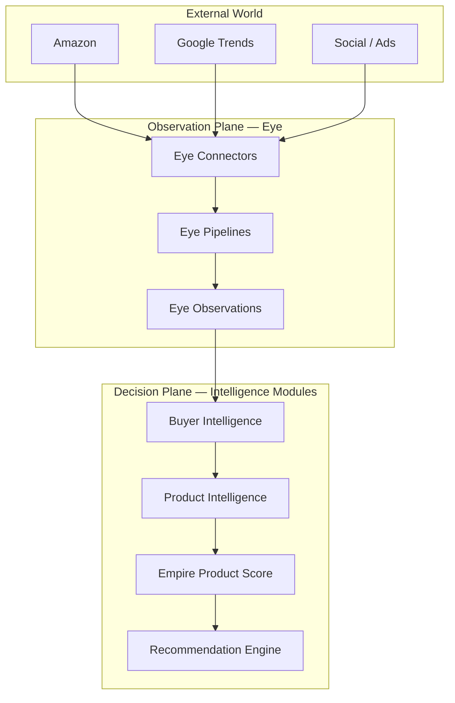
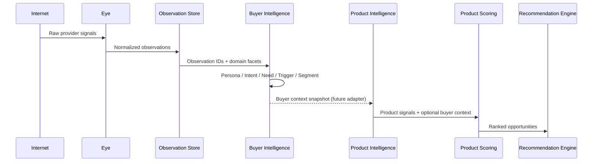

# EMPIREAI Buyer Intelligence Architecture

> **Mission 022 — Foundation Only**  
> **Status:** Types, contracts, schema proposal, and architecture specification (no runtime implementation)  
> **Audience:** Engineering, AI workforce, architecture review  
> **Companion docs:** [EMPIREAI_EYE_ARCHITECTURE.md](../../../../EMPIREAI_EYE_ARCHITECTURE.md) · [EMPIREAI_GLOBAL_PRODUCT_INTELLIGENCE_ARCHITECTURE.md](../../../../EMPIREAI_GLOBAL_PRODUCT_INTELLIGENCE_ARCHITECTURE.md) · Mission 020 Product Scoring (`backend/src/intelligence/product-scoring-engine/`)

---

## 1. Executive Summary

**Buyer Intelligence** is EmpireAI's **buyer-context layer** — it transforms Eye observations into structured understanding of **who** is buying, **what need** they express, **how ready** they are to purchase, and **which audience segments** they belong to.

Buyer Intelligence is **independent** from Product Intelligence. Product Intelligence evaluates product opportunity; Buyer Intelligence evaluates buyer context. The two modules communicate through **typed contracts and optional downstream adapters** — never through shared tables or tight coupling.

**Canonical pipeline position:**

```
Internet → Eye → Observation → Buyer Intelligence → Product Intelligence → Empire Product Score → Recommendation Engine
```

**Mission 022 adds (foundation only):**

- Entity models: `BuyerPersona`, `BuyerIntent`, `NeedCategory`, `PurchaseTrigger`, `AudienceSegment`
- `BuyerIntelligenceModuleContract` aligned with Brain contract patterns (no Brain wiring)
- Repository interface contracts (workspace-scoped CRUD/query)
- Proposed `bi_*` database schema (types + SQL sketch, no migrations)
- Architecture documentation and module README

**Do not modify in Mission 022:** Brain, AI CEO, Eye runtime, Product Scoring, Product Intelligence engine, connectors, or any existing passing tests.

---

## 2. Placement in the EmpireAI Intelligence Stack

### 2.1 Three-plane context

Buyer Intelligence lives on the **Decision Plane**, consuming normalized observations from the **Observation Plane (Eye)** and emitting buyer context for downstream product evaluation.



### 2.2 Data flow (Mission 022 design target)



### 2.3 Independence boundary

| Layer | Responsibility | Buyer Intelligence relationship |
|-------|----------------|--------------------------------|
| Eye | Observe external world | **Upstream** — BI reads observations only |
| Buyer Intelligence | Buyer personas, intent, needs, triggers, segments | **This module** |
| Product Intelligence | Product evaluation, SELL/REVIEW/REJECT | **Downstream consumer** (future) |
| Product Scoring | Empire Score dimensions | **Parallel downstream** — may weight by buyer urgency later |
| Recommendation Engine | Actionable recommendations | **Terminal consumer** |

**Rule:** Buyer Intelligence MUST NOT import from `product-intelligence-engine/` or `product-scoring-engine/`. Product Intelligence MUST NOT own buyer persona tables.

---

## 3. Core Entities

### 3.1 BuyerPersona

Represents a stable buyer archetype within a workspace.

| Field group | Examples |
|-------------|----------|
| Demographics | age range, income level, region, occupation |
| Psychographics | values, interests, lifestyle, buying motivations |
| Pain points | friction, unmet needs, objections |
| Goals | desired outcomes, success criteria |
| Provenance | `sourceObservationIds`, confidence |

### 3.2 BuyerIntent

Captures purchase readiness derived from observation signals.

| Attribute | Values |
|-----------|--------|
| Stage | `awareness` · `consideration` · `purchase` |
| Urgency | `low` · `medium` · `high` · `critical` |
| Signals | typed strength + observation linkage |
| Links | optional `personaId`, `needCategoryIds`, `subjectKey` |

### 3.3 NeedCategory

Classifies **why** a buyer is in-market, linked to Eye domains (`product`, `trend`, `market`, `advertisement`).

Supports hierarchical taxonomy via `parentCategoryId`.

### 3.4 PurchaseTrigger

Events or conditions that elevate purchase likelihood: seasonality, trends, lifecycle moments, competitor moves, price shifts.

### 3.5 AudienceSegment

Rule-based groupings with optional size estimates (`pointEstimate`, `min`/`max`, confidence). Membership stored in `bi_segment_memberships`.

---

## 4. Module Contract

`BuyerIntelligenceModuleContract` mirrors `IntelligenceModuleContract` from `backend/src/brain/contract/intelligence-module.ts`:

- `moduleId`: `buyer-intelligence`
- Capabilities: persona, intent, need-category, trigger, segment, snapshot
- `execute` / `validate` / `health` / `confidenceScore`

**Mission 022:** contract types only — no Brain registry registration, no runtime engine.

---

## 5. Repository Contracts

All repositories are **workspace-scoped**. Every query requires `workspaceId`.

| Repository | Operations |
|------------|------------|
| `BuyerPersonaRepository` | create, getById, getBySlug, update, delete, list |
| `BuyerIntentRepository` | create, getById, update, delete, list, listByObservation |
| `NeedCategoryRepository` | create, getById, getBySlug, update, delete, list |
| `PurchaseTriggerRepository` | create, getById, update, delete, list |
| `AudienceSegmentRepository` | create, getById, getBySlug, update, delete, list |
| `SegmentMembershipRepository` | add, remove, list, countBySegment |

Aggregated surface: `BuyerIntelligenceRepository`.

---

## 6. Proposed Database Schema

Tables use the `bi_` prefix to avoid collision with Product Intelligence tables.

| Table | Purpose |
|-------|---------|
| `bi_buyer_personas` | Persona records |
| `bi_buyer_intents` | Intent detection results |
| `bi_need_categories` | Need taxonomy |
| `bi_purchase_triggers` | Trigger definitions |
| `bi_audience_segments` | Segment definitions |
| `bi_segment_memberships` | Segment membership rows |

### 6.1 SQL sketch

```sql
-- Mission 022 — proposed schema (not applied in this mission)

CREATE TABLE IF NOT EXISTS bi_buyer_personas (
  id TEXT PRIMARY KEY,
  workspace_id TEXT NOT NULL,
  name TEXT NOT NULL,
  slug TEXT NOT NULL,
  description TEXT,
  demographics_json TEXT NOT NULL,
  psychographics_json TEXT NOT NULL,
  pain_points_json TEXT NOT NULL,
  goals_json TEXT NOT NULL,
  source_observation_ids_json TEXT NOT NULL DEFAULT '[]',
  confidence REAL NOT NULL DEFAULT 0,
  tags_json TEXT NOT NULL DEFAULT '[]',
  created_at TEXT NOT NULL,
  updated_at TEXT NOT NULL,
  UNIQUE (workspace_id, slug)
);

CREATE TABLE IF NOT EXISTS bi_buyer_intents (
  id TEXT PRIMARY KEY,
  workspace_id TEXT NOT NULL,
  persona_id TEXT,
  subject_key TEXT,
  stage TEXT NOT NULL CHECK (stage IN ('awareness', 'consideration', 'purchase')),
  urgency TEXT NOT NULL CHECK (urgency IN ('low', 'medium', 'high', 'critical')),
  signals_json TEXT NOT NULL DEFAULT '[]',
  observation_ids_json TEXT NOT NULL DEFAULT '[]',
  need_category_ids_json TEXT NOT NULL DEFAULT '[]',
  confidence REAL NOT NULL DEFAULT 0,
  summary TEXT,
  detected_at TEXT NOT NULL,
  expires_at TEXT,
  created_at TEXT NOT NULL,
  updated_at TEXT NOT NULL,
  FOREIGN KEY (persona_id) REFERENCES bi_buyer_personas(id)
);

CREATE TABLE IF NOT EXISTS bi_need_categories (
  id TEXT PRIMARY KEY,
  workspace_id TEXT NOT NULL,
  slug TEXT NOT NULL,
  label TEXT NOT NULL,
  description TEXT,
  observation_domains_json TEXT NOT NULL,
  parent_category_id TEXT,
  priority TEXT NOT NULL CHECK (priority IN ('low', 'medium', 'high', 'critical')),
  keywords_json TEXT NOT NULL DEFAULT '[]',
  confidence REAL NOT NULL DEFAULT 0,
  created_at TEXT NOT NULL,
  updated_at TEXT NOT NULL,
  UNIQUE (workspace_id, slug),
  FOREIGN KEY (parent_category_id) REFERENCES bi_need_categories(id)
);

CREATE TABLE IF NOT EXISTS bi_purchase_triggers (
  id TEXT PRIMARY KEY,
  workspace_id TEXT NOT NULL,
  name TEXT NOT NULL,
  trigger_type TEXT NOT NULL,
  description TEXT,
  conditions_json TEXT NOT NULL DEFAULT '[]',
  linked_need_category_ids_json TEXT NOT NULL DEFAULT '[]',
  strength REAL NOT NULL DEFAULT 0,
  observation_ids_json TEXT NOT NULL DEFAULT '[]',
  active INTEGER NOT NULL DEFAULT 1,
  window_start TEXT,
  window_end TEXT,
  created_at TEXT NOT NULL,
  updated_at TEXT NOT NULL
);

CREATE TABLE IF NOT EXISTS bi_audience_segments (
  id TEXT PRIMARY KEY,
  workspace_id TEXT NOT NULL,
  name TEXT NOT NULL,
  slug TEXT NOT NULL,
  description TEXT,
  status TEXT NOT NULL CHECK (status IN ('draft', 'active', 'archived')),
  rule_operator TEXT NOT NULL CHECK (rule_operator IN ('and', 'or')),
  rules_json TEXT NOT NULL DEFAULT '[]',
  persona_ids_json TEXT NOT NULL DEFAULT '[]',
  need_category_ids_json TEXT NOT NULL DEFAULT '[]',
  intent_stages_json TEXT NOT NULL DEFAULT '[]',
  size_estimate_json TEXT,
  tags_json TEXT NOT NULL DEFAULT '[]',
  created_at TEXT NOT NULL,
  updated_at TEXT NOT NULL,
  UNIQUE (workspace_id, slug)
);

CREATE TABLE IF NOT EXISTS bi_segment_memberships (
  id TEXT PRIMARY KEY,
  workspace_id TEXT NOT NULL,
  segment_id TEXT NOT NULL,
  member_ref TEXT NOT NULL,
  member_type TEXT NOT NULL CHECK (member_type IN ('persona', 'subject', 'external')),
  matched_at TEXT NOT NULL,
  match_score REAL NOT NULL DEFAULT 0,
  metadata_json TEXT,
  FOREIGN KEY (segment_id) REFERENCES bi_audience_segments(id)
);
```

TypeScript row mappings live in `schema/buyer-intelligence-schema.ts`.

---

## 7. Observation Domain Mapping

Buyer Intelligence primarily consumes Eye domains:

| Eye domain | Buyer Intelligence use |
|------------|------------------------|
| `product` | Product-category need signals, consideration intent |
| `trend` | Rising need categories, seasonal triggers |
| `market` | Audience size, regional segment rules |
| `advertisement` | Awareness-stage intent, creative angle hints |

Domains `supplier` and `risk` remain available for future cross-module context but are not required for Mission 022 foundation.

---

## 8. Future Integration Points (out of scope)

1. **Eye ingestion adapter** — map `EyeRawObservation` → `BuyerIntentSignal`
2. **Product Intelligence adapter** — pass `BuyerContextSnapshot` as optional PIE input
3. **Product Scoring weighting** — urgency-aware demand dimension (Mission 020+ extension)
4. **Brain registration** — implement `BuyerIntelligenceModuleContract` and register module ID
5. **Migrations** — apply `bi_*` tables via Brain database bootstrap

---

## 9. File Map

```
backend/src/intelligence/buyer-intelligence/
  index.ts
  README.md
  contract/buyer-intelligence-contract.ts
  models/
    buyer-persona.ts
    buyer-intent.ts
    need-category.ts
    purchase-trigger.ts
    audience-segment.ts
  repositories/buyer-intelligence-repository.ts
  schema/buyer-intelligence-schema.ts
  docs/BUYER_INTELLIGENCE_ARCHITECTURE.md
```

---

## 10. Verification Checklist (Mission 022)

- [x] No modifications to Brain, Eye runtime, Product Intelligence, Product Scoring, connectors
- [x] Buyer Intelligence module is self-contained under `buyer-intelligence/`
- [x] Contract aligned with Brain patterns without registry wiring
- [x] Proposed schema documented with SQL sketch
- [x] `npm run typecheck` passes
- [x] All existing tests remain green (138+)
