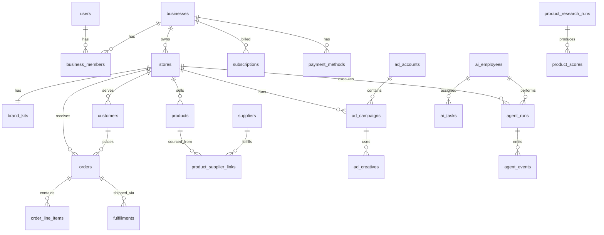

# Database Schema — EmpireAI Commerce

**Document type:** Database specification  
**Product:** EmpireAI Commerce  
**Version:** 1.0  
**Status:** Draft  
**Audience:** Engineering, data, and platform teams  
**Database engine:** PostgreSQL 15+  
**Companion docs:** [SYSTEM_ARCHITECTURE.md](./SYSTEM_ARCHITECTURE.md) · [AI_EMPLOYEES.md](./AI_EMPLOYEES.md) · [PRODUCT_INTELLIGENCE_ENGINE.md](./PRODUCT_INTELLIGENCE_ENGINE.md)

---

## Executive Summary

This document defines the complete relational schema for EmpireAI Commerce. All application data lives in **PostgreSQL**, scoped by **business** (tenant) and **store**. External system identifiers (Shopify, Stripe, Meta, suppliers) are stored as reference fields with EmpireAI UUIDs as internal primary keys.

**Tenancy model:** `User` → `Business` → `Store` → all operational entities.

**Out of scope for PostgreSQL:** Session tokens (Redis), job queues (Redis), binary files (object storage — metadata in `assets`).

---

## Conventions

| Convention | Rule |
|------------|------|
| Primary keys | UUID v4 (`id`) on all tables unless noted |
| Timestamps | `created_at`, `updated_at` (UTC) on all mutable tables |
| Soft delete | `deleted_at` nullable timestamp where noted |
| Tenancy | `business_id` and/or `store_id` on all tenant-scoped rows |
| Money | `NUMERIC(12,2)` stored in major currency units; `currency_code` ISO 4217 |
| Enums | Documented as allowed values; implemented as PostgreSQL ENUM or CHECK |
| JSON | `metadata` JSONB for extensibility; not for core query fields |
| Encryption | `*_encrypted` suffix for fields encrypted at application layer |
| External IDs | `{provider}_id` or `external_id` + `external_provider` |

---

## Entity Relationship Overview

```
users ──────┬──── business_members ──── businesses ──── stores ───┬── products
            │                                                    ├── orders ─── customers
            oauth_accounts                                         ├── ad_campaigns
                                                                 ├── agent_runs / ai_tasks
                                                                 ├── integration_connections
                                                                 └── metrics_*

suppliers ──── supplier_skus ──── product_supplier_links ──── products

subscriptions / payments / invoices ──── businesses
notifications / audit_logs ──── users, businesses, stores
ai_employees (reference catalog) ──── agent_runs, ai_tasks, agent_events
```

---

## Table Index

| Domain | Tables |
|--------|--------|
| **Users** | `users`, `oauth_accounts`, `business_members` |
| **Businesses** | `businesses` |
| **Stores** | `stores`, `brand_kits` |
| **Products** | `products`, `product_research_runs`, `product_scores`, `assets` |
| **Suppliers** | `suppliers`, `store_supplier_connections`, `product_supplier_links` |
| **Orders** | `orders`, `order_line_items`, `fulfillments`, `refunds` |
| **Customers** | `customers` |
| **Advertising** | `ad_accounts`, `ad_campaigns`, `ad_creatives`, `ad_insights_daily` |
| **AI employees** | `ai_employees`, `agent_runs`, `agent_events` |
| **Tasks** | `ai_tasks` |
| **Payments** | `payment_methods`, `payments`, `invoices`, `ad_spend_ledger` |
| **Subscriptions** | `subscription_plans`, `subscriptions` |
| **Analytics** | `analytics_events`, `metrics_hourly`, `metrics_daily` |
| **Notifications** | `notifications`, `notification_preferences` |
| **Audit logs** | `audit_logs`, `webhook_events` |
| **Integrations** | `integration_connections` |

**Total:** 38 tables

---

## 1. Users

### `users`

**Purpose:** Founders and platform operators who authenticate into EmpireAI Commerce.

| Field | Type | Description |
|-------|------|-------------|
| `id` | UUID | Primary key |
| `email` | String (255) | Unique, normalized lowercase |
| `email_verified_at` | Timestamp | Null until verified |
| `password_hash` | String | Null if OAuth-only |
| `full_name` | String (255) | Display name |
| `avatar_url` | String | Optional profile image URL |
| `timezone` | String (64) | IANA timezone; default UTC |
| `locale` | String (10) | e.g., `en-US` |
| `status` | Enum | `active`, `suspended`, `deleted` |
| `last_login_at` | Timestamp | Last successful authentication |
| `created_at` | Timestamp | Row creation |
| `updated_at` | Timestamp | Last update |
| `deleted_at` | Timestamp | Soft delete |

**Relationships:**

| Related table | Relationship |
|---------------|--------------|
| `oauth_accounts` | One user → many OAuth providers |
| `business_members` | One user → many businesses |
| `notifications` | One user → many notifications |
| `notification_preferences` | One user → one preferences row per business |
| `audit_logs` | One user → many audit entries (as actor) |

---

### `oauth_accounts`

**Purpose:** Links users to Google, Apple, or other OAuth identity providers.

| Field | Type | Description |
|-------|------|-------------|
| `id` | UUID | Primary key |
| `user_id` | UUID | FK → `users.id` |
| `provider` | Enum | `google`, `apple` |
| `provider_user_id` | String | External subject ID |
| `provider_email` | String | Email from provider |
| `access_token_encrypted` | Text | Encrypted; refreshed by backend |
| `refresh_token_encrypted` | Text | Encrypted; nullable |
| `expires_at` | Timestamp | Token expiry |
| `created_at` | Timestamp | |
| `updated_at` | Timestamp | |

**Relationships:**

| Related table | Relationship |
|---------------|--------------|
| `users` | Many oauth_accounts → one user |

**Constraints:** Unique (`provider`, `provider_user_id`).

---

### `business_members`

**Purpose:** Associates users with businesses and defines their role (v1: owner only; extensible for teams).

| Field | Type | Description |
|-------|------|-------------|
| `id` | UUID | Primary key |
| `business_id` | UUID | FK → `businesses.id` |
| `user_id` | UUID | FK → `users.id` |
| `role` | Enum | `owner`, `admin`, `viewer` (v1 default: `owner`) |
| `invited_at` | Timestamp | |
| `accepted_at` | Timestamp | Null until accepted |
| `created_at` | Timestamp | |
| `updated_at` | Timestamp | |

**Relationships:**

| Related table | Relationship |
|---------------|--------------|
| `businesses` | Many members → one business |
| `users` | Many memberships → one user |

**Constraints:** Unique (`business_id`, `user_id`).

---

## 2. Businesses

### `businesses`

**Purpose:** Top-level tenant container. One founder business may own one or more stores (v1: one store per business).

| Field | Type | Description |
|-------|------|-------------|
| `id` | UUID | Primary key |
| `name` | String (255) | Business display name |
| `slug` | String (64) | Unique URL-safe identifier |
| `stripe_customer_id` | String | Stripe Customer ID |
| `plan_id` | UUID | FK → `subscription_plans.id`; current plan |
| `status` | Enum | `active`, `past_due`, `suspended`, `closed` |
| `billing_email` | String | May differ from user email |
| `metadata` | JSONB | Extensibility |
| `created_at` | Timestamp | |
| `updated_at` | Timestamp | |
| `deleted_at` | Timestamp | Soft delete |

**Relationships:**

| Related table | Relationship |
|---------------|--------------|
| `business_members` | One business → many members |
| `stores` | One business → many stores |
| `subscriptions` | One business → many subscription records (history) |
| `payment_methods` | One business → many payment methods |
| `payments` | One business → many payments |
| `invoices` | One business → many invoices |
| `notification_preferences` | One business → many preference rows |

---

## 3. Stores

### `stores`

**Purpose:** A single AI-operated dropshipping store. Central entity for catalog, orders, ads, and integrations.

| Field | Type | Description |
|-------|------|-------------|
| `id` | UUID | Primary key |
| `business_id` | UUID | FK → `businesses.id` |
| `name` | String (255) | Store display name |
| `slug` | String (64) | Unique; used in subdomain |
| `category` | String (128) | Founder-selected product category |
| `category_taxonomy_id` | String | Internal category mapping |
| `status` | Enum | `draft`, `building`, `launch_ready`, `live`, `paused`, `closed` |
| `journey_state` | Enum | Setup state machine value (see FOUNDER_EXPERIENCE) |
| `shopify_store_id` | String | Shopify shop ID |
| `shopify_domain` | String | e.g., `{slug}.myshopify.com` |
| `storefront_url` | String | Public customer URL |
| `daily_ad_budget` | Numeric | Founder-set cap in store currency |
| `currency_code` | String (3) | Default `USD` |
| `sell_region` | String (2) | Primary ISO country code |
| `published_at` | Timestamp | When store went live |
| `paused_at` | Timestamp | When store was paused |
| `created_at` | Timestamp | |
| `updated_at` | Timestamp | |
| `deleted_at` | Timestamp | |

**Relationships:**

| Related table | Relationship |
|---------------|--------------|
| `businesses` | Many stores → one business |
| `brand_kits` | One store → one brand_kit |
| `products` | One store → many products |
| `orders` | One store → many orders |
| `customers` | One store → many customers |
| `integration_connections` | One store → many integrations |
| `ad_accounts` | One store → many ad accounts |
| `ad_campaigns` | One store → many campaigns |
| `agent_runs` | One store → many agent runs |
| `ai_tasks` | One store → many tasks |
| `metrics_daily` | One store → many daily metric rows |
| `product_research_runs` | One store → many research runs |

---

### `brand_kits`

**Purpose:** Locked brand identity generated during setup (name styling, colors, voice).

| Field | Type | Description |
|-------|------|-------------|
| `id` | UUID | Primary key |
| `store_id` | UUID | FK → `stores.id`; unique |
| `primary_color` | String (7) | Hex |
| `accent_color` | String (7) | Hex |
| `font_family` | String (64) | |
| `voice_traits` | JSONB | Array of trait strings |
| `tagline` | String (255) | |
| `logo_asset_id` | UUID | FK → `assets.id`; nullable |
| `direction_index` | Integer | Which AI direction was chosen (0–2) |
| `locked_at` | Timestamp | When founder confirmed brand |
| `created_at` | Timestamp | |
| `updated_at` | Timestamp | |

**Relationships:**

| Related table | Relationship |
|---------------|--------------|
| `stores` | One brand_kit → one store |
| `assets` | Optional logo asset |

---

## 4. Products

### `products`

**Purpose:** Catalog items offered on the store, synced to Shopify and linked to suppliers.

| Field | Type | Description |
|-------|------|-------------|
| `id` | UUID | Primary key |
| `store_id` | UUID | FK → `stores.id` |
| `title` | String (512) | Customer-facing title |
| `slug` | String (255) | URL slug |
| `description_short` | Text | Collection/cart copy |
| `description_long` | Text | Product page body |
| `status` | Enum | `draft`, `active`, `paused`, `archived` |
| `shopify_product_id` | String | External Shopify product ID |
| `recommended_price` | Numeric | PIE-suggested retail price |
| `compare_at_price` | Numeric | Optional strike-through price |
| `cost_price` | Numeric | Supplier unit cost |
| `shipping_cost_est` | Numeric | Estimated shipping to sell region |
| `profit_per_sale_est` | Numeric | Cached estimate at selection |
| `currency_code` | String (3) | |
| `is_hero` | Boolean | Featured on homepage |
| `is_top_pick` | Boolean | AI Top Pick at selection |
| `selection_rank` | Integer | Rank at time of founder selection |
| `primary_image_asset_id` | UUID | FK → `assets.id` |
| `metadata` | JSONB | SEO title, meta description, bullets |
| `selected_at` | Timestamp | When founder included in catalog |
| `created_at` | Timestamp | |
| `updated_at` | Timestamp | |
| `deleted_at` | Timestamp | |

**Relationships:**

| Related table | Relationship |
|---------------|--------------|
| `stores` | Many products → one store |
| `product_scores` | One product → one score snapshot |
| `product_supplier_links` | One product → one or more supplier links |
| `order_line_items` | One product → many line items |
| `ad_creatives` | One product → many creatives |
| `assets` | One product → many gallery assets |

---

### `product_research_runs`

**Purpose:** Immutable snapshot of a Product Intelligence Engine (PIE) execution for a store.

| Field | Type | Description |
|-------|------|-------------|
| `id` | UUID | Primary key |
| `store_id` | UUID | FK → `stores.id` |
| `category` | String (128) | Category searched |
| `status` | Enum | `running`, `completed`, `failed`, `fallback` |
| `candidates_analyzed` | Integer | Count scanned |
| `candidates_returned` | Integer | Count in shortlist |
| `duration_ms` | Integer | Pipeline runtime |
| `pie_version` | String (16) | Scoring model version |
| `error_message` | Text | Null on success |
| `completed_at` | Timestamp | |
| `created_at` | Timestamp | |

**Relationships:**

| Related table | Relationship |
|---------------|--------------|
| `stores` | Many runs → one store |
| `product_scores` | One run → many product scores |
| `agent_runs` | Optional link via metadata |

---

### `product_scores`

**Purpose:** PIE scoring breakdown per product candidate, preserved for Intelligence dashboard transparency.

| Field | Type | Description |
|-------|------|-------------|
| `id` | UUID | Primary key |
| `research_run_id` | UUID | FK → `product_research_runs.id` |
| `product_id` | UUID | FK → `products.id`; nullable if not selected |
| `supplier_sku_ref` | String | External SKU at research time |
| `title_at_research` | String (512) | Snapshot title |
| `rank` | Integer | Final rank in shortlist |
| `product_score` | Numeric (5,2) | Composite 0–100 |
| `confidence_tier` | Integer | 1–5 bars |
| `demand_score` | Numeric | Sub-score |
| `trend_score` | Numeric | Sub-score |
| `profit_score` | Numeric | Sub-score |
| `ad_potential_score` | Numeric | Sub-score |
| `competition_score` | Numeric | Sub-score |
| `seasonal_score` | Numeric | Sub-score |
| `supplier_score` | Numeric | Sub-score |
| `risk_score` | Numeric | Sub-score |
| `demand_level` | Enum | `high`, `medium`, `low` |
| `demand_rationale` | Text | Plain-language reason |
| `trend_rationale` | Text | |
| `why_this_product` | Text | Composite rationale |
| `seasonal_note` | Text | Nullable |
| `recommended_price` | Numeric | At research time |
| `estimated_profit` | Numeric | At research time |
| `was_selected` | Boolean | Founder selected this SKU |
| `created_at` | Timestamp | Immutable |

**Relationships:**

| Related table | Relationship |
|---------------|--------------|
| `product_research_runs` | Many scores → one run |
| `products` | Optional link after selection |

---

### `assets`

**Purpose:** Metadata for files stored in object storage (images, creatives, exports).

| Field | Type | Description |
|-------|------|-------------|
| `id` | UUID | Primary key |
| `store_id` | UUID | FK → `stores.id` |
| `asset_type` | Enum | `product_image`, `brand_logo`, `ad_creative`, `export`, `other` |
| `storage_key` | String (512) | S3 object key |
| `cdn_url` | String (1024) | Public URL if applicable |
| `mime_type` | String (64) | |
| `file_size_bytes` | Integer | |
| `width` | Integer | Nullable |
| `height` | Integer | Nullable |
| `alt_text` | String (512) | |
| `source` | Enum | `supplier`, `ai_generated`, `uploaded` |
| `created_at` | Timestamp | |

**Relationships:**

| Related table | Relationship |
|---------------|--------------|
| `stores` | Many assets → one store |
| `products` | Referenced as primary or gallery |
| `brand_kits` | Referenced as logo |
| `ad_creatives` | Referenced as creative media |

---

## 5. Suppliers

### `suppliers`

**Purpose:** Master registry of dropship supplier platforms (CJ, Spocket-class, etc.).

| Field | Type | Description |
|-------|------|-------------|
| `id` | UUID | Primary key |
| `name` | String (255) | Display name |
| `slug` | String (64) | Unique: `cj`, `zendrop`, etc. |
| `platform_type` | Enum | `api`, `manual`, `middleware` |
| `default_avg_ship_days_min` | Integer | Platform baseline |
| `default_avg_ship_days_max` | Integer | |
| `reliability_score` | Numeric (5,2) | Platform-wide score |
| `status` | Enum | `active`, `degraded`, `disabled` |
| `metadata` | JSONB | API version, docs link |
| `created_at` | Timestamp | |
| `updated_at` | Timestamp | |

**Relationships:**

| Related table | Relationship |
|---------------|--------------|
| `store_supplier_connections` | One supplier → many store connections |
| `product_supplier_links` | One supplier → many product links |

---

### `store_supplier_connections`

**Purpose:** Per-store supplier integration health and credentials.

| Field | Type | Description |
|-------|------|-------------|
| `id` | UUID | Primary key |
| `store_id` | UUID | FK → `stores.id` |
| `supplier_id` | UUID | FK → `suppliers.id` |
| `integration_connection_id` | UUID | FK → `integration_connections.id` |
| `connection_status` | Enum | `connected`, `degraded`, `disconnected`, `auto_recovered` |
| `orders_fulfilled_30d` | Integer | Rolling count |
| `issues_30d` | Integer | Alert count |
| `avg_ship_days` | Numeric | Store-specific rolling avg |
| `last_health_check_at` | Timestamp | |
| `created_at` | Timestamp | |
| `updated_at` | Timestamp | |

**Relationships:**

| Related table | Relationship |
|---------------|--------------|
| `stores` | Many connections → one store |
| `suppliers` | Many connections → one supplier |
| `integration_connections` | One connection record → one integration |
| `product_supplier_links` | One store connection → many product links |

**Constraints:** Unique (`store_id`, `supplier_id`).

---

### `product_supplier_links`

**Purpose:** Maps a store product to a supplier SKU for fulfillment and cost tracking.

| Field | Type | Description |
|-------|------|-------------|
| `id` | UUID | Primary key |
| `product_id` | UUID | FK → `products.id` |
| `supplier_id` | UUID | FK → `suppliers.id` |
| `store_supplier_connection_id` | UUID | FK → `store_supplier_connections.id` |
| `supplier_sku` | String (255) | External SKU |
| `supplier_product_id` | String | External product ID |
| `unit_cost` | Numeric | Current cost |
| `shipping_cost` | Numeric | To primary sell region |
| `stock_status` | Enum | `in_stock`, `low`, `out_of_stock`, `discontinued` |
| `is_primary` | Boolean | Active fulfillment source |
| `last_verified_at` | Timestamp | |
| `created_at` | Timestamp | |
| `updated_at` | Timestamp | |

**Relationships:**

| Related table | Relationship |
|---------------|--------------|
| `products` | Many links → one product (one primary) |
| `suppliers` | Many links → one supplier |
| `fulfillments` | Link referenced at fulfillment time |

---

## 6. Customers

### `customers`

**Purpose:** End customers who purchase from the Shopify storefront. PII scoped and masked in list views.

| Field | Type | Description |
|-------|------|-------------|
| `id` | UUID | Primary key |
| `store_id` | UUID | FK → `stores.id` |
| `shopify_customer_id` | String | External ID |
| `email` | String (255) | |
| `email_hash` | String | Hashed for lookup without exposing raw |
| `full_name` | String (255) | |
| `country_code` | String (2) | Shipping country |
| `region` | String (128) | State/province; nullable |
| `orders_count` | Integer | Denormalized |
| `total_spent` | Numeric | Denormalized |
| `first_order_at` | Timestamp | |
| `last_order_at` | Timestamp | |
| `created_at` | Timestamp | |
| `updated_at` | Timestamp | |

**Relationships:**

| Related table | Relationship |
|---------------|--------------|
| `stores` | Many customers → one store |
| `orders` | One customer → many orders |

**Constraints:** Unique (`store_id`, `shopify_customer_id`).

---

## 7. Orders

### `orders`

**Purpose:** Orders captured from Shopify, used for fulfillment, profit, and dashboard display.

| Field | Type | Description |
|-------|------|-------------|
| `id` | UUID | Primary key |
| `store_id` | UUID | FK → `stores.id` |
| `customer_id` | UUID | FK → `customers.id`; nullable for guest |
| `order_number` | String (32) | Human-readable; e.g., `#1042` |
| `shopify_order_id` | String | External ID |
| `status` | Enum | `pending`, `paid`, `processing`, `shipped`, `delivered`, `cancelled`, `refunded` |
| `financial_status` | Enum | `pending`, `paid`, `partially_refunded`, `refunded` |
| `fulfillment_status` | Enum | `unfulfilled`, `partial`, `fulfilled` |
| `subtotal` | Numeric | |
| `shipping_total` | Numeric | Charged to customer |
| `tax_total` | Numeric | |
| `discount_total` | Numeric | |
| `total` | Numeric | Gross order total |
| `currency_code` | String (3) | |
| `estimated_profit` | Numeric | Calculated at order time |
| `estimated_cogs` | Numeric | Product + ship cost |
| `shipping_country` | String (2) | |
| `placed_at` | Timestamp | Customer purchase time |
| `created_at` | Timestamp | Sync time |
| `updated_at` | Timestamp | |

**Relationships:**

| Related table | Relationship |
|---------------|--------------|
| `stores` | Many orders → one store |
| `customers` | Many orders → one customer |
| `order_line_items` | One order → many line items |
| `fulfillments` | One order → many fulfillments |
| `refunds` | One order → many refunds |
| `ai_tasks` | Optional fulfillment tasks |

**Constraints:** Unique (`store_id`, `shopify_order_id`).

---

### `order_line_items`

**Purpose:** Individual products within an order.

| Field | Type | Description |
|-------|------|-------------|
| `id` | UUID | Primary key |
| `order_id` | UUID | FK → `orders.id` |
| `product_id` | UUID | FK → `products.id`; nullable if delisted |
| `shopify_line_item_id` | String | External ID |
| `title` | String (512) | Snapshot at order time |
| `sku` | String (128) | |
| `quantity` | Integer | |
| `unit_price` | Numeric | |
| `line_total` | Numeric | |
| `unit_cost` | Numeric | COGS snapshot |
| `line_profit_est` | Numeric | |
| `created_at` | Timestamp | |

**Relationships:**

| Related table | Relationship |
|---------------|--------------|
| `orders` | Many line items → one order |
| `products` | Many line items → one product |

---

### `fulfillments`

**Purpose:** Supplier fulfillment attempts and shipment tracking.

| Field | Type | Description |
|-------|------|-------------|
| `id` | UUID | Primary key |
| `order_id` | UUID | FK → `orders.id` |
| `product_supplier_link_id` | UUID | FK → `product_supplier_links.id` |
| `supplier_id` | UUID | FK → `suppliers.id` |
| `status` | Enum | `pending`, `submitted`, `shipped`, `delivered`, `failed` |
| `supplier_order_id` | String | External fulfillment reference |
| `tracking_number` | String (128) | |
| `tracking_url` | String (1024) | |
| `carrier` | String (128) | |
| `shopify_fulfillment_id` | String | After sync back to Shopify |
| `submitted_at` | Timestamp | |
| `shipped_at` | Timestamp | |
| `delivered_at` | Timestamp | |
| `failure_reason` | Text | |
| `created_at` | Timestamp | |
| `updated_at` | Timestamp | |

**Relationships:**

| Related table | Relationship |
|---------------|--------------|
| `orders` | Many fulfillments → one order |
| `product_supplier_links` | Many fulfillments → one link |
| `suppliers` | Many fulfillments → one supplier |

---

### `refunds`

**Purpose:** Refund records initiated by Support AI or founder approval.

| Field | Type | Description |
|-------|------|-------------|
| `id` | UUID | Primary key |
| `order_id` | UUID | FK → `orders.id` |
| `amount` | Numeric | Refund amount |
| `currency_code` | String (3) | |
| `reason` | String (255) | |
| `status` | Enum | `pending`, `approved`, `processed`, `rejected` |
| `initiated_by` | Enum | `support_ai`, `founder`, `system` |
| `approved_by_user_id` | UUID | FK → `users.id`; nullable |
| `shopify_refund_id` | String | External ID |
| `processed_at` | Timestamp | |
| `created_at` | Timestamp | |

**Relationships:**

| Related table | Relationship |
|---------------|--------------|
| `orders` | Many refunds → one order |
| `users` | Optional approver |

---

## 8. Advertising Campaigns

### `ad_accounts`

**Purpose:** Connected advertising platform accounts per store (Meta, Google, TikTok).

| Field | Type | Description |
|-------|------|-------------|
| `id` | UUID | Primary key |
| `store_id` | UUID | FK → `stores.id` |
| `platform` | Enum | `meta`, `google`, `tiktok` |
| `external_account_id` | String | Platform ad account ID |
| `account_name` | String (255) | |
| `integration_connection_id` | UUID | FK → `integration_connections.id` |
| `status` | Enum | `active`, `paused`, `error`, `disconnected` |
| `currency_code` | String (3) | |
| `daily_budget_share_pct` | Numeric | % of founder daily cap |
| `last_synced_at` | Timestamp | |
| `created_at` | Timestamp | |
| `updated_at` | Timestamp | |

**Relationships:**

| Related table | Relationship |
|---------------|--------------|
| `stores` | Many ad accounts → one store |
| `integration_connections` | One ad account → one OAuth connection |
| `ad_campaigns` | One ad account → many campaigns |
| `ad_insights_daily` | One ad account → many insight rows |

**Constraints:** Unique (`store_id`, `platform`, `external_account_id`).

---

### `ad_campaigns`

**Purpose:** Advertising campaigns created and managed by Advertising AI.

| Field | Type | Description |
|-------|------|-------------|
| `id` | UUID | Primary key |
| `store_id` | UUID | FK → `stores.id` |
| `ad_account_id` | UUID | FK → `ad_accounts.id` |
| `platform` | Enum | `meta`, `google`, `tiktok` |
| `external_campaign_id` | String | Platform campaign ID |
| `name` | String (255) | |
| `objective` | Enum | `conversions`, `traffic`, `sales` |
| `status` | Enum | `draft`, `active`, `paused`, `ended`, `error` |
| `daily_budget` | Numeric | Platform-level budget |
| `lifetime_budget` | Numeric | Nullable |
| `start_at` | Timestamp | |
| `end_at` | Timestamp | Nullable |
| `created_by_agent_run_id` | UUID | FK → `agent_runs.id` |
| `created_at` | Timestamp | |
| `updated_at` | Timestamp | |

**Relationships:**

| Related table | Relationship |
|---------------|--------------|
| `stores` | Many campaigns → one store |
| `ad_accounts` | Many campaigns → one ad account |
| `ad_creatives` | One campaign → many creatives |
| `ad_insights_daily` | One campaign → many insight rows |
| `agent_runs` | Created by agent run |

---

### `ad_creatives`

**Purpose:** Ad creative assets and copy deployed to platforms.

| Field | Type | Description |
|-------|------|-------------|
| `id` | UUID | Primary key |
| `store_id` | UUID | FK → `stores.id` |
| `campaign_id` | UUID | FK → `ad_campaigns.id` |
| `product_id` | UUID | FK → `products.id`; nullable |
| `asset_id` | UUID | FK → `assets.id` |
| `platform` | Enum | `meta`, `google`, `tiktok` |
| `external_creative_id` | String | Platform ID |
| `format` | Enum | `square`, `vertical`, `landscape`, `responsive` |
| `headline` | String (255) | |
| `primary_text` | Text | |
| `call_to_action` | String (64) | |
| `destination_url` | String (1024) | |
| `status` | Enum | `active`, `paused`, `rejected`, `fatigued` |
| `ctr` | Numeric | Cached latest |
| `conversions` | Integer | Cached latest |
| `created_at` | Timestamp | |
| `updated_at` | Timestamp | |

**Relationships:**

| Related table | Relationship |
|---------------|--------------|
| `ad_campaigns` | Many creatives → one campaign |
| `products` | Optional product association |
| `assets` | Creative media file |

---

### `ad_insights_daily`

**Purpose:** Daily aggregated performance metrics per campaign or account.

| Field | Type | Description |
|-------|------|-------------|
| `id` | UUID | Primary key |
| `store_id` | UUID | FK → `stores.id` |
| `ad_account_id` | UUID | FK → `ad_accounts.id` |
| `campaign_id` | UUID | FK → `ad_campaigns.id`; nullable for account rollup |
| `platform` | Enum | `meta`, `google`, `tiktok` |
| `date` | Date | Metric date |
| `impressions` | Integer | |
| `clicks` | Integer | |
| `spend` | Numeric | |
| `conversions` | Integer | |
| `conversion_value` | Numeric | Revenue attributed |
| `ctr` | Numeric | |
| `cpc` | Numeric | |
| `roas` | Numeric | |
| `currency_code` | String (3) | |
| `created_at` | Timestamp | |

**Relationships:**

| Related table | Relationship |
|---------------|--------------|
| `stores` | Many rows → one store |
| `ad_accounts` | Many rows → one account |
| `ad_campaigns` | Optional campaign granularity |

**Constraints:** Unique (`campaign_id`, `date`) or (`ad_account_id`, `date`) where campaign null.

---

## 9. AI Employees

### `ai_employees`

**Purpose:** Reference catalog of the eight AI employees (not tenant-specific). Defines slug, role, and display metadata for dashboard.

| Field | Type | Description |
|-------|------|-------------|
| `id` | UUID | Primary key |
| `slug` | String (32) | Unique: `avery`, `blake`, `quinn`, etc. |
| `display_name` | String (64) | e.g., Avery, Morgan |
| `role_title` | String (128) | e.g., CEO AI, Product Research AI |
| `description` | Text | Responsibilities summary |
| `avatar_asset_key` | String | Static avatar reference |
| `sort_order` | Integer | Dashboard roster order |
| `is_active` | Boolean | |
| `created_at` | Timestamp | |
| `updated_at` | Timestamp | |

**Relationships:**

| Related table | Relationship |
|---------------|--------------|
| `agent_runs` | One employee → many runs |
| `ai_tasks` | One employee → many tasks |
| `agent_events` | One employee → many events |

**Seed data:** 8 rows per AI_EMPLOYEES.md (Avery, Blake, Quinn, Morgan, Reese, Taylor, Sam, Jordan).

---

### `agent_runs`

**Purpose:** A single execution of an AI employee workflow (setup pipeline, daily optimization, etc.).

| Field | Type | Description |
|-------|------|-------------|
| `id` | UUID | Primary key |
| `store_id` | UUID | FK → `stores.id` |
| `ai_employee_id` | UUID | FK → `ai_employees.id` |
| `workflow_name` | String (128) | e.g., `pie_research`, `store_build`, `ad_launch` |
| `status` | Enum | `queued`, `running`, `completed`, `failed`, `cancelled` |
| `trigger_type` | Enum | `founder_action`, `webhook`, `cron`, `agent_event` |
| `trigger_ref` | String | ID of triggering entity |
| `started_at` | Timestamp | |
| `completed_at` | Timestamp | |
| `duration_ms` | Integer | |
| `error_message` | Text | |
| `input_summary` | JSONB | Redacted input snapshot |
| `output_summary` | JSONB | Result snapshot |
| `created_at` | Timestamp | |

**Relationships:**

| Related table | Relationship |
|---------------|--------------|
| `stores` | Many runs → one store |
| `ai_employees` | Many runs → one employee |
| `agent_events` | One run → many events |
| `ai_tasks` | One run → many tasks |
| `tool_invocations` | Via agent_events or separate if needed |

---

### `agent_events`

**Purpose:** Individual actions taken by AI employees, powering the AI Team activity feed.

| Field | Type | Description |
|-------|------|-------------|
| `id` | UUID | Primary key |
| `store_id` | UUID | FK → `stores.id` |
| `agent_run_id` | UUID | FK → `agent_runs.id`; nullable for standalone |
| `ai_employee_id` | UUID | FK → `ai_employees.id` |
| `event_type` | Enum | `created`, `updated`, `paused`, `swapped`, `connected`, `optimized`, `escalated` |
| `action_description` | Text | Plain-language feed text |
| `entity_type` | String (64) | `product`, `order`, `campaign`, `supplier`, etc. |
| `entity_id` | UUID | Polymorphic reference |
| `outcome_metric` | String (128) | e.g., "CTR +12%" |
| `metadata` | JSONB | Before/after, tool name |
| `occurred_at` | Timestamp | |
| `created_at` | Timestamp | |

**Relationships:**

| Related table | Relationship |
|---------------|--------------|
| `stores` | Many events → one store |
| `agent_runs` | Many events → one run |
| `ai_employees` | Many events → one employee |

---

## 10. Tasks

### `ai_tasks`

**Purpose:** Discrete work items assigned to AI employees—queued, in progress, or awaiting founder approval.

| Field | Type | Description |
|-------|------|-------------|
| `id` | UUID | Primary key |
| `store_id` | UUID | FK → `stores.id` |
| `ai_employee_id` | UUID | FK → `ai_employees.id` |
| `agent_run_id` | UUID | FK → `agent_runs.id`; nullable |
| `task_type` | String (128) | e.g., `fulfill_order`, `swap_supplier`, `pause_ad` |
| `title` | String (255) | Short description |
| `status` | Enum | `pending`, `running`, `completed`, `failed`, `awaiting_approval`, `cancelled` |
| `priority` | Enum | `low`, `normal`, `high`, `critical` |
| `approval_level` | Enum | `L0`, `L1`, `L2`, `L3`, `L4` per AI_EMPLOYEES |
| `requires_founder_approval` | Boolean | |
| `approved_by_user_id` | UUID | FK → `users.id`; nullable |
| `approved_at` | Timestamp | |
| `entity_type` | String (64) | Related object type |
| `entity_id` | UUID | Related object ID |
| `due_at` | Timestamp | Nullable |
| `started_at` | Timestamp | |
| `completed_at` | Timestamp | |
| `failure_reason` | Text | |
| `result_summary` | Text | |
| `created_at` | Timestamp | |
| `updated_at` | Timestamp | |

**Relationships:**

| Related table | Relationship |
|---------------|--------------|
| `stores` | Many tasks → one store |
| `ai_employees` | Many tasks → one assignee |
| `agent_runs` | Optional parent run |
| `users` | Optional approver |
| Polymorphic | `entity_type` + `entity_id` → orders, products, campaigns, etc. |

---

## 11. Payments

### `payment_methods`

**Purpose:** Founder's payment methods on file (via Stripe).

| Field | Type | Description |
|-------|------|-------------|
| `id` | UUID | Primary key |
| `business_id` | UUID | FK → `businesses.id` |
| `stripe_payment_method_id` | String | Stripe PM ID |
| `type` | Enum | `card`, `bank_account` |
| `card_brand` | String (32) | e.g., `visa` |
| `card_last4` | String (4) | |
| `card_exp_month` | Integer | |
| `card_exp_year` | Integer | |
| `is_default` | Boolean | |
| `status` | Enum | `active`, `expired`, `failed` |
| `created_at` | Timestamp | |
| `updated_at` | Timestamp | |

**Relationships:**

| Related table | Relationship |
|---------------|--------------|
| `businesses` | Many payment methods → one business |
| `payments` | One method → many payments |

---

### `payments`

**Purpose:** Individual charge records—platform fees, ad spend pass-through, one-time charges.

| Field | Type | Description |
|-------|------|-------------|
| `id` | UUID | Primary key |
| `business_id` | UUID | FK → `businesses.id` |
| `store_id` | UUID | FK → `stores.id`; nullable for business-level |
| `payment_method_id` | UUID | FK → `payment_methods.id` |
| `invoice_id` | UUID | FK → `invoices.id`; nullable |
| `stripe_payment_intent_id` | String | |
| `payment_type` | Enum | `subscription`, `ad_spend`, `one_time`, `refund_reversal` |
| `amount` | Numeric | |
| `currency_code` | String (3) | |
| `status` | Enum | `pending`, `succeeded`, `failed`, `refunded` |
| `failure_code` | String | Stripe failure code |
| `description` | String (255) | |
| `paid_at` | Timestamp | |
| `created_at` | Timestamp | |
| `updated_at` | Timestamp | |

**Relationships:**

| Related table | Relationship |
|---------------|--------------|
| `businesses` | Many payments → one business |
| `stores` | Optional store scope |
| `payment_methods` | Many payments → one method |
| `invoices` | Many payments → one invoice |
| `ad_spend_ledger` | Ledger entries may reference payment |

---

### `invoices`

**Purpose:** Monthly or event-driven invoices for founder billing.

| Field | Type | Description |
|-------|------|-------------|
| `id` | UUID | Primary key |
| `business_id` | UUID | FK → `businesses.id` |
| `stripe_invoice_id` | String | |
| `invoice_number` | String (32) | Human-readable |
| `status` | Enum | `draft`, `open`, `paid`, `void`, `uncollectible` |
| `subtotal` | Numeric | |
| `tax` | Numeric | |
| `total` | Numeric | |
| `currency_code` | String (3) | |
| `period_start` | Date | |
| `period_end` | Date | |
| `line_items_summary` | JSONB | Platform fee, ad spend breakdown |
| `pdf_url` | String | |
| `due_at` | Timestamp | |
| `paid_at` | Timestamp | |
| `created_at` | Timestamp | |
| `updated_at` | Timestamp | |

**Relationships:**

| Related table | Relationship |
|---------------|--------------|
| `businesses` | Many invoices → one business |
| `payments` | One invoice → many payments |

---

### `ad_spend_ledger`

**Purpose:** Daily ad spend tracking for CFO AI budget enforcement and billing reconciliation.

| Field | Type | Description |
|-------|------|-------------|
| `id` | UUID | Primary key |
| `store_id` | UUID | FK → `stores.id` |
| `ad_account_id` | UUID | FK → `ad_accounts.id` |
| `date` | Date | |
| `platform` | Enum | `meta`, `google`, `tiktok` |
| `spend_reported` | Numeric | From ad platform |
| `spend_charged` | Numeric | Charged to founder |
| `currency_code` | String (3) | |
| `payment_id` | UUID | FK → `payments.id`; nullable until charged |
| `reconciled_at` | Timestamp | |
| `created_at` | Timestamp | |

**Relationships:**

| Related table | Relationship |
|---------------|--------------|
| `stores` | Many entries → one store |
| `ad_accounts` | Many entries → one account |
| `payments` | Optional link when batch charged |

**Constraints:** Unique (`store_id`, `ad_account_id`, `date`).

---

## 12. Subscriptions

### `subscription_plans`

**Purpose:** Reference catalog of EmpireAI Commerce plan tiers.

| Field | Type | Description |
|-------|------|-------------|
| `id` | UUID | Primary key |
| `slug` | String (32) | e.g., `starter`, `growth` |
| `name` | String (128) | Display name |
| `description` | Text | |
| `price_monthly` | Numeric | |
| `currency_code` | String (3) | |
| `stripe_price_id` | String | |
| `features` | JSONB | Feature flags list |
| `is_active` | Boolean | |
| `sort_order` | Integer | |
| `created_at` | Timestamp | |
| `updated_at` | Timestamp | |

**Relationships:**

| Related table | Relationship |
|---------------|--------------|
| `businesses` | One plan → many businesses |
| `subscriptions` | One plan → many subscription records |

---

### `subscriptions`

**Purpose:** Subscription lifecycle history per business (Stripe-backed).

| Field | Type | Description |
|-------|------|-------------|
| `id` | UUID | Primary key |
| `business_id` | UUID | FK → `businesses.id` |
| `plan_id` | UUID | FK → `subscription_plans.id` |
| `stripe_subscription_id` | String | |
| `status` | Enum | `trialing`, `active`, `past_due`, `cancelled`, `paused` |
| `current_period_start` | Timestamp | |
| `current_period_end` | Timestamp | |
| `cancel_at_period_end` | Boolean | |
| `cancelled_at` | Timestamp | |
| `trial_end_at` | Timestamp | |
| `created_at` | Timestamp | |
| `updated_at` | Timestamp | |

**Relationships:**

| Related table | Relationship |
|---------------|--------------|
| `businesses` | Many subscriptions → one business (one active) |
| `subscription_plans` | Many subscriptions → one plan |

---

## 13. Analytics

### `analytics_events`

**Purpose:** Raw event stream for debugging and short-retention analysis. Rollups written to `metrics_*`.

| Field | Type | Description |
|-------|------|-------------|
| `id` | UUID | Primary key |
| `store_id` | UUID | FK → `stores.id` |
| `event_name` | String (128) | e.g., `order_paid`, `ad_click` |
| `event_category` | Enum | `commerce`, `ads`, `support`, `setup`, `ai` |
| `occurred_at` | Timestamp | |
| `properties` | JSONB | Event payload |
| `customer_id` | UUID | FK → `customers.id`; nullable |
| `order_id` | UUID | FK → `orders.id`; nullable |
| `campaign_id` | UUID | FK → `ad_campaigns.id`; nullable |
| `created_at` | Timestamp | Ingestion time |

**Relationships:**

| Related table | Relationship |
|---------------|--------------|
| `stores` | Many events → one store |
| Optional FKs | Customer, order, campaign |

**Retention:** 30 days default; archived or deleted by worker.

---

### `metrics_hourly`

**Purpose:** Hourly rollups for near-real-time dashboard charts.

| Field | Type | Description |
|-------|------|-------------|
| `id` | UUID | Primary key |
| `store_id` | UUID | FK → `stores.id` |
| `hour_start` | Timestamp | Truncated to hour |
| `revenue` | Numeric | |
| `orders_count` | Integer | |
| `ad_spend` | Numeric | |
| `ad_clicks` | Integer | |
| `ad_conversions` | Integer | |
| `estimated_profit` | Numeric | |
| `store_visits` | Integer | Nullable |
| `currency_code` | String (3) | |
| `created_at` | Timestamp | |

**Relationships:**

| Related table | Relationship |
|---------------|--------------|
| `stores` | Many rows → one store |

**Constraints:** Unique (`store_id`, `hour_start`).

---

### `metrics_daily`

**Purpose:** Daily rollups for Profit dashboard, digests, and AI calibration.

| Field | Type | Description |
|-------|------|-------------|
| `id` | UUID | Primary key |
| `store_id` | UUID | FK → `stores.id` |
| `date` | Date | |
| `revenue` | Numeric | Gross |
| `orders_count` | Integer | |
| `aov` | Numeric | Average order value |
| `refunds_total` | Numeric | |
| `cogs_total` | Numeric | |
| `ad_spend` | Numeric | All platforms |
| `ad_spend_meta` | Numeric | |
| `ad_spend_google` | Numeric | |
| `ad_spend_tiktok` | Numeric | |
| `ad_impressions` | Integer | |
| `ad_clicks` | Integer | |
| `ad_conversions` | Integer | |
| `roas` | Numeric | |
| `estimated_profit` | Numeric | |
| `profit_margin_pct` | Numeric | |
| `store_visits` | Integer | |
| `conversion_rate` | Numeric | |
| `currency_code` | String (3) | |
| `created_at` | Timestamp | |
| `updated_at` | Timestamp | Last rollup refresh |

**Relationships:**

| Related table | Relationship |
|---------------|--------------|
| `stores` | Many rows → one store |

**Constraints:** Unique (`store_id`, `date`).

---

## 14. Notifications

### `notifications`

**Purpose:** In-app and email notification records for founders.

| Field | Type | Description |
|-------|------|-------------|
| `id` | UUID | Primary key |
| `user_id` | UUID | FK → `users.id` |
| `business_id` | UUID | FK → `businesses.id` |
| `store_id` | UUID | FK → `stores.id`; nullable |
| `type` | Enum | `order`, `profit_digest`, `ad_alert`, `payment_failed`, `supplier`, `ai_action`, `setup` |
| `channel` | Enum | `in_app`, `email`, `push` |
| `title` | String (255) | |
| `body` | Text | |
| `action_url` | String (512) | Deep link path |
| `entity_type` | String (64) | |
| `entity_id` | UUID | |
| `read_at` | Timestamp | Null until read |
| `email_sent_at` | Timestamp | |
| `created_at` | Timestamp | |

**Relationships:**

| Related table | Relationship |
|---------------|--------------|
| `users` | Many notifications → one user |
| `businesses` | Many notifications → one business |
| `stores` | Optional store context |

---

### `notification_preferences`

**Purpose:** Per-user, per-business toggles for notification types and channels.

| Field | Type | Description |
|-------|------|-------------|
| `id` | UUID | Primary key |
| `user_id` | UUID | FK → `users.id` |
| `business_id` | UUID | FK → `businesses.id` |
| `type` | Enum | Matches notification types |
| `email_enabled` | Boolean | |
| `in_app_enabled` | Boolean | |
| `push_enabled` | Boolean | |
| `created_at` | Timestamp | |
| `updated_at` | Timestamp | |

**Relationships:**

| Related table | Relationship |
|---------------|--------------|
| `users` | Many preferences → one user |
| `businesses` | Many preferences → one business |

**Constraints:** Unique (`user_id`, `business_id`, `type`).

---

## 15. Audit Logs

### `audit_logs`

**Purpose:** Immutable record of sensitive actions for security, compliance, and debugging.

| Field | Type | Description |
|-------|------|-------------|
| `id` | UUID | Primary key |
| `occurred_at` | Timestamp | |
| `actor_type` | Enum | `user`, `ai_employee`, `system`, `webhook` |
| `actor_user_id` | UUID | FK → `users.id`; nullable |
| `actor_ai_employee_id` | UUID | FK → `ai_employees.id`; nullable |
| `business_id` | UUID | FK → `businesses.id`; nullable |
| `store_id` | UUID | FK → `stores.id`; nullable |
| `action` | String (128) | e.g., `store.publish`, `payment_method.add` |
| `entity_type` | String (64) | |
| `entity_id` | UUID | |
| `changes` | JSONB | Before/after diff (redacted) |
| `ip_address` | String (45) | |
| `user_agent` | String (512) | |
| `request_id` | String (64) | Trace correlation |
| `created_at` | Timestamp | |

**Relationships:**

| Related table | Relationship |
|---------------|--------------|
| `users` | Optional actor |
| `ai_employees` | Optional actor |
| `businesses` | Optional scope |
| `stores` | Optional scope |

**Retention:** 7 years default for compliance-sensitive actions.

---

### `webhook_events`

**Purpose:** Inbound webhook receipt log for idempotency and replay debugging.

| Field | Type | Description |
|-------|------|-------------|
| `id` | UUID | Primary key |
| `provider` | Enum | `shopify`, `stripe`, `meta`, `supplier`, `google`, `tiktok` |
| `external_event_id` | String | Provider event ID |
| `store_id` | UUID | FK → `stores.id`; nullable |
| `business_id` | UUID | FK → `businesses.id`; nullable |
| `event_type` | String (128) | Provider event type |
| `payload` | JSONB | Raw payload (PII redacted) |
| `status` | Enum | `received`, `processed`, `failed`, `ignored` |
| `processed_at` | Timestamp | |
| `error_message` | Text | |
| `retry_count` | Integer | |
| `created_at` | Timestamp | |

**Relationships:**

| Related table | Relationship |
|---------------|--------------|
| `stores` | Optional store context |
| `businesses` | Optional business context |

**Constraints:** Unique (`provider`, `external_event_id`).

---

## 16. Integrations (Supporting)

### `integration_connections`

**Purpose:** OAuth tokens and connection metadata for Shopify, ad platforms, and suppliers.

| Field | Type | Description |
|-------|------|-------------|
| `id` | UUID | Primary key |
| `store_id` | UUID | FK → `stores.id` |
| `provider` | Enum | `shopify`, `meta`, `google`, `tiktok`, `cj`, `stripe`, etc. |
| `status` | Enum | `connected`, `expired`, `revoked`, `error` |
| `external_account_id` | String | |
| `access_token_encrypted` | Text | |
| `refresh_token_encrypted` | Text | |
| `token_expires_at` | Timestamp | |
| `scopes` | JSONB | Granted scopes |
| `last_used_at` | Timestamp | |
| `last_error` | Text | |
| `connected_at` | Timestamp | |
| `created_at` | Timestamp | |
| `updated_at` | Timestamp | |

**Relationships:**

| Related table | Relationship |
|---------------|--------------|
| `stores` | Many connections → one store |
| `ad_accounts` | Referenced by ad accounts |
| `store_supplier_connections` | Referenced by supplier connections |

**Constraints:** Unique (`store_id`, `provider`) for single-connection providers.

---

## Relationship Summary Diagram



---

## Indexing Strategy (Summary)

| Table | Recommended indexes |
|-------|---------------------|
| All tenant tables | `(store_id)`, `(business_id)` |
| `orders` | `(store_id, placed_at DESC)`, `(shopify_order_id)` |
| `products` | `(store_id, status)` |
| `agent_events` | `(store_id, occurred_at DESC)` |
| `notifications` | `(user_id, read_at)`, `(created_at DESC)` |
| `metrics_daily` | `(store_id, date DESC)` |
| `ad_insights_daily` | `(store_id, date DESC)`, `(campaign_id, date)` |
| `audit_logs` | `(store_id, occurred_at DESC)`, `(action)` |
| `webhook_events` | `(provider, external_event_id)` unique |

---

## Data Lifecycle Rules

| Rule | Description |
|------|-------------|
| PIE immutability | `product_scores` rows never updated after creation |
| Order snapshots | Line item titles/prices frozen at order time |
| Soft delete | `users`, `businesses`, `stores`, `products` use `deleted_at` |
| Token rotation | `integration_connections` updated in place; audit logged |
| GDPR erasure | Cascade anonymize `customers`, redact `audit_logs.changes` |
| Analytics retention | `analytics_events` 30 days; rollups indefinite |

---

## Related Documents

- [SYSTEM_ARCHITECTURE.md](./SYSTEM_ARCHITECTURE.md) — Infrastructure and data flow
- [PRODUCT_INTELLIGENCE_ENGINE.md](./PRODUCT_INTELLIGENCE_ENGINE.md) — PIE fields in `product_scores`
- [AI_EMPLOYEES.md](./AI_EMPLOYEES.md) — AI employee roster and task approval levels
- [FOUNDER_EXPERIENCE.md](./FOUNDER_EXPERIENCE.md) — `journey_state` enum values
- `database/migrations/` — Implementation migrations (future)

---

## Revision History

| Version | Date | Changes |
|---------|------|---------|
| 1.0 | 2025-06-21 | Initial database schema specification — 38 tables |
