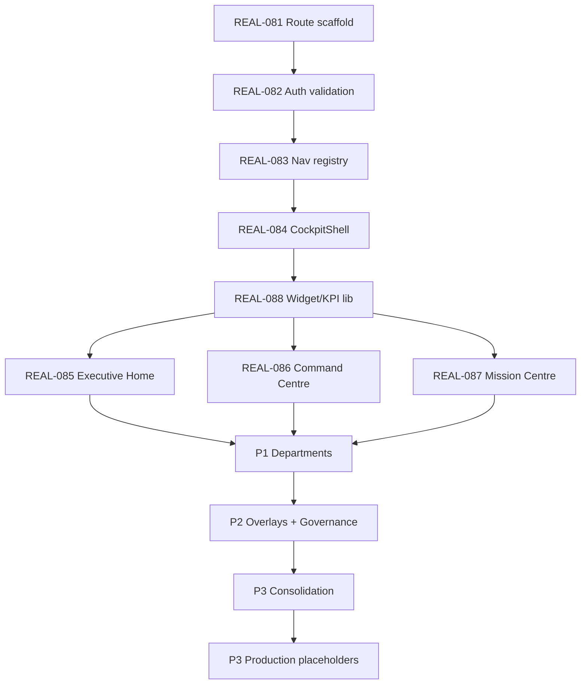
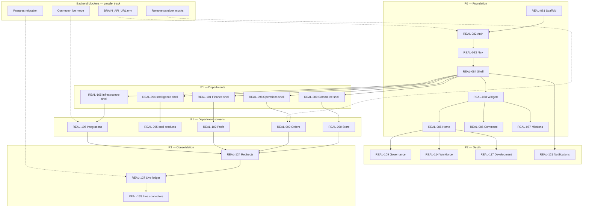
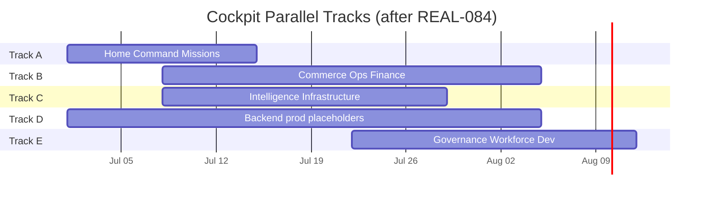
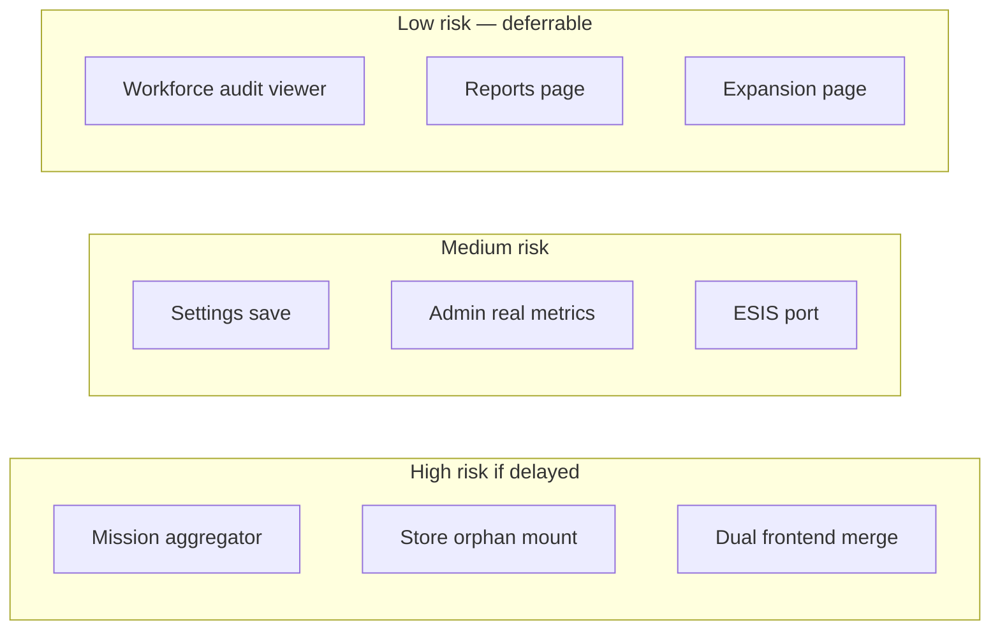

# Cockpit Dependency Graph

**Mission:** REAL-080  
**Version:** 1.0  

---

## 1. Critical Path (Must Build First)

**Critical path length:** REAL-081 → REAL-088 → REAL-085/086/087 → first P1 department → REAL-124 → REAL-127 (live data).

---

## 2. Full Dependency Graph

---

## 3. Parallel Work Tracks

Three tracks can run concurrently after REAL-084 (CockpitShell) lands:

| Track | Owner focus | Missions | Can start after |
|-------|-------------|----------|-----------------|
| **Track A — Core UX** | Cockpit command surfaces | REAL-085, 086, 087, 088 | REAL-084 |
| **Track B — Commerce path** | Commerce + Ops + Finance | REAL-089–104 | REAL-088 |
| **Track C — Intel + Infra** | Intelligence + Infrastructure | REAL-094–097, 105–108 | REAL-088 |
| **Track D — Backend prod** | Placeholders, connectors, DB | REAL-127–133 (backend) | Independent |
| **Track E — Governance depth** | P2 departments | REAL-109–120 | REAL-085 |
| **Track F — Overlays** | Global chrome | REAL-121–123 | REAL-087 |

---

## 4. Blocker Registry

| Blocker ID | Description | Blocks | Owner | Resolution |
|------------|-------------|--------|-------|------------|
| BLK-001 | `BRAIN_API_URL` not set on Vercel | All Cockpit data | DevOps | Set env + redeploy |
| BLK-002 | No server-side session validation | Production auth | REAL-082 | Middleware validates `/cockpit/*` |
| BLK-003 | No Mission aggregator API | Mission Centre | REAL-087 | Client-side merge initially; API later |
| BLK-004 | Seed data in module-views | Live KPI badges | REAL-127 | Ledger-backed views |
| BLK-005 | Sandbox fulfillment only | Operations go-live | REAL-129, 130 | live-cj-fulfillment path |
| BLK-006 | Mock connectors default | Integrations grid truth | REAL-133 | LIVE_COMMERCE mode |
| BLK-007 | Dual frontend routing confusion | User navigation | REAL-124 | Redirects |
| BLK-008 | Orphaned store-builder components | Store panel completeness | REAL-090 | Mount components |
| BLK-009 | sql.js non-persistent DB | Revenue durability | REAL-132 | Postgres |
| BLK-010 | No shared component package | Duplication during port | REAL-125 (optional) | Extract `cockpit/ui` |

---

## 5. Dependency Matrix

Rows depend on columns (✓ = hard dependency).

|  | R081 | R082 | R083 | R084 | R088 | R085 | R086 | R087 | P1 | P2 | P3 |
|--|:---:|:---:|:---:|:---:|:---:|:---:|:---:|:---:|:---:|:---:|:---:|
| R082 | ✓ | | | | | | | | | | |
| R083 | ✓ | ✓ | | | | | | | | | |
| R084 | ✓ | ✓ | ✓ | | | | | | | | |
| R088 | | | ✓ | ✓ | | | | | | | |
| R085 | | ✓ | ✓ | ✓ | ✓ | | | | | | |
| R086 | | ✓ | ✓ | ✓ | ✓ | | | | | | |
| R087 | | ✓ | ✓ | ✓ | ✓ | | | | | | |
| P1 depts | | ✓ | ✓ | ✓ | ✓ | | | | | | |
| P2 depts | | ✓ | ✓ | ✓ | ✓ | ✓ | | | ✓ | | |
| R124 | | | ✓ | ✓ | | | | | ✓ | ✓ | |
| R127 | | | | | | | | | ✓ | | ✓ |

---

## 6. External Dependencies

| External | Required for | Phase |
|----------|--------------|-------|
| Railway Brain API | All Cockpit screens | P0 |
| Vercel empireai-web deploy | Cockpit host | P0 |
| Redis sessions | Auth stability | P0 |
| Stripe (test → live) | Finance live KPIs | P3 |
| CJ Dropshipping API | Operations live | P3 |
| Meta Ads OAuth | Commerce ads live | P3 |
| Postgres | Production persistence | P3 |

---

## 7. Risk Dependencies

---

*REAL-080 — Cockpit Dependency Graph v1.0*
