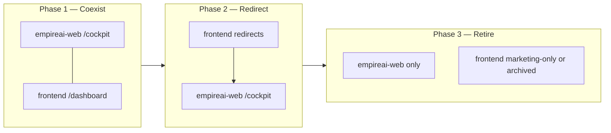

# Cockpit Migration Plan

**Mission:** REAL-080  
**Version:** 1.0  

---

## 1. Migration Strategy Overview

**Goal:** Single Executive OS at `/cockpit/*` hosted in `empireai-web`, absorbing `frontend/` dashboard capabilities without a big-bang rewrite.

**Approach:** Strangler fig — new Cockpit routes wrap or port existing components; legacy routes redirect; delete Vite dashboard when parity reached.



---

## 2. Canonical Cockpit Folder Structure

Target layout inside `empireai-web/`:

```
empireai-web/
├── app/
│   ├── (marketing)/              # unchanged — public landing
│   ├── (auth)/                   # unchanged — login
│   ├── (platform)/               # LEGACY — redirect to /cockpit after P3
│   │   └── platform/...
│   ├── (cockpit)/                # NEW — Executive OS
│   │   ├── layout.tsx            # CockpitShell wrapper
│   │   ├── page.tsx              # SCR-001 Executive Home
│   │   ├── command/
│   │   │   └── page.tsx          # SCR-010 Command Centre
│   │   ├── missions/
│   │   │   └── page.tsx          # SCR-020 Mission Centre
│   │   ├── intelligence/
│   │   │   ├── products/page.tsx
│   │   │   ├── suppliers/page.tsx
│   │   │   ├── discovery/page.tsx
│   │   │   └── marketplace/page.tsx
│   │   ├── commerce/
│   │   │   ├── store/page.tsx
│   │   │   ├── launch/page.tsx
│   │   │   ├── marketing/page.tsx
│   │   │   ├── ads/page.tsx
│   │   │   └── workspace/
│   │   │       ├── page.tsx
│   │   │       └── [id]/page.tsx
│   │   ├── operations/
│   │   │   ├── orders/page.tsx
│   │   │   ├── fulfillment/page.tsx
│   │   │   └── support/page.tsx
│   │   ├── finance/
│   │   │   ├── profit/page.tsx
│   │   │   ├── pl/page.tsx
│   │   │   ├── billing/page.tsx
│   │   │   └── costs/page.tsx
│   │   ├── workforce/
│   │   │   ├── page.tsx
│   │   │   ├── activity/page.tsx
│   │   │   └── audit/page.tsx
│   │   ├── infrastructure/
│   │   │   ├── integrations/page.tsx
│   │   │   ├── deployments/page.tsx
│   │   │   ├── health/page.tsx
│   │   │   └── admin/page.tsx
│   │   ├── governance/
│   │   │   ├── settings/page.tsx
│   │   │   ├── soul/page.tsx
│   │   │   ├── decisions/page.tsx
│   │   │   ├── council/page.tsx
│   │   │   └── v1/page.tsx
│   │   └── development/
│   │       ├── pillow/page.tsx
│   │       ├── approvals/page.tsx
│   │       ├── inspection/page.tsx
│   │       └── learning/page.tsx
│   └── api/                      # unchanged BFF
├── components/
│   ├── cockpit/                  # NEW — Cockpit-specific
│   │   ├── shell/
│   │   │   ├── CockpitShell.tsx
│   │   │   ├── CockpitSidebar.tsx
│   │   │   ├── CockpitTopBar.tsx
│   │   │   ├── CockpitMobileNav.tsx
│   │   │   ├── ApprovalBar.tsx
│   │   │   └── PillowFab.tsx
│   │   ├── layout/
│   │   │   ├── CockpitDepartmentLayout.tsx
│   │   │   └── CockpitTabs.tsx
│   │   ├── widgets/
│   │   │   ├── KpiStrip.tsx
│   │   │   ├── DataModeBadge.tsx
│   │   │   ├── DepartmentHealthRow.tsx
│   │   │   ├── MissionQueuePreview.tsx
│   │   │   ├── CommandSnapshot.tsx
│   │   │   ├── PortfolioPulse.tsx
│   │   │   ├── AgentRosterGrid.tsx
│   │   │   └── IntegrationGrid.tsx
│   │   ├── overlays/
│   │   │   ├── NotificationDrawer.tsx
│   │   │   └── PillowCompanionDrawer.tsx
│   │   └── pages/                # Page-level compositions
│   │       ├── ExecutiveHomePage.tsx
│   │       ├── CommandCentrePage.tsx
│   │       └── MissionCentrePage.tsx
│   ├── platform/                 # LEGACY — migrate into cockpit/ or re-export
│   └── home/                     # marketing — unchanged
├── lib/
│   ├── cockpit/                  # NEW
│   │   ├── navigation.ts         # Canonical nav tree (REAL-083)
│   │   ├── permissions.ts        # Department role filters
│   │   ├── widgets/registry.ts   # Widget IDs → components
│   │   ├── kpis/registry.ts      # KPI IDs → fetchers
│   │   ├── hooks/
│   │   │   ├── useMissionQueue.ts
│   │   │   ├── useCockpitKpis.ts
│   │   │   └── useScreenContext.ts  # Pillow context
│   │   └── types.ts
│   ├── brain/                    # unchanged — shared BFF client
│   └── auth/                     # unchanged
└── middleware.ts                 # extend for /cockpit/*
```

### Optional Phase 3: shared package

```
packages/
└── cockpit-ui/                   # REAL-125 — if extracting for reuse
    ├── src/components/
    └── package.json
```

---

## 3. Canonical Navigation Tree

```typescript
// lib/cockpit/navigation.ts (target — REAL-083)

export const cockpitNavigation = [
  { id: "home", label: "Executive Home", href: "/cockpit", icon: "home", roles: ["founder", "admin", "operator"] },
  { id: "command", label: "Command Centre", href: "/cockpit/command", icon: "command", roles: ["founder", "admin"] },
  { id: "missions", label: "Mission Centre", href: "/cockpit/missions", icon: "missions", roles: ["founder", "admin"] },
  {
    id: "intelligence",
    label: "Intelligence",
    href: "/cockpit/intelligence/products",
    icon: "intelligence",
    roles: ["founder", "admin", "operator"],
    tabs: [
      { id: "products", label: "Products", href: "/cockpit/intelligence/products" },
      { id: "suppliers", label: "Suppliers", href: "/cockpit/intelligence/suppliers" },
      { id: "discovery", label: "Discovery", href: "/cockpit/intelligence/discovery" },
      { id: "marketplace", label: "Marketplace", href: "/cockpit/intelligence/marketplace" },
    ],
  },
  {
    id: "commerce",
    label: "Commerce",
    href: "/cockpit/commerce/store",
    icon: "commerce",
    tabs: [
      { id: "store", label: "Store", href: "/cockpit/commerce/store" },
      { id: "launch", label: "Launch", href: "/cockpit/commerce/launch" },
      { id: "marketing", label: "Marketing", href: "/cockpit/commerce/marketing" },
      { id: "ads", label: "Ads", href: "/cockpit/commerce/ads" },
      { id: "workspace", label: "Workspace", href: "/cockpit/commerce/workspace" },
    ],
  },
  {
    id: "operations",
    label: "Operations",
    href: "/cockpit/operations/orders",
    icon: "operations",
    tabs: [
      { id: "orders", label: "Orders", href: "/cockpit/operations/orders" },
      { id: "fulfillment", label: "Fulfillment", href: "/cockpit/operations/fulfillment" },
      { id: "support", label: "Support", href: "/cockpit/operations/support" },
    ],
  },
  {
    id: "finance",
    label: "Finance",
    href: "/cockpit/finance/profit",
    icon: "finance",
    roles: ["founder", "admin"],
    tabs: [
      { id: "profit", label: "Profit", href: "/cockpit/finance/profit" },
      { id: "pl", label: "P&L", href: "/cockpit/finance/pl" },
      { id: "billing", label: "Billing", href: "/cockpit/finance/billing" },
      { id: "costs", label: "Costs", href: "/cockpit/finance/costs" },
    ],
  },
  {
    id: "workforce",
    label: "AI Workforce",
    href: "/cockpit/workforce",
    icon: "workforce",
    roles: ["founder", "admin"],
    tabs: [
      { id: "roster", label: "Roster", href: "/cockpit/workforce" },
      { id: "activity", label: "Activity", href: "/cockpit/workforce/activity" },
      { id: "audit", label: "Audit", href: "/cockpit/workforce/audit" },
    ],
  },
  {
    id: "infrastructure",
    label: "Infrastructure",
    href: "/cockpit/infrastructure/integrations",
    icon: "infrastructure",
    roles: ["founder", "admin"],
    tabs: [
      { id: "integrations", label: "Integrations", href: "/cockpit/infrastructure/integrations" },
      { id: "deployments", label: "Deployments", href: "/cockpit/infrastructure/deployments" },
      { id: "health", label: "Health", href: "/cockpit/infrastructure/health" },
      { id: "admin", label: "Admin", href: "/cockpit/infrastructure/admin", roles: ["admin"] },
    ],
  },
  {
    id: "governance",
    label: "Governance",
    href: "/cockpit/governance/settings",
    icon: "governance",
    tabs: [
      { id: "settings", label: "Settings", href: "/cockpit/governance/settings" },
      { id: "soul", label: "Soul", href: "/cockpit/governance/soul", roles: ["founder", "admin"] },
      { id: "decisions", label: "Decisions", href: "/cockpit/governance/decisions", roles: ["founder", "admin"] },
      { id: "council", label: "Council", href: "/cockpit/governance/council", roles: ["founder", "admin"] },
      { id: "v1", label: "V1 Certification", href: "/cockpit/governance/v1", roles: ["founder", "admin"] },
    ],
  },
  {
    id: "development",
    label: "Development",
    href: "/cockpit/development/pillow",
    icon: "development",
    roles: ["founder", "admin"],
    tabs: [
      { id: "pillow", label: "Pillow", href: "/cockpit/development/pillow" },
      { id: "approvals", label: "Approvals", href: "/cockpit/development/approvals" },
      { id: "inspection", label: "Inspection", href: "/cockpit/development/inspection" },
      { id: "learning", label: "Learning", href: "/cockpit/development/learning" },
    ],
  },
] as const;
```

---

## 4. frontend/ Migration

### 4.1 What stays in frontend/

| Asset | Reason |
|-------|--------|
| `pages/public/LandingPage.tsx` | Marketing — separate from Cockpit |
| `pages/auth/LoginPage.tsx` | Until auth unified in empireai-web |
| Vite build for legacy deploy | Until REAL-126 |

### 4.2 What migrates to empireai-web

| frontend/ source | Cockpit target | Method |
|------------------|----------------|--------|
| `EmpireCommandCenterPage` | `cockpit/pages/CommandCentrePage` | Port JSX + merge with FounderDashboardModule |
| `MissionHomePage` | Partial → `ExecutiveHomePage` | Extract widgets |
| `ApprovalsPage` | Partial → `MissionCentrePage` | Merge queue logic |
| `IntegrationsHubPage` | `infrastructure/integrations` | Port + REST client |
| `ProfitPage`, `OperatingCostPage` | `finance/profit`, `finance/costs` | Port |
| `ProductDiscoveryPage` | `intelligence/discovery` | Port |
| `AiTeamPage` | `workforce` | Port + new roster grid |
| `PillowChatPage` + pillow components | `development/pillow` + drawer | Port |
| `Success001CommandCenterPage` | `governance/v1` | Port |
| `system/*`, `pillow/*`, `empire/*` | `components/cockpit/*` | Copy-adapt (CSS modules → Tailwind if needed) |

### 4.3 API client migration

| frontend API | empireai-web equivalent | Action |
|--------------|-------------------------|--------|
| `api/client.ts` → `VITE_API_BASE_URL` | `lib/brain/client.ts` → BFF | **Dual during migration:** add `lib/cockpit/api/rest-client.ts` for REST paths frontend used |
| `api/pillow.ts` | New `lib/cockpit/api/pillow.ts` | Port |
| `api/integrations-hub.ts` | `lib/cockpit/api/integrations.ts` | Port |
| `api/dispatch.ts` | Already in `lib/brain/client.ts` | Reuse |
| 14 other api/* files | Port on demand per screen | Incremental |

**Rule:** Cockpit REST calls go through `lib/cockpit/api/*`; dispatch calls use existing `lib/brain/hooks/*`.

---

## 5. empireai-web/ Migration

### 5.1 What changes

| Current | Target |
|---------|--------|
| `app/(platform)/platform/*` | Redirect → `/cockpit/*` (REAL-124) |
| `lib/platform/navigation.ts` | Superseded by `lib/cockpit/navigation.ts` |
| `components/platform/shell/*` | Fork → `components/cockpit/shell/*` then deprecate |
| `middleware.ts` cookie check | Server session validation (REAL-082) |
| Login redirect to `/platform/dashboard` | Redirect to `/cockpit` |

### 5.2 What reuses unchanged

| Asset | Reuse |
|-------|-------|
| `components/platform/modules/*` | Import from Cockpit department pages |
| `components/platform/ui/PlatformPrimitives.tsx` | Re-export from cockpit or import directly |
| `lib/brain/*` | All hooks and BFF client |
| `app/api/auth/*`, `app/api/brain/*` | Unchanged |

---

## 6. Shared UI Strategy

### Phase 1 — Copy-adapt (REAL-081–120)

- Port frontend components into `empireai-web/components/cockpit/`
- Adapt CSS modules → Tailwind where conflicts exist
- Keep PlatformPrimitives for module screens

### Phase 2 — Unify primitives (REAL-125 optional)

- Merge `ExecutiveKpiCard` + `StatCard` → `CockpitStatCard`
- Merge `ExecutiveTable` + `DataTable` → `CockpitDataTable`
- Single design token file in `app/globals.css`

### Phase 3 — Design system

- Document tokens in REAL-078 UX doctrine alignment
- Storybook optional (out of scope)

---

## 7. Layout Migration

| Layout | Current | Target |
|--------|---------|--------|
| Root | `app/layout.tsx` | Unchanged |
| Cockpit | — | `app/(cockpit)/layout.tsx` wraps CockpitShell |
| Platform (legacy) | `app/(platform)/layout.tsx` | Thin redirect wrapper after REAL-124 |
| Auth | `app/(auth)/layout.tsx` | Login success → `/cockpit` |

### Cockpit layout responsibilities

```tsx
// app/(cockpit)/layout.tsx (conceptual — REAL-084)
// - AuthProvider (existing)
// - CockpitShell
//   - CockpitSidebar (from navigation.ts)
//   - CockpitTopBar
//   - {children}
//   - ApprovalBar (conditional)
//   - PillowFab
// - Screen context provider (Pillow)
```

---

## 8. Navigation Migration Map

| frontend path | empireai-web path | Cockpit canonical |
|---------------|-------------------|-------------------|
| `/dashboard` | `/platform/dashboard` | `/cockpit` |
| `/dashboard/command` | `/platform/dashboard` + `/platform/ai-ceo` | `/cockpit/command` |
| `/dashboard/approvals` | — | `/cockpit/missions` |
| `/dashboard/intelligence` | `/platform/intelligence` | `/cockpit/intelligence/products` |
| `/dashboard/suppliers` | `/platform/suppliers` | `/cockpit/intelligence/suppliers` |
| `/dashboard/operations` | `/platform/orders` | `/cockpit/operations/orders` |
| `/dashboard/operatingCost` | `/platform/finance` | `/cockpit/finance/profit` |
| `/dashboard/advertising` | `/platform/ads` | `/cockpit/commerce/ads` |
| `/dashboard/integrations` | — | `/cockpit/infrastructure/integrations` |
| `/dashboard/settings` | `/platform/settings` | `/cockpit/governance/settings` |
| `/dashboard/success-001` | — | `/cockpit/governance/v1` |
| `/dashboard/pillow` | — | `/cockpit/development/pillow` |
| `/platform/*` (all) | `/platform/*` | `/cockpit/*` mapped per screen matrix |

---

## 9. Redirect Implementation (REAL-124)

### empireai-web middleware

```
/platform/*  →  308  →  /cockpit/*  (mapped)
/cockpit     →  auth required
```

### frontend vite app

```
/dashboard/*  →  302  →  https://{cockpit-host}/cockpit/*
/             →  marketing stays
```

---

## 10. Migration Risks & Mitigations

| Risk | Mitigation |
|------|------------|
| CSS module vs Tailwind clash | Port one component at a time; visual regression checklist |
| Dual API clients | `rest-client.ts` documents which paths use REST vs dispatch |
| Broken deep links | Redirect table + 404 fallback to `/cockpit` |
| Feature regression during port | Screen parity checklist per REAL-079 SCR IDs |
| Two Vercel projects | Consolidate to empireai-web Cockpit; frontend marketing-only |

---

## 11. Migration Checklist (Per Screen)

- [ ] SCR ID mapped in ESIS registry  
- [ ] Route exists under `app/(cockpit)/`  
- [ ] Nav entry in `lib/cockpit/navigation.ts`  
- [ ] DataModeBadge applied  
- [ ] Role filter applied  
- [ ] Legacy redirect configured  
- [ ] Pillow screen context registered  
- [ ] Build + typecheck pass  

---

*REAL-080 — Cockpit Migration Plan v1.0*
