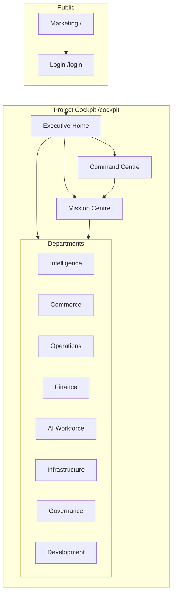

# Cockpit Screen Map

**Mission:** REAL-079  
**Authority:** Grand King Executive Directive  
**Status:** V1 design — screen inventory + wireframes  
**Version:** 1.0  

---

## 1. Screen Map Overview



**Total V1 screens:** 42 canonical screens (including tabs as screens).

---

## 2. Master Screen Index

| # | Screen ID | Route | Department | Wireframe § |
|---|-----------|-------|------------|-------------|
| 0 | SCR-000 | `/login` | Auth | — |
| 1 | SCR-001 | `/cockpit` | — | §3.1 |
| 2 | SCR-010 | `/cockpit/command` | Command | §3.2 |
| 3 | SCR-020 | `/cockpit/missions` | Missions | §3.3 |
| 4 | SCR-100 | `/cockpit/intelligence/products` | Intelligence | §4.1 |
| 5 | SCR-101 | `/cockpit/intelligence/suppliers` | Intelligence | §4.2 |
| 6 | SCR-102 | `/cockpit/intelligence/discovery` | Intelligence | §4.3 |
| 7 | SCR-103 | `/cockpit/intelligence/marketplace` | Intelligence | §4.4 |
| 8 | SCR-200 | `/cockpit/commerce/store` | Commerce | §5.1 |
| 9 | SCR-201 | `/cockpit/commerce/launch` | Commerce | §5.2 |
| 10 | SCR-202 | `/cockpit/commerce/marketing` | Commerce | §5.3 |
| 11 | SCR-203 | `/cockpit/commerce/ads` | Commerce | §5.4 |
| 12 | SCR-204 | `/cockpit/commerce/workspace` | Commerce | §5.5 |
| 13 | SCR-300 | `/cockpit/operations/orders` | Operations | §6.1 |
| 14 | SCR-301 | `/cockpit/operations/fulfillment` | Operations | §6.2 |
| 15 | SCR-302 | `/cockpit/operations/support` | Operations | §6.3 |
| 16 | SCR-400 | `/cockpit/finance/profit` | Finance | §7.1 |
| 17 | SCR-401 | `/cockpit/finance/pl` | Finance | §7.2 |
| 18 | SCR-402 | `/cockpit/finance/billing` | Finance | §7.3 |
| 19 | SCR-403 | `/cockpit/finance/costs` | Finance | §7.4 |
| 20 | SCR-500 | `/cockpit/workforce` | AI Workforce | §8.1 |
| 21 | SCR-501 | `/cockpit/workforce/activity` | AI Workforce | §8.2 |
| 22 | SCR-502 | `/cockpit/workforce/audit` | AI Workforce | §8.3 |
| 23 | SCR-600 | `/cockpit/infrastructure/integrations` | Infrastructure | §9.1 |
| 24 | SCR-601 | `/cockpit/infrastructure/deployments` | Infrastructure | §9.2 |
| 25 | SCR-602 | `/cockpit/infrastructure/health` | Infrastructure | §9.3 |
| 26 | SCR-603 | `/cockpit/infrastructure/admin` | Infrastructure | §9.4 |
| 27 | SCR-700 | `/cockpit/governance/settings` | Governance | §10.1 |
| 28 | SCR-701 | `/cockpit/governance/soul` | Governance | §10.2 |
| 29 | SCR-702 | `/cockpit/governance/decisions` | Governance | §10.3 |
| 30 | SCR-703 | `/cockpit/governance/council` | Governance | §10.4 |
| 31 | SCR-704 | `/cockpit/governance/v1` | Governance | §10.5 |
| 32 | SCR-800 | `/cockpit/development/pillow` | Development | §11.1 |
| 33 | SCR-801 | `/cockpit/development/approvals` | Development | §11.2 |
| 34 | SCR-802 | `/cockpit/development/inspection` | Development | §11.3 |
| 35 | SCR-803 | `/cockpit/development/learning` | Development | §11.4 |

### Overlay screens (not routes)

| ID | Overlay | Trigger |
|----|---------|---------|
| OVL-001 | Notification Drawer | Bell |
| OVL-002 | Pillow Companion Drawer | FAB / ⌘K |
| OVL-003 | Mission Quick Modal | ⌘M |
| OVL-004 | Approval Bar | Auto when pending |
| OVL-005 | Company Detail Drawer | Row click in portfolio |

---

## 3. Core Screens (Wireframes)

### 3.1 SCR-001 — Executive Home

**Purpose:** 30-second empire pulse. Route Grand King to Command or Missions.

```
┌─────────────────────────────────────────────────────────────────────────────┐
│ ▣ Empire Holdings          ● Live    Profit today +$4,280    🔔(3)   GK ▼  │
├──────┬──────────────────────────────────────────────────────────────────────┤
│      │  Good morning, Grand King                    Sun 21 Jun · Sovereign  │
│  ◉   │  ┌────────────────────────────────────────────────────────────────┐ │
│ Home │  │ ⚠ V1: 1 blocker — CJ credentials          [ Fix in Integrations ]│ │
│  ◎   │  └────────────────────────────────────────────────────────────────┘ │
│ Cmd  │  ┌─────────────┐ ┌─────────────┐ ┌─────────────┐ ┌─────────────┐     │
│  ◎   │  │ GMV MTD     │ │ Net Margin  │ │ Pending     │ │ Open        │     │
│ Mis  │  │ $1.24M  ▲   │ │ 36.3%   ▲   │ │ Decisions 3 │ │ Missions  7 │     │
│ ───  │  │ LIVE        │ │ LIVE        │ │ LIVE        │ │ LIVE        │     │
│ Intel│  └─────────────┘ └─────────────┘ └─────────────┘ └─────────────┘     │
│ Com  │  ┌──────────────────────────────┬─────────────────────────────────┐  │
│ Ops  │  │ COMMAND SNAPSHOT             │ MISSION QUEUE                   │  │
│ Fin  │  │ "Portfolio velocity is       │ 🔴 CJ fulfill #1842    [Review] │  │
│ Work │  │  accelerating..."            │ 🔴 Cursor REAL-080     [Review] │  │
│ Infra│  │                              │ 🟠 Meta budget +$500   [Review] │  │
│ Gov  │  │ Priorities: Scale · Launch   │ 🟡 CJ creds missing    [Fix]    │  │
│ Dev  │  │ [ Open Command Centre → ]    │ [ Open Mission Centre → ]       │  │
│      │  └──────────────────────────────┴─────────────────────────────────┘  │
│      │  ┌──────────────────────────────┬─────────────────────────────────┐  │
│      │  │ PORTFOLIO PULSE              │ AGENT ACTIVITY                  │  │
│      │  │ ● Acme — scaling  ◐ Nova —   │ 14:02 Morgan · scan wireless    │  │
│      │  │   building  ○ 3 idle         │ 14:01 Casey · manufacture Nova  │  │
│      │  └──────────────────────────────┴─────────────────────────────────┘  │
│      │  DEPT HEALTH: [Intel ●] [Com ◐] [Ops ●] [Fin ●] [Work ●] [Inf ⚠] …  │
└──────┴──────────────────────────────────────────────────────────────────────┘
│ ⬤ 2 approvals pending                                    [ Review now ]    │
└─────────────────────────────────────────────────────────────────────────────┘
                                                    [💬 Pillow]
```

**Widgets:** W-G-001–007, W-E-001–005  
**KPIs:** K-E-001–008  

---

### 3.2 SCR-010 — Command Centre

```
┌─────────────────────────────────────────────────────────────────────────────┐
│ COMMAND CENTRE                    Period [ MTD ▼ ]              [Export ↓]    │
├─────────────────────────────────────────────────────────────────────────────┤
│ ┌──────────┐ ┌──────────┐ ┌──────────┐ ┌──────────┐ ┌──────────┐           │
│ │ GMV      │ │ Margin   │ │ Companies│ │ Agents   │ │ Profit   │           │
│ │ $1.24M   │ │ 36.3%    │ │ 12       │ │ 18       │ │ +$4.2k   │           │
│ └──────────┘ └──────────┘ └──────────┘ └──────────┘ └──────────┘           │
├────────────────────────────────────┬────────────────────────────────────────┤
│ AI CEO BRIEFING          [Brief ↻] │ PORTFOLIO                    [View all]│
│ ┌────────────────────────────────┐│ ┌────────────────────────────────────┐│
│ │ Headline                       ││ │ Company    Revenue  Margin   Status ││
│ │ Summary paragraph...           ││ │ Acme Co    $420K    42%      ● Live ││
│ │                                ││ │ Nova Home  —        —       ◐ Build││
│ │ PRIORITIES                     ││ │ ...                                ││
│ │ 1. Scale top revenue    [High] ││ └────────────────────────────────────┘│
│ │ 2. Launch Nova ads   [Medium]  ││ RECENT ACTIVITY                       │
│ │ 3. Manufacture vertical [High]  ││ • Casey — pipeline init — store       │
│ └────────────────────────────────┘│ • Morgan — scan complete — intel       │
│ PENDING DECISIONS                  │                                        │
│ ┌────────────────────────────────┐│                                        │
│ │ Scale Meta ads    [Deny][Approve││                                        │
│ │ New supplier      [Deny][Approve││                                        │
│ └────────────────────────────────┘│                                        │
└────────────────────────────────────┴────────────────────────────────────────┘
```

---

### 3.3 SCR-020 — Mission Centre

```
┌─────────────────────────────────────────────────────────────────────────────┐
│ MISSION CENTRE              [ Urgent (3) | Pending (4) | Done | All ]       │
├─────────────────────────────────────────────────────────────────────────────┤
│ ┌─ URGENT ────────────────────────────────────────────────────────────────┐ │
│ │ TYPE          TITLE                              AGE      ACTIONS       │ │
│ │ Fulfillment   Approve CJ — Order #1842           12m      [Review][✓]  │ │
│ │ Pillow        Cursor: REAL-080 Cockpit shell      45m      [Review][✓][✗]│ │
│ │ AI CEO        Scale Meta budget +$500/day         2h       [Deny][✓]    │ │
│ └─────────────────────────────────────────────────────────────────────────┘ │
│ ┌─ PENDING ───────────────────────────────────────────────────────────────┐ │
│ │ V1 Blocker    CJ credentials not configured       1d       [Integrations]│ │
│ │ Assistant     Generate commerce audit             3h       [Open]        │ │
│ └─────────────────────────────────────────────────────────────────────────┘ │
│ ┌─ COMPLETED TODAY ───────────────────────────────────────────────────────┐ │
│ │ ✓ Approved manufacture — Nova Home                         09:14         │ │
│ └─────────────────────────────────────────────────────────────────────────┘ │
└─────────────────────────────────────────────────────────────────────────────┘
```

---

## 4. Intelligence Screens

### 4.1 SCR-100 — Products

```
┌─────────────────────────────────────────────────────────────────────────────┐
│ INTELLIGENCE › Products                              [ DEMO ⚠ mock providers ]│
│ [Products] [Suppliers] [Discovery] [Marketplace]                             │
├─────────────────────────────────────────────────────────────────────────────┤
│ [SKUs 2,400] [Confidence 87%] [Signals 8 mock]                               │
├─────────────────────────────────────────────────────────────────────────────┤
│ Product Scoring Table                              [ Scan ▼ category ] [Full]│
│ ┌──────────────────────────────────────────────────────────────────────────┐│
│ │ Product          Score  Demand  Margin  Trend  Rec                       ││
│ │ Wireless Earbuds   94   High    42%     ▲      Scale                       ││
│ │ ...                                                                      ││
│ └──────────────────────────────────────────────────────────────────────────┘│
└─────────────────────────────────────────────────────────────────────────────┘
```

### 4.2 SCR-101 — Suppliers

```
│ INTELLIGENCE › Suppliers                                                       │
│ [Connected 22] [Fulfillment 98.4%] [Recoveries 12]                           │
│ Supplier cards with reliability bars · [ Health Check ]                        │
```

### 4.3 SCR-102 — Discovery

```
│ INTELLIGENCE › Discovery                                                       │
│ Active sessions list · [ Start Session ] · session detail → approve product    │
```

### 4.4 SCR-103 — Marketplace

```
│ INTELLIGENCE › Marketplace                                                     │
│ Marketplace intelligence + expansion scores                                    │
```

---

## 5. Commerce Screens

### 5.1 SCR-200 — Store

```
┌─────────────────────────────────────────────────────────────────────────────┐
│ COMMERCE › Store                                     [ LIVE / DEMO badge ]   │
│ [Store] [Launch] [Marketing] [Ads] [Workspace]                               │
├─────────────────────────────────────────────────────────────────────────────┤
│ [Building 1] [Pipeline 68%] [Deployed 3]                                       │
├───────────────────────────────┬─────────────────────────────────────────────┤
│ BUILD PIPELINE                │ ACTIONS                                      │
│ Nova Home ████████░░ 72%      │ [ Preview Store ]                            │
│ Stage: Catalog · Manufacture  │ [ Manufacture New ]                          │
│                               │ [ Run Full Pipeline ]                        │
├───────────────────────────────┴─────────────────────────────────────────────┤
│ COMPANIES: table with status · revenue · build progress                      │
└─────────────────────────────────────────────────────────────────────────────┘
```

### 5.2 SCR-201 — Launch

```
│ COMMERCE › Launch — Discovery → Preview → Build → Deploy timeline            │
```

### 5.3–5.5 Marketing, Ads, Workspace

Standard department template with campaign table, ROAS cards, opportunity compare grid respectively.

---

## 6. Operations Screens

### 6.1 SCR-300 — Orders

```
┌─────────────────────────────────────────────────────────────────────────────┐
│ OPERATIONS › Orders                                    [ SANDBOX if mock ]   │
│ [Orders] [Fulfillment] [Support]                                             │
├─────────────────────────────────────────────────────────────────────────────┤
│ [Today 24] [Processing 3] [Shipped 18] [Profit +$1.2k]                       │
├───────────────────────────────┬─────────────────────────────────────────────┤
│ ORDER TABLE                   │ FULFILLMENT READINESS (side panel)           │
│ ID · Company · Product · St   │ Prepare → Draft → Approve → Submit           │
└───────────────────────────────┴─────────────────────────────────────────────┘
```

---

## 7. Finance Screens

### 7.1 SCR-400 — Profit (Grand King default)

```
┌─────────────────────────────────────────────────────────────────────────────┐
│ FINANCE › Profit                                                             │
│ [Profit] [P&L] [Billing] [Costs]                                             │
├─────────────────────────────────────────────────────────────────────────────┤
│ ┌─────────────────┐  ┌─────────────────┐  ┌─────────────────┐               │
│ │ Profit Today    │  │ Profit MTD      │  │ Net Margin      │               │
│ │ +$4,280    ▲18% │  │ +$1.03M         │  │ 36.3%           │               │
│ └─────────────────┘  └─────────────────┘  └─────────────────┘               │
│ ┌──────────────────────────────────────────────────────────────────────────┐│
│ │ 7-day profit trend (chart placeholder)                                   ││
│ └──────────────────────────────────────────────────────────────────────────┘│
│ Top companies by profit today                                                │
└─────────────────────────────────────────────────────────────────────────────┘
```

### 7.2 SCR-401 — P&L

P&L waterfall: Revenue → COGS → Ad spend → Platform fees → Net profit (W-F-001).

---

## 8. AI Workforce Screens

### 8.1 SCR-500 — Roster

```
┌─────────────────────────────────────────────────────────────────────────────┐
│ AI WORKFORCE                    [ Roster ] [ Activity ] [ Audit ]              │
├─────────────────────────────────────────────────────────────────────────────┤
│ [18 Online] [142 Dispatches] [0 Guardian blocks] [Queue 12]                  │
├─────────────────────────────────────────────────────────────────────────────┤
│ ┌─────────┐ ┌─────────┐ ┌─────────┐ ┌─────────┐ ┌─────────┐ ┌─────────┐    │
│ │ Victoria│ │ Morgan  │ │ Jordan  │ │ Alex    │ │ Quinn   │ │ Casey   │    │
│ │ AI CEO  │ │ PIE     │ │ Scout   │ │ Sourcing│ │ SIE     │ │ Store   │    │
│ │ ● Active│ │ ● Active│ │ ○ Idle  │ │ ● Active│ │ ○ Idle  │ │ ● Active│    │
│ └─────────┘ └─────────┘ └─────────┘ └─────────┘ └─────────┘ └─────────┘    │
│ ┌─────────┐ ┌─────────┐ ┌─────────┐ ┌─────────┐ ┌─────────┐ ┌─────────┐    │
│ │ Riley   │ │ Taylor  │ │ Blake   │ │ Sam     │ │ Nova    │ │ Avery   │    │
│ │ Marketing│ │ Ads    │ │ Finance │ │ Orders  │ │ Support │ │ Dashboard│   │
│ └─────────┘ └─────────┘ └─────────┘ └─────────┘ └─────────┘ └─────────┘    │
│                                    ┌─────────┐                               │
│                                    │ Sentinel│                               │
│                                    │ Admin   │                               │
│                                    └─────────┘                               │
└─────────────────────────────────────────────────────────────────────────────┘
```

---

## 9. Infrastructure Screens

### 9.1 SCR-600 — Integrations

```
┌─────────────────────────────────────────────────────────────────────────────┐
│ INFRASTRUCTURE › Integrations                                                │
├─────────────────────────────────────────────────────────────────────────────┤
│ ┌──────────────┐ ┌──────────────┐ ┌──────────────┐ ┌──────────────┐        │
│ │ Stripe       │ │ CJ Dropship  │ │ Meta Ads     │ │ Vercel       │        │
│ │ ● Connected  │ │ ⚠ Not config │ │ ○ Mock       │ │ ● Connected  │        │
│ │ [Manage]     │ │ [Connect]    │ │ [Connect]    │ │ [Manage]     │        │
│ └──────────────┘ └──────────────┘ └──────────────┘ └──────────────┘        │
│ ┌──────────────┐ ┌──────────────┐                                           │
│ │ Amazon SP-API│ │ Google GA4   │                                           │
│ │ ○ Not config │ │ ○ Not config │                                           │
│ └──────────────┘ └──────────────┘                                           │
└─────────────────────────────────────────────────────────────────────────────┘
```

---

## 10. Governance Screens

### 10.5 SCR-704 — V1 Certification

```
┌─────────────────────────────────────────────────────────────────────────────┐
│ GOVERNANCE › V1 Certification                          Success-001 HQ        │
├─────────────────────────────────────────────────────────────────────────────┤
│ Readiness: ████████████░░░░░░░░  62%                                         │
│ BLOCKERS (1): CJ credentials — [ Go to Integrations ]                        │
│ MILESTONES: M1 ✓  M2 ✓  M3 ◐  M4 ○  M5 ○                                     │
│ [ Run validation ] [ Executive sign-off ]                                      │
└─────────────────────────────────────────────────────────────────────────────┘
```

---

## 11. Development Screens

### 11.1 SCR-800 — Pillow Chat

Full-page Pillow chat (alternative to drawer) — mirrors `frontend/PillowChatPage`.

### 11.2 SCR-801 — Approvals

Cursor approval queue with evidence list and approve/deny.

---

## 12. Overlay Wireframes

### 12.1 OVL-002 — Pillow Companion Drawer

```
                                    ┌────────────────────────────┐
                                    │ PILLOW COMPANION      [×]  │
                                    │ Context: Commerce › Store  │
                                    ├────────────────────────────┤
                                    │ Chat history...            │
                                    │                            │
                                    ├────────────────────────────┤
                                    │ [ Ask Pillow...        ] ⏎│
                                    └────────────────────────────┘
```

### 12.2 OVL-001 — Notification Drawer

```
                                    ┌────────────────────────────┐
                                    │ NOTIFICATIONS         [×]  │
                                    │ [ Mark all read ]          │
                                    ├────────────────────────────┤
                                    │ 🔴 Payment failed — Acme   │
                                    │ 🟠 Fulfillment delayed       │
                                    │ 🟢 PIE batch complete        │
                                    └────────────────────────────┘
```

---

## 13. Shell Wireframe (Applies to All Screens)

```
┌─────────────────────────────────────────────────────────────────────────────┐
│ TOP BAR (64px)                                                               │
├──────────┬──────────────────────────────────────────────────────────────────┤
│ SIDEBAR  │ CONTENT AREA                                                     │
│ (240px)  │  Department header + tabs + KPI strip + panels                   │
│          │                                                                  │
│ collapses│                                                                  │
│ to 64px  │                                                                  │
│ on tablet│                                                                  │
├──────────┴──────────────────────────────────────────────────────────────────┤
│ APPROVAL BAR (48px, conditional)                                             │
└─────────────────────────────────────────────────────────────────────────────┘
        Pillow FAB (bottom-right, 56px)
```

---

## 14. Migration Map (Current → Canonical)

| Canonical screen | Current implementation | Merge priority |
|------------------|------------------------|----------------|
| SCR-001 Home | *New* | P0 — create |
| SCR-010 Command | `frontend/EmpireCommandCenterPage` + `empireai-web/dashboard` | P0 |
| SCR-020 Missions | *New* (aggregate queue) | P0 |
| SCR-100 Products | `empireai-web/intelligence` | P1 |
| SCR-200 Store | `empireai-web/store` + store-builder orphans | P1 |
| SCR-300 Orders | `empireai-web/orders` + fulfillment panel | P1 |
| SCR-400 Profit | `frontend/ProfitPage` | P1 |
| SCR-500 Workforce | `frontend/AiTeamPage` | P2 |
| SCR-600 Integrations | `frontend/IntegrationsHubPage` | P1 |
| SCR-704 V1 | `frontend/Success001CommandCenterPage` | P2 |
| SCR-800 Pillow | `frontend/PillowChatPage` + companion drawer | P1 |

**Implementation host (V1 recommendation):** Extend `empireai-web` with `/cockpit/*` route group; embed or migrate `frontend/` pages incrementally.

---

## 15. Responsive Breakpoints

| Breakpoint | Sidebar | Mission access | Primary use |
|------------|---------|----------------|-------------|
| ≥1280px | Full 240px | Sidebar + Home widget | Desktop command |
| 768–1279px | Collapsed 64px | Home widget + bottom bar | Tablet triage |
| <768px | Bottom nav (5 icons) | Mission Centre default | Mobile urgent-only |

---

## 16. Screen → Widget → KPI Matrix (Sample)

| Screen | Widgets | KPIs |
|--------|---------|------|
| SCR-001 Home | W-E-001–005, W-G-003–007 | K-E-001–008 |
| SCR-010 Command | W-E-006–009 | K-E-001–007 |
| SCR-020 Missions | W-E-003, W-E-007 | K-E-007–008 |
| SCR-200 Store | W-C-001, W-C-004 | K-C-001, K-C-004 |
| SCR-400 Profit | W-F-002 | K-E-003, K-F-001 |
| SCR-500 Workforce | W-W-001, W-W-002 | K-W-001–003 |
| SCR-600 Integrations | W-N-001 | K-N-001 |
| SCR-704 V1 | W-GV-002 | K-GV-001, K-E-009 |

Full catalogues: `COCKPIT_INFORMATION_ARCHITECTURE.md` §9–10.

---

*REAL-079 — Cockpit Screen Map v1.0*
