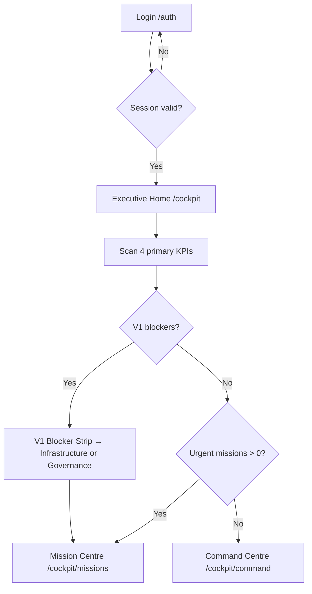
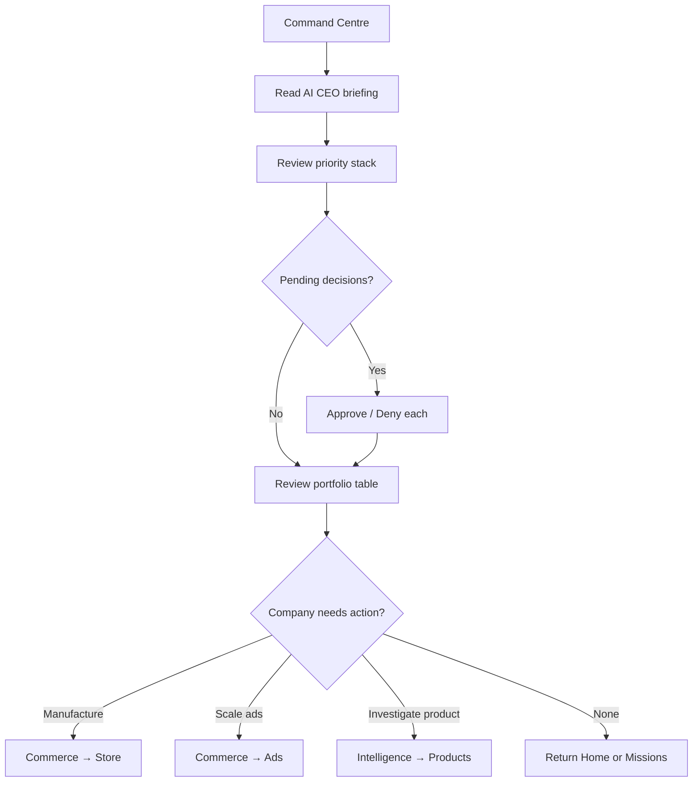
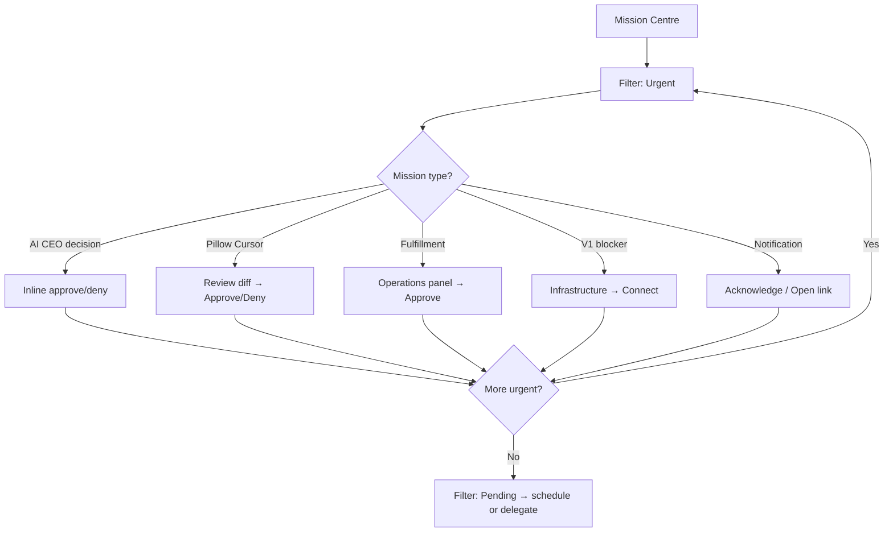
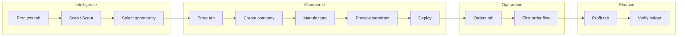
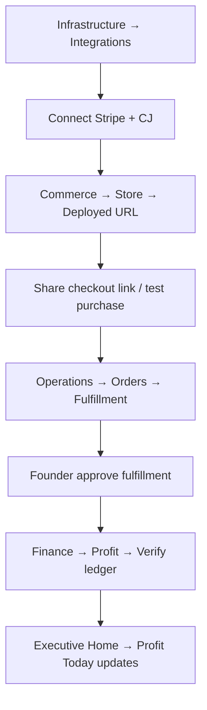
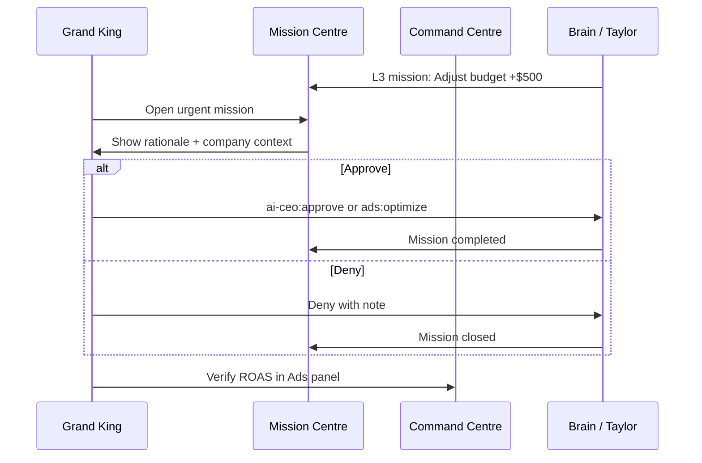
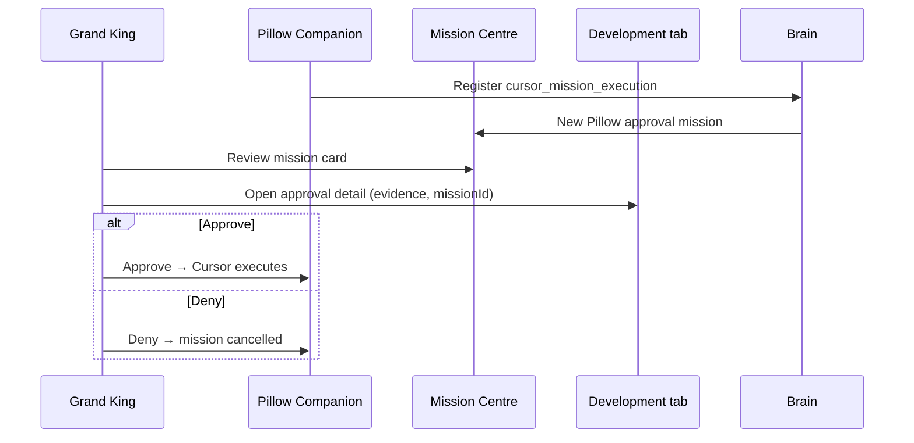
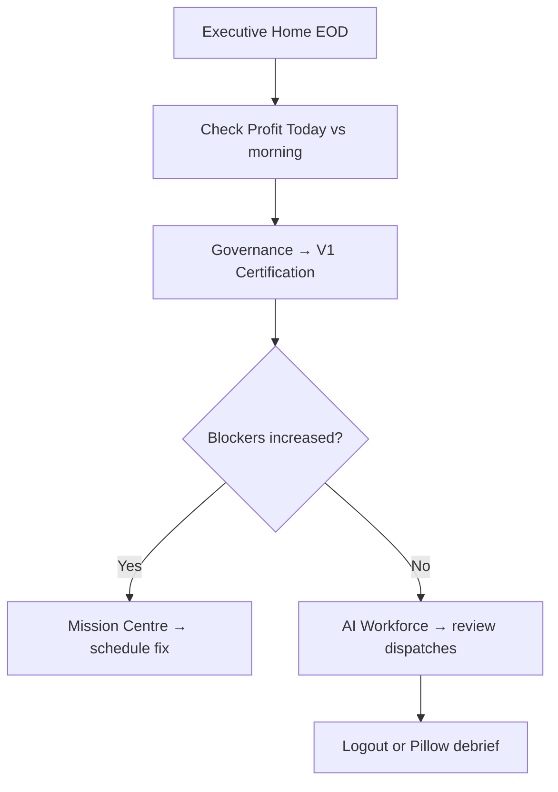

# Cockpit User Flow

**Mission:** REAL-079  
**Authority:** Grand King Executive Directive  
**Status:** V1 design — user flows and daily workflow  
**Version:** 1.0  

---

## 1. Personas

| Persona | Role | Primary Cockpit surfaces |
|---------|------|------------------------|
| **Grand King** | Founder / sovereign operator | Home, Command, Missions, Commerce, Finance |
| **Sentinel Admin** | Platform operator | Infrastructure Admin, AI Workforce Audit, Development |
| **Operator** | Day-to-day ops | Operations, Commerce (read), Intelligence (read) |

This document centers on **Grand King** daily workflow.

---

## 2. Grand King Daily Workflow

### 2.1 Overview

Grand King operates EmpireAI in **four daily modes**:

```
Morning Pulse → Command Session → Mission Triage → Department Deep Work
     │                │                  │                    │
  Executive Home   Command Centre    Mission Centre      Commerce / Finance / etc.
  (5–10 min)       (15–30 min)       (10–20 min)         (as needed)
```

### 2.2 Timeline (canonical day)

```mermaid
gantt
    title Grand King Daily Cockpit Workflow
    dateFormat HH:mm
    axisFormat %H:%M

    section Morning
    Login → Executive Home     :07:00, 10m
    Review pulse + KPIs        :07:05, 5m

    section Command
    Command Centre briefing    :07:15, 20m
    AI CEO decisions           :07:25, 10m

    section Missions
    Mission Centre triage      :07:45, 15m
    Approve Pillow / fulfillment :07:50, 10m

    section Deep Work
    Commerce / Launch          :08:00, 60m
    Intelligence scan          :09:00, 30m
    Finance check              :09:30, 15m

    section Afternoon
    Mission Centre check-in    :14:00, 10m
    Operations / orders        :14:15, 30m

    section Evening
    Executive Home EOD pulse   :18:00, 5m
    Governance / V1 blockers   :18:05, 10m
```



### 2.3 Step-by-step: Morning Pulse



**Grand King questions answered in 30 seconds:**

1. Am I profitable today? → K-E-003 Profit Today  
2. Is anything on fire? → Mission queue + V1 strip  
3. Are agents working? → SSE activity + K-E-006  
4. What needs my brain? → Pending decisions count  

### 2.4 Step-by-step: Command Session



### 2.5 Step-by-step: Mission Triage



---

## 3. Core User Flows

### 3.1 Flow: Manufacture a new company



| Step | Screen | Action | Brain |
|------|--------|--------|-------|
| 1 | Intelligence → Products | Run scan | `intelligence:scan` |
| 2 | Commerce → Store | Create company | `store:create` |
| 3 | Commerce → Store | Manufacture | `store:manufacture` |
| 4 | Commerce → Store | Preview | `store:get_storefront` |
| 5 | Infrastructure → Deployments | Deploy | `production-deploy:execute_vercel` |
| 6 | Operations → Orders | Monitor | `orders:load` |

### 3.2 Flow: First revenue (Grand King path)



### 3.3 Flow: Approve autonomous ad spend



### 3.4 Flow: Pillow Cursor mission



### 3.5 Flow: End-of-day governance check



---

## 4. Entry Points

| Entry | Destination | Condition |
|-------|-------------|-----------|
| Login success | Executive Home | Default all roles |
| Post-login (founder) | Executive Home | `post-login-destination` |
| Deep link `/cockpit/missions?id=` | Mission detail | Notification click |
| Deep link `/cockpit/commerce/store?company=` | Store detail | Activity feed |
| Pillow "Go to screen" | Contextual department | Screen context map |
| V1 blocker click | Governance → V1 | Blocker strip |

---

## 5. Navigation Flow Patterns

### 5.1 Hub-and-spoke

Grand King rarely browses sidebar linearly. Pattern:

```
Home → (issue detected) → Department → (action) → Mission Centre → Home
```

### 5.2 Mission-driven

```
Notification / Approval bar → Mission Centre → Target department → Back
```

### 5.3 Command-driven

```
Command Centre → Decision → Commerce/Finance/Intelligence → Command Centre
```

---

## 6. Error & Empty States

| State | Screen | Grand King message | CTA |
|-------|--------|-------------------|-----|
| Not authenticated | Any | Session expired | Login |
| Brain unreachable | Any | Brain API unavailable | Retry · Status |
| No companies | Command / Commerce | No ventures yet | Intelligence → Create |
| No missions | Mission Centre | All clear — empire running | Command Centre |
| Demo data mode | Any department | Demo data — connect integrations | Infrastructure |
| Sandbox fulfillment | Operations | Sandbox mode active | Connect CJ (live) |
| Operator denied | Finance | Insufficient permissions | Home |

---

## 7. Mobile / Tablet Flow (V1.1)

Grand King mobile is **Mission-first**, not department-deep:

```
Mobile landing → Mission Centre (urgent only)
              → Executive Home (KPI strip vertical)
              → Pillow FAB (primary action)
```

Department deep work deferred to desktop.

---

## 8. Keyboard Shortcuts (V1.1)

| Shortcut | Action |
|----------|--------|
| `⌘K` / `Ctrl+K` | Pillow Companion |
| `⌘M` | Mission Centre |
| `⌘H` | Executive Home |
| `⌘⇧C` | Command Centre |
| `g then m` | Go to Missions (vim-style, optional) |

---

## 9. Flow → Screen Map Index

| Flow | Primary screens | Document |
|------|-----------------|----------|
| Daily workflow | Home, Command, Missions | This doc §2 |
| Manufacture company | Intelligence, Commerce, Ops, Finance | §3.1 |
| First revenue | Infrastructure, Commerce, Ops, Finance | §3.2 |
| Ad approval | Missions, Command, Commerce/Ads | §3.3 |
| Pillow mission | Missions, Development | §3.4 |
| EOD governance | Home, Governance, Workforce | §3.5 |

Full screen inventory: `COCKPIT_SCREEN_MAP.md`

---

## 10. Success Metrics (UX)

| Metric | Target | Measures |
|--------|--------|----------|
| Time to first KPI on Home | < 3s | Performance |
| Morning pulse completion | < 10 min | Session analytics |
| Mission resolution rate | > 90% same day | Mission Centre |
| Clicks to approve decision | ≤ 3 | Mission flow |
| Department depth sessions | ≥ 2/day on active launch days | Navigation analytics |

---

*REAL-079 — Cockpit User Flow v1.0*
