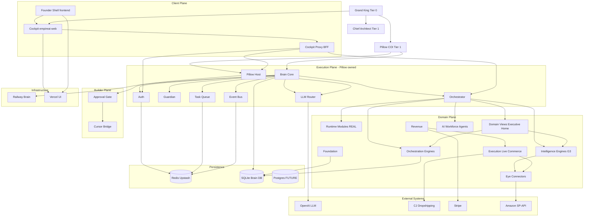

# 03 — Architecture Dependency Graph

---

## Highest-Level Architecture

**Root:** Grand King → Pillow (technical owner) → Brain (execution) → Domain implementations → Infrastructure

**Highest-level runtime dependency:** Client (Cockpit) → Cockpit Proxy → Brain → Redis/SQLite/External APIs

---

## Dependency Graph (Mermaid)



---

## Leaf Architecture (No Downstream Empire Dependencies)

| Leaf | Type |
|------|------|
| External APIs (OpenAI, CJ, Stripe, Amazon) | External |
| Grand King (human) | Authority |
| Chief Architect (doc role) | Authority |
| Vercel / Railway / Upstash | Infrastructure |
| Evidence JSON artifacts | Doc evidence |
| `ai-agents/` README stub | Stub |

---

## Dependency Matrix (Major Subsystems)

| Subsystem | Depends on | Depended on by |
|-----------|------------|----------------|
| Grand King | — | All UX, approvals |
| Cockpit | BFF, Brain dispatch, Pillow | Grand King |
| Cockpit Proxy | Brain URLs, env | Cockpit |
| Brain | Redis, SQLite, env | All routes, Pillow Host |
| Pillow Host | Pillow package, LLMRouter, governance bundle | Cockpit Pillow panel |
| Pillow package | Repo root, OpenAI (via adapter) | Pillow Host |
| Auth | Redis/SQLite users | All protected routes |
| Orchestrator | Tool registry, agents | Dispatch, Cockpit |
| Guardian | Brain subsystems | Health, dispatch pre-checks |
| Executive Home | Domain views, orchestration lite path | Cockpit command |
| Intelligence engines | Eye, SQLite, connectors | Dispatch, commerce gates |
| Runtime modules | Brain tools, SQLite | Dispatch (primary prod path) |
| Eye | External APIs | Intelligence, execution |
| Cursor Bridge | Pillow session, approvals SQLite | Builder missions |
| Task queue | Redis BullMQ | Agents, workflows |
| Foundation | SQLite | Governance modules, soul runtime |

---

## Circular Dependencies

| Cycle | Severity | Resolution |
|-------|----------|------------|
| **None hard-coded in import graph at architecture level** | — | Module-level cycles may exist within `backend/src` — not architecture-breaking |
| **Soft cycle: Executive Home → orchestration → dispatch → Executive Home data** | Low | By design — aggregation reads engines it does not mutate in same request |
| **Soft cycle: Pillow Host → Brain LLM → audit → SQLite persist → event loop → dispatch** | Medium | Mitigated by debounced persist, cooperative yields (CURRENT) |
| **Documentation cycle: REAL-078 cites frontend/dashboard; production uses empireai-web** | High | **RECOMMENDED:** ADR + doc update — not runtime cycle |

**No fatal circular ownership cycles identified** — Pillow owns Brain owns dispatch; Cockpit does not own Brain.

---

## Duplicate Responsibilities (Architecture Level)

| Responsibility | Duplicate holders | RECOMMENDED owner |
|----------------|-------------------|-------------------|
| Executive UI | frontend/dashboard (legacy), empireai-web/cockpit, empireai-web/platform | Cockpit only |
| Architecture truth | 4 architecture docs | Canonical + operational split |
| Health check | `/health/live` vs Guardian vs Pillow health | Layered: liveness → Guardian → Pillow lifecycle |
| Session auth | BFF cookie handling + Brain auth + middleware | Brain authoritative; BFF proxy only |
| Executive council | Pillow council vs backend executive-council | Pillow companion vs Brain runtime — **keep separate** per REAL-078 |
| Product intelligence | PIE vs runtime live-product-intelligence | PIE owns scoring; runtime consumes |

---

## Architecture Violations (CURRENT vs Normative)

| Violation | Norm (REAL-078) | CURRENT | Severity |
|-----------|-----------------|---------|----------|
| Dual production client paths | One Cockpit shell | frontend + empireai-web | High |
| Extension HTTP off | Implied full Brain API | Gated by env | Medium (intentional) |
| SQLite not Postgres | Scalable DB target | SQLite primary | Medium (FUTURE) |
| Pillow minimal prod chat | Full COI | Trimmed path | Medium (document) |
| REAL-078 cockpit path stale | empireai-web | doc says frontend/dashboard | Low (doc) |
| Workers off at prod boot | Full async processing | Disabled at API boot | Medium |

---

## Architecture Gaps (Missing Nodes)

See `06_ARCHITECTURE_GAPS.md` — summary: Vision doc, ECC, VIE, production truth architecture node, unified commerce folder, browser E2E architecture, multi-instance architecture.

---

## Architecture Drift Summary

| Domain | Drift direction |
|--------|-----------------|
| Client | Implementation ahead of REAL-078 mapping |
| Persistence | Behind normative (Postgres) |
| HTTP surface | Behind normative (extension gating) |
| Pillow runtime | Production mode ≠ full package |
| Documentation | Volume exceeds single authority |

---

## Future Architecture Dependencies (FUTURE)

```
FUTURE: Postgres primary → reduces SQLite single-writer constraint
FUTURE: ECC → supervises Builder + dispatch queues
FUTURE: VIE → validates Vision ↔ implementation alignment
FUTURE: Unified Cockpit app → eliminates dual frontend
FUTURE: commerce/ namespace → consolidates scattered engines
FUTURE: Multi-instance Brain → requires Redis mandatory + session/externalized Pillow chat
```
