# 02 — Document Authority

**Purpose:** Define who owns, maintains, and holds authority over each documentation class.

---

## 1. Authority Levels

| Level | Code | Meaning | Examples |
|-------|------|---------|----------|
| **Sovereign** | A0 | Grand King final approval | Vision sign-off, Constitution Lock |
| **Apex Law** | A1 | Supreme commercial governing document | CTD |
| **Domain Law** | A2 | Domain constitution or doctrine | Engineering Constitution, GVD, Pillow Constitution |
| **Normative Spec** | A3 | Architecture and interface contracts | Canonical Architecture, Pillow Architecture Contract |
| **Programme** | A4 | Roadmaps, Bible, ADRs, Journey | EMPIREAI_ROADMAP, V1 Bible |
| **Operational** | A5 | Implementation truth, dev guides | EMPIREAI_STATUS, docs/ARCHITECTURE.md |
| **Evidence** | A6 | Immutable proof — no authority over law | Combined audits, artifact audits |
| **Historical** | A7 | Superseded — zero authority | SYSTEM_ARCHITECTURE cluster |
| **Navigation** | AN | Catalog only — no normative authority | Master Index (points to authority) |

---

## 2. Documentation Ownership Graph

```mermaid
flowchart TB
    GK[Grand King A0]
    CA[Chief Architect A1-strategic]
    PK[Pillow COI A2-Pillow]

    GK --> Vision[EMPIREAI_VISION.md A0/A2]
    GK --> Soul[EMPIREAI_SOUL.md A0]
    GK --> CTD[CTD A1]

    CA --> CTD
    CA --> EngConst[Engineering Constitution A2]
    CA --> CanonArch[Canonical Architecture A3]
    CA --> Roadmap[Master Roadmap A4]
    CA --> ADR[EMPIREAI_DECISIONS A4]
    CA --> MasterIdx[Master Index AN]

    PK --> PillowConst[Pillow Constitution A2]
    PK --> PillowEI[Pillow EI Constitution A2]

    CA --> OpsArch[docs/ARCHITECTURE.md A5]
    CA --> ProdTruth[Production Truth A5 - TO AUTHOR]

    GK --> Evidence[Evidence Archive A6]
    CA --> Evidence
```

---

## 3. Owner / Maintainer Matrix (Canonical Set)

| Document | Owner | Maintainer | Authority | Tier |
|----------|-------|------------|-----------|------|
| `EMPIREAI_CORE_CONSTITUTION_CTD.md` | Grand King | Chief Architect | A1 | 3 |
| `EMPIREAI_CONSTITUTION.md` | Chief Architect | Cursor (missions) | A2 | 3 |
| `EMPIREAI_GOVERNANCE_DOCTRINE_GVD.md` | Grand King + Architect | Governance maintainer | A2 | 3 |
| `EMPIREAI_ARCHITECTURE_CONSTRAINTS_ACD.md` | Chief Architect | Architecture maintainer | A2 | 3 |
| `EMPIREAI_UX_IDENTITY_DOCTRINE_UID.md` | Grand King + Architect | Cockpit UX owner | A2 | 3 |
| `EMPIREAI_COMMERCIAL_BUSINESS_DOCTRINE_CBD.md` | Grand King | Commerce owner | A2 | 3 |
| `EMPIREAI_BL_C_CONTINUOUS_IMPROVEMENT_CONSTITUTION.md` | Grand King | Enhancement register owner | A2 | 3 |
| `EMPIREAI_PILLOW_CONSTITUTION.md` | Pillow COI under Grand King | Pillow + Brain host | A2 | 3 |
| `EMPIREAI_PILLOW_EXECUTIVE_INTELLIGENCE_CONSTITUTION.md` | Pillow COI | EI maintainers | A2 | 3 |
| `EMPIREAI_PILLOW_MEMORY_DOCTRINE.md` | Pillow COI | Pillow | A2 | 3 |
| `docs/executive-intelligence/EI0–EI10` | EI programme | EI maintainers | A2 | 3 |
| `docs/executive-intelligence/PILLOW_EXECUTIVE_CONSTITUTION.md` | EI programme | EI maintainers | A2 | 3 |
| `docs/architecture/EMPIREAI_CANONICAL_ARCHITECTURE.md` | Chief Architect | Architecture maintainer | A3 | 3 |
| `PILLOW_ARCHITECTURE_CONTRACT.md` | Pillow COI | Pillow + Brain | A3 | 3 |
| `EMPIREAI_PILLOW_ARCHITECTURE.md` | Pillow COI | Pillow | A3 | 3 |
| `EMPIREAI_EYE_ARCHITECTURE.md` | Chief Architect | Eye module owner | A3 | 3 |
| `CANONICAL_EKLS_SPECIFICATION.md` | Chief Architect | Knowledge owner | A3 | 3 |
| `docs/architecture/cockpit/*` | UID doctrine owner | Cockpit builders | A3 | 3 |
| `EMPIREAI_VISION.md` | Grand King + Architect | Chief Architect | A2 | 2 |
| `EMPIREAI_SOUL.md` | Grand King | Chief Architect | A2 | 2 |
| `EMPIREAI_ROADMAP.md` | Grand King + Architect | Chief Architect | A4 | 4 |
| `PILLOW_ROADMAP.md` | Pillow COI | Pillow | A4 | 4 |
| `artifacts/empireai-version-1-build-hierarchy-bible.md` | Chief Architect | Chief Architect | A4 | 4 |
| `JOURNEY.md` | Operations | Cursor + Grand King | A4 | 4 |
| `EMPIREAI_STATUS.md` | Operations | Cursor + Grand King | A5 | 4 |
| `EMPIREAI_DECISIONS.md` | Chief Architect | Cursor | A4 | 4 |
| `EMPIREAI_REPOSITORY_MASTER_INDEX.md` | Chief Architect | Index maintainer | AN | — |
| `docs/governance/EXECUTIVE_AUDIT_INDEX.md` | Governance | Audit maintainer | A4 | 4 |
| `deployment/MANAGED_DEPLOYMENT.md` | Grand King + DevOps | DevOps | A5 | 5 |
| `docs/ARCHITECTURE.md` | Chief Architect | Engineering | A5 | 5 |
| `docs/governance/EMPIREAI_PRODUCTION_TRUTH.md` | Grand King + Architect | Chief Architect | A5 | 5 |
| `docs/governance/EMPIREAI_CONSTITUTION_HIERARCHY.md` | Chief Architect | Chief Architect | A2 | 3 |

---

## 4. Domain Authority Summary

| Domain | Decides (Owner) | Updates (Maintainer) | Authority level |
|--------|-----------------|----------------------|-----------------|
| Vision | Grand King | Chief Architect | A2 (once authored) |
| Soul | Grand King | Chief Architect | A2 |
| CTD | Grand King | Chief Architect | **A1 apex** |
| Engineering Constitution | Chief Architect | Cursor missions | A2 |
| Governance registers | Grand King | Governance maintainer | A4 |
| Architecture (normative) | Chief Architect | Architecture maintainer | A3 |
| Pillow docs | Pillow COI | Pillow + EI | A2–A3 |
| Executive Intelligence | EI programme | EI maintainers | A2 |
| Commerce | Grand King (CBD) | Commerce owner | A2–A4 |
| Cockpit specs | UID owner | Cockpit builders | A3 |
| Brain operational | Engineering Constitution | Brain team | A5 |
| Production | Grand King + DevOps | DevOps + Architect | A5 |
| Journey / Status | Operations | Cursor + Grand King | A4–A5 |
| Roadmaps | Domain owners | Domain maintainers | A4 |
| Bible (V1) | Chief Architect | Chief Architect | A4 |
| Master Index | Chief Architect | Index maintainer | AN |
| ADR register | Chief Architect | Cursor | A4 |
| Audits / Evidence | Governance archive | Audit authors (immutable) | A6 |
| Historical | Governance archive | None (frozen) | A7 |

---

## 5. Authority Conflicts Requiring ADR

| Conflict | CURRENT authority | RECOMMENDED resolution |
|----------|-------------------|------------------------|
| Production Grand King UI | Unclear — both `frontend/` and `empireai-web/` deployed | ADR-CON-001 — Grand King names production Cockpit authority |
| Pillow full COI vs production minimal chat | Pillow Constitution (full) vs Brain stability (trimmed) | Production Truth doctrine documents **Production Mode** |
| Extension HTTP routes vs full Brain API | Code defaults off; docs imply full surface | Production Truth + ADR-CON-002 |
| CTD vs Engineering on commercial matters | CTD wins (stated in Engineering Constitution) | Constitution hierarchy one-pager makes explicit |
| REAL-078 Cockpit path vs production | REAL-078 lists `frontend/dashboard`; production uses `empireai-web/cockpit` | Amend REAL-078 at Constitution Lock or ADR footnote |

---

## 6. Who May Amend What

| Classification | Who may amend | Process |
|----------------|---------------|---------|
| CANONICAL (Tier 3 law) | Grand King approval + Chief Architect draft | Constitution amendment / BL-C register |
| CANONICAL (Tier 2 identity) | Grand King sign-off | Identity ceremony |
| CANONICAL (Tier 4 programme) | Chief Architect + domain owner | ADR or roadmap revision |
| OPERATIONAL | Maintainer + mission PR | Standard doc update with Journey entry |
| EVIDENCE | **Nobody** — append new evidence only | New audit file |
| HISTORICAL | **Nobody** — label only | Master Index classification |

**CURRENT:** Amendment rules exist implicitly in GVD and BL-C.  
**RECOMMENDED:** Encode in `EMPIREAI_CONSTITUTION_HIERARCHY.md` at Constitution Construction.  
**FUTURE:** Automated index validation on PR (optional).

---

## 7. Agent Authority Rule

Agents **must not** treat EVIDENCE or HISTORICAL documents as authority over CANONICAL law. When uncertain, escalate to CTD → Constitution hierarchy one-pager → Chief Architect.
