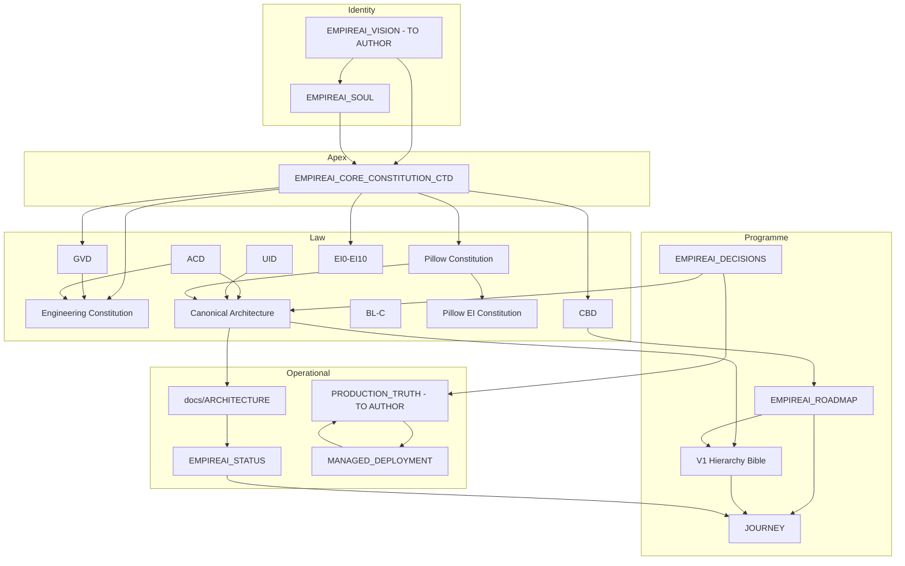
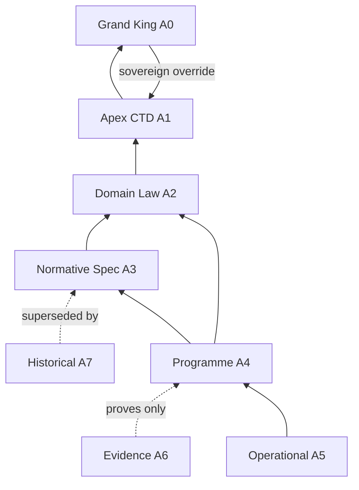
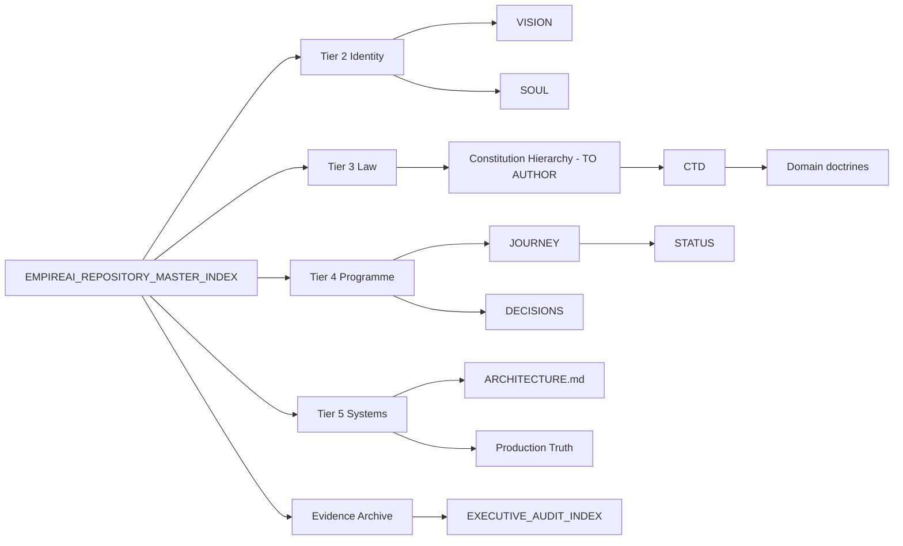

# 04 — Document Dependencies

**Purpose:** Map how documents depend on, cite, and consume each other.

---

## 1. Document Dependency Graph



---

## 2. Document Authority Graph



---

## 3. Document Navigation Graph



**Agent entry rule:** Always START → classify tier → read apex law if legal question.

---

## 4. Document Ownership Graph

See `02_DOCUMENT_AUTHORITY.md` §3 for full matrix. Summary edges:

- Grand King → CTD, Vision, Soul sign-off
- Chief Architect → Engineering Constitution, Canonical Architecture, Roadmaps, ADRs, Master Index
- Pillow COI → Pillow Constitution stack, Pillow roadmaps
- EI programme → EI library
- DevOps + Architect → Production docs
- Governance archive → Evidence (immutable)

---

## 5. Key Dependency Chains

### Chain A — Constitution Construction

```
Master Index → Constitution Hierarchy (future) → CTD → all Tier 3 law → V1 Bible → Journey
```

### Chain B — Production question

```
Production Truth (future) → MANAGED_DEPLOYMENT → EMPIREAI_STATUS → /health/live evidence
```

### Chain C — Architecture question

```
Canonical Architecture → ACD → Pillow Architecture Contract → docs/ARCHITECTURE.md → code
```

### Chain D — Pillow behaviour

```
Pillow Constitution → Pillow EI Constitution → Memory Doctrine → Pillow host code
```

### Chain E — Audit citation

```
EXECUTIVE_AUDIT_INDEX → COMBINED_EXECUTIVE_AUDIT_* → artifact audit → evidence JSON
```

---

## 6. Consumer Matrix (Who Reads What)

| Consumer | Primary docs | Secondary docs |
|----------|--------------|----------------|
| Grand King | CTD, Vision, Soul, Journey, STATUS | Cockpit specs, certification checklists |
| Chief Architect | Full Tier 3–4 stack | All audit packs |
| Cursor / Builder agents | Engineering Constitution, Cursor standards, STATUS, Journey | Operational architecture |
| Pillow runtime | Pillow Constitution, EI library, Production Truth | Pillow Architecture |
| Cockpit developers | UID, cockpit specs, Cockpit roadmap | docs/ARCHITECTURE.md |
| DevOps | MANAGED_DEPLOYMENT, Production Truth, env templates | EMPIREAI_STATUS |
| External auditors | EXECUTIVE_AUDIT_INDEX, combined audits, evidence JSON | CTD, certification mode |
| New repo agents | Master Index → Constitution Hierarchy → CTD | This audit pack |

---

## 7. Circular Dependency Risks

| Cycle | Risk | Resolution |
|-------|------|------------|
| Journey ↔ STATUS | Both update ops state | Journey = index; STATUS = snapshot — STATUS feeds Journey |
| Roadmap ↔ Bible | Overlap in programme scope | Roadmap = sequence; Bible = structure — precedence in `03` |
| Canonical Architecture ↔ REAL-078 missions | Missions reference architecture that references missions | REAL-### as mission IDs only; architecture cites capabilities not mission list |
| Master Index ↔ all docs | Index must list everything | Index is AN authority — never normative |

**No blocking circular dependencies** identified that prevent Constitution Construction.

---

## 8. External Dependencies (Non-Repo)

| Dependency | Document anchor | Notes |
|------------|-----------------|-------|
| Railway (Brain) | MANAGED_DEPLOYMENT | Production URL evidence |
| Vercel (Cockpit/Frontend) | MANAGED_DEPLOYMENT, vercel configs | Dual deploy path — ADR pending |
| Upstash Redis | Production Truth (future) | Session durability |
| SQLite volume | Canonical Architecture REAL-132 | FUTURE Postgres migration |
| OpenAI / LLM providers | Pillow Architecture, Brain config | Operational |

---

## 9. Audit Pack Dependencies

This documentation pack **depends on**:

| Input | Path |
|-------|------|
| Full All-Angle Audit | `docs/audits/full-empireai-audit/` |
| Hierarchy Normalization | `docs/audits/hierarchy-normalization/` |
| Canonical Architecture | `docs/audits/canonical-architecture/` |

**Consumed by (FUTURE):** Constitution Construction ceremony, Master Index refresh, ADR backlog CON-001–CON-019.

---

## 10. Dependency Health

| Metric | Assessment |
|--------|------------|
| Apex dependencies clear | **Yes** — CTD is root |
| Missing nodes | **4** — Vision, hierarchy one-pager, production truth, Tier 6 deferral |
| Broken edges (stale index) | **2** — audit index, docs/README |
| Evidence properly leaf-node | **Yes** — evidence does not depend on mutable law |
