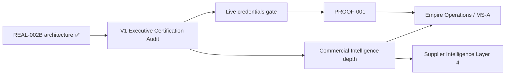

# Commercial Integration → Commercial Intelligence Transition

> **Authority:** Grand King Commercial Architecture Decision  
> **Status:** Strategic planning — post-Version 1 Executive Certification Audit guidance  
> **Date:** 2026-06-29  
> **Scope:** Planning only. No runtime, contract, or Journey renumbering changes authorized by this document.

---

## 1. Executive summary

**REAL-002B (Live Commerce Integration)** completes the **foundational commercial integration layer** for EmpireAI Version 1. With OAuth, credential vault, catalog/inventory/pricing/order sync, webhooks, failure recovery, and go-live assessment in place (`COMBINED_EXECUTIVE_AUDIT_REAL-002B.md`), the empire's next strategic development focus shifts from **connecting providers** to **competing on intelligence**.

**API integrations are infrastructure** — necessary, governed, and certifiable — but not the primary source of competitive advantage. Advantage accrues through **Commercial Intelligence**: product, supplier, pricing, margin, advertising, and demand capabilities that reuse live integration pipes without duplicating connector logic.

This transition takes effect for **post-V1 development prioritization** after the **EmpireAI Version 1 Executive Certification Audit** completes. It does not alter V1 runtime, approval gates, or live-commerce safety controls.

**Decision Register:** ADR-045 · Cross-ref: `EMPIREAI_ROADMAP.md` Layer 3 · `PILLOW_ROADMAP.md` · ADR-013 (COS-001)

---

## 2. REAL-002B — foundation layer complete

### 2.1 What REAL-002B closes

| Capability | Status (architecture) | Owner |
|---|---|---|
| Marketplace OAuth + credential vault | ✅ REAL-002B | `reality-integration/live-commerce/` |
| Supplier authentication (CJ) | ✅ REAL-002B | Live commerce adapters |
| Live catalog / inventory / pricing / order sync | ✅ REAL-002B | Sync services |
| Webhook processing + dead-letter | ✅ REAL-002B | Webhook pipeline |
| Failure recovery + security review | ✅ REAL-002B | Recovery + go-live assessment |
| Connector runtime live validation | ✅ REAL-002B on REAL-002A | `connector-runtime.ts` |

REAL-002B sits on **REAL-002A** (connector framework) and **REAL-001/002** (reality integration architecture) per ADR-013 COS-001 Connector Kernel doctrine.

### 2.2 What remains outside REAL-002B (operational gates, not architecture gaps)

| Gate | Meaning |
|---|---|
| Grand King **VERIFIED live credentials** | Production Amazon SP-API + supplier keys — operational, not architectural |
| **PROOF-001** | First verified live net profit event |
| **MS-A / MS-B** | Milestone profit thresholds (ADR-015) |
| **GK-GOLIVE-APPROVAL** | Grand King authorization for public rollout |

These gates **must remain** under all future Commercial Intelligence work.

### 2.3 Strategic declaration

> **Foundational commercial integration is complete at the architecture layer.**  
> Further connector work (additional marketplaces, payment rails, logistics APIs) is **maintenance and expansion of infrastructure**, scheduled by commercial priority — not the primary V1+ engineering narrative.

---

## 3. Integrations as infrastructure (not differentiation)

### 3.1 Principle

| Layer | Role | Competitive weight |
|---|---|---|
| **Integration / Connector** | Authenticate, sync, validate, recover — COS Connector Kernel | **Table stakes** — required to operate |
| **Governance / Approval** | GC-02, Pillow approval gate, Grand King decisions, Guardian | **Non-negotiable** — trust and safety |
| **Commercial Intelligence** | Score, recommend, optimize, forecast — reuse live data | **Primary differentiation** |

### 3.2 Rules for post-V1 engineering

1. **No new commerce capability shall duplicate REAL-002B connector logic** — intelligence modules consume integration outputs.
2. **New provider adapters** follow REAL-002B patterns (OAuth, vault, sync, webhook, recovery) — classified as **infrastructure missions**, not intelligence missions.
3. **Intelligence modules** must declare **reusedModules** and bind to existing dashboards/APIs (pattern: REAL-031/032/033 chiefs, CIS, supplier-intelligence).
4. **CBD-007/008** (Empire owns Product and Pricing Intelligence) govern intelligence ownership — suppliers and marketplaces provide data, Empire owns decisions.

---

## 4. Commercial execution lifecycle — validation framework

Before scaling Commercial Intelligence, the empire validates that the **full execution lifecycle** is architecturally present and governable. Validation is **lifecycle completeness**, not live-revenue proof (that is PROOF-001).

### 4.1 Lifecycle map

| Stage | Question | V1 architectural owner | Validation signal |
|---|---|---|---|
| **Product** | Can we discover, score, and prepare products for commerce? | Product discovery · PIE · REAL-003→007 pipeline | Products in pipeline; listing intelligence outputs |
| **Supplier** | Can we source, score, and connect suppliers? | Supplier Intelligence (SUP) · REAL-002B CJ adapter | Supplier dashboard; live connector status |
| **Marketplace** | Can we publish and sync to marketplaces? | REAL-003 publishing · REAL-002B Amazon SP-API | OAuth complete; sync jobs; readiness dashboard |
| **Customer** | Do we understand buyer trust, psychology, retention? | REAL-033 · customer-intelligence | Chief of Customer recommendations |
| **Order** | Can orders flow from capture to fulfillment? | Customer order pipeline · live-cj-fulfillment | Pipeline states; fulfillment bridge |
| **Payment** | Can payments be captured with governance? | Live payment engine | Payment methods; ledger events |
| **Profit** | Can we measure net profit and margin? | Empire economics · OFD · REAL-019/020 | Net profit on dashboard; SUCCESS-001 metrics |
| **Dashboard** | Does the King see one operating picture? | Ecommerce OS · Mission Home · Command Center · ESS | Live or explicit empty/error states (UX contract) |
| **Organizational Learning** | Does the empire retain and improve from outcomes? | Empire Knowledge · Pillow memory · PEI evidence | Learning records; executive audits; Journey sync |

### 4.2 Validation posture (post REAL-002B)

| Dimension | V1 state | Post-transition focus |
|---|---|---|
| Architecture wired | ✅ REAL-001→100 built | **Depth and live proof** per stage |
| Live credentials | 🔴 Pending Grand King | Infrastructure ready; intelligence blocked on **live data** until credentialed |
| Governance on money-moving actions | ✅ GC-02 · Pillow · Guardian | **Preserve** — intelligence recommends; King approves |
| Lifecycle audit | 🟡 Per-stage readiness varies | **Commercial Intelligence** closes gaps in scoring/optimization, not connectors |

### 4.3 Certification sequence (after V1 Executive Certification Audit)

1. Executive Certification Audit signs V1 architecture complete.  
2. Lifecycle validation checklist run against Grand King account (explicit pass/fail per stage).  
3. PROOF-001 attempts with live credentials (REAL-002B operational gate).  
4. Commercial Intelligence missions prioritized from §5 below.

---

## 5. Commercial Intelligence — next strategic focus

### 5.1 Definition

**Commercial Intelligence** is Layer 3 of the EmpireAI five-layer roadmap (`EMPIREAI_ROADMAP.md`):

```
Pillow Runtime ✅ → Pillow Executive Intelligence → Commercial Intelligence → Supplier Intelligence → Empire Operations
```

Commercial Intelligence transforms **connected commerce data** into **ranked decisions** — what to sell, from whom, at what price, on which marketplace, with what ad spend, expecting what demand — always **recommend-only** until Grand King approval.

### 5.2 Relationship to existing REAL modules

Many REAL-003+ modules are **architecturally built** but **intelligence depth** and **live activation** are the post-V1 work:

| Domain | Existing REAL / module anchors | Intelligence depth mission |
|---|---|---|
| Product | REAL-003→007 · PIE · product-discovery · REAL-013 | Product Intelligence consolidation |
| Supplier | SUP · REAL-015+ · supplier-intelligence | Supplier Intelligence (Layer 4 — follows CI) |
| Pricing | pricing-intelligence · CBD-008 · empire-economics | Pricing + margin optimization |
| Advertising | REAL-038 · meta-ads · global-advertising-intelligence | Advertising Intelligence |
| Demand | product-trend · forecasting modules | Demand Forecasting |

**Supplier Intelligence** remains **Layer 4** — specialized depth after cross-cutting Commercial Intelligence matures.

---

## 6. Priority capability stack (post-V1)

Ordered for **strategic planning** after V1 Executive Certification Audit. Grand King may reprioritize via Backlog Release (ADR-020 ROUTE 02).

| Priority | Capability | Purpose | Existing anchors | Governance |
|---|---|---|---|---|
| **P1** | **Product Intelligence** | What to sell — scores, lifecycle, winning listings | PIE · CIS · REAL-004 · REAL-013 · Eye Series | Recommend-only; publish gated |
| **P2** | **Supplier Intelligence** | From whom — trust, risk, CJ readiness | SUP · REAL-071 · supplier-intelligence | Connection via REAL-002B; no auto-order |
| **P3** | **Pricing Intelligence** | At what price — margin guard, competitive price | pricing-intelligence · CBD-008 · REAL-031 | Margin changes gated (GC-02) |
| **P4** | **Margin Optimization** | Net profit maximization across SKU/market | empire-economics · REAL-019/020 · AI CFO | No ungated price/promo changes |
| **P5** | **Advertising Intelligence** | ROAS, spend efficiency, creative loop | REAL-038 · ads connectors | Spend gated (GC-02 · REAL-086) |
| **P6** | **Demand Forecasting** | What will sell — trend + inventory alignment | product-trend-intelligence · inventory-intelligence | Forecasts inform; King decides scale |

### 6.1 Cross-cutting enablers (parallel, not sequential blockers)

- **ESS + Eye Series** — surveillance and observation feed intelligence (GC-03, GC-05).  
- **REAL-031/032/033 chiefs** — executive recommendation surfaces (GC-05).  
- **Empire Knowledge + PEI** — organizational learning loop.  
- **Pillow Executive Intelligence (Layer 2)** — evidence-based mission planning before CI depth missions execute.

---

## 7. Governance preservation (non-negotiable)

All Commercial Intelligence development **must preserve**:

| Gate | Owner | Rule |
|---|---|---|
| **GC-02 Approval Bar** | GKR · EC · REAL-086 | Money-moving actions require visible approval |
| **Pillow Approval Gate** | PILLOW-017 | Repository writes · Cursor missions · audit generation |
| **Guardian pre-dispatch** | Brain · ADR-004 | Destructive payloads blocked |
| **REAL-002B live-commerce safety** | reality-integration | Sandbox/production mode · webhook signature · dead-letter |
| **Credential vault** | REAL-002B · REAL-004 foundation | No plaintext secrets |
| **Grand King sole operation** | ADR-016 | Grand King account until MS-B |
| **Recommend-only chiefs** | REAL-031/032/033 | Intelligence proposes; King disposes |
| **Journey sync** | ADR-014 · ADR-026 | New CI missions get Journey rows before implementation |

**Commercial Intelligence shall never bypass** Soul approval doctrine, Executive Council debate chain (REAL-007/055/056), or live-commerce go-live assessment.

---

## 8. Sequencing relative to V1 certification



| Phase | Focus | Starts when |
|---|---|---|
| **Now (V1)** | Architecture complete · REAL-002B ✅ · UX ✅ · Pillow Runtime ✅ | Current |
| **Certification** | V1 Executive Certification Audit | Grand King review |
| **Post-cert planning** | This document governs CI prioritization | After certification |
| **Operational proof** | Live credentials · PROOF-001 · MS-A | Parallel to CI depth; blocked on creds for live data |
| **CI depth missions** | P1→P6 capability stack | After certification; may use sandbox/simulated until creds |

---

## 9. What does not change

- REAL-002B runtime implementation and routes  
- REAL-003→100 module contracts and Journey numbering (ADR-044)  
- UX Implementation Contract acceptance criteria  
- COS-001 kernel architecture (ADR-013)  
- Closed Backlog Releases (BL-A, BL-B)  
- MS-A / MS-B milestone definitions (ADR-015)  

---

## 10. Repository owners

| Artifact | Owner | Action on CI missions |
|---|---|---|
| `JOURNEY.md` | Repository Governance | Add rows for new CI missions after Grand King approval |
| `EMPIREAI_ROADMAP.md` | Strategic direction | Layer 3 status updates |
| `PILLOW_ROADMAP.md` | Pillow Architecture | Align Layer 3 with CI priorities |
| `MASTER_COMPLETION_LEDGER.md` | Commercial program | Track CI mission completion |
| Combined Executive Audits | Audit standard ADR-021 | One audit per CI tranche |
| `reality-integration/` | Infrastructure only | Adapter expansion — not CI differentiation |

---

*Grand King Commercial Architecture Decision · Strategic planning only · Stop.*
