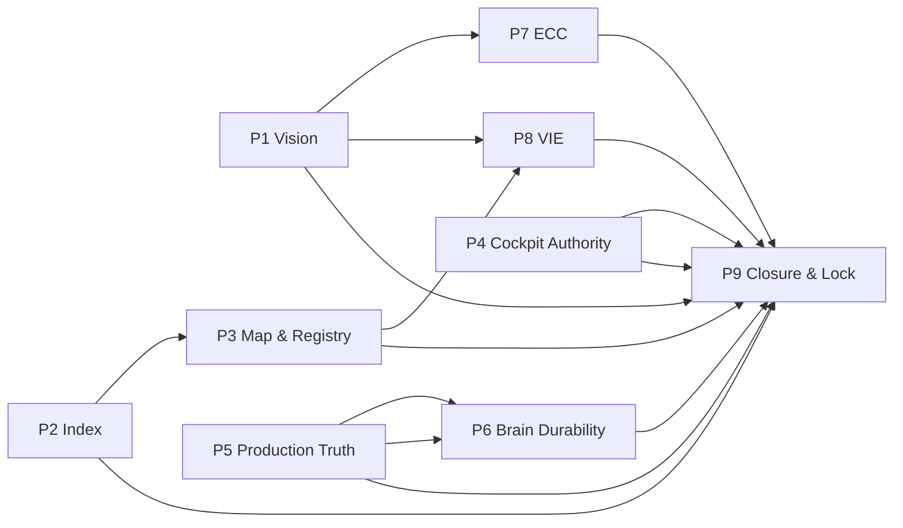

# EMPIREAI CONSTITUTION LOCK

> **Classification:** CANONICAL — Tier 3 Law (Governance Register)  
> **Document ID:** CONSTITUTION-LOCK-001  
> **Constitutional Lock date:** **2026-07-04**  
> **Constitutional Lock authority:** **Grand King**  
> **Status:** **LOCKED** — constitutional execution baseline is permanent  
> **Supreme law:** `EMPIREAI_CORE_CONSTITUTION_CTD.md` (CTD remains apex governing document)  
> **Evidence source:** Grand King approval of the EmpireAI Constitutional Execution Roadmap · synthesized from Full All-Angle Audit constitution backlog (`docs/audits/full-empireai-audit/16_RECOMMENDED_CONSTITUTION_BACKLOG.md`) · Canonical Documentation Reconstruction (`docs/audits/canonical-documentation/`)

---

## 1. Purpose

This document permanently records the **locked Constitutional Execution Roadmap** — the authoritative sequence for completing EmpireAI's constitutional documentation and governance baseline before and through Constitution Lock.

This document is **not** a redesign. It is the **frozen baseline** approved by the Grand King.

---

## 2. Constitutional Execution Roadmap (Locked)

The EmpireAI Constitutional Execution Roadmap defines **nine immutable phases (P1–P9)** containing **nineteen immutable task IDs (CON-001 through CON-019)**.

**Execution rule:** Phases execute in order **P1 → P2 → … → P9**. Task dependencies within and across phases are **immutable**.

**Append rule:** Future discoveries become **new roadmap items** (CON-020+, or a future roadmap register). They **do not** modify, reorder, rename, or merge existing phases P1–P9 or tasks CON-001–CON-019.

---

## 3. Locked Phase Structure (P1–P9)

| Phase ID | Phase Name | Locked Task IDs | Dependencies |
|----------|------------|-----------------|--------------|
| **P1** | Vision Foundation | CON-001 | — |
| **P2** | Master Index Classification | CON-002 | — |
| **P3** | Constitution Map & Audit Registry | CON-003, CON-004, CON-005 | CON-004 → CON-002 · CON-005 → CON-002 |
| **P4** | Production Cockpit Authority | CON-006 | — |
| **P5** | Production Truth & Route Policy | CON-007, CON-008, CON-009 | CON-008 → CON-007 · CON-009 → CON-007 |
| **P6** | Brain Durability & Session Policy | CON-010, CON-011, CON-012 | CON-010 → CON-009 · CON-011 → CON-008 · CON-012 → CON-009 |
| **P7** | Execution Control Center Resolution | CON-013 | CON-013 → CON-001 |
| **P8** | Vision Integrity & Engineering Constitution Map | CON-014, CON-015 | CON-014 → CON-001 · CON-015 → CON-004 |
| **P9** | Programme Closure & Constitutional Lock Ceremony | CON-016, CON-017, CON-018, CON-019 | CON-016 → CON-006 · CON-017 → CON-006 · CON-019 → CON-001…CON-018 |

---

## 4. Locked Phase IDs — Task Register

### P1 — Vision Foundation

| Task ID | Category | Task | Description | Owner | Destination |
|---------|----------|------|-------------|-------|-------------|
| CON-001 | Vision | Author canonical Vision File | Create `EMPIREAI_VISION.md` reconciling Soul, Marketplace OS Vision, and CTD commercial intent | Grand King + Architect | Root docs |

### P2 — Master Index Classification

| Task ID | Category | Task | Description | Owner | Destination |
|---------|----------|------|-------------|-------|-------------|
| CON-002 | Index | Update master navigation index | Refresh `EMPIREAI_REPOSITORY_MASTER_INDEX.md` with audit classifications (canonical/historical/obsolete) | Architect | Root docs |

### P3 — Constitution Map & Audit Registry

| Task ID | Category | Task | Description | Owner | Destination |
|---------|----------|------|-------------|-------|-------------|
| CON-003 | Index | Fix executive audit index | Align `docs/governance/EXECUTIVE_AUDIT_INDEX.md` to all 38 combined audits on disk | Governance | docs/governance |
| CON-004 | Docs | Constitution hierarchy map | **Complete (P2-01):** `EMPIREAI_CONSTITUTION_HIERARCHY.md` — Tiers 0–7 apex governance · precedence · citation | Governance | docs/governance |
| CON-005 | Docs | Mark obsolete architecture cluster | Label `docs/SYSTEM_ARCHITECTURE.md` + companions as HISTORICAL in index | Architect | docs/ |

### P4 — Production Cockpit Authority

| Task ID | Category | Task | Description | Owner | Destination |
|---------|----------|------|-------------|-------|-------------|
| CON-006 | UX | Resolve production frontend authority | ADR: which Vercel project (`frontend/` vs `empireai-web/`) serves empire-ai.co Grand King | Grand King | EMPIREAI_DECISIONS.md |

### P5 — Production Truth & Route Policy

| Task ID | Category | Task | Description | Owner | Destination |
|---------|----------|------|-------------|-------|-------------|
| CON-007 | Prod | Document production route policy | Doctrine: when `EMPIRE_ENABLE_EXTENSION_ROUTES` is enabled; critical vs extension surface | Brain | deployment/ |
| CON-008 | Prod | Document Pillow production mode | Explain minimal chat path vs full Pillow COI; Grand King expectations | Pillow | docs/governance |
| CON-009 | Prod | Production truth doctrine | Consolidate MANAGED_DEPLOYMENT + readiness checks + journey scripts into one canonical doc | Production | docs/governance |

### P6 — Brain Durability & Session Policy

| Task ID | Category | Task | Description | Owner | Destination |
|---------|----------|------|-------------|-------|-------------|
| CON-010 | Brain | Redis production hard requirement | Fail fast or explicit degraded banner when Redis unavailable in production | Brain | backend/config |
| CON-011 | Brain | Session durability plan | Redis-backed Pillow sessions or documented ephemeral policy in Constitution | Brain | pillow-host |
| CON-012 | Brain | SQLite durability doctrine | Document debounced persist + crash window; Postgres migration decision | Brain | docs/architecture |

### P7 — Execution Control Center Resolution

| Task ID | Category | Task | Description | Owner | Destination |
|---------|----------|------|-------------|-------|-------------|
| CON-013 | ECC | Define Execution Control Center scope | INTENDED HIERARCHY CHECK — design doc or explicit V2 deferral in Constitution | Architect | docs/governance |

### P8 — Vision Integrity & Engineering Constitution Map

| Task ID | Category | Task | Description | Owner | Destination |
|---------|----------|------|-------------|-------|-------------|
| CON-014 | VIE | Define Vision Integrity Engine scope | INTENDED HIERARCHY CHECK — design doc or explicit V2 deferral | Architect | docs/governance |
| CON-015 | Eng | Engineering Constitution ratification | **Complete (P2-03):** `EMPIREAI_CONSTITUTION.md` — lifecycle · acceptance · Builder · Cursor governance | Governance | Root docs |

### P9 — Programme Closure & Constitutional Lock Ceremony

| Task ID | Category | Task | Description | Owner | Destination |
|---------|----------|------|-------------|-------|-------------|
| CON-016 | Cockpit | Placeholder panel registry | List all "not yet implemented" SCR panels with target missions | Cockpit | empireai-web |
| CON-017 | Test | Browser E2E acceptance suite | Playwright/Cypress Grand King journey matching production scripts | QA | backend/scripts |
| CON-018 | Cursor | Clear pending bridge missions | Execute or archive `.cursor/missions/pending/bridge-*` | Builder | .cursor/missions |
| CON-019 | Lock | Constitution Lock ceremony | Grand King + Architect sign-off on canonical doc set listed in CON-004 | Grand King | docs/governance |

---

## 5. Phase Dependency Graph (Locked)

**Sequential phase order:** P1 → P2 → P3 → P4 → P5 → P6 → P7 → P8 → P9.

Cross-phase task dependencies in §3 and §4 are **immutable**.

---

## 6. Constitutional Rules (Locked)

### Rule 1 — Phase names are immutable

The phase names **P1 — Vision Foundation** through **P9 — Programme Closure & Constitutional Lock Ceremony** shall not be renamed.

### Rule 2 — Phase ordering is immutable

Phases **P1 → P2 → P3 → P4 → P5 → P6 → P7 → P8 → P9** shall not be reordered.

### Rule 3 — IDs are immutable

Phase IDs (**P1–P9**) and task IDs (**CON-001–CON-019**) shall not be changed, renumbered, or recycled.

### Rule 4 — Dependencies are immutable

All task and phase dependencies recorded in §3, §4, and §5 shall not be altered.

### Rule 5 — Future roadmap growth is append-only

Future discoveries, gaps, or missions **must** be recorded as **new items** (e.g. CON-020+, future roadmap registers, or post-lock ADRs).

New items **must not**:

- Modify existing phases P1–P9  
- Modify existing tasks CON-001–CON-019  
- Insert tasks into locked phases  
- Reorder locked phases  

### Rule 6 — Restructuring requires Constitutional Review

Any proposal to restructure phases P1–P9, tasks CON-001–CON-019, or these six rules requires an explicit:

**CONSTITUTIONAL REVIEW**

approved by the **Grand King**.

Until approved, this document and its locked structure remain in force.

---

## 7. Future Discoveries Policy (Locked)

| Situation | Required action |
|-----------|-----------------|
| New documentation gap discovered | Append **CON-0XX** (next ID) or new register entry — do not edit P1–P9 |
| New production policy needed | Append ADR in `EMPIREAI_DECISIONS.md` — do not modify locked tasks |
| New architecture domain | Append to roadmaps and ADRs — do not modify locked phases |
| Task in P1–P9 completed | Mark complete in Journey / status registers — do not remove or reword task |

**Principle:** The locked roadmap defines the **constitutional execution baseline**. Runtime implementation missions (REAL-###, PILLOW-###, etc.) remain governed by their respective roadmaps and defer to CTD and this lock for constitutional sequencing.

---

## 8. Hierarchy Integration

| Relationship | Document |
|--------------|----------|
| **Constitutional framework (entry point)** | `docs/governance/EMPIREAI_CONSTITUTIONAL_FRAMEWORK.md` |
| Constitution hierarchy map | `docs/governance/EMPIREAI_CONSTITUTION_HIERARCHY.md` |
| Supreme commercial law | `EMPIREAI_CORE_CONSTITUTION_CTD.md` |
| Engineering law | `EMPIREAI_CONSTITUTION.md` |
| Documentation system | `docs/audits/canonical-documentation/01_CANONICAL_DOCUMENT_SYSTEM.md` |
| Constitution backlog evidence | `docs/audits/full-empireai-audit/16_RECOMMENDED_CONSTITUTION_BACKLOG.md` |
| ADR register | `EMPIREAI_DECISIONS.md` |
| Navigation spine | `EMPIREAI_REPOSITORY_MASTER_INDEX.md` |
| Live status | `JOURNEY.md` · `EMPIREAI_STATUS.md` |

**Precedence:** CTD → domain law → this Constitution Lock register → programme roadmaps → operational docs.

---

## 9. Lock Certification

| Field | Value |
|-------|-------|
| **Constitutional Lock date** | **2026-07-04** |
| **Constitutional Lock authority** | **Grand King** |
| **Locked phases** | **P1, P2, P3, P4, P5, P6, P7, P8, P9** |
| **Locked task IDs** | **CON-001 through CON-019** |
| **Roadmap status** | **LOCKED** |
| **Implementation in this mission** | **None** — record only |

---

## 10. Revision History

| Version | Date | Authority | Change |
|---------|------|-----------|--------|
| 1.0.0 | 2026-07-04 | Grand King | Initial Constitution Lock — Constitutional Execution Roadmap P1–P9 locked |

**Amendment rule:** This document may only be amended via **CONSTITUTIONAL REVIEW** approved by the Grand King. Append-only growth of the execution roadmap occurs outside P1–P9 per Rule 5.
