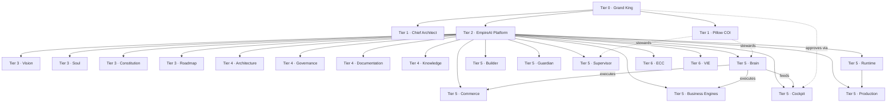

# EMPIREAI HIERARCHY

> **Classification:** CANONICAL — Tier 3 Law (Governance)  
> **Document ID:** P1-06  
> **Constitutional phase:** P1 — Identity Foundation  
> **Dependencies:** P1-01 · P1-02 · P1-03 · P1-04 · P1-05  
> **Authority:** Grand King  
> **Established:** 2026-07-04  
> **Role:** Single permanent **structural** hierarchy — where every component belongs  
> **This is NOT ownership** → [`EMPIREAI_OWNERSHIP_MODEL.md`](./EMPIREAI_OWNERSHIP_MODEL.md) · **NOT implementation**

**Parent framework:** [`EMPIREAI_CONSTITUTIONAL_FRAMEWORK.md`](./EMPIREAI_CONSTITUTIONAL_FRAMEWORK.md)  
**Ownership accountability:** [`EMPIREAI_OWNERSHIP_MODEL.md`](./EMPIREAI_OWNERSHIP_MODEL.md) (P1-05)  
**Reasoning chain:** [`EMPIREAI_REASONING_MODEL.md`](./EMPIREAI_REASONING_MODEL.md) (P1-02)  
**Naming authority:** [`EMPIREAI_NAMING_STANDARD.md`](./EMPIREAI_NAMING_STANDARD.md) (P1-07)  
**Terminology:** [`EMPIREAI_GLOSSARY.md`](./EMPIREAI_GLOSSARY.md) (P1-08)  
**Repository doctrine:** [`EMPIREAI_REPOSITORY_STRUCTURE.md`](./EMPIREAI_REPOSITORY_STRUCTURE.md) (P1-09)

**Specialized hierarchy maps (subordinate views):**
[`EMPIREAI_CONSTITUTION_HIERARCHY.md`](./EMPIREAI_CONSTITUTION_HIERARCHY.md) (P2-01 · **constitutional document authority**) · [`EMPIREAI_VISION_HIERARCHY.md`](./EMPIREAI_VISION_HIERARCHY.md) · [`EMPIREAI_ROADMAP_HIERARCHY.md`](./EMPIREAI_ROADMAP_HIERARCHY.md)

**Note:** P1-06 **EMPIREAI_HIERARCHY** = platform component placement. P2-01 **CONSTITUTION HIERARCHY** = constitutional document authority. Both required; different questions.

---

## 1. Purpose

P1-01 through P1-05 established **why** EmpireAI exists, **how** it reasons, **how** Vision compounds, **who** it remembers itself to be, and **who owns** what.

P1-06 establishes **where everything belongs** — one canonical position per component.

**Hierarchy defines structure.** It answers: *What is parent to what?* It does **not** answer *Who is accountable?* (ownership) or *How is it built?* (implementation).

**The principle:** One parent · no cycles · no duplicate authority · no ambiguity · every component has exactly **one** canonical location.

---

## 2. Hierarchy vs Ownership vs Modes

| Concept | Question | Canonical doc |
|---------|----------|---------------|
| **Hierarchy** | Where does it sit structurally? | **This document** |
| **Ownership** | Who is constitutionally accountable? | [`EMPIREAI_OWNERSHIP_MODEL.md`](./EMPIREAI_OWNERSHIP_MODEL.md) |
| **Authority** | Who may decide irreversibles? | Tier 0 Grand King · GVD · CTD |
| **Stewardship** | Who keeps fidelity day-to-day? | Pillow · Chief Architect (per ownership matrix) |
| **Execution** | Who runs it at runtime? | Brain · Builder · deployment pipeline |
| **Visualization** | Who displays live state? | Cockpit |

A component's **tier position** and **constitutional owner** are independent dimensions — e.g. Brain sits at **Tier 5** (structure) and is **owned by Pillow** (accountability).

---

## 3. Hierarchy Tree (Canonical)

```
TIER 0 — SUPREME AUTHORITY
└── Grand King

TIER 1 — STRATEGIC AUTHORITY (non-runtime)
├── Chief Architect (ChatGPT)
└── Pillow COI

TIER 2 — PLATFORM
└── EmpireAI
    │
    ├── TIER 3 — IDENTITY & PROGRAMME LAW
    │   ├── Vision          → EMPIREAI_VISION.md
    │   ├── Soul            → EMPIREAI_SOUL.md
    │   ├── Constitution    → CTD · doctrines · domain constitutions · Framework · Lock
    │   └── Roadmap         → EMPIREAI_ROADMAP.md · CON Lock P1–P9 · domain roadmaps
    │
    ├── TIER 4 — DESIGN & KNOWLEDGE PLANE
    │   ├── Architecture    → Canonical Architecture · ADRs · subsystem specs
    │   ├── Governance      → P1–P5 policies · supervisor · sync · accumulation
    │   ├── Documentation   → ECDS · Master Index · operational docs
    │   └── Knowledge       → EKLS · executive intelligence library · Soul runtime mirror
    │
    ├── TIER 5 — RUNTIME & COMMERCE PLANE
    │   ├── Brain             → orchestration kernel
    │   ├── Cockpit           → Grand King executive shell
    │   ├── Builder           → Cursor implementation channel
    │   ├── Guardian          → pre-dispatch fail-safe
    │   ├── Supervisor        → Pillow COI supervision role (not separate platform)
    │   ├── Commerce          → commerce modules · treasury · connectors boundary
    │   ├── Business Engines  → marketplace · supplier · payment · logistics · etc.
    │   ├── Runtime           → Pillow host · Brain process · async infra
    │   └── Production        → deployed environment · production truth · STATUS
    │
    └── TIER 6 — FUTURE CONSTITUTIONAL SYSTEMS (explicit registration required)
        ├── ECC               → Execution Control Center (CON-013)
        ├── VIE               → Vision Integrity Engine (CON-014)
        ├── Future AI systems → new workers under same doctrine
        └── Future Business Engines → new engines · single parent assignment
```

---

## 4. Hierarchy Principles

| # | Principle | Rule |
|---|-----------|------|
| 1 | **One parent** | Every component has exactly one immediate structural parent |
| 2 | **No cycles** | No A → B → C → A chains |
| 3 | **No duplicate authority** | Authority flows Tier 0 → 1 → 2 → … — subordinates do not override superiors |
| 4 | **No conflicting ownership** | Hierarchy position ≠ ownership; resolve conflicts via ownership model + GK |
| 5 | **No hierarchy ambiguity** | If placement unclear, register here before production attach |
| 6 | **One canonical location** | Domain maps (Vision · Constitution · Roadmap) are **views** — this tree is apex structure |
| 7 | **CTD bounds structure** | No tier may imply violation of apex commercial law |
| 8 | **Append-only Tier 6** | Future systems register in §14 — never re-parent existing Tier 3–5 without CONSTITUTIONAL REVIEW |

---

## 5. Tier Definitions

### Tier 0 — Grand King

| Attribute | Definition |
|-----------|------------|
| **Position** | Apex of hierarchy — outside EmpireAI platform tree |
| **Role** | Sovereign authority · final approval · commercial irreversibles |
| **Contains** | Human operator only — not a subsystem |
| **Relationship** | Parents Tier 1 authorities · owns Tier 3 Vision/Soul sign-off |

### Tier 1 — Chief Architect · Pillow

| Component | Structural parent | Role in hierarchy |
|-----------|-------------------|-------------------|
| **Chief Architect (ChatGPT)** | Grand King | Architectural stewardship — constitution design · normative architecture · mission design |
| **Pillow COI** | Grand King | Operational stewardship — runtime subsystem tree · Builder supervision |

**Rule:** Tier 1 authorities are **peers under Grand King** — not parent to each other. They jointly steward Tier 2 EmpireAI.

### Tier 2 — EmpireAI

| Attribute | Definition |
|-----------|------------|
| **Position** | The governed platform entity — single container for all subsystems |
| **Parent** | Grand King (sovereign) · stewarded by Tier 1 CA + Pillow |
| **Children** | Tier 3 · Tier 4 · Tier 5 · Tier 6 branches |
| **Not** | A runtime process — a constitutional container |

### Tier 3 — Vision · Soul · Constitution · Roadmap

| Component | Parent | Canonical artifact(s) | Hierarchy role |
|-----------|--------|----------------------|----------------|
| **Vision** | EmpireAI | `EMPIREAI_VISION.md` | WHY — highest identity intent |
| **Soul** | EmpireAI | `EMPIREAI_SOUL.md` | WHO — continuity memory |
| **Constitution** | EmpireAI | CTD · GVD · CBD · Engineering · Pillow constitutions · Framework · Lock | WHAT MUST BE TRUE |
| **Roadmap** | EmpireAI | `EMPIREAI_ROADMAP.md` · `EMPIREAI_CONSTITUTION_LOCK.md` · domain roadmaps | WHAT NEXT — programme sequence |

**Precedence within Tier 3 (read order, not parent):** Vision → Soul → Constitution → Roadmap for mission sync. Constitution (CTD) **bounds** Vision and Soul commercially.

### Tier 4 — Architecture · Governance · Documentation · Knowledge

| Component | Parent | Canonical artifact(s) | Hierarchy role |
|-----------|--------|----------------------|----------------|
| **Architecture** | EmpireAI | `docs/architecture/EMPIREAI_CANONICAL_ARCHITECTURE.md` · ADRs · contracts | HOW systems should be shaped |
| **Governance** | EmpireAI | P1 policies · Framework · Supervisor · Sync · Accumulation · Ownership | HOW the empire governs itself |
| **Documentation** | EmpireAI | ECDS-1 · Master Index · operational docs | HOW truth is classified and navigated |
| **Knowledge** | EmpireAI | EKLS · EI library · `foundation/soul-file/` mirror | Organizational memory at runtime |

### Tier 5 — Runtime & Commerce Plane

| Component | Parent | Implementation locus | Hierarchy role |
|-----------|--------|---------------------|----------------|
| **Brain** | EmpireAI | `backend/src/brain/` | Execution kernel — dispatch · auth · persistence |
| **Cockpit** | EmpireAI | `empireai-web/` · Cockpit specs | Executive visualization shell |
| **Builder** | EmpireAI | Cursor agent channel | Approved implementation worker |
| **Guardian** | EmpireAI | Brain pre-dispatch module | Fail-safe gate — not a peer orchestrator |
| **Supervisor** | EmpireAI | Pillow COI role | Supervision overlay — **same parent as Pillow runtime, distinct hierarchy slot for clarity** |
| **Commerce** | EmpireAI | Commerce modules · canon | Commercial execution domain |
| **Business Engines** | EmpireAI | Engine implementations | Marketplace · supplier · payment · etc. |
| **Runtime** | EmpireAI | Pillow host · Brain process · Redis · SQLite | Live process plane |
| **Production** | EmpireAI | Deployed env · `EMPIREAI_STATUS.md` · Production Truth | Live operational truth |

**Runtime chain (permanent):** Pillow (Tier 1 stewardship) → Tier 5 Runtime → Brain executes → Cockpit visualizes.

### Tier 6 — Future Constitutional Systems

| Component | Parent | Status | Registration |
|-----------|--------|--------|--------------|
| **ECC** | EmpireAI | Deferred CON-013 | §14 appendix |
| **VIE** | EmpireAI | Deferred CON-014 | §14 appendix |
| **Future AI systems** | EmpireAI | Unassigned until born | §14 appendix |
| **Future Business Engines** | EmpireAI | Unassigned until born | §14 appendix |

**Rule:** Tier 6 components **must not** execute in production until assigned exactly one Tier 5 or Tier 6 slot here and one owner in ownership model.

---

## 6. Component Registry — Exactly One Position

Every major component **must** appear once:

| Component | Tier | Parent | Specialized map |
|-----------|------|--------|-----------------|
| Grand King | 0 | — | Ownership §3 |
| Chief Architect | 1 | Grand King | Framework §3 |
| Pillow COI | 1 | Grand King | Supervisor Governance |
| EmpireAI (platform) | 2 | Grand King | This tree |
| Vision | 3 | EmpireAI | Vision Hierarchy |
| Soul | 3 | EmpireAI | Soul §2 |
| Constitution | 3 | EmpireAI | Constitution Hierarchy |
| Roadmap | 3 | EmpireAI | Roadmap Hierarchy |
| Architecture | 4 | EmpireAI | Canonical Architecture |
| Governance | 4 | EmpireAI | Constitutional Framework |
| Documentation | 4 | EmpireAI | ECDS-1 |
| Knowledge (EKLS) | 4 | EmpireAI | EKLS spec |
| Brain | 5 | EmpireAI | Architecture §2 |
| Cockpit | 5 | EmpireAI | Cockpit roadmap |
| Builder | 5 | EmpireAI | Supervisor §5 |
| Guardian | 5 | EmpireAI | Engineering Constitution |
| Supervisor | 5 | EmpireAI | Supervisor Governance |
| Commerce | 5 | EmpireAI | Commerce Canon |
| Business Engines | 5 | EmpireAI | Canonical Architecture §2 |
| Runtime | 5 | EmpireAI | Production governance |
| Production | 5 | EmpireAI | Framework §14 |
| ECC | 6 | EmpireAI | CON-013 |
| VIE | 6 | EmpireAI | CON-014 |

---

## 7. Relationship Model

### 7.1 Structural relationships (parent → child)

```
Grand King
  → Chief Architect · Pillow
  → EmpireAI
      → Vision · Soul · Constitution · Roadmap
      → Architecture · Governance · Documentation · Knowledge
      → Brain · Cockpit · Builder · Guardian · Supervisor · Commerce · Business Engines · Runtime · Production
      → ECC · VIE · (future)
```

### 7.2 Logical relationships (not hierarchy — cross-tier)

| From | To | Relationship |
|------|-----|--------------|
| **Vision** | Soul | Vision informs Soul; Soul constrains Vision amendments |
| **Vision** | Roadmap | Roadmap sequences WHAT; subordinate to WHY |
| **Soul** | Constitution | Soul aligns with law; CTD overrides on conflict |
| **Constitution** | Architecture | Law bounds normative architecture |
| **Architecture** | Brain | Architecture defines Brain's shape; Brain implements |
| **Pillow (T1)** | Brain · Guardian · Supervisor (T5) | Stewardship over runtime subsystems |
| **Brain** | Commerce · Business Engines | Orchestrates execution |
| **Brain** | Cockpit | Feeds live state |
| **Cockpit** | Grand King | Visualizes for sovereign operator |
| **Builder** | Repository | Implements approved changes |
| **Supervisor** | Builder | Pillow supervises — not hierarchical parent |
| **Guardian** | Brain | Pre-dispatch inside Brain path |
| **Production** | Runtime | Deployed instance of runtime plane |
| **Knowledge** | Brain · Pillow | Context assembly |
| **Governance** | All tiers | Policies wrap mission lifecycle |
| **Documentation** | All tiers | ECDS classifies every artifact |

### 7.3 Mode relationships

| Component | Authority | Ownership (CO) | Stewardship | Execution | Visualization |
|-----------|-----------|----------------|-------------|-----------|---------------|
| Vision | GK | GK | CA · Pillow sync | — | Cockpit cites |
| Soul | GK | GK | Pillow | Brain reads | — |
| Constitution | GK · CA | GK (CTD) · CA (domain) | Maintainers | Brain enforces | — |
| Roadmap | GK · CA | GK | CA · domain owners | — | Cockpit |
| Architecture | CA | CA (normative) | CA | Builder implements | Cockpit |
| Brain | Pillow | Pillow | Pillow | Brain | Cockpit displays |
| Pillow | GK | GK (sovereignty) | Pillow | Pillow runtime | Cockpit |
| Cockpit | GK | Pillow | Pillow | Cockpit app | **Self** |
| Builder | GK (mission) | GK | Pillow supervises | Cursor | — |
| Supervisor | Pillow | Pillow | Pillow | Pillow COI | Cockpit |
| Guardian | Pillow | Pillow | Brain module | Pre-dispatch | Alerts via Cockpit |
| Commerce | GK (irreversibles) | Pillow | Commerce owner | Brain | Cockpit |
| Production | GK | GK | CA · DevOps | Runtime | Cockpit · STATUS |

Full ownership columns: [`EMPIREAI_OWNERSHIP_MODEL.md`](./EMPIREAI_OWNERSHIP_MODEL.md) §5.

---

## 8. Relationship Diagram



**Solid lines:** structural parent (EmpireAI → component). **Dotted:** stewardship · execution · approval — not structural parenthood.

---

## 9. Reasoning Model Alignment

| Reasoning link | Hierarchy tier | Primary components |
|----------------|----------------|-------------------|
| **WHY** | Tier 3 | Vision (+ Soul constraints) |
| **WHAT** | Tier 3 | Roadmap · Constitution programme |
| **HOW** | Tier 4–5 | Architecture · Governance → Brain · Engines |
| **PROOF** | Tier 4–5 | Documentation (evidence class) · Production truth |

→ [`EMPIREAI_REASONING_MODEL.md`](./EMPIREAI_REASONING_MODEL.md)

---

## 10. Mission-Start Hierarchy Read Order

Aligns with [`EMPIREAI_VISION_SYNCHRONIZATION_POLICY.md`](./EMPIREAI_VISION_SYNCHRONIZATION_POLICY.md):

```
Tier 3 Vision → Tier 3 Soul → Tier 3 Roadmap
    → Tier 4 Governance (Constitution Hierarchy · Ownership · this doc)
    → Tier 4 Architecture (if engineering)
    → Tier 5 target subsystem (if runtime mission)
```

---

## 11. Examples

### Example 1 — Place REAL Brain mission

| Question | Answer |
|----------|--------|
| Tier position? | **Tier 5 — Brain** |
| Parent? | **EmpireAI** |
| Owner? | **Pillow** (not Brain) |
| Executor? | **Brain runtime** |
| Wrong? | Listing Brain as Tier 1 — Brain is never strategic authority |

### Example 2 — Place EMPIREAI_VISION.md

| Question | Answer |
|----------|--------|
| Tier position? | **Tier 3 — Vision** |
| Parent? | **EmpireAI** |
| Not parent? | Grand King (GK is Tier 0 authority over Vision, not structural parent of the file tree) |
| Specialized map? | Vision Hierarchy for Vision-tier read order |

### Example 3 — Place Supervisor

| Question | Answer |
|----------|--------|
| Tier position? | **Tier 5 — Supervisor** (distinct slot) |
| Identity? | **Pillow COI role** — not a separate platform owner |
| Wrong? | Supervisor as Tier 1 peer to Pillow — duplicates authority |

### Example 4 — Register future engine

Before production: append §14 · assign **Tier 5 Business Engines** child · assign **Pillow CO** in ownership model · ADR required.

### Example 5 — Wrong: duplicate hierarchy

**Wrong:** Create `EMPIREAI_NEW_HIERARCHY.md` with alternate tiers.  
**Right:** Amend this document via CONSTITUTIONAL REVIEW · append Tier 6 row.

---

## 12. Governance

| Role | Hierarchy duty |
|------|----------------|
| **Grand King** | Approve tier structure changes · Tier 6 promotions to Tier 5 |
| **Chief Architect** | Maintain registry · resolve placement disputes · align domain maps |
| **Pillow COI** | Flag orphan components · enforce single-parent at mission start |
| **Builder** | Cite component tier in mission alignment statement |
| **Governance maintainer** | Dedupe domain maps against this tree |

**Amendment:** CONSTITUTIONAL REVIEW + Grand King for tier restructure. **Append-only** for Tier 6 registration.

**Domain hierarchy docs** remain as **specialized views** — they must not contradict this tree. On conflict, **this document wins** for structural placement.

---

## 13. Future Expansion Rules

| Rule | Requirement |
|------|-------------|
| **F1** | New component declares tier + parent in §14 before production |
| **F2** | New component declares CO in ownership model |
| **F3** | Tier 6 → Tier 5 promotion requires CON-### or CON-020+ register entry |
| **F4** | Future AI workers: Tier 6 until approved · then Tier 5 under EmpireAI |
| **F5** | Future Business Engines: children of Tier 5 Business Engines node · single engine owner |
| **F6** | No new top-level tier without Grand King + CONSTITUTIONAL REVIEW |
| **F7** | ECC · VIE resolve at CON-013 · CON-014 before Tier 5 attach |

---

## 14. Future Component Register

| Component | Tier | Parent | CON/ADR | Status |
|-----------|------|--------|---------|--------|
| ECC | 6 | EmpireAI | CON-013 | Deferred |
| VIE | 6 | EmpireAI | CON-014 | Deferred |
| *Future entries* | — | EmpireAI | CON-020+ | Append here |

---

## 15. Validation Checklist

| Check | Status |
|-------|--------|
| Every constitutional component has exactly one position | §6 registry |
| Agrees with Vision | Tier 3 Vision · Vision Hierarchy subordinate |
| Agrees with Soul | Tier 3 Soul |
| Agrees with Ownership | §2 · §7.3 — structure ≠ ownership |
| Agrees with Architecture | Tier 4 + Tier 5 mapping |
| Agrees with Documentation | Tier 4 Documentation · ECDS |
| Agrees with Roadmap | Tier 3 Roadmap · Roadmap Hierarchy subordinate |
| No duplicate hierarchy | Domain maps are views only |
| No conflicting parent | §4 principles 1–2 |
| No cycles | §4 principle 2 |

---

## Revision History

| Version | Date | Authority | Change |
|---------|------|-----------|--------|
| 1.0.0 | 2026-07-04 | Grand King · P1-06 | Initial canonical hierarchy |

---

## Related

- [`EMPIREAI_OWNERSHIP_MODEL.md`](./EMPIREAI_OWNERSHIP_MODEL.md) (P1-05)  
- [`EMPIREAI_VISION_HIERARCHY.md`](./EMPIREAI_VISION_HIERARCHY.md)  
- [`EMPIREAI_CONSTITUTION_HIERARCHY.md`](./EMPIREAI_CONSTITUTION_HIERARCHY.md)  
- [`EMPIREAI_ROADMAP_HIERARCHY.md`](./EMPIREAI_ROADMAP_HIERARCHY.md)  
- [`EMPIREAI_SOUL.md`](../../EMPIREAI_SOUL.md) · [`EMPIREAI_VISION.md`](../../EMPIREAI_VISION.md)
