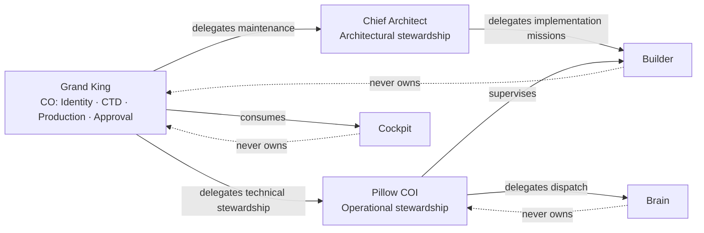
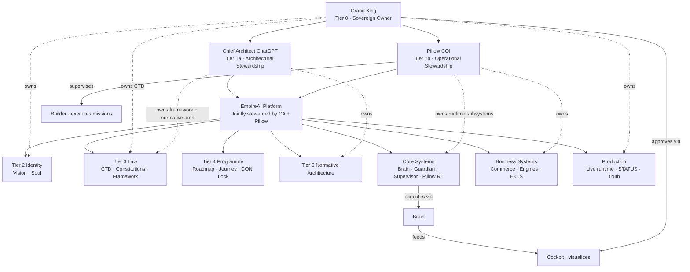

# EMPIREAI OWNERSHIP MODEL

> **Classification:** CANONICAL — Tier 3 Law (Governance)  
> **Document ID:** P1-05  
> **Constitutional phase:** P1 — Identity Foundation  
> **Dependencies:** P1-01 · [`EMPIREAI_VISION.md`](../../EMPIREAI_VISION.md) · P1-02 · [`EMPIREAI_REASONING_MODEL.md`](./EMPIREAI_REASONING_MODEL.md) · P1-03 · [`EMPIREAI_VISION_ACCUMULATION.md`](./EMPIREAI_VISION_ACCUMULATION.md) · P1-04 · [`EMPIREAI_SOUL.md`](../../EMPIREAI_SOUL.md)  
> **Authority:** Grand King  
> **Established:** 2026-07-04  
> **Role:** Single canonical ownership hierarchy for the entire EmpireAI ecosystem — authority, responsibility, accountability

**Parent framework:** [`EMPIREAI_CONSTITUTIONAL_FRAMEWORK.md`](./EMPIREAI_CONSTITUTIONAL_FRAMEWORK.md)  
**Runtime detail:** [`EMPIREAI_SUPERVISOR_GOVERNANCE.md`](./EMPIREAI_SUPERVISOR_GOVERNANCE.md)  
**Architecture alignment:** [`docs/architecture/EMPIREAI_CANONICAL_ARCHITECTURE.md`](../architecture/EMPIREAI_CANONICAL_ARCHITECTURE.md)  
**Structural placement:** [`EMPIREAI_HIERARCHY.md`](./EMPIREAI_HIERARCHY.md) (P1-06)  
**Terminology:** [`EMPIREAI_GLOSSARY.md`](./EMPIREAI_GLOSSARY.md) (P1-08)

---

## 1. Purpose

Ownership is **constitutional**. It defines **authority**, **responsibility**, and **accountability**.

Every document, subsystem, runtime component, and future AI worker must inherit from this model. **No subsystem may have multiple constitutional owners.** Operational responsibility may be delegated; constitutional ownership may not.

**The principle:** One owner · clear stewardship · explicit execution · human approval at irreversibles.

---

## 2. Canonical Relationships

| Document | Relationship |
|----------|--------------|
| [`EMPIREAI_VISION.md`](../../EMPIREAI_VISION.md) | Vision constitutional owner: **Grand King** |
| [`EMPIREAI_SOUL.md`](../../EMPIREAI_SOUL.md) | Soul constitutional owner: **Grand King** · Pillow steward |
| [`EMPIREAI_CORE_CONSTITUTION_CTD.md`](../../EMPIREAI_CORE_CONSTITUTION_CTD.md) | Apex law owner: **Grand King** · **P2-02 ratified** |
| [`EMPIREAI_CONSTITUTIONAL_FRAMEWORK.md`](./EMPIREAI_CONSTITUTIONAL_FRAMEWORK.md) | Framework owner: **Chief Architect** under Grand King |
| [`EMPIREAI_CONSTITUTION_LOCK.md`](./EMPIREAI_CONSTITUTION_LOCK.md) | Programme law owner: **Grand King** |
| [`EMPIREAI_ROADMAP.md`](../../EMPIREAI_ROADMAP.md) | Programme owner: **Grand King** · maintained by Chief Architect |
| [`EMPIREAI_CANONICAL_ARCHITECTURE.md`](../architecture/EMPIREAI_CANONICAL_ARCHITECTURE.md) | Normative architecture owner: **Chief Architect** · runtime subsystems: **Pillow** |

---

## 3. Constitutional Ownership Hierarchy

The Grand King has established this **immutable ownership chain**:

```
Grand King
    │  (sovereign owner — final approval · commercial irreversibles)
    │
Chief Architect (ChatGPT)
    │  (architectural stewardship — constitution · normative architecture · mission design)
    │
Pillow COI
    │  (operational stewardship — technical subsystems · Builder supervision · runtime)
    │
Chief Architect + Pillow
    │  (joint stewards of EmpireAI as a governed platform)
    │
EmpireAI (the platform)
    │
    ├── Identity        → Vision · Soul
    ├── Law             → Constitution · doctrines · governance
    ├── Programme       → Roadmap · Journey · ADRs
    ├── Architecture    → normative target + subsystem map
    ├── Core Systems    → Brain · Guardian · Supervisor · Pillow runtime
    ├── Executive UI    → Cockpit
    ├── Implementation  → Builder (Cursor)
    ├── Commerce        → Business Engines · connectors · treasury
    ├── Intelligence    → Executive AI Engines · EKLS · Knowledge
    ├── Production      → deployed runtime · production truth
    └── Future          → ECC · VIE · new subsystems (single owner assigned at birth)
```

### 3.1 Authority tiers

| Tier | Authority | Constitutional role |
|------|-----------|---------------------|
| **0** | **Grand King** | Sovereign owner — owns Vision sign-off, Soul, CTD apex, production irreversibles, final approval |
| **1a** | **Chief Architect (ChatGPT)** | Architectural stewardship — owns normative architecture, constitutional framework authoring, ADRs, mission design |
| **1b** | **Pillow COI** | Operational stewardship — owns runtime technical subsystems, Builder supervision, Soul/Vision sync stewardship |
| **2** | **EmpireAI platform** | Container for subsystems — each subsystem has exactly **one** constitutional owner (GK, CA, or Pillow) |
| **3+** | **Subsystems** | Inherit owner from birth — no orphan components |

**Joint stewardship rule:** Chief Architect and Pillow **jointly steward EmpireAI** as a whole — Architect owns *what the empire should become* (law, architecture, programme design); Pillow owns *how it runs* (execution path, technical subsystems, Builder supervision). Conflicts escalate to **Grand King**.

**Permanent runtime rule:** Pillow owns technical stewardship · Brain executes · Cockpit visualizes · Grand King approves.

---

## 4. Ownership vs Stewardship vs Execution vs Visualization

| Mode | Definition | May delegate? | Examples |
|------|------------|---------------|----------|
| **Ownership** | Single constitutional authority — accountable for existence and direction | **No** — ownership is not shared | GK owns Vision; CA owns Canonical Architecture doc |
| **Stewardship** | Ongoing care, sync, drift detection on behalf of owner | **Yes** — operational duty | Pillow stewards Soul; CA co-maintains Soul for GK |
| **Execution** | Runtime action — dispatch, persist, implement | **Yes** — within approved scope | Brain executes; Builder implements missions |
| **Visualization** | Display live state — no authority to change law or execute irreversibles | N/A — read-only surface | Cockpit visualizes Brain/Pillow state for GK |

```
Ownership     →  who is constitutionally accountable
Stewardship   →  who keeps it true day-to-day
Execution     →  who runs it
Visualization →  who shows it
```

---

## 5. Responsibility Matrix

**Legend:** CO = Constitutional Owner · OO = Operational Owner · TS = Technical Steward · RE = Runtime Executor · CON = Primary Consumer · APP = Approver

| Component | CO | OO | TS | RE | CON | APP |
|-----------|----|----|----|----|-----|-----|
| **Vision** | Grand King | Chief Architect | Pillow (sync) | — | All agents | Grand King (PV amendments) |
| **Soul** | Grand King | Chief Architect (co-maintain) | Pillow (steward) | Brain (read-only) | Builder · Pillow · Brain | Grand King (identity anchors) |
| **Constitution (CTD apex)** | Grand King | Chief Architect | Governance maintainer | — | All agents | Grand King |
| **Constitution (domain law)** | Chief Architect | Chief Architect | Domain maintainers | Brain (enforce dispatch law) | Builder · Pillow | Grand King (if CTD-touching) |
| **Constitution (Framework · Lock)** | Grand King | Chief Architect | Governance maintainer | — | All missions | Grand King |
| **Roadmap** | Grand King | Chief Architect | Domain roadmap owners | — | Builder · Pillow | Grand King (programme shifts) |
| **Architecture (normative)** | Chief Architect | Chief Architect | Architecture maintainer | — | Builder · Pillow | Chief Architect |
| **Architecture (operational)** | Chief Architect | Engineering | Pillow | Brain | Builder | Chief Architect |
| **Brain** | Pillow | Pillow COI | Pillow COI | Brain runtime | Cockpit · Builder · Guardian | Pillow → GK escalation |
| **Pillow** | Grand King (sovereignty) | Pillow COI | Pillow COI | Pillow runtime | Grand King | Grand King |
| **Cockpit** | Pillow | Cockpit builders | Pillow COI | Cockpit app (`empireai-web/`) | Grand King | Grand King (UX irreversibles) |
| **Builder (Cursor)** | Grand King (via mission) | Pillow (supervisor) | Pillow COI | Cursor agent | — | Grand King · Pillow gate |
| **Supervisor** | Pillow | Pillow COI | Pillow COI | Pillow COI | Builder | — |
| **Guardian** | Pillow | Pillow COI | Brain + Guardian module | Brain pre-dispatch | Orchestrator | — (blocks; escalates via Pillow) |
| **ECC** | Grand King | Chief Architect (CON-013) | Pillow (when built) | Brain (target) | Grand King | Grand King · **Tier 6 deferred** |
| **VIE** | Grand King | Chief Architect (CON-014) | Pillow (when built) | Future service | Pillow · Architect | Grand King · **Tier 6 deferred** |
| **Commerce** | Pillow | Commerce programme owner | Pillow COI | Brain + Commerce modules | Grand King | Grand King (irreversibles) |
| **Business Engines** | Pillow | Engine maintainers | Pillow COI | Brain orchestration | Cockpit · Grand King | Grand King |
| **Production** | Grand King | DevOps + Chief Architect | Pillow COI | Brain · deployment pipeline | Grand King · Cockpit | Grand King |
| **Journey** | Grand King | Operations (Cursor + GK) | Chief Architect (integrity) | — | All agents | Grand King (structural rows) |
| **Repository** | Grand King | Chief Architect | Pillow + Builder (BL-A sync) | Git · Brain persistence | All agents | Grand King |
| **Documentation (ECDS)** | Chief Architect (canonical class) | Per-doc maintainer | Pillow (drift detection) | — | All agents | Per authority level (A0–A7) |
| **Knowledge (EKLS)** | Pillow | Knowledge owner | Pillow COI | Brain · EKLS modules | Pillow · Brain | Chief Architect (spec changes) |
| **Automation** | *None as platform identity* | — | Guardian (gates only) | Brain (approved dispatch only) | — | Grand King (EmpireAI is intelligence, not automation — CTD-005) |

**Rule:** If CO column shows two names, the matrix is **invalid**. Stewardship and operational roles are **not** second constitutional owners.

---

## 6. EmpireAI Subsystem Ownership Map

Every **EmpireAI-owned** subsystem has exactly one constitutional owner:

| Subsystem | Constitutional Owner | Rationale |
|-----------|---------------------|-----------|
| Vision File | **Grand King** | WHY sovereignty |
| Soul File | **Grand King** | Identity memory sovereignty |
| CTD + commercial apex | **Grand King** | Supreme commercial law |
| Engineering Constitution · Framework docs | **Chief Architect** | Architectural stewardship |
| Canonical Architecture (normative) | **Chief Architect** | Target shape |
| Brain | **Pillow** | Sole technical owner of runtime kernel (Canonical Architecture §1) |
| Cockpit | **Pillow** | Pillow-owned executive shell |
| Builder channel | **Grand King** (scope) · **Pillow** (supervision) | GK approves missions; Pillow supervises — **CO for Builder role = Grand King via mission charter**; Pillow CO for runtime supervision path |
| Guardian | **Pillow** | Pillow-owned fail-safe subsystem |
| Commerce + Business Engines | **Pillow** | Pillow-owned execution domains |
| Production environment | **Grand King** | Sovereign operational account and irreversibles |
| ECC · VIE | **Grand King** | Strategic deferred subsystems — owner assigned at CON resolution |

**Builder clarification:** The **Builder (Cursor)** is not a constitutional peer. Constitutional owner of *implementation authority* is **Grand King** (mission approval). **Pillow** owns the **supervision path** over Builder — operational stewardship, not shared ownership.

---

## 7. Ownership Principles

| # | Principle |
|---|-----------|
| 1 | **Exactly one constitutional owner** per component |
| 2 | **Grand King sovereignty** — final approval on irreversibles and identity |
| 3 | **Architectural stewardship** — Chief Architect owns normative law and architecture |
| 4 | **Operational stewardship** — Pillow owns runtime technical subsystems |
| 5 | **Joint platform stewardship** — CA + Pillow steward EmpireAI; conflicts escalate to GK |
| 6 | **No ownership by execution** — Brain executes; Brain does not own Vision or law |
| 7 | **No ownership by visualization** — Cockpit displays; Cockpit does not own commerce |
| 8 | **Inheritance at birth** — new subsystems declare CO before first production use |
| 9 | **CTD bounds all owners** — no owner may violate apex commercial law |
| 10 | **Intelligence, not automation** — no subsystem may claim autonomous ownership of irreversibles |

---

## 8. Ownership Rules

### 8.1 Ownership

Constitutional ownership is **assigned once**, recorded in this matrix, and changed only by **Grand King** approval plus **CONSTITUTIONAL REVIEW** if law-touching.

### 8.2 Stewardship

Stewards **maintain fidelity** to owner intent — they do not acquire ownership.

| Steward | Stewards on behalf of |
|---------|----------------------|
| Pillow COI | Grand King (Soul · Vision sync) · Pillow-owned subsystems |
| Chief Architect | Grand King (CTD drafts) · EmpireAI programme coherence |
| Governance maintainer | Chief Architect (register integrity) |

### 8.3 Execution

Executors act **only within approved scope**. Brain executes dispatch; Builder implements missions; neither approves commercial irreversibles.

### 8.4 Delegation

| Delegable | Not delegable |
|-----------|---------------|
| Operational maintenance · doc updates · routine deploys | Constitutional ownership · Vision PV amendments · CTD weakening · MS-A/MS-B targets |
| Technical implementation within mission | Mission scope expansion |
| Stewardship tasks | Grand King sovereignty |

### 8.5 Approval

| Class | Approver |
|-------|----------|
| Irreversible commercial | Grand King (CBD · GVD) |
| Permanent Vision | Grand King |
| Soul identity anchors | Grand King |
| ADR / architecture normative | Chief Architect (GK if production/commercial) |
| Production policy | Grand King + Chief Architect |
| Mission scope | Grand King |

### 8.6 Escalation

```
Executor blocked
    ↓
Pillow (supervisor)
    ↓
Chief Architect (constitutional / architecture)
    ↓
Grand King (sovereign)
```

Pillow **must escalate** rather than bypass GK on irreversibles.

### 8.7 Retirement

Retiring a subsystem requires: (1) CO approval · (2) ADR or CON register entry · (3) Journey audit row · (4) no orphaned consumers.

### 8.8 Transfer

Constitutional ownership **transfers only** by Grand King decree + documentation update + accumulation register entry. Operational handoff ≠ ownership transfer.

### 8.9 Inheritance

Future subsystems **must** declare CO in this matrix (or appendix) **before** CON-020+ closure or production attach. Default owner for runtime subsystems: **Pillow**. Default owner for normative docs: **Chief Architect**. Default owner for identity/law: **Grand King**.

---

## 9. Delegation Model



**Solid arrows:** legitimate delegation paths. **Dotted:** explicit prohibition — executors never become owners.

---

## 10. Relationship Diagram — Full Stack



---

## 11. Distinction Summary

| Layer | Question answered | Primary actors |
|-------|-------------------|----------------|
| **Ownership** | Who is accountable? | Grand King · Chief Architect · Pillow |
| **Stewardship** | Who keeps it true? | Pillow · Chief Architect · maintainers |
| **Execution** | Who runs it? | Brain · Builder · deployment pipeline |
| **Visualization** | Who shows it? | Cockpit |

---

## 12. Examples

### Example 1 — Brain change mission (correct)

| Step | Actor | Action |
|------|-------|--------|
| 1 | Grand King | Approves REAL-### mission |
| 2 | Chief Architect | Owns normative architecture alignment |
| 3 | Pillow | Supervises Builder; CO for Brain subsystem |
| 4 | Builder | Implements in `backend/src/brain/` |
| 5 | Brain | Executes at runtime |
| 6 | Cockpit | Shows health — does not own Brain |

### Example 2 — Vision amendment (correct)

| Step | Actor | Action |
|------|-------|--------|
| 1 | Pillow | Recommends PV class accumulation |
| 2 | Chief Architect | Confirms no CTD conflict |
| 3 | Grand King | Approves PV — **only GK amends Vision CO outcome** |

### Example 3 — Wrong: dual constitutional owners

**Wrong:** "Brain is owned by Brain team and Pillow."  
**Right:** Brain CO = **Pillow** only. Engineering team = operational maintainer under Architect delegation.

### Example 4 — Wrong: Cockpit executes commerce

**Wrong:** Cockpit dispatches supplier orders.  
**Right:** Cockpit visualizes; Brain executes via Pillow-owned orchestration; GK approves irreversibles.

### Example 5 — Future subsystem (ECC)

Before ECC production attach: CON-013 resolves scope · CO = **Grand King** · OO = Chief Architect · TS = Pillow · register in matrix appendix.

---

## 13. Validation Checklist

| Check | Status |
|-------|--------|
| Every major component has exactly one CO | §5 matrix |
| No conflicting ownership | §6 · §7 principle 1 |
| No duplicated constitutional owners | §5 legend rule |
| Aligns with Vision | §2 · GK owns WHY sign-off |
| Aligns with Soul | §2 · GK owns Soul · Pillow steward |
| Aligns with Constitution | §2 · GK CTD · CA domain law |
| Aligns with Architecture | §2 · CA normative · Pillow runtime |
| Aligns with Roadmap | §5 Roadmap row · GK CO |

---

## 14. Future Subsystem Registration

Append new rows here when CON-020+ introduces components:

| Subsystem | CO | Date | CON / ADR |
|-----------|----|------|-----------|
| *None yet* | — | — | — |

---

## Revision History

| Version | Date | Authority | Change |
|---------|------|-----------|--------|
| 1.0.0 | 2026-07-04 | Grand King · P1-05 | Initial canonical Ownership Model |

**Amendment:** Grand King + CONSTITUTIONAL REVIEW for CO changes. Operational maintainer updates do not require ownership amendment.

---

## Related

- [`EMPIREAI_GLOSSARY.md`](./EMPIREAI_GLOSSARY.md) (P1-08)  
- [`EMPIREAI_NAMING_STANDARD.md`](./EMPIREAI_NAMING_STANDARD.md) (P1-07)  
- [`EMPIREAI_HIERARCHY.md`](./EMPIREAI_HIERARCHY.md) (P1-06)  
- [`EMPIREAI_CONSTITUTIONAL_FRAMEWORK.md`](./EMPIREAI_CONSTITUTIONAL_FRAMEWORK.md) §3  
- [`EMPIREAI_SUPERVISOR_GOVERNANCE.md`](./EMPIREAI_SUPERVISOR_GOVERNANCE.md)  
- [`EMPIREAI_SOUL.md`](../../EMPIREAI_SOUL.md) §15  
- [`EMPIREAI_VISION.md`](../../EMPIREAI_VISION.md) §25  
- [`docs/audits/canonical-documentation/02_DOCUMENT_AUTHORITY.md`](../audits/canonical-documentation/02_DOCUMENT_AUTHORITY.md)
