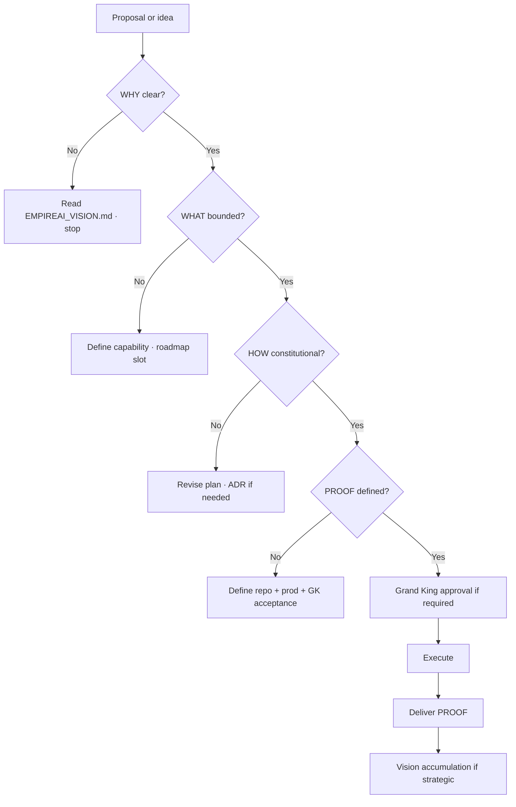

# EMPIREAI REASONING MODEL

> **Classification:** CANONICAL — Tier 3 Law (Constitutional Reasoning)  
> **Document ID:** P1-02  
> **Constitutional phase:** P1 — Identity Foundation  
> **Dependency:** P1-01 · [`EMPIREAI_VISION.md`](../EMPIREAI_VISION.md) — **required**  
> **Authority:** Grand King  
> **Established:** 2026-07-04  
> **Role:** The permanent constitutional thinking framework for the entire Empire  
> **This is NOT an engineering document.** It governs how every decision and mission is reasoned.

---

## Canonical Relationships

| Document | Role in the chain |
|----------|-------------------|
| [`EMPIREAI_VISION.md`](../EMPIREAI_VISION.md) | **WHY** — purpose and mission |
| [`EMPIREAI_SOUL.md`](../EMPIREAI_SOUL.md) | **WHO** — identity constraints on WHY (P1-04) |
| [`EMPIREAI_GLOSSARY.md`](./EMPIREAI_GLOSSARY.md) | **Meanings** — official definitions (P1-08) |
| [`EMPIREAI_PRODUCTION_TRUTH.md`](./EMPIREAI_PRODUCTION_TRUTH.md) | **Reality** — truth hierarchy · acceptance (P1-10) |
| [`EMPIREAI_REPOSITORY_STRUCTURE.md`](./EMPIREAI_REPOSITORY_STRUCTURE.md) | **Physical repo** — folder/document homes (P1-09) |
| [`EMPIREAI_NAMING_STANDARD.md`](./EMPIREAI_NAMING_STANDARD.md) | **Names** — canonical terminology (P1-07) |
| [`EMPIREAI_HIERARCHY.md`](./EMPIREAI_HIERARCHY.md) | **WHERE** — structural tier placement (P1-06) |
| [`EMPIREAI_OWNERSHIP_MODEL.md`](./EMPIREAI_OWNERSHIP_MODEL.md) | **WHO owns WHAT** — constitutional accountability (P1-05) |
| [`EMPIREAI_CORE_CONSTITUTION_CTD.md`](../EMPIREAI_CORE_CONSTITUTION_CTD.md) | Law bounds all four links |
| [`EMPIREAI_ROADMAP.md`](../EMPIREAI_ROADMAP.md) · [`EMPIREAI_CONSTITUTION_LOCK.md`](./EMPIREAI_CONSTITUTION_LOCK.md) | **WHAT** — programme scope |
| [`docs/architecture/EMPIREAI_CANONICAL_ARCHITECTURE.md`](../docs/architecture/EMPIREAI_CANONICAL_ARCHITECTURE.md) · [`EMPIREAI_CONSTITUTION.md`](../EMPIREAI_CONSTITUTION.md) | **HOW** — shape and execution law |
| [`EMPIREAI_CONSTITUTIONAL_FRAMEWORK.md`](./EMPIREAI_CONSTITUTIONAL_FRAMEWORK.md) | Parent framework |
| [`EMPIREAI_MISSION_GENERATION_POLICY.md`](./EMPIREAI_MISSION_GENERATION_POLICY.md) | Mission application |
| [`EMPIREAI_VISION_SYNCHRONIZATION_POLICY.md`](./EMPIREAI_VISION_SYNCHRONIZATION_POLICY.md) | Pre-mission chain |
| [`EMPIREAI_VISION_ACCUMULATION.md`](./EMPIREAI_VISION_ACCUMULATION.md) | Post-mission → future WHY (P1-03) |
| [`EMPIREAI_VISION_ACCUMULATION_POLICY.md`](./EMPIREAI_VISION_ACCUMULATION_POLICY.md) | Policy pointer to P1-03 framework |

---

## 1. Purpose

EmpireAI requires **one permanent reasoning model** so that every future decision — roadmap item, Cursor mission, Builder task, Pillow recommendation, architecture proposal, business capability, production change, and UI surface — traces the same constitutional chain:

```
WHY
 ↓
WHAT
 ↓
HOW
 ↓
PROOF
```

**No exceptions.**

If any link is missing or unclear, the work **must not proceed** until the chain is complete and validated.

This model exists so the empire never drifts into implementation without purpose, capability without scope, or claims without proof.

---

## 2. The Model — Four Links

### 2.1 WHY — Purpose

| Rule | Detail |
|------|--------|
| **Defines** | Purpose — why this decision or mission exists |
| **Never** | Implementation, technology, file paths, or stack choices |
| **Sources** | [`EMPIREAI_VISION.md`](../EMPIREAI_VISION.md) · Soul · CTD commercial intent |
| **Test** | Can you explain it to the Grand King without mentioning code? |

**WHY is unclear → mission must not proceed.**

---

### 2.2 WHAT — Capability

| Rule | Detail |
|------|--------|
| **Defines** | Capability or outcome — what must become true |
| **Never** | Technology, frameworks, or implementation detail |
| **Sources** | Roadmaps · Constitution Lock phase · domain programme · ADR intent |
| **Test** | Stated as a capability or boundary, not a library or folder |

**Example (valid WHAT):** “Grand King can approve Pillow engineering proposals with constitutional fields visible.”  
**Example (invalid WHAT):** “Add React component X to empireai-web.”

---

### 2.3 HOW — Implementation

| Rule | Detail |
|------|--------|
| **Defines** | Implementation approach — how the capability is built or documented |
| **May evolve** | Technology, structure, and tactics change; WHY and WHAT do not silently change |
| **Sources** | Canonical Architecture · Engineering Constitution · operational guides · mission plan |
| **Test** | Traceable to WHAT; bounded scope; respects constitution |

**Builder Rule:** Builder shall **never** generate implementation before understanding **WHY**.

---

### 2.4 PROOF — Acceptance

| Rule | Detail |
|------|--------|
| **Defines** | Objective acceptance — how we know WHAT was achieved |
| **Requires all three** | **Repository** · **Production** (when applicable) · **Grand King** |
| **Sources** | Tests · audits · commits · live verification · GK sign-off |
| **Test** | Could an auditor disagree? If yes, proof is insufficient |

| Proof layer | Meaning |
|-------------|---------|
| **Repository** | Commits, tests, evidence artifacts, Journey entries — immutable record |
| **Production** | Live behaviour matches claim (when user-facing or runtime) |
| **Grand King** | Sovereign acceptance for irreversibles and mission closure |

---

## 3. Constitutional Rules (Permanent)

### 3.1 Repository Rule

Every mission generated by **Pillow** or **Chief Architect (ChatGPT)** must **begin** by validating:

```
WHY → WHAT → HOW → PROOF
```

Document the four links in the mission brief before authorization.

If **WHY** is unclear → **stop**. Re-read Vision. Do not proceed.

Policy: [`EMPIREAI_MISSION_GENERATION_POLICY.md`](./EMPIREAI_MISSION_GENERATION_POLICY.md)

---

### 3.2 Builder Rule

**Builder (Cursor)** shall:

1. Receive an authorized brief with all four links  
2. Confirm **WHY** before writing code or docs  
3. Implement only **HOW** within approved **WHAT** scope  
4. Produce **PROOF** before claiming completion  

Builder **must not** invent WHY or expand WHAT without Grand King re-approval.

---

### 3.3 Pillow Rule — Constitutional Guardian

**Pillow** is the **constitutional guardian** of technical work.

Before recommending work, Pillow verifies:

```
Vision
  ↓
WHY
  ↓
Roadmap
  ↓
Hierarchy
  ↓
Mission
```

Then Pillow ensures the mission brief contains **WHY → WHAT → HOW → PROOF**.

Pillow **rejects** recommendations that skip Vision sync or lack a clear WHY.

Supervisor detail: [`EMPIREAI_SUPERVISOR_GOVERNANCE.md`](./EMPIREAI_SUPERVISOR_GOVERNANCE.md)

---

## 4. Decision Flow (Universal)



---

## 5. Mission Flow

Every Cursor / Builder mission:

| Step | Link | Action |
|------|------|--------|
| 1 | Pre-chain | Vision Synchronization Policy |
| 2 | **WHY** | Cite Vision section + CTD/Soul alignment |
| 3 | **WHAT** | Mission scope · roadmap ID · in/out |
| 4 | **HOW** | Architecture + constitution + files touched |
| 5 | **PROOF** | Tests · audits · GK criteria |
| 6 | Execute | Builder under Pillow supervision |
| 7 | Close | Lessons learned → Vision accumulation |

---

## 6. Architecture Flow

Architecture proposals and ADRs:

| Link | Architecture question |
|------|----------------------|
| **WHY** | Which Vision principle or commercial risk does this serve? |
| **WHAT** | Which capability or boundary changes? |
| **HOW** | Normative architecture · subsystem ownership · ADR text |
| **PROOF** | ADR accepted · docs updated · compliance tests if applicable |

Architecture **never** leads with HOW. It starts with WHY from Vision.

---

## 7. Business Flow

Commercial and business decisions:

| Link | Business question |
|------|-------------------|
| **WHY** | Does this increase MS-A / PROOF-001 probability? (Vision §2 · CBD) |
| **WHAT** | Which commercial capability — product, channel, pricing, risk? |
| **HOW** | Commerce canon phase · governance gates · CRI if launch |
| **PROOF** | Live transaction · ledger · CRIR · Grand King approval chain |

Triple approval (CBD-018): recommendation → Soul alignment → Grand King — is part of **PROOF** for irreversibles.

---

## 8. Engineering Flow

Brain, Pillow, runtime, and Builder work:

| Link | Engineering question |
|------|---------------------|
| **WHY** | Vision + mission commercial or constitutional purpose |
| **WHAT** | Engineering outcome — not “refactor folder X” unless WHAT states capability |
| **HOW** | Engineering Constitution · Guardian · scoped implementation |
| **PROOF** | Tests pass · commit · STATUS/Journey · no production claim without prod proof |

---

## 9. Traceability Examples

Every example demonstrates **WHY → WHAT → HOW → PROOF**.

---

### Example A — Architecture Decision (ADR-CON-001 class)

| Link | Content |
|------|---------|
| **WHY** | Vision §15: Grand King requires one executive surface; confusion between Founder Shell and Cockpit violates “Cockpit shows, does not decide.” |
| **WHAT** | Single authoritative production Grand King UX path for empire-ai.co. |
| **HOW** | ADR in EMPIREAI_DECISIONS.md; deployment docs updated; no folder rename in V1. |
| **PROOF** | **Repository:** ADR merged. **Production:** GK login → executive journey on chosen surface. **Grand King:** explicit ADR sign-off. |

---

### Example B — Business Decision (PROOF-001 path)

| Link | Content |
|------|---------|
| **WHY** | Vision §2 · §22: first verified net profit is the factory’s first proof gate. |
| **WHAT** | One live SKU profitable on a King-approved V1 marketplace channel. |
| **HOW** | GO-002 sequence · live credentials · commerce canon LIVE phase · Cockpit approval surfaces. |
| **PROOF** | **Repository:** evidence artifact + Journey. **Production:** verified ledger profit. **Grand King:** PROOF-001 sign-off. |

---

### Example C — Production Decision (Production Mode)

| Link | Content |
|------|---------|
| **WHY** | Vision §29: production must be honest; Grand King must operate and verify; stability serves MS-A probability. |
| **WHAT** | Documented production policy — which capabilities run in production vs deferred mode. |
| **HOW** | EMPIREAI_PRODUCTION_TRUTH.md · CON-007–009 · MANAGED_DEPLOYMENT alignment. |
| **PROOF** | **Repository:** doctrine merged. **Production:** behaviour matches doc · health endpoints. **Grand King:** approves production truth doctrine. |

---

### Example D — Engineering Decision (long-run stability)

| Link | Content |
|------|---------|
| **WHY** | Vision §23 failure mode: Grand King loses visibility; Pillow chat failure blocks daily command. |
| **WHAT** | Grand King can complete login → Executive Home → Pillow chat without session death over long runs. |
| **HOW** | Brain persistence policy · debounced SQLite · timeouts · production verification script. |
| **PROOF** | **Repository:** commit + test script. **Production:** 3-cycle long-run PASS on empire-ai.co. **Grand King:** browser acceptance (pending human sign-off where required). |

---

### Example E — UI Decision (Cockpit screen)

| Link | Content |
|------|---------|
| **WHY** | Vision §15 · UID: Grand King daily workflow requires department visibility without execution confusion. |
| **WHAT** | Commerce department shell with tab navigation and clear data-mode honesty (live vs demo). |
| **HOW** | Cockpit spec SCR · REAL mission · registry-driven placeholders. |
| **PROOF** | **Repository:** REAL commit · route in nav registry. **Production:** route loads authenticated. **Grand King:** UX acceptance or explicit deferral in enhancement register. |

---

### Example F — Commerce Decision (marketplace channel)

| Link | Content |
|------|---------|
| **WHY** | Vision §12: operate across existing marketplaces; V1 channel registry defines proof scope. |
| **WHAT** | Grand King can list and fulfill on approved V1 channel (e.g. amazon-us). |
| **HOW** | Adapter · vault creds · commerce canon phase · CRI/CRIR if launch. |
| **PROOF** | **Repository:** b6 evidence JSON · tests. **Production:** live API verification. **Grand King:** channel activation approval. |

---

## 10. Alignment Validation

| Source | Alignment |
|--------|-----------|
| **Vision** | WHY derives from Vision; model referenced in Vision header |
| **Soul** | WHO constraints applied when drafting WHY |
| **Constitution** | HOW and PROOF bounded by CTD · Engineering Constitution · GVD |
| **Roadmap** | WHAT cites P-phase · CON-### · REAL-### · domain roadmap |
| **Architecture** | HOW cites canonical architecture; never normative from operational memory alone |
| **Documentation** | PROOF artifacts classified EVIDENCE vs CANONICAL per ECDS-1 |

**No duplicated truth:** Vision owns WHY purpose; this document owns the **chain mechanics**; Mission Generation owns **brief format**; Vision Sync owns **pre-mission order**.

---

## 11. Relationship to Vision Synchronization

Vision Synchronization is the **entry** to WHY:

```
Vision Synchronization → Vision → Soul → Roadmap → Hierarchy → Mission Context → Mission Generation
```

Inside Mission Generation, every brief **must** express the four links explicitly.

→ [`EMPIREAI_VISION_SYNCHRONIZATION_POLICY.md`](./EMPIREAI_VISION_SYNCHRONIZATION_POLICY.md)

---

## 12. Relationship to Vision Accumulation (P1-03)

Completed missions with valid **PROOF** feed the accumulation lifecycle:

```
Mission Completed → Lessons Learned → Architectural Review → Vision Review → Decision → Approved Update
```

**Canonical framework:** [`EMPIREAI_VISION_ACCUMULATION.md`](./EMPIREAI_VISION_ACCUMULATION.md)  
**Register:** [`EMPIREAI_VISION_ACCUMULATION_REGISTER.md`](./EMPIREAI_VISION_ACCUMULATION_REGISTER.md)

The reasoning model closes the loop: **PROOF** validates WHAT; accumulation updates future **WHY** (Permanent Vision class only with Grand King approval).

---

## Revision History

| Version | Date | Authority | Change |
|---------|------|-----------|--------|
| 1.0.0 | 2026-07-04 | Grand King · P1-02 | Initial constitutional reasoning model |

**Amendment:** CONSTITUTIONAL REVIEW + Grand King approval. The four-link sequence itself is **immutable** unless constitutionally reviewed.
