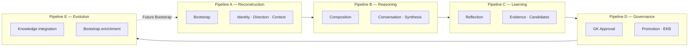

# Executive Cognitive Pipelines — Pillow Executive Intelligence

> **Authority:** Grand King Architecture Observation  
> **Status:** Organisational planning only — no PEI renumbering, no constitutional amendment, no runtime change  
> **Date:** 2026-06-29  
> **Effective for implementation:** After EmpireAI Version 1 Executive Certification Audit **and** Grand King approval of the Layer 2 Master Plan  
> **Companion:** `EMPIREAI_PILLOW_EXECUTIVE_INTELLIGENCE_CONSTITUTION.md` · `PILLOW_ROADMAP.md` · ADR-046

---

## 1. Purpose

This document **organises** future **Pillow Executive Intelligence** (EmpireAI Roadmap Layer 2) missions into five **Executive Cognitive Pipelines**. Pipelines are a **planning taxonomy** — they group PEI capabilities by cognitive function without replacing:

- Existing **PEI-###** mission identifiers  
- The **Executive Intelligence Lifecycle** (Constitution §2.1)  
- The **Knowledge Evolution chain** (Constitution §3)  
- **Pillow Runtime** (Layer 1) architecture  

Pipelines help Grand King, Pillow Architecture, and mission planners **sequence Layer 2 work**, write Master Plans, and trace dependencies — they do **not** define new runtime subsystems or approval shortcuts.

---

## 2. Pipeline overview



| Pipeline | Cognitive question | Lifecycle stages served (Constitution §2.1) |
|---|---|---|
| **A — Executive Reconstruction** | *What does Pillow know before it thinks?* | Bootstrap · Executive Identity · Executive Direction · Executive Context |
| **B — Executive Reasoning** | *How does Pillow think and respond?* | Conversation · Executive Reasoning |
| **C — Executive Learning** | *What did the Empire learn from evidence?* | Executive Reflection · Evidence → Candidate Organizational Knowledge |
| **D — Executive Governance** | *What may become permanent?* | Grand King Approval · Executive Knowledge Base |
| **E — Executive Evolution** | *How does approved intelligence improve future sessions?* | Future Bootstrap · continuous executive improvement |

**Flow rule:** Pipelines A→B→C→D→E mirror the governed session lifecycle. Pipeline E closes the loop by enriching Pipeline A on the next Bootstrap.

---

## 3. Pipeline A — Executive Reconstruction

**Scope:** Load, reconstruct, and certify the executive operating picture **before** turn-level reasoning.

### 3.1 Pipeline components

| Component | Description | Runtime foundation (Layer 1) | Planned PEI depth |
|---|---|---|---|
| **Bootstrap** | Mandatory repository reconstruction; Executive Self-Assessment; Executive Briefing seed | PILLOW-002 · Bootstrap extension | PEI-001 · PEI-020 |
| **Executive Identity** | Stable strategic self from Soul + constitution | Bootstrap extension (`executive-identity`) | PEI-001 (maturity) |
| **Executive Direction** | Supreme Directive, objective, priority, blockers, phase from Journey/Status/roadmap | Bootstrap extension (`executive-direction`) | PEI-005 · PEI-009 · PEI-011 |
| **Executive Context** | Ephemeral task-scoped context assembly — not permanent memory | PILLOW-004 Context Builder | PEI-003 · PEI-002 · PEI-013 |

### 3.2 PEI mission alignment (primary pipeline A)

| ID | Capability | Role in Pipeline A |
|---|---|---|
| **PEI-001** | Repository self-reconstruction & executive-ready gate | Bootstrap maturity beyond scan-and-classify |
| **PEI-002** | Repository Intelligence depth — NLP, knowledge graph | Reconstruction intelligence layer (PILLOW-003) |
| **PEI-003** | Context Builder executive task profiles | Executive Context depth |
| **PEI-009** | Dedicated Journey Manager | Direction/context — operational position truth |
| **PEI-011** | Dedicated Status Manager | Direction/context — project truth |
| **PEI-013** | UX Enhancement Register Reader | Cross-program context for executive awareness |
| **PEI-017** | Empire Recovery Assessment | Bootstrap continuity after disruption |
| **PEI-018** | REAL owner graph normalization | Repository reconstruction hygiene |
| **PEI-020** | Full Operational Readiness Check (14 criteria) | Bootstrap certification gate |

**Secondary touchpoints:** PEI-010 (ADR continuity feeds reconstruction canon) · PEI-005 (planner informs direction).

**V1 state:** Bootstrap extensions (Identity · Direction · Context) are **implemented** in Pillow Runtime foundations. Pipeline A PEI missions add **depth and certification**, not replacement.

---

## 4. Pipeline B — Executive Reasoning

**Scope:** Compose executive turns — silent business-conversation analysis, multi-lens synthesis, natural Grand King-facing responses.

### 4.1 Pipeline components

| Component | Description | Runtime foundation | Planned PEI depth |
|---|---|---|---|
| **Reasoning composition** | Executive Briefing anchor → structured reasoning cycle | Bootstrap extension (`composeReasoningCycle`) | PEI-019 (prompt canon) |
| **Conversation intelligence** | Mode-aware strategic dialogue; manifest-aware responses | PILLOW-015 · PILLOW-016 chat host | **PEI-014** (Critical) |
| **Response synthesis** | Council/Soul perspectives; cross-module executive brief | REAL-007 · GVD-003/004 integration points | PEI-015 · PEI-016 · PEI-005 |

### 4.2 PEI mission alignment (primary pipeline B)

| ID | Capability | Role in Pipeline B |
|---|---|---|
| **PEI-014** | Conversation intelligence — silent analysis & natural dialogue | **Primary Layer 2 expression** — Core Principle §2 |
| **PEI-015** | Executive perspectives — council/debate in responses | Response synthesis — multi-lens output |
| **PEI-016** | Strategic synthesis dashboard | Cross-module executive brief |
| **PEI-005** | Mission Planner strategic synthesis | Reasoning input — "what next" truth |
| **PEI-006** | Continuous Due Diligence | Autonomous executive analysis (self-initiated reasoning) |
| **PEI-019** | Prompt Registry & canonical executive prompt versioning | Reasoning composition consistency |

**Secondary touchpoints:** PEI-026 consumes **completed** reasoning cycles (downstream in C, not B).

**V1 state:** Reasoning composition pipeline is **implemented** in Bootstrap extension. PEI-014 is the **critical** first intelligence depth mission for conversational expression.

---

## 5. Pipeline C — Executive Learning

**Scope:** Post-reasoning and multi-source evidence ingestion → **candidate** organizational knowledge only.

### 5.1 Pipeline components

| Component | Description | Constitution anchor | Planned PEI depth |
|---|---|---|---|
| **Executive Reflection** | Post-reasoning evaluation of significant conversations | §2.2 | **PEI-026** (Critical — first downstream capability) |
| **Organizational Knowledge Quality Assessment (OKQA)** | Advisory pre-presentation scoring and prioritization of candidates | OKQA design · §2.2 | **PEI-027** (High — subordinate to PEI-026) |
| **Evidence collection** | Unified Evidence Sources abstraction | §3.1 · §3.1.1 | **PEI-021** + adapters PEI-022…025 |
| **Candidate Organizational Knowledge** | Structured proposals with profit relevance — never auto-applied | §3 | PEI-007 · PEI-021 synthesis · PEI-012 |

### 5.2 PEI mission alignment (primary pipeline C)

| ID | Capability | Role in Pipeline C |
|---|---|---|
| **PEI-026** | Executive Reflection | Bridge Reasoning → Learning; triggers Continuous Artifact Generation when lasting decisions detected |
| **PEI-027** | Organizational Knowledge Quality Assessment (OKQA) | Advisory scoring · prioritization · deduplication before GK presentation — CAGW unchanged |
| **PEI-021** | Evidence-Based Learning Architecture | Unified Evidence Source model → profit-aligned candidates |
| **PEI-022** | Commercial outcomes adapter | Layer 3 bridge — validated profit signals |
| **PEI-023** | Runtime metrics adapter | Health/blocker observational learning |
| **PEI-024** | Executive Audits adapter | Audit trends → improvement candidates |
| **PEI-025** | Approved strategic reviews adapter | Council/Soul outputs → intelligence feed |
| **PEI-007** | Autonomous Improvement Engine | Conversation/outcome → candidate knowledge → Improvement Vault |
| **PEI-012** | Executive Audit Reader | Audit structure & trend intelligence as evidence |

**Governance reminder (§3.2):** No Evidence Source may directly modify Executive Knowledge. Pipeline C **always** terminates in candidates — never permanent mutation.

**Recommended sequencing (planning):** PEI-026 first (conversation path) → **PEI-027 (OKQA — with PEI-026)** → PEI-021 core → PEI-022…025 adapters in parallel by commercial priority (ADR-045 Layer 3 bridge).

---

## 6. Pipeline D — Executive Governance

**Scope:** Grand King authority over what becomes permanent — promotion, vault discipline, Executive Knowledge Base integrity.

### 6.1 Pipeline components

| Component | Description | Runtime / doctrine owner | Planned PEI depth |
|---|---|---|---|
| **Grand King Approval** | Mandatory gate for repository mutations and permanent intelligence | GVD-019 · PILLOW-017 Approval Gate · BL-C | *(runtime complete — PEI deepens UX/intelligence around gate)* |
| **Knowledge promotion** | Improvement Vault → approved artifact proposals | PILLOW-012 · Improvement Engine | PEI-007 · PEI-008 |
| **Executive Knowledge Base governance** | Journey, Soul, Decisions, Status, contracts, doctrines, audits as permanent canon | Memory Doctrine · PILLOW-005 · PILLOW-010 | PEI-004 · PEI-008 · PEI-010 |

### 6.2 PEI mission alignment (primary pipeline D)

| ID | Capability | Role in Pipeline D |
|---|---|---|
| **PEI-004** | Repository Memory executive learning loops | EKB refresh discipline — approved knowledge only |
| **PEI-008** | Executive Audit Reviewer — cognitive quality gate | Mission acceptance intelligence before promotion |
| **PEI-010** | Dedicated Decision Manager | ADR continuity — architectural governance |
| **PEI-007** | Autonomous Improvement Engine | Candidate → vault → approval routing (shared with C) |

**Cross-pipeline note:** PEI-007 spans **C** (candidate generation) and **D** (promotion routing). Primary planning home: **C** for generation, **D** for promotion governance.

**Non-negotiable:** Pipeline D preserves all existing approval gates. Intelligence missions **recommend**; Grand King **disposes**.

---

## 7. Pipeline E — Executive Evolution

**Scope:** Close the cognitive loop — approved knowledge enriches future Bootstrap and drives continuous executive improvement.

### 7.1 Pipeline components

| Component | Description | Lifecycle stage | Planned PEI depth |
|---|---|---|---|
| **Executive Knowledge integration** | Approved artifacts loaded into reconstruction canon | Future Bootstrap (§2.1) | PEI-001 · PEI-004 |
| **Bootstrap enrichment** | Self-reconstruction evolves beyond initial executive-ready gate | Future Bootstrap | PEI-001 · PEI-002 · PEI-020 |
| **Continuous executive improvement** | Due diligence, synthesis maturity, BL-C enhancement routing | Long-horizon loop | PEI-006 · PEI-016 · PEI-004 |

### 7.2 PEI mission alignment (primary pipeline E)

| ID | Capability | Role in Pipeline E |
|---|---|---|
| **PEI-001** | Repository self-reconstruction | Future Bootstrap loads approved canon |
| **PEI-004** | Repository Memory executive learning loops | Permanent memory refinement from approved cycles |
| **PEI-006** | Continuous Due Diligence | Self-initiated improvement discovery |
| **PEI-016** | Strategic synthesis dashboard | Maturity scoring — executive improvement telemetry |
| **PEI-002** | Repository Intelligence depth | Enriched reconstruction graph for future sessions |

**Loop closure:**

```
Pipeline E (approved knowledge integrated)
      → Pipeline A (enriched Bootstrap on next session)
      → Pipeline B (better reasoning)
      → Pipeline C (richer reflection inputs)
      → Pipeline D (governed promotion)
      → Pipeline E …
```

---

## 8. Complete PEI-001…026 pipeline map

Planning **primary** pipeline assignment. Missions may touch adjacent pipelines as noted in §3–7.

| ID | Capability | Primary pipeline | Adjacent |
|---|---|---|---|
| PEI-001 | Repository self-reconstruction & executive-ready gate | **A** | E |
| PEI-002 | Repository Intelligence depth | **A** | E |
| PEI-003 | Context Builder executive task profiles | **A** | — |
| PEI-004 | Repository Memory executive learning loops | **D** | E |
| PEI-005 | Mission Planner strategic synthesis | **B** | A |
| PEI-006 | Continuous Due Diligence | **B** | E |
| PEI-007 | Autonomous Improvement Engine | **C** | D |
| PEI-008 | Executive Audit Reviewer | **D** | — |
| PEI-009 | Dedicated Journey Manager | **A** | — |
| PEI-010 | Dedicated Decision Manager | **D** | A |
| PEI-011 | Dedicated Status Manager | **A** | — |
| PEI-012 | Executive Audit Reader | **C** | — |
| PEI-013 | UX Enhancement Register Reader | **A** | — |
| PEI-014 | Conversation intelligence | **B** | — |
| PEI-015 | Executive perspectives | **B** | — |
| PEI-016 | Strategic synthesis dashboard | **B** | E |
| PEI-017 | Empire Recovery Assessment | **A** | E |
| PEI-018 | REAL owner graph normalization | **A** | — |
| PEI-019 | Prompt Registry & executive prompt versioning | **B** | D |
| PEI-020 | Operational Readiness Check (14 criteria) | **A** | — |
| PEI-021 | Evidence-Based Learning Architecture | **C** | — |
| PEI-022 | Commercial outcomes Evidence Source adapter | **C** | — |
| PEI-023 | Runtime metrics Evidence Source adapter | **C** | — |
| PEI-024 | Executive Audits Evidence Source adapter | **C** | — |
| PEI-025 | Approved strategic reviews Evidence Source adapter | **C** | — |
| PEI-026 | Executive Reflection | **C** | B (consumes reasoning output) |
| PEI-027 | Organizational Knowledge Quality Assessment (OKQA) | **C** | PEI-026 (pre-presentation advisory) |

---

## 9. Suggested Master Plan tranches (planning only)

Implementation requires V1 Executive Certification Audit + Grand King Master Plan approval. Proposed tranches follow pipeline dependency — Grand King may reorder via Backlog Release (ADR-020 ROUTE 02).

| Tranche | Pipelines | Missions (indicative) | Rationale |
|---|---|---|---|
| **T1 — Learning bridge** | C (+ B input) | PEI-026 · PEI-014 | First downstream capability after Bootstrap extension; Constitution §2.2 |
| **T2 — Evidence core** | C | PEI-021 | Unified Evidence Sources before adapter sprawl |
| **T3 — Evidence adapters** | C | PEI-022…025 | Parallel by commercial/operational priority |
| **T4 — Reconstruction depth** | A · E | PEI-001 · PEI-003 · PEI-020 | Bootstrap certification + context profiles |
| **T5 — Governance depth** | D | PEI-004 · PEI-008 · PEI-010 | EKB and promotion discipline |
| **T6 — Reasoning maturity** | B · E | PEI-015 · PEI-016 · PEI-006 · PEI-019 | Perspectives, synthesis, due diligence, prompt canon |
| **T7 — Repository intelligence** | A · E | PEI-002 · PEI-009…013 · PEI-018 | Dedicated managers and graph hygiene |

**Critical path (planning):** T1 → T2 → T3 aligns with Constitution lifecycle (Reflection before multi-source learning depth).

---

## 10. Relationship to other artifacts

| Artifact | Relationship |
|---|---|
| `EMPIREAI_PILLOW_EXECUTIVE_INTELLIGENCE_CONSTITUTION.md` | **Unchanged** — pipelines organise the same §2.1 lifecycle and §3 chain |
| `PILLOW_ROADMAP.md` | Layer 2 capability table — PEI IDs preserved; pipelines added as organisational view |
| `PILLOW_ARCHITECTURE_CONTRACT.md` Part 11 | Layer 2 authority — unchanged |
| `docs/governance/PILLOW_ENHANCEMENT_REGISTER.md` | Backlog items map to PEI → pipeline for prioritisation |
| `EMPIREAI_CONTINUOUS_ARTIFACT_GENERATION_WORKFLOW.md` | Triggered from Pipeline C (PEI-026) on lasting decisions |
| ADR-045 Commercial Intelligence | PEI-022 adapter bridges Layer 3 → Pipeline C |
| Pillow Runtime (`pillow/src/bootstrap/`) | Pipeline A/B foundations — **no modification** by this document |

---

## 11. What does not change

- PEI-001…026 identifiers and descriptions in `PILLOW_ROADMAP.md`  
- Constitution text, Memory Doctrine, Approval Gate runtime  
- PILLOW-001…019 mission labels and Layer 1 complete status  
- Journey row numbering · BL-C enhancement lifecycle  
- GVD-019 · Grand King sole-operation · recommend-only intelligence  

---

## 12. Implementation gate

| Gate | Requirement |
|---|---|
| **V1 Executive Certification Audit** | EmpireAI Version 1 architecture signed complete |
| **Layer 2 Master Plan** | Grand King-approved plan referencing pipeline tranches |
| **Journey sync** | New PEI implementation missions → Journey row + ROUTE 02 per ADR-014 |
| **Combined Executive Audit** | One audit per approved tranche per ADR-021 |

Until both gates pass, this document remains **organisational planning only**.

---

*Grand King Architecture Observation · Executive Cognitive Pipelines · Stop.*
