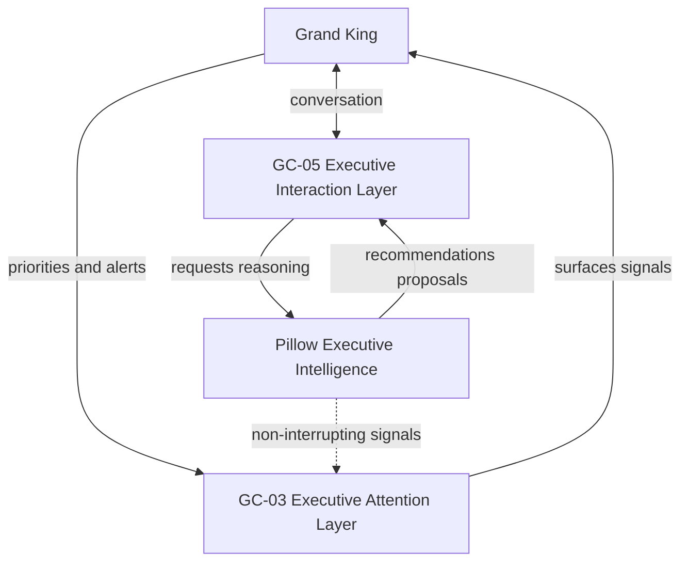

# Executive UX Layer Architecture

> **Authority:** Grand King Architecture Observation  
> **Status:** Permanent architecture doctrine — documentation only (no runtime change)  
> **Date:** 2026-06-29  
> **Registered:** ADR-047  
> **Companion:** `UX_IMPLEMENTATION_CONTRACT.md` · `EMPIREAI_PILLOW_CONSTITUTION.md` · [`EMPIREAI_COCKPIT_ARCHITECTURE.md`](../architecture/EMPIREAI_COCKPIT_ARCHITECTURE.md) (P3-03)

---

## 1. Purpose

This document formally defines **GC-03** and **GC-05** as the two **executive interface layers** of EmpireAI Version 1, and establishes their relationship to **Pillow** as Executive Intelligence.

It is a **documentation refinement only**. Completed GC-03 / GC-05 implementations, API contracts, and runtime behaviour are **unchanged**.

---

## 2. Executive UX philosophy

EmpireAI's executive experience is composed of **three complementary components**:

| Component | Role | Responsibility |
|---|---|---|
| **Pillow** | **Executive Intelligence** | Executive reasoning, organizational intelligence, recommendations, strategic synthesis, constitutional discipline, objective governance |
| **GC-05 — Global AI Assistant** | **Executive Interaction Layer** | Conversational interaction between Grand King and EmpireAI; primary interface to Executive Intelligence while preserving proposal-and-approval governance |
| **GC-03 — Notifications Center** | **Executive Attention Layer** | Executive priorities, operational events, commercial observations, and critical alerts requiring Grand King's awareness |

---

## 3. Architectural principle — intelligence vs presentation

**Pillow shall remain independent from the presentation layer.**

| Layer | What it is | What it is not |
|---|---|---|
| **Pillow** | Executive Intelligence — thinks, analyses, recommends, synthesizes | A UI component, chat widget, or notification panel |
| **GC-05** | Interface — exposes Pillow capabilities through governed conversation | Embedded executive intelligence; autonomous agent |
| **GC-03** | Interface — exposes attention-worthy signals without reasoning | Embedded executive intelligence; autonomous agent |

GC-05 and GC-03 are **interface components** that expose Pillow's capabilities **without embedding executive intelligence directly into the UI**.

This separation:

- Preserves clean architecture between reasoning and presentation  
- Allows future UX redesigns without affecting executive reasoning  
- Supports future expansion of Pillow Executive Intelligence (Layer 2) independently of chrome  

---

## 4. GC-05 — Executive Interaction Layer

**Canonical label:** Global AI Assistant · AI Assistant Panel  
**Contract ID:** GC-05 (`UX_IMPLEMENTATION_CONTRACT.md` Part 2.1)  
**Implementation:** `backend/src/global-assistant/` · `frontend/src/components/system/GlobalAssistantPanel.tsx`  
**Status:** ✅ Complete (see `COMBINED_EXECUTIVE_AUDIT_GC-05.md`)

### Role

GC-05 is the **primary conversational interface** between Grand King and EmpireAI.

It:

- Presents natural dialogue and evidence-on-demand ("Why?")  
- Surfaces missions, audits, and chief outputs (REAL-031/032/033 integration points)  
- Routes proposal-worthy work through the **existing approval-gated command model**  
- Does **not** replace Pillow — it **interfaces with** Pillow Executive Intelligence  

### Governance preserved

- Grand King approval required before execution  
- Cursor Sovereignty — no autonomous repository modification  
- Proposal-and-approval chain unchanged  

### Relationship to Pillow

| Concern | Owner |
|---|---|
| Executive reasoning, synthesis, constitutional law | Pillow |
| Conversational presentation, panel chrome, keyboard affordances | GC-05 |
| Approval cards, recommendation display | GC-05 (presentation) · Pillow (content) |

Pillow `/dashboard/pillow` chat and GC-05 Global Assistant are **both interaction surfaces** — GC-05 is the **global** executive interaction layer accessible from every dashboard screen; Pillow chat is the **dedicated** Executive Intelligence session surface. Both consume Pillow intelligence; neither embed reasoning logic in UI components.

---

## 5. GC-03 — Executive Attention Layer

**Canonical label:** Notifications Center · Global Notifications  
**Contract ID:** GC-03 (`UX_IMPLEMENTATION_CONTRACT.md` Part 2.1)  
**Implementation:** `backend/src/global-notifications/` · `frontend/src/components/system/NotificationsCenter.tsx`  
**Status:** ✅ Complete (see `COMBINED_EXECUTIVE_AUDIT_GC-03.md`)

### Role

GC-03 is the **executive attention layer** — responsible for what Grand King must **be aware of**, not what Pillow must **reason about** in dialogue.

It:

- Aggregates operational events, commercial observations, and critical alerts  
- Ingests from ESS, eye-series, REAL, Council, and Pillow signal sources  
- Provides unread counts, deep-links, acknowledgment, and time grouping  
- Protects cognitive load — alerts are prioritized, not conversational  

### Relationship to Pillow

| Concern | Owner |
|---|---|
| Strategic silence, Improvement Vault, objective filter | Pillow (PILLOW-019) |
| Surfacing attention-worthy events to Grand King | GC-03 |
| Whether an alert becomes active work | Grand King approval via existing gates |

GC-03 **does not** debate, recommend, or dispatch Cursor. It **notifies**. Pillow **reasons**.

---

## 6. The two executive interface layers (formal definition)

| Layer | GC ID | Name | Executive function |
|---|---|---|---|
| **Interaction** | **GC-05** | Global AI Assistant | Dialogue · evidence · proposals · approval presentation |
| **Attention** | **GC-03** | Notifications Center | Priorities · events · alerts · awareness |

Together, GC-03 and GC-05 form the **Executive UX Layer** — the stable presentation shell through which Grand King interacts with and attends to the Empire.

All other GC components (GC-01 Shell, GC-02 Approval Bar, GC-04 Command Palette, GC-06 Page Contract, GC-07 Verdict primitives) support the executive experience but are **not** classified as executive interface layers in this architecture.

---

## 7. Implementation impact (explicit non-changes)

This architecture observation **does not modify**:

| Artifact | Status |
|---|---|
| GC-03 runtime (`global-notifications`) | Unchanged |
| GC-05 runtime (`global-assistant`) | Unchanged |
| Pillow runtime (`pillow/`, `pillow-host`) | Unchanged |
| API routes and contracts | Unchanged |
| UX acceptance criteria in `UX_IMPLEMENTATION_CONTRACT.md` | Unchanged (cross-reference added only) |

### Future direction

| Enhancement type | Target |
|---|---|
| Executive reasoning, learning, constitution, perspectives | **Pillow** |
| Conversational UX, global assistant affordances | **GC-05** |
| Alert ingestion, attention prioritization, deep-links | **GC-03** |
| Visual redesign, chrome, layout | GC-01 and related UX — **not** Pillow |

---

## 8. Related doctrines

| Document | Relationship |
|---|---|
| `EMPIREAI_PILLOW_CONSTITUTION.md` | Pillow identity, Cursor Sovereignty, cognitive load protection |
| `EMPIREAI_PILLOW_ARCHITECTURE.md` | Pillow bootstrap and session architecture |
| `UX_IMPLEMENTATION_CONTRACT.md` | GC-03 / GC-05 contract authority and acceptance criteria |
| `PILLOW_ARCHITECTURE_CONTRACT.md` | Pillow subsystem boundaries |
| ADR-046 Executive Cognitive Pipelines | Layer 2 planning — Pillow only |
| ADR-047 Executive UX Layer Architecture | This document |

---

## 9. Governance

| Concern | Owner |
|---|---|
| This architecture | UX Governance · Pillow Architecture |
| GC-03 implementation | ESS + eye-series |
| GC-05 implementation | REAL-031/032/033 + executive-council integration points |
| Pillow Executive Intelligence | Pillow Architecture |

Structural changes require Journey synchronization per BL-A / ROUTE 02.

---

_Executive UX Layer Architecture — documentation only. GC-03 and GC-05 remain the stable executive interface layers; Pillow remains Executive Intelligence._
