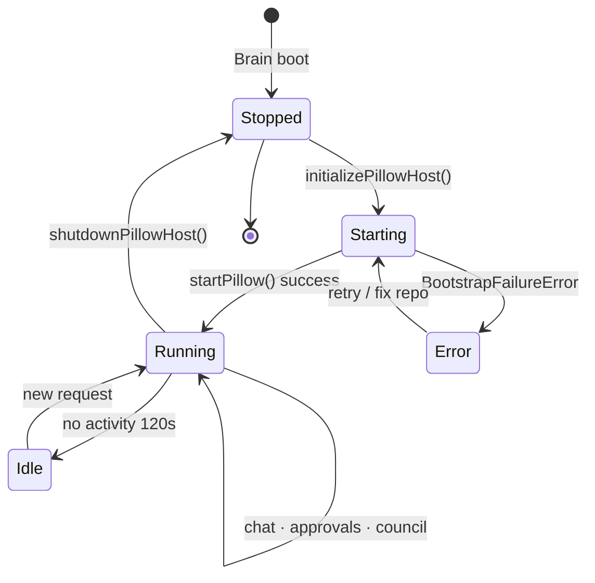
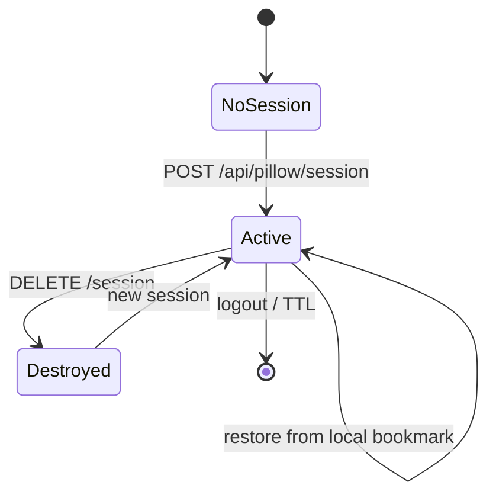

# Pillow Product Integration Master Plan

> **Canonical label:** Pillow Product Integration Master Plan  
> **Canonical owner:** Pillow Architecture · Runtime Engineering · UX Governance  
> **Authority:** `PILLOW_ARCHITECTURE_CONTRACT.md` · `EMPIREAI_PILLOW_CONSTITUTION.md` · ADR-010 · ADR-016 · ADR-047  
> **Status:** **CANONICAL PLAN** — planning only; supersedes integration sequencing in `PILLOW_RUNTIME_INTEGRATION_PLAN.md` for product-level scope  
> **Scope:** PILLOW-016 · PILLOW-017 · PILLOW-018 · PILLOW-019  
> **Date:** 2026-06-29 · **Synchronized:** 2026-06-29 (Executive Perspectives · Constitutional Laws · V1 gap analysis · **Pillow Delivery Mode ADR-049** alignment)

---

## 1. Executive summary

Pillow Runtime missions **PILLOW-016 through PILLOW-019 are implemented** in the live EmpireAI Brain backend and founder-facing frontend. This document is the **canonical master plan** for how Pillow integrates into the **live product** as Executive Intelligence — covering frontend, backend, OpenAI, Cursor Bridge, Brain, Executive Perspectives (internal reasoning), session lifecycle, approval gates, chat interface, and migration.

**Single intelligence rule:** There is **one Pillow** executive intelligence. Executive Perspectives are internal reasoning disciplines — not separate agents, memories, or OpenAI calls. Pillow performs final synthesis; there is no separate CEO entity (`EMPIREAI_PILLOW_CONSTITUTION.md` §15).

**Product integration** means more than wiring modules: it is the governed embedding of Pillow into EmpireAI's executive experience such that:

- Grand King interacts through **stable interface layers** (GC-05 interaction · GC-03 attention · Pillow chat)  
- **One Pillow intelligence** reasons behind all surfaces (ADR-047)  
- **No repository mutation or Cursor dispatch** bypasses Grand King approval (Pillow Constitution)  
- **Builder Mode and One Objective** discipline gate all autonomous paths (PILLOW-019)  

**Planning only.** This document does not authorize runtime changes. Implementation tranches require Grand King approval per mission.

---

## 2. Integration scope — four missions

| Mission | Role in product | Implementation path | Journey status |
|---|---|---|---|
| **PILLOW-016** | Brain Integration Layer — host Pillow in Brain; all LLM via `LLMRouter` | `backend/src/orchestration/pillow-host/` · `pillow/src/openai/` | ✅ |
| **PILLOW-017** | Approval Gate + Cursor Bridge — gated writes and mission handoff | `backend/src/orchestration/pillow-approval/` · `pillow/src/approval-gate/` · `pillow/src/cursor-bridge/` | ✅ |
| **PILLOW-018** | Pillow Chat UI — superseded by PILLOW-019 Executive Companion | `frontend/src/components/pillow/PillowCompanionPanel.tsx` | ✅ superseded |
| **PILLOW-019** | Executive Companion — persistent icon + side panel + workspace context | `PillowCompanionContext` · `PillowCompanionPanel` · `PillowCompanionIcon` | ✅ |
| **PILLOW-019** | Objective Orchestrator — Builder Mode, Improvement Vault, Empire Score | `pillow/src/objective/` · wired in `pillow-host` approval layer | ✅ |

**Foundation (pre-integration, complete):** PILLOW-002…015 in `@empireai/pillow` — Bootstrap through Command Interface.

---

## 3. Product architecture — three-layer executive model

Per **ADR-047 Executive UX Layer Architecture**:

```
┌─────────────────────────────────────────────────────────────────────────┐
│  GRAND KING (founder account · ADR-016)                                  │
└───────────────┬───────────────────────────────┬─────────────────────────┘
                │                               │
                ▼                               ▼
┌───────────────────────────┐     ┌───────────────────────────────────────┐
│  GC-05 Interaction Layer  │     │  GC-03 Attention Layer                 │
│  Global AI Assistant      │     │  Notifications Center                  │
│  (every dashboard screen) │     │  (priorities · alerts · deep-links)    │
└─────────────┬─────────────┘     └───────────────────────────────────────┘
              │
              │  also
              ▼
┌─────────────────────────────────────────────────────────────────────────┐
│  PILLOW-018 Chat UI  (/dashboard/pillow)                               │
│  Dedicated Executive Intelligence session surface                       │
└───────────────────────────────┬─────────────────────────────────────────┘
                                │ ADR-010 BFF · founder-only · session cookie
                                ▼
┌─────────────────────────────────────────────────────────────────────────┐
│  BACKEND — Pillow Host (PILLOW-016)                                      │
│  pillow-host · pillow-approval · pillow-executive-council (persistence)  │
│  · executive learning                                                      │
└───────────────────────────────┬─────────────────────────────────────────┘
                                │ in-process
                                ▼
┌─────────────────────────────────────────────────────────────────────────┐
│  @empireai/pillow — Executive Intelligence                               │
│  Bootstrap · Context · Memory · Planner · Supervisor · Objective · …     │
└───────────────────────────────┬─────────────────────────────────────────┘
                                │
                                ▼
┌─────────────────────────────────────────────────────────────────────────┐
│  BRAIN — LLMRouter · audit-logger · SQLite · auth session                │
└─────────────────────────────────────────────────────────────────────────┘
```

**Principle:** Pillow is intelligence. GC-03/GC-05 and PILLOW-018 are presentation. Intelligence never lives in React components.

---

## 4. PILLOW-016 — Brain + OpenAI integration

### 4.1 Purpose in product

Host `@empireai/pillow` inside Brain at application startup; route every completion through Brain `LLMRouter` (no browser keys, no duplicate LLM stack).

### 4.2 Implemented architecture

| Component | Path | Responsibility |
|---|---|---|
| Pillow Host singleton | `backend/src/orchestration/pillow-host/pillow-host.ts` | Lifecycle, workspace sessions, `routePrompt()` |
| Brain LLM adapter | `backend/src/orchestration/pillow-host/brain-llm-adapter.ts` | Injects `LLMRouter` into Pillow OpenAI layer |
| OpenAI Integration Layer | `pillow/src/openai/engine.ts` | Context Builder payloads · mode policy · learning bundle · perspectives synthesis prompt augmentation |
| Workspace session store | `backend/src/orchestration/pillow-host/session-store.ts` | Ephemeral chat history per workspace session |
| API routes | `backend/src/orchestration/pillow-host/routes/pillow-routes.ts` | `/api/pillow/*` chat, session, status, SSE |

### 4.3 OpenAI / Brain flow

```
POST /api/pillow/chat | /chat/stream
      ↓
pillow-host.routePrompt()
      ↓
PILLOW-015 Command intent (if imperative) OR conversational path
      ↓
PILLOW-004 ContextBuilder.build({ userMessage })
      ↓
Executive Direction + Learning bundle + Executive Perspectives debate (when proposal detected)
      ↓
Pillow Synthesis → ONE executive recommendation (synthesizedBy: "pillow")
      ↓
PILLOW-016 OpenAIIntegrationLayer.complete()
      ↓
BrainLLMAdapter → LLMRouter.complete()
      ↓
Audit log · token telemetry · session history update
      ↓
Response envelope → frontend
```

### 4.4 Operating modes (internal — user sees one chat)

| Mode | Detection | Context profile |
|---|---|---|
| General Intelligence | Default queries | `general_query` |
| Empire Operations | Journey, blockers, commercial | `executive_operations` |
| Engineering Operations | Mission, audit, sync, Cursor | `engineering_mission` |

### 4.5 Product integration remaining (planned tranches)

| Tranche | Work | Owner |
|---|---|---|
| P16-A | CFO cost dashboard for `pillow_llm_usage` telemetry | Runtime Engineering |
| P16-B | GC-05 → Pillow host shared session strategy (single intelligence, two surfaces) | UX + Pillow Architecture |
| P16-C | Prompt Registry (PEI-019) — canonical prompt versioning | Pillow Architecture |
| P16-D | Guardian pre-dispatch for engineering-mode mutation prompts | Brain + Pillow |

---

## 5. PILLOW-017 — Approval Gate + Cursor Bridge

### 5.1 Purpose in product

**No repository mutation and no Cursor mission dispatch without Grand King explicit approval** (GVD-019 · Pillow Constitution Cursor Sovereignty).

### 5.2 Implemented architecture

| Component | Path | Responsibility |
|---|---|---|
| Approval Gate Engine | `backend/src/orchestration/pillow-approval/approval-gate-engine.ts` | Register · decide · execute typed proposals |
| Cursor Bridge Adapter | `backend/src/orchestration/pillow-approval/cursor-bridge-adapter.ts` | Post-approval handoff · heartbeat · dry-run launch |
| SQLite persistence | `backend/src/orchestration/pillow-approval/repository/` | Approvals · supervised missions |
| Pillow package gate | `pillow/src/approval-gate/` · `pillow/src/cursor-bridge/` | Domain logic · supervisor integration |
| API routes | `backend/src/orchestration/pillow-approval/routes/pillow-approval-routes.ts` | `/api/pillow/approval` · cursor heartbeat |

### 5.3 Gated action taxonomy (product)

| Proposal type | Product behaviour on approve |
|---|---|
| `repository_write` / sync | PILLOW-010 synchronizer executor (preview-first) |
| `cursor_mission` | Cursor Bridge → PILLOW-007 Supervisor queue |
| `improvement_mission` | Planner → Bridge (BL-C path) |
| Journey / ADR / Status writes | Canonical owner paths via sync engine |

**Objective gate (PILLOW-019):** `pillow-host` approval layer calls `autonomousRuntime.prepareForExecution()` — non-aligned work → Improvement Vault without approval card.

### 5.4 Cursor Bridge product flow

```
Grand King approves mission (Pillow Chat or approval API)
      ↓
ApprovalGateEngine.execute()
      ↓
CursorBridgeAdapter.handoff() — dryRunLaunch unless GK-GOLIVE
      ↓
PILLOW-007 Supervisor.launchMission()
      ↓
POST /api/pillow/cursor/heartbeat (worker ingress)
      ↓
Supervisor state → SSE /api/pillow/events/stream
      ↓
Executive Audit verification → mission complete
      ↓
Optional sync preview → second approval for repository write
```

### 5.5 Dual-track governance (product boundary)

| Track | Scope | Product surfaces |
|---|---|---|
| **Pillow track** | Repository · engineering · Cursor missions | Pillow Chat · approval cards · GC-05 commands |
| **Empire track** | Commercial irreversible (publish, spend, live credentials) | UX-014 Approvals · REAL-007 Executive Council · GKR |

Pillow **surfaces blockers** from Empire track; it **does not** replace GKR commercial approval.

### 5.6 Product integration remaining (planned tranches)

| Tranche | Work | Owner |
|---|---|---|
| P17-A | Full `ImplementationProposal` fields in approval UI (Laws 2–3) | UX Governance |
| P17-B | cursor-sdk / MCP automated handoff (enhancement register) | Runtime Engineering |
| P17-C | `PILLOW_DRY_RUN=false` go-live gate with GK-GOLIVE-APPROVAL | Grand King + Governance |
| P17-D | Unified approval inbox across Pillow Chat + UX-014 (read-only federation) | UX Governance |

---

## 6. PILLOW-019 — Executive Companion (replaces standalone PILLOW-018 page)

Grand King interacts with Pillow through a **persistent Executive Companion** — not a dedicated chat page.

| Requirement | Implementation |
|---|---|
| Persistent icon | `PillowCompanionIcon` — fixed Moon FAB on every founder screen |
| Side panel | `PillowCompanionPanel` — 420px right dock; page stays visible |
| No navigation | Closing panel returns to same screen; `/dashboard/pillow` redirects with panel open |
| Single session | `PillowCompanionProvider` + one `usePillowChat` instance at layout scope |
| Workspace context | Auto on route change via `buildPillowWorkspaceContext`; sent with each chat POST |
| Extension awareness | `usePillowPageContext()` on approved extension pages (e.g. Integrations Hub) |
| Governance | Approval cards · Executive Learning · Cursor Sovereignty unchanged |

Legacy full-page chat (`PillowChatPage.tsx`) retained for reference; route no longer serves standalone chat.

## 6A. PILLOW-018 — Chat interface (superseded)

### 6.1 Purpose in product

Dedicated **Executive Intelligence session surface** at `/dashboard/pillow` — not a replacement for UX-001…023 dashboards (contract §4.12).

### 6.2 Implemented architecture

| Component | Path | Responsibility |
|---|---|---|
| Chat page | `frontend/src/pages/dashboard/PillowChatPage.tsx` | Layout · thread · panels |
| API client | `frontend/src/api/pillow.ts` | Session · chat · stream · approvals |
| Hook | `frontend/src/hooks/usePillowChat.ts` | Session lifecycle · SSE · local session bookmarks |
| Components | `frontend/src/components/pillow/` | Composer · cards · mission center · executive panel · recommendation card |
| Learning review | `/dashboard/pillow/learning` | Executive Learning Engine UI |

### 6.3 UI component map (product)

| Component | Product function |
|---|---|
| `PillowStatusBanner` | Host health · bootstrap / recovering state |
| `PillowSessionSidebar` | Workspace session list · restore · search |
| `PillowMessageBubble` | Ephemeral transcript (Memory Doctrine) |
| `PillowComposer` | Send · stream |
| `PillowApprovalCard` | Inline Approve / Reject / Defer |
| `PillowMissionCenter` | Supervisor mission board |
| `PillowExecutivePanel` | Objective dashboard · Empire Score · blockers |
| `PillowExecutiveRecommendationCard` | Single recommendation · View Debate (confidential) |
| `PillowWorkspacePanel` | Repository fingerprint · cursor status |

### 6.4 Auth and access (product rules)

| Rule | Implementation |
|---|---|
| Grand King exclusivity | `founder`/`admin` on all `/api/pillow/*` |
| ADR-010 BFF | `credentials: include` — no provider keys in browser |
| Operator accounts | 403 on Pillow routes until MS-B |
| Nav | Founder-only Pillow link in GC-01 shell |

### 6.5 Relationship to GC-05 (product plan)

| Surface | When Grand King uses it |
|---|---|
| **GC-05 Global Assistant** | Evidence-on-demand ("Why?") from any dashboard screen · chief outputs |
| **PILLOW-018 Pillow Chat** | Extended executive session · missions · approvals · objective · learning review |

**Integration tranche P18-A:** Document and implement shared intelligence session token so GC-05 and Pillow Chat do not fork context (optional; default independent sessions acceptable for V1).

### 6.6 Product integration remaining (planned tranches)

| Tranche | Work | Owner |
|---|---|---|
| P18-A | GC-05 ↔ Pillow session continuity strategy | UX + Pillow Architecture |
| P18-B | Constitutional proposal fields on approval cards | UX Governance |
| P18-C | Executive Perspectives rename in UI copy (internal debate labels) | UX Governance |
| P18-D | Mobile / responsive polish (enhancement register) | UX Governance |

---

## 7. PILLOW-019 — Objective orchestrator (product governance)

### 7.1 Purpose in product

Enforce **One Objective Rule**, **Improvement Vault**, **Builder Mode**, **Empire Score**, and **Constitutional Laws 1–7** at runtime — reducing cognitive load and preventing scope expansion during Version 1.

### 7.2 Implemented architecture

| Component | Path | Responsibility |
|---|---|---|
| Objective Engine | `pillow/src/objective/engine.ts` | One active objective · gateAction · dashboard |
| Autonomous Runtime Orchestrator | `pillow/src/objective/autonomous-runtime-orchestrator.ts` | Approval surfacing · Cursor eligibility |
| Improvement Vault | `pillow/src/objective/improvement-vault.ts` | Strategic silence · passive storage |
| Empire Score | `pillow/src/objective/empire-score.ts` | Internal prioritisation signal |
| Constitution constants | `pillow/src/objective/constitution.ts` | Laws 1–7 · Supreme Directive |
| Host integration | `pillow-host.initializeApprovalLayer()` | Objective filter on every approval registration |

### 7.3 Product-visible behaviour

| Behaviour | Grand King experience |
|---|---|
| Builder Mode | Only Version 1 blocker work surfaces approvals |
| Improvement Vault | Non-objective ideas stored silently |
| Cognitive load (Law 5) | One primary attention action on objective dashboard |
| Empire Score | Visible in `PillowExecutivePanel` · guides prioritisation only |
| Objective switch | Requires Grand King approval + objective complete |

### 7.4 API

| Route | Purpose |
|---|---|
| `GET /api/pillow/objective` | Full objective dashboard including Empire Score |

### 7.5 Product integration remaining (planned tranches)

| Tranche | Work | Owner |
|---|---|---|
| P19-A | Improvement Vault review UI (explicit GK request only) | UX Governance |
| P19-B | Objective switch ceremony in chat (post-V1 completion) | Pillow Architecture |
| P19-C | GC-03 notifications for objective blockers only (attention layer) | ESS + Pillow |

---

## 8. Executive Perspectives in product integration

### 8.1 Two distinct systems (do not conflate)

| System | Scope | Product surface |
|---|---|---|
| **Empire Executive Council** | Empire-wide commercial governance | REAL-007 · UX-012 Executive Debate · GKR |
| **Pillow Executive Perspectives** | Internal reasoning disciplines inside Pillow | `pillow/src/executive-perspectives/` · recommendation card · View Debate |

Executive Perspectives are **NOT** independent AI agents, separate memories, or separate OpenAI calls. They are lenses Pillow applies before speaking with one voice to Grand King.

### 8.2 Seven permanent perspectives

| Perspective | Focus |
|---|---|
| **Financial** | ROI · profit · cost · capital efficiency · engineering investment |
| **Technology** | Architecture · maintainability · scalability · technical debt |
| **Operations** | Execution · workflow · delivery · operational efficiency |
| **Risk** | Business · repository · security · recovery · compliance |
| **Commercial** | Customers · suppliers · marketplace · revenue · conversion · retention |
| **Repository** | Repository integrity · Journey · architecture · documentation consistency |
| **Strategy** | Long-term direction · objective sequencing · trade-offs · future impact |

### 8.3 Pillow synthesis product flow

```
Grand King message (proposal detected)
      ↓
Pillow Host → runAndStoreExecutiveCouncil() [API alias; runtime = perspectives]
      ↓
Internal perspective debate (7 lenses — hidden from Grand King by default)
      ↓
Pillow Synthesis → ONE executive recommendation (no CEO entity)
      ↓
PILLOW-016 system prompt augmentation (single Pillow voice)
      ↓
executiveRecommendation on chat result → PillowExecutiveRecommendationCard
      ↓
Grand King sees: objective · recommendation · reason · confidence · risk ·
                 profit impact · engineering cost · Approve / Reject / Defer
      ↓
Optional: View Executive Debate (GK explicit request)
         → perspective disagreements · trade-offs · rejected alternatives
      ↓
Separate Cursor path ONLY after explicit approval (never auto-dispatch)
```

**Debate confidentiality:** Internal reasoning is hidden by default. Grand King normally sees only the synthesized recommendation fields above.

### 8.4 Runtime paths

| Layer | Path | Note |
|---|---|---|
| Perspectives engine | `pillow/src/executive-perspectives/` | Debate · synthesis · proposal detector |
| OpenAI augmentation | `pillow/src/openai/engine.ts` | `formatExecutiveRecommendationForLlm()` |
| Backend persistence | `backend/src/orchestration/pillow-executive-council/` | Historical route namespace; stores perspective debates |
| Frontend card | `PillowExecutiveRecommendationCard.tsx` | Approve / Reject / Defer · View Debate |

**Cursor Sovereignty:** Executive Perspectives **never** communicate with Cursor directly.

### 8.5 API (Pillow track — stable routes)

| Route | Purpose |
|---|---|
| `GET /api/pillow/executive-council/pending` | Pending recommendations |
| `GET /api/pillow/executive-council/debate/:debateId` | View Debate (confidential) |
| `POST /api/pillow/executive-council/recommendation/:id/decide` | Grand King decision |

Route prefix retained for API stability; runtime uses Executive Perspectives internally.

### 8.6 Product integration remaining

| Tranche | Work | Status |
|---|---|---|
| EC-A | Executive Perspectives runtime + constitution sync | ✅ Complete (`COMBINED_EXECUTIVE_AUDIT_EXECUTIVE_PERSPECTIVES_REFINEMENT.md`) |
| EC-B | UI copy: "Executive Debate" labels → perspective terminology | 🔵 Planned (Phase 1) |
| EC-C | Harmonize `PillowExecutiveRecommendation` with full `ImplementationProposal` schema (Laws 2–3) | 🔵 Planned |
| EC-D | Federation: REAL-007 debate summaries as read-only Pillow context (no execution) | 🔵 Phase 2 |

---

## 9. Session lifecycle (product)

### 9.1 Server states



### 9.2 Workspace session states (per Grand King)



### 9.3 Bootstrap sequence (product — unchanged semantics)

On `initializePillowHost()` → `startPillow()` loads PILLOW-002…015 + registers PILLOW-016 LLM layer + PILLOW-017 approval/cursor + PILLOW-019 objective/autonomous runtime.

First chat turn triggers full executive reasoning chain (Direction · Learning bundle · Perspectives if proposal · Pillow synthesis · LLM).

### 9.4 Ephemeral vs permanent memory

| Data | Store | TTL | Product rule |
|---|---|---|---|
| Chat transcript | Backend session store | Session / rolling | Memory Doctrine — not canonical |
| Approvals · missions · perspectives debates | SQLite | Until decided | Auditable |
| Organizational intelligence | Repository artifacts | Permanent | GK approval → Journey/Soul/ADR |

---

## 10. Migration strategy — product integration phases

> **Delivery Mode (ADR-049):** Phase 0 is complete. **Phases 1–3** are the only permitted remaining Pillow V1 work. Phase 4 is post-V1. See `docs/governance/PILLOW_VERSION_1_DELIVERY_MODE.md`.

### Phase 0 — Runtime wiring ✅ COMPLETE

| Deliverable | Status |
|---|---|
| PILLOW-016 Brain host + LLM adapter | ✅ |
| PILLOW-017 Approval + Cursor Bridge | ✅ |
| PILLOW-018 Chat UI + SSE | ✅ |
| PILLOW-019 Objective orchestrator in host | ✅ |
| Executive Learning + Executive Perspectives in host | ✅ |
| Constitutional Laws 1–7 in PILLOW-019 | ✅ |
| Journey rows PILLOW-016…019 → ✅ | ✅ |

### Phase 1 — Product hardening (planned · GK approval)

| Step | Action | Missions |
|---|---|---|
| 1.1 | Executive UX Layer alignment — GC-05/GC-03/Pillow Chat role docs in product copy | ADR-047 |
| 1.2 | Constitutional Laws 2–3 full UI on proposals and recommendations | PILLOW-019 |
| 1.3 | Executive Perspectives UI copy sync (runtime ✅; labels pending) | EC-B |
| 1.4 | Improvement Vault review surface (GK-initiated only) | PILLOW-019 |
| 1.5 | Integration test suite: chat → approve → supervisor → audit path | PILLOW-016–018 |

**Exit criteria:** Grand King completes full product loop with constitutional fields visible; no autonomous bypass.

### Phase 2 — Executive surface federation (planned)

| Step | Action |
|---|---|
| 2.1 | GC-03 alerts for objective blockers and approval pending (attention only) |
| 2.2 | GC-05 deep-link to Pillow Chat for extended mission work |
| 2.3 | Mission Home (UX-002) Pillow status chip — bootstrap health · current objective |
| 2.4 | UX-014 Approvals federation — read-only mirror of Pillow pending approvals |

**Exit criteria:** Single executive picture across GC-03 · GC-05 · Pillow Chat without duplicating intelligence.

### Phase 3 — Go-live readiness (planned · gated)

| Gate | Requirement |
|---|---|
| GK-GOLIVE-APPROVAL | Grand King explicit sign-off |
| PROOF-001 | First validated profit signal |
| REAL-002B | Live credentials posture (Empire Operations mode) |
| `PILLOW_DRY_RUN=false` | ADR + env flag for Cursor Bridge live handoff |
| Pillow Master Audit | Integration readiness re-score ≥ 90% |

**Exit criteria:** Pillow operates in full Empire Operations mode with live Cursor handoff and non-dry-run sync — still approval-gated.

### Phase 4 — Layer 2 on product surface (post-V1 · planned)

| Step | Action |
|---|---|
| 4.1 | PEI-026 Executive Reflection in chat pipeline |
| 4.2 | PEI-014 Conversation intelligence depth |
| 4.3 | PEI-021 Evidence Sources adapters feeding product recommendations |
| 4.4 | Prompt Registry (PEI-019) |

**Gated by:** V1 Executive Certification Audit + Layer 2 Master Plan approval (ADR-046).

---

## 11. Dependency graph (product integration)

```mermaid
flowchart TB
  subgraph ProductUI["Product UI"]
    GC05[GC-05 Assistant]
    GC03[GC-03 Notifications]
    P18[PILLOW-018 Chat]
    UX[UX-001…023 Dashboards]
  end

  subgraph Backend["Brain Backend"]
    Host[Pillow Host 016]
    Appr[Pillow Approval 017]
    Council[Pillow Perspectives + persistence]
    Learn[Executive Learning]
    Routes[/api/pillow/*]
  end

  subgraph PillowPkg["@empireai/pillow"]
    Core[002…015 Core]
    OAI[016 OpenAI]
    Obj[019 Objective]
  end

  subgraph BrainCore["Brain"]
    LLM[LLMRouter]
    Auth[Auth Session]
    DB[(SQLite)]
  end

  subgraph External["External"]
    Cursor[Cursor Worker]
    Repo[Git Repository]
  end

  subgraph Empire["Empire Governance"]
    REAL007[REAL-007 Council]
    GKR[GKR Approvals]
  end

  GC05 --> Routes
  P18 --> Routes
  GC03 -.->|alerts only| P18
  UX -.->|blockers| GKR
  Routes --> Host
  Host --> Core
  Host --> OAI
  Host --> Obj
  Host --> Appr
  Host --> Council
  Host --> Learn
  OAI --> LLM
  Appr --> Cursor
  Appr -->|gated| Repo
  Council -.->|never| Cursor
  REAL007 --> GKR
  Host --> DB
  Auth --> Routes
```

---

## 12. Integration risks (product)

| ID | Risk | Mitigation |
|---|---|---|
| R-01 | Two chat surfaces (GC-05 vs Pillow) fork context | Phase 2 federation · shared session strategy |
| R-02 | Executive Perspectives confused with REAL-007 Empire Council | Dual-track docs · separate API namespaces · §8.1 |
| R-03 | Chat history mistaken for memory | TTL · Memory Doctrine · Learning candidates require approval |
| R-04 | dry-run flags left on at go-live | GK-GOLIVE gate · env audit |
| R-05 | Approval bypass via direct Cursor IDE | Governance doctrine · audit trail |
| R-06 | Objective filter bypass via manual API | Host approval layer mandatory |
| R-07 | GC-05 commands skip Pillow constitution | Route GC-05 engineering commands through Pillow host |
| R-08 | Cost overrun | CFO telemetry tranche P16-A |
| R-09 | Repository root mismatch deployment vs dev | `EMPIREAI_REPO_ROOT` configuration |
| R-10 | Layer 2 features embedded in UI components | ADR-047 separation — all PEI in Pillow package |

---

## 13. Governance synchronization

| Event | Action |
|---|---|
| Phase closeout | Executive Audit per `EMPIREAI_EXECUTIVE_AUDIT_STANDARD.md` |
| Journey update | PILLOW-016…019 rows + product integration phase |
| Enhancement discovery | `docs/governance/PILLOW_ENHANCEMENT_REGISTER.md` |
| Structural architecture change | ADR in `EMPIREAI_DECISIONS.md` |
| Constitution change | `EMPIREAI_PILLOW_CONSTITUTION.md` + Journey sync |

**ROUTE 02:** Audit → Journey → Journey Audit → Difference Report → Validation.

---

## 14. Related artifacts

| Artifact | Relationship |
|---|---|
| `PILLOW_RUNTIME_INTEGRATION_PLAN.md` | Historical Phase 1–3 closeout — superseded for product scope by this plan |
| `PILLOW_ARCHITECTURE_CONTRACT.md` | Supreme Pillow subsystem authority |
| `EMPIREAI_PILLOW_CONSTITUTION.md` | Executive Intelligence constitutional law |
| `docs/governance/EXECUTIVE_UX_LAYER_ARCHITECTURE.md` | GC-03/GC-05 layer roles (ADR-047) |
| `UX_IMPLEMENTATION_CONTRACT.md` | GC component acceptance criteria |
| `PILLOW_ROADMAP.md` | Layer 1 complete · Layer 2 future |
| `COMBINED_EXECUTIVE_AUDIT_PILLOW_PRODUCT_INTEGRATION_MASTER_PLAN.md` | This plan's executive audit |
| `COMBINED_EXECUTIVE_AUDIT_EXECUTIVE_PERSPECTIVES_REFINEMENT.md` | Perspectives architecture refinement |
| `COMBINED_EXECUTIVE_AUDIT_EMPIREAI_V1_EXECUTIVE_CERTIFICATION_GAP_ANALYSIS.md` | V1 certification blockers affecting Phase 3 gates |

---

## 15. Executive recommendation

**Adopt this document as the canonical Pillow Product Integration Master Plan.**

Runtime integration (PILLOW-016…019) is **complete**. Product integration proceeds in **Phases 1–4** above — hardening, executive surface federation, go-live gates, and Layer 2 depth — each requiring **Grand King approval** as separate engineering missions.

**Do not** enable live Cursor handoff or non-dry-run repository writes until Phase 3 gates pass.

**Do not** embed Executive Intelligence in GC-03, GC-05, or dashboard React components — all reasoning remains in Pillow.

---

_Planning document only. No runtime modifications authorized by this plan._
